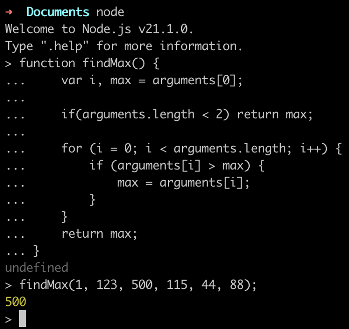

前文回顾：

> [#前端](https://mp.weixin.qq.com/mp/appmsgalbum?action=getalbum&__biz=MzI0NTM0MzE5Mw==&scene=1&album_id=3953635132766044162&count=3#wechat_redirect)

# 函数

函数，实际上是可被调用的完整的程序。它具备输入、处理、输出的功能。又因为它经常在主程序里被调用，所以它总是更像是个子程序。

了解一个函数，无非是要了解它的两个方面：

> * 它的**输入**是怎么构成的（都有哪些参数？如何指定？）；
> * 以及它的**输出**是什么（返回值究竟是什么？）……

从这个角度看，牛，对人类来说就是个函数，它吃的是_草_，挤出来的是*奶*…… 开玩笑了。

在我们使用函数的过程中，我们常常_有意忽略_它的内部如何完成从输出到输出之间的_处理过程_ —— 这就好像我们平日里用灯泡一样，大多数情况下，我们只要知道开关的使用方法就够了 —— 至于为什么按到这个方向上灯会亮，为什么按到另外一个方向上灯会灭，并不是我们作为用户必须关心的事情…… 

当然，如果你是设计开关的人就不一样了，你必须知道其中的运作原理；但是，最终，你还是希望你的用户用最简单方便的操作界面，而不是必须搞懂所有原理才能够使用你所设计的产品……

当我们用 Python 编程的时候，更多的情况下，我们只不过是在使用别人已经写好的函数，或者用更专业一点的词藻，叫做“已完好封装的函数”。而我们所需要做的事情（所谓的“学习使用函数”），其实只不过是“通过阅读产品说明书了解如何使用产品”而已，真的没多神秘……

**注意**

> 这一章的核心目的，不是让你学会如何写函数；而是通过一些例子，让你大抵上学会“_如何阅读官方文档中关于函数的使用说明_”。也请注意之前的那个词：“_大抵上_”，所以**千万别怕自己最初的时候理解不全面**。

## 示例 console.log()

### 基本的使用方法

`console.log()` 是初学者最常遇到的函数 —— 姑且不说是不是最常用到的。

它最基本的作用就是把传递给它的值输出到屏幕上，如果不给它任何参数，那么它就输出一个空行：


```javascript
console.log('line 1st');
console.log('line 2nd')
console.log()
console.log('line 4th');
```

    line 1st
    line 2nd
    
    line 4th line1


你也可以向它传递多个参数，参数之间用「 , 」分开，它就会把那些值逐个输出到屏幕，每个值之间默认用空格分开。
> 参考链接：
>
> https://developer.mozilla.org/zh-CN/docs/Web/API/Console/log


```javascript
console.log('Hello,', 'jack', 'mike', '...', 'and all you guys!');
```

    Hello, jack mike ... and all you guys!


当我们想把变量或者表达式的值插入字符串中的时候，可以用`${}`将变量括起来：


```javascript
var name = 'Ann';
var age = '22';
console.log(`${name} is ${age} years old.`);
```

    Ann is 22 years old.


### console.log() 的官方文档说明

以下，是 console.log() 这个函数的[官方文档](https://developer.mozilla.org/zh-CN/docs/Web/API/Console/log)：

>#### 语法
>```
console.log(obj1 [, obj2, ..., objN]);
console.log(msg [, subst1, ..., substN]);
console.log('String: %s, Int: %d,Float: %f, Object: %o', str, ints, floats, obj)
console.log(`temp的值为: ${temp}`)
```
>#### 参数
> **obj1 ... objN**
>
>一个用于输出的 JavaScript 对象列表。其中每个对象会以字符串的形式按照顺序依次输出到控制台。
>
> **msg**
>
>一个JavaScript字符串，其中包含零个或多个替代字符串。
>
> **subst1 ... substN**
>
>JavaScript 对象，用来依次替换msg中的替代字符串。你可以在替代字符串中指定对象的输出格式。

简单来说，就是描述了 `console.log()` 的几种形式


```javascript
console.log('Hello','world!');                    
console.log("%s %s", "Hello", "world!");
var output = "hello world!";
console.log(`${output}`);
```

    Hello world!
    Hello world!
    hello world!


很多人只看各种教材、教程，却从来不去翻阅官方文档 —— 到最后非常吃亏。只不过是多花一点点的功夫而已……

另外，现在可以说清楚了：

> `console.log()` 这个函数没有返回值—— 注意，它向屏幕输出的内容，与 `console.log()` 这个函数的返回值不是一回事儿。

做为例子，看看 `console.log(console.log(1))` 这个语句 —— `console.log()` 这个函数被调用了两次，第一次是 `console.log(1)`，它向屏幕输出了一次，完整的输出值实际上是 `str(1) + '\n'`，而后没有返回值；而第二次调用 print()，这相当于是向屏幕输出没有函数没有返回值的结果：


```javascript
console.log(console.log(1))
```

    1
    undefined


“**看说明书**”就是这样，全都看了，真不一定全部看懂，但，看总是比不看强，因为总是有能看懂的部分……

## 函数参数

在 Javascript 中，定义时的函数参数被称为 Parameters，使用时候具体传的值被称为 Arguments。

```
var foo = function( a, b, c ) {}; // a, b, and c are the parameters

foo( 1, 2, 3 ); // 1, 2, and 3 are the arguments
```

Parameters 和 Arguments 并非一定一一对应。

因此我们可以这样调用函数：


```javascript
var foo = function( a, b, c ) {
    console.log(a);
    console.log(b);
    console.log(c);
}; // a, b, and c are the parameters

foo(1, 2); // 1, 2, and 3 are the arguments
```

    1
    2
    undefined


Parameters 对应的位置没有 Arguments，则会将这个 Parameter 赋值为 undefined。
为了防止意料之外的情况发生，我们可以给 Parameters 定义默认值：


```javascript
var foo = function( a, b, c = 10 ) {
    console.log(a);
    console.log(b);
    console.log(c);
}; // a, b, and c are the parameters

foo(1, 2); // 1, 2, and 3 are the arguments
```

    1
    2
    10


## 数量不定的参数

有的时候，在定义函数的时候我们不指定参数的数量，这时我们通过 `arguments[参数位置]` 来定位参数：


```javascript
x = findMax(1, 123, 500, 115, 44, 88);
 
function findMax() {
    var i, max = arguments[0];
    
    if(arguments.length < 2) return max;
 
    for (i = 0; i < arguments.length; i++) {
        if (arguments[i] > max) {
            max = arguments[i];
        }
    }
    return max;
}
```




    500


## 总结

本章需要（大致）了解的重点如下，其实很简单：

> * 你可以把函数当作一个产品，而你自己是这个产品的用户；
> * 既然你是产品的用户，你要养成好习惯，一定要亲自阅读产品说明书；
> * 所有的函数都有返回值，即便它内部不指定返回值，也有一个返回值：`undefined` ；
> * 另外，一定要耐心阅读该函数在使用的时候需要注意什么 —— 产品说明书的主要作用就在这里……

知道这些就很好了！

这就好像你拿着一张地图，不可能一下子掌握其中所有的细节，但，花几分钟搞清楚“图例”（Legend）部分总是可以的，知道什么样的线标示的是公交车，什么样的线标示的是地铁，什么样的线标示的是桥梁，然后知道上北下南左西右东 —— 这之后，就可以开始慢慢研究地图了……

## 思考🤔

以下是实际产品的 `Deno` 代码，同样是函数。

> https://github.com/NonceGeek/bodhi-searcher/blob/619b1a6ab01c92b91ae8cdac257a755884bd8be8/deno/bodhi_data_getter.tsx#L361

```typescript
router
.get("/text_search_v2", async (context) => { 
    const queryParams = context.request.url.searchParams;
    const key = queryParams.get("keyword");
    const tableName = queryParams.get("table_name");
    const column = queryParams.get("column");
    const limit = parseInt(queryParams.get("limit"), 10); // Get limit from query and convert to integer
    const supabase_url = queryParams.get("supabase_url") || Deno.env.get("SUPABASE_URL");
    // TODO: make SUPABASE_SERVICE_ROLE_KEY for a spec table as a param.
    const supabase = createClient(
      supabase_url,
      Deno.env.get("SUPABASE_SERVICE_ROLE_KEY") ?? ""
    );
    console.log("supabase_url", supabase_url);
    try {
      let query = supabase
        .from(tableName)
        .select("*") // Select all columns initially
        .textSearch(column, key)
        .order("id", { ascending: false }); // Order results by id_on_chain in descending order

      if (!isNaN(limit) && limit > 0) {
        query = query.limit(limit); // Apply limit to the query if valid
      }

      const { data, error } = await query;

      console.log("data", data);
      context.response.status = 200;
      context.response.body = data;
      if (error) {
        throw error;
      }
    } catch (error) { 
      console.error("Error fetching data:", error);
      context.response.status = 500;
      context.response.body = { error: "Failed to fetch data" };
    }
  })
```

请思考：

* 这个函数有函数名吗？
* 这个函数的参数是什么？
* 这个函数的返回值是什么？
