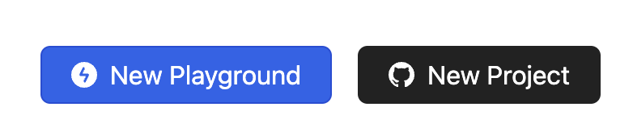
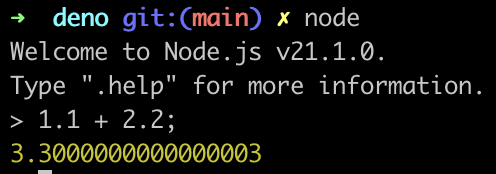
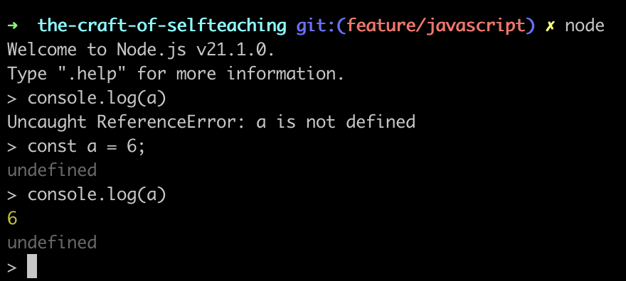
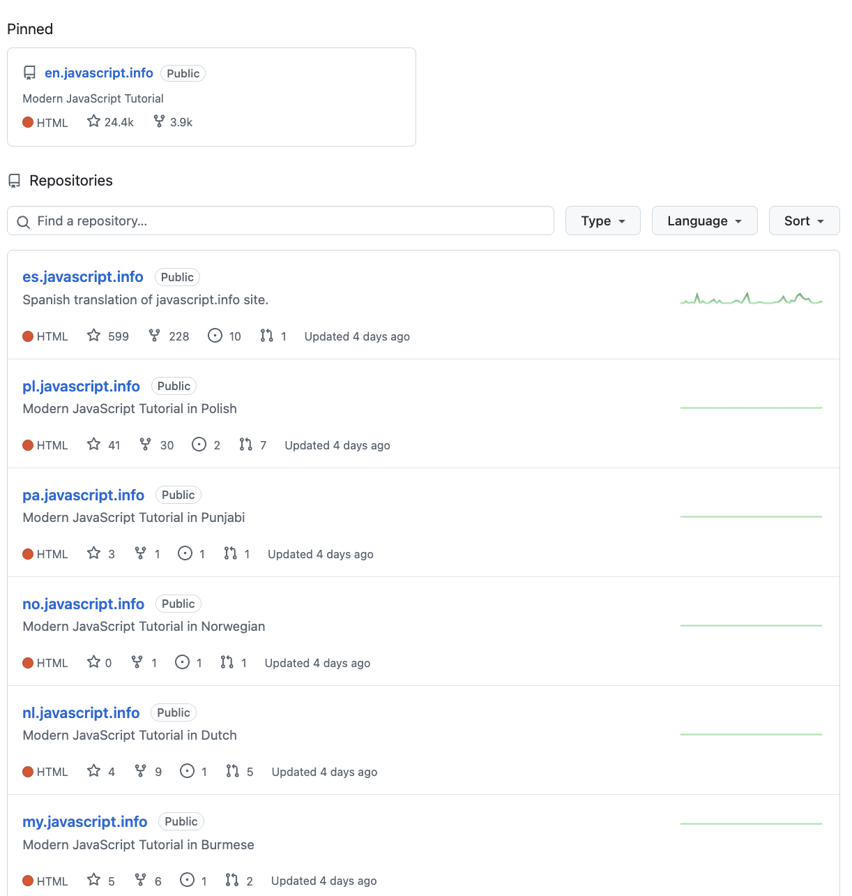
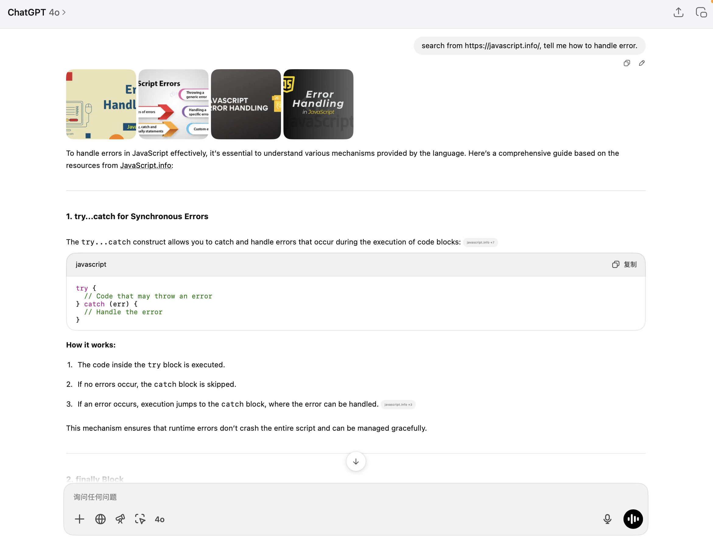
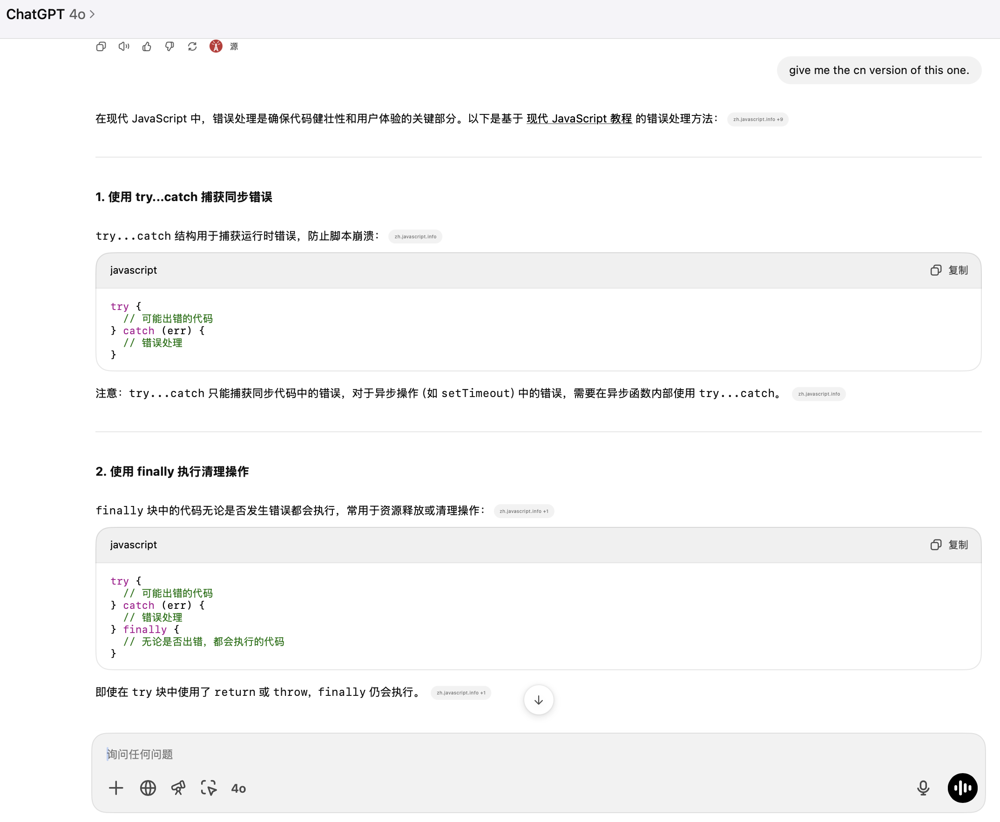

# 自学是门手艺

> One has no future if one couldn't teach themself<a href='#fn1' name='fn1b'><sup>[1]</sup></a>.

**作者：李笑来**

特别感谢**霍炬**（[@virushuo](https://github.com/virushuo)）、**洪强宁**（[@hongqn](https://github.com/hongqn)) 两位良师诤友在此书写作过程中给予我的巨大帮助！

```javascript
// pseudo-code of selfteaching in Javascript

function teachYourself(anything) {
  while (!create()) {
    learn();
    practice();
  }
  return teachYourself(another);
}

teachYourself(coding);
```

## 目录

> - [01.preface（**前言**）](#01.preface)
> - [02.proof-of-work（**如何证明你真的读过这本书？**）](#02.proof-of-work)
> - [Part.1.A.better.teachyourself（**为什么一定要掌握自学能力？**）](#Part.1.A.better.teachyourself)
> - [Part.1.B.why.start.from.learning.coding（**为什么把编程当作自学的入口？**）](#Part.1.B.why.start.from.learning.coding)
> - [Part.1.C.must.learn.sth.only.by.reading（**只靠阅读习得新技能**）](#Part.1.C.must.learn.sth.only.by.reading)
> - [Part.1.D.preparation.for.reading（**开始阅读前的一些准备**）](#Part.1.D.preparation.for.reading)
> - [Part.1.E.1.entrance（**入口**）](#Part.1.E.1.entrance)
> - [Part.1.E.2.values-and-their-operators（**值及其相应的运算**）](#Part.1.E.2.values-and-their-operators)
> - [Part.1.E.3.controlflow（**流程控制**）](#Part.1.E.3.controlflow)
> - [Part.1.E.4.functions（**函数**）](#Part.1.E.4.functions)
> - [Part.1.E.5.strings（**字符串**）](#Part.1.E.5.strings)
> - [Part.1.E.6.containers（**数据容器**）](#Part.1.E.6.containers)
> - [Part.1.E.7.files（**文件**）](#Part.1.E.7.files)
> - [Part.1.F.deal-with-forward-references（**如何从容应对含有过多 “过早引用” 的知识？**）](#Part.1.F.deal-with-forward-references)
> - [Part.1.G.The-Javascript-Tutorial-local（**官方教程：Javascript@MDN**）](#Part.1.G.The-Javascript-Tutorial-local)
> - [Part.2.A.clumsy-and-patience（**笨拙与耐心**）](#Part.2.A.clumsy-and-patience)
> - [Part.2.B.deliberate-practicing（**刻意练习**）](#Part.2.B.deliberate-practicing)
> - [Part.2.C.why-start-from-writing-functions（**为什么从函数开始？**）](#Part.2.C.why-start-from-writing-functions)
> - [Part.2.D.1-args（**关于参数（上）**）](#Part.2.D.1-args)
> - [Part.2.D.2-aargs（**关于参数（下）**）](#Part.2.D.2-aargs)
> - [Part.2.D.3-lambda（**化名与匿名**）](#Part.2.D.3-lambda)
> - [Part.2.D.4-recursion（**递归函数**）](#Part.2.D.4-recursion)
> - [Part.2.D.5-docstrings（**函数的文档**）](#Part.2.D.5-docstrings)
> - [Part.2.D.6-modules（**保存到文件的函数**）](#Part.2.D.6-modules)
> - [Part.2.D.7-tdd（**测试驱动的开发**）](#Part.2.D.7-tdd)
> - [Part.2.D.8-main（**可执行的 Javascript 文件**）](#Part.2.D.8-main)
> - [Part.2.E.deliberate-thinking（**刻意思考**）](#Part.2.E.deliberate-thinking)
> - [Part.3.A.conquering-difficulties（**战胜难点**）](#Part.3.A.conquering-difficulties)
> - [Part.3.B.1.classes-1（**类 —— 面向对象编程**）](#Part.3.B.1.classes-1)
> - [Part.3.B.2.classes-2（**类 —— Javascript 的实现**）](#Part.3.B.2.classes-2)
> - [Part.3.B.3.decorator-iterator-generator（**函数工具**）](#Part.3.B.3.decorator-iterator-generator)
> - [Part.3.B.4.regex（**正则表达式**）](#Part.3.B.4.regex)
> - [Part.3.B.5.bnf-ebnf-pebnf（**BNF 以及 EBNF**）](#Part.3.B.5.bnf-ebnf-pebnf)
> - [Part.3.C.breaking-good-and-bad（**拆解**）](#Part.3.C.breaking-good-and-bad)
> - [Part.3.D.indispensable-illusion（**刚需幻觉**）](#Part.3.D.indispensable-illusion)
> - [Part.3.E.to-be-thorough（**全面 —— 自学的境界**）](#Part.3.E.to-be-thorough)
> - [Part.3.F.social-selfteaching（**自学者的社交**）](#Part.3.F.social-selfteaching)
> - [Part.3.G.the-golden-age-and-google（**这是自学者的黄金时代**）](#Part.3.G.the-golden-age-and-google)
> - [Part.3.H.prevent-focus-drifting（**避免注意力漂移**）](#Part.3.H.prevent-focus-drifting)
> - [Q.good-communication（**如何成为优秀沟通者**）](#Q.good-communication)
> - [R.finale（**自学者的终点**）](#R.finale)
> - [S.whats-next（**下一步干什么？**）](#S.whats-next)
> - [T-appendix.editor.vscode（**Visual Studio Code 的安装与配置**）](#T-appendix.editor.vscode)
> - [T-appendix.git-introduction（**Git 简介**）](#T-appendix.git-introduction)
> - [T-appendix.jupyter-installation-and-setup（**Node.js（与 Deno）的安装与配置**）](#T-appendix.jupyter-installation-and-setup)
> - [T-appendix.symbols（**这些符号都代表什么？**）](#T-appendix.symbols)

本书的版权协议为 [CC-BY-NC-ND license](https://creativecommons.org/licenses/by-nc-nd/3.0/deed.zh)。


-----
**脚注**

<a name='fn1'>[1]</a>：['Themselves' or 'themself'？-- Oxford Dictionary](https://en.oxforddictionaries.com/usage/themselves-or-themself)

<a href='#fn1b'><small>↑Back to Content↑</small></a>


- [01 前言](#01.preface)
- [02 如何证明你真的读过这本书？](#02.proof-of-work)

### PART 1

- [Part.1.A 为什么一定要掌握自学能力？](#Part.1.A.better.teachyourself)
- [Part.1.B 为什么把编程当作自学的入口？](#Part.1.B.why.start.from.learning.coding)
- [Part.1.C 只靠阅读习得新技能](#Part.1.C.must.learn.sth.only.by.reading)
- [Part.1.D 开始阅读前的一些准备](#Part.1.D.preparation.for.reading)
- [Part.1.E.1 入口](#Part.1.E.1.entrance)
- [Part.1.E.2 值及其相应的运算](#Part.1.E.2.values-and-their-operators)
- [Part.1.E.3 流程控制](#Part.1.E.3.controlflow)
- [Part.1.E.4 函数](#Part.1.E.4.functions)
- [Part.1.E.5 字符串](#Part.1.E.5.strings)
- [Part.1.E.6 数据容器](#Part.1.E.6.containers)
- [Part.1.E.7 文件](#Part.1.E.7.files)
- [Part.1.F 如何从容应对含有过多 “过早引用” 的知识？](#Part.1.F.deal-with-forward-references)
- [Part.1.G 官方教程：Javascript@MDN](#Part.1.G.The-Javascript-Tutorial-local)

### PART 2

- [Part.2.A 笨拙与耐心](#Part.2.A.clumsy-and-patience)
- [Part.2.B 刻意练习](#Part.2.B.deliberate-practicing)
- [Part.2.C 为什么从函数开始？](#Part.2.C.why-start-from-writing-functions)
- [Part.2.D.1 关于参数（上）](#Part.2.D.1-args)
- [Part.2.D.2 关于参数（下）](#Part.2.D.2-aargs)
- [Part.2.D.3 化名与匿名](#Part.2.D.3-lambda)
- [Part.2.D.4 递归函数](#Part.2.D.4-recursion)
- [Part.2.D.5 函数的文档](#Part.2.D.5-docstrings)
- [Part.2.D.6 保存到文件的函数](#Part.2.D.6-modules)
- [Part.2.D.7 测试驱动的开发](#Part.2.D.7-tdd)
- [Part.2.D.8 可执行的 Javascript 文件](#Part.2.D.8-main)
- [Part.2.E 刻意思考](#Part.2.E.deliberate-thinking)

### PART 3

- [Part.3.A 战胜难点](#Part.3.A.conquering-difficulties)
- [Part.3.B.1 类 —— 面向对象编程](#Part.3.B.1.classes-1)
- [Part.3.B.2 类 —— Javascript 的实现](#Part.3.B.2.classes-2)
- [Part.3.B.3 函数工具](#Part.3.B.3.decorator-iterator-generator)
- [Part.3.B.4 正则表达式](#Part.3.B.4.regex)
- [Part.3.B.5 BNF 以及 EBNF](#Part.3.B.5.bnf-ebnf-pebnf)
- [Part.3.C 拆解](#Part.3.C.breaking-good-and-bad)
- [Part.3.D 刚需幻觉](#Part.3.D.indispensable-illusion)
- [Part.3.E 全面 —— 自学的境界](#Part.3.E.to-be-thorough)
- [Part.3.F 自学者的社交](#Part.3.F.social-selfteaching)
- [Part.3.G 这是自学者的黄金时代](#Part.3.G.the-golden-age-and-google)
- [Part.3.H 避免注意力漂移](#Part.3.H.prevent-focus-drifting)

### 附章

- [Q 如何成为优秀沟通者](#Q.good-communication)
- [R 自学者的终点](#R.finale)
- [S 下一步干什么？](#S.whats-next)

### 附录

- [Appendix A: Visual Studio Code 的安装与配置](#T-appendix.editor.vscode)
- [Appendix B: Git 简介](#T-appendix.git-introduction)
- [Appendix C: Node.js（与 Deno）的安装与配置](#T-appendix.jupyter-installation-and-setup)
- [Appendix D: 这些符号都代表什么？](#T-appendix.symbols)


<a id="01.preface"></a>
# 01. 前言

想写一本关于自学能力的书，还真的不是一天两天的事，所以肯定不是心血来潮。

等我快把初稿框架搭完，跟霍炬说起我正在写的内容时，霍炬说：

> 你还记得吗，你第一次背个包来我家的时候，咱们聊的就是咋写本有意思的编程书……

我说：

> 真是呢！十三年就这么过去了……

不过，这次真的写了。写出来的其实并不是，或者说，并不仅仅是 “一本编程书”。

这本 “书” 是近些年我一直在做却没做完整的事情，讲清楚 “学习学习再学习”：

> 学会学习之后再去学习……

只不过，这一次我阐述地更具体 —— 不是 “学会学习”，而是 “学会自学” —— 这一点点的变化，让十多年前没写顺的东西，终于在这一次迎刃而解，自成体系。

> 以前，我在写作课里讲，写好的前提就是 “Narrow down your topic” —— 把话题范围缩小缩小再缩小…… 这次算是给读者一个活生生的实例了罢。

自学能力，对每个个体来说，是这个变化频率和变化幅度都在不断加大的时代里最具价值的能力。具备这个能力，不一定能直接增加一个人的幸福感（虽然实际上常常确实能），但它一定会缓解甚至消除一个人的焦虑 —— 若是在一个以肉眼可见的方式变化着的环境里生存，却心知肚明自己已然原地踏步许久，自己正在被这个时代甩在身后，谁能不焦虑呢？

实际上，这些年来我写的书，都是关于学习的，无论是《[把时间当作朋友](https://github.com/xiaolai/time-as-a-friend)》，还是《通往财富自由之路》，甚至《韭菜的自我修养》，你去看就知道，背后都是同样的目标：学习、进步 —— 甚至**进化**。

这一次的《自学是门手艺》，首先，可以看作是之前内容的 “实践版”：

> 完成这本书的内容，起码会习得一个新技能：编程。

更为重要的是，可以把《自学是门手艺》当作之前内容的 “升级版”：

> 自学能力，是持续学习持续成长的发动机……

仔细观察整个人群，你就会发现一个惊人且惊悚的事实：

> **至少有 99% 的人终生都没有掌握自学能力！**

其实这个数字根本不夸张。根据 2017 年的统计数据，从 1977 年到 2017 年，40 年间全国大学录取人数总计为 1.15 亿左右（11518.2 万），占全国人口数量的 10% 不到，另外，这其中一半以上是专科生…… 你觉得那些 4% 左右的本科毕业生中，带着自学能力走入社会的比例是多少？不夸张地讲，我觉得 1% 都是很高的比例了 —— 所以，前面提到的 99% 都是很客气的说法。

绝大多数人，终其一生都没有自学过什么。他们也不是没学过，也不是没辛苦过，但事实却是：他们在有人教、有人带、有人逼的情况下都没真学明白那些基础知识…… 更可怕的是，他们学的那些东西中，绝大多数终其一生只有一个用处：考试。于是，考试过后，那些东西就 “考过即弃” 了…… 不得不承认，应试教育的确是磨灭自学能力的最有效方法。

在随后的生活里，尽管能意识到自己应该学点什么，常有 “要是我也会这个东西就好了” 的想法，但基本上百分之百以无奈结束 —— 再也没有人教、再也没有人带、再也没有人逼…… 于是，每次 “决心重新做人” 都默默地改成 “继续做人” 而后逢年过节再次许愿 “重新做人”……

这是有趣而又尴尬的真相：

> 没有不学习的人。

你仔细观察就知道了，就算被你认为不学无术的人，其实也在学习，只不过，他们的选择不同，他们想学的是投机取巧，并天天琢磨怎样才能更好地投机取巧……

但他们不是最倒霉的人。最倒霉的人是那种人，也 “认真学了”，可总是最终落得个越来越焦虑的下场……
经常有一些人指责另外一些人 “贩卖焦虑” —— 根据我的观察，这种指责的肤浅在于，焦虑不是被卖方贩卖的产品，焦虑其实是买方长期自行积累的结果。

**别人无法贩卖给你焦虑，是你自己焦虑** —— 是你自己在为自己不断积累越来越多的焦虑……

然而，又有谁不想解决掉焦虑呢？又有谁不想马上解决掉焦虑呢？

于是，你焦虑，你就要找解决方案。而焦虑的你找到的解决方案，就是花个钱买本书，报个班，找个老师，上个课…… 这能说是别人贩卖焦虑给你吗？

自学能力强的人，并非不花钱，甚至他们花的钱可能更多。他们也花钱买书，而且买更多的书；他们也可能花钱上课，而且要上就上最好的课、最好的班；他们更经常费尽周折找到恰当的人咨询、求教、探讨 —— 所以，事实上，他们更可能花了更多的钱……

但自学能力强的人不焦虑，起码他们不会因为学习以及学习过程而焦虑 —— 这是重大差别。

而焦虑的大多数，并不是因为别人贩卖焦虑给他们，他们才 “拥有” 那些焦虑 —— 他们一直在焦虑，并且越来越焦虑……

为什么呢？总也学不会、学不好，换做是你，你不焦虑吗？！

生活质量就是这样一点一点被消磨掉的 —— 最消耗生活质量的东西，就是焦虑。

我相信，若是《自学是门手艺》这本书真的有用，它的重要用处之一就是能够缓解你的焦虑，让你明白，首先焦虑没用，其次，有办法也有途径让你摆脱过往一事无成的状况，逐步产生积累，并且逐步体会到那积累的作用，甚至最后还能感觉到更多积累带来的加速度…… 到那时候，焦虑就是 “别人的事情” 了。

自学没有什么 “秘诀”。**它是一门手艺**，并且，严格意义上来讲，它**只是**一门手艺。

手艺的特点就是**无需天分**。手艺的特点就是**熟练程度决定一切**。从这一点上来看，自学这门手艺和擀饺子皮没什么区别 —— 就那点事，刚开始谁都笨手笨脚，但熟练了之后，就那么回事…… 而已。

做什么事都有技巧，这不可否认。

自学当然也有技巧…… 不过，请做好思想准备：

> 这儿的空间，**没什么新鲜**……

—— 这是崔健一首歌里的歌词片段，但放在这里竟然非常恰当到位。

**一切与自学相关的技巧都是老生常谈**。

中国人说，熟能生巧；老外说，Practice makes perfect —— 你看，与自学相关的技巧，干脆不分国界……

—— 因为这事人类从起点开始就没变过 —— 每代人都有足够多的人在自学这件事上挣扎…… 有成的有不成的；成的之中有大成有小成…… 可有一件事同样不变：留下的文字、留下的信息，都是大成或者小成之人留下的，不成的人不声不响就销声匿迹。

并且，从各国历史上来看，自学技巧这个话题从未涉及到政治，无论是在东方还是西方都是如此。结果就是，在自学能力这个小领域中，留下并流传下来的信息，几乎从未被审查，从未被摧毁，从未被侵犯，从未被扭曲 —— 真的是个特别罕见的 “纯净的领域” —— 这真的是整个人类不可想像之意外好运。

这就是为什么一切的自学技巧到最后肯定是老生常谈的原因。

大部分年轻人讨厌老生常谈。

但这还真的是被误导的结果。年轻人被什么误导了呢？

每一代人都是新鲜出生，每一代人出生时都在同一水准…… 随着时间的推移，总是庸者占绝大多数，这个 “绝大多数” 不是 51%，不是 70%，而是 99%！—— 年轻人吃亏就吃在没把这个现象考虑进来。

也就是说，虽然有用的道理在不断地传播，可终究还是 99% 的人做不到做不好，于是：

> 讲大道理的更可能是庸者、失败者，而不是成功者。

人类有很多天赋。就好像我反复提到的那样，“就算不懂也会用” 是人类的特长。同样的道理，人类在这方面同样擅长：

> 无论自己什么样，在 “判断别人到底是不是真的很成功” 上，基本上有 99% 的把握……

所以，十岁不到的时候，绝大多数小朋友就 “看穿” 了父母，后来再 “看穿” 了老师…… 发现他们整天说的都是他们自己做不到的事情…… 于是误以为自己 “看穿” 了整个世界。

那时候小朋友们还没学、或者没学好概率这个重要知识，于是，他们并不知道那只不过是 99% 的情况，而且更不知道 “**因素的重要性与它所占的比例常常全无正相关**”，所以当然不知道那自己尚未见到的 `1%` 才可能是最重要的……

于是，99% 的小朋友们一不小心就把自己 “搭了进去”：

> 不仅讨厌老生常谈，而且偏要对着干，干着干着就把自己变成了另外一个属于那 99% 的另外一个老生……

这是 99% 的人终其一生的生动写照。

做 `1%` 很难吗？真的很简单，有时仅仅一条就可能奏效：

> **在自学这件事上，重视一切老生常谈……**

很难吗？不难，只不过是一个 “开关” 而已。

当我动手写这本 “书” 的时候，是 47 岁那年（2019）的春节前 —— 显然，这个时候我也早就是一位 “老生” 了…… 并且，这些道理我已经前后讲了二十年！算是 “常谈” 甚至 “长谈” 了罢……

开始在新东方教书那年，我 28 岁；用之前那一点三脚猫的编程能力辅助着去写《TOEFL 核心词汇 21 天突破》是 2003 年；后来写《[把时间当作朋友](https://github.com/xiaolai/time-as-a-friend)》是 2007 年，这本书的印刷版出版发行是在 2009 年；再后来陆续写了很多内容，包括没有纸质版发行只有在线版的《人人都能用英语》（2013）；以及因为在罗振宇的得到 App 上开专栏，把之前写过的《学习学习再学习》重构且扩充而出版的《通往财富自由之路》（2017）；甚至连《韭菜的自我修养》（2018）都是讲思考、学习、和认知升级的……

说来说去，就那些事 —— **没什么新鲜**。

这中间也有很多写了却没写完，或者因为写得自己不满意扔在柜子里的东西，比如《人人都是工程师》（2016）—— 哈！我就是这么坚韧，有了目标就会死不放弃…… 3 年后的今天，我终于用那个时候完全想不到的方式完成了当时的目标，并且，做到了很多 3 年前自己都完全想象不到的事情。

在写当前这本《自学是门手艺》的过程中，我从一开始就干脆没想给读者带来什么 “新鲜” 的或者 “前所未见” 的自学技巧 —— 因为真的就没有，根本就没有什么新鲜的自学技巧…… 没有，真的没有 —— 至少，我自己这么久了还是真的没见识过。

然而，我算是最终能做到的人。知道、得到、做到之间，均各不相同。

二十年前，在拥挤的课堂里坐在台下听我讲课的小朋友们，绝大多数在当时应该没有想到他们遇到了这样一个人 —— 二十年后，刚认识我的人也不会自动知道我是这样的人。

但是，这些年里，看到我在一点一点进步、从未原地踏步的人很多很多…… 我猜，所谓的 “榜样”，也不过如此了罢。

不夸张地讲，这可能是当前世界上**最硬核的鸡汤书**了 —— 因为，虽然它就是鸡汤（李笑来自认就是个鸡汤作者），但它不是 “只是拿话糊弄你” 那种，也不是 “只不过是善意的鼓励” 那种，它是那种 “教会你人生最重要的技能” 的鸡汤，并且还不仅仅只有一种技能，起码两个：“自学能力” 和 “编程能力”…… 而这两个能力中的无论哪一种，都是能确定地提高读者未来收入的技能，对，就是 `100%` 地确定 —— 有个会计专业的人求职的时候说 “我还会编程” 且还能拿出作品，你看看他可不可能找不到工作？你看看他是不是能薪水更高？

`#!` —— 这是个程序员能看懂的梗。

关键在于，这个老生不是说说而已的老生，他是能够**做到**的人：

> - 一个末流大学的会计专业毕业的人不得已去做了销售；
> - 这个销售后来去国内最大的课外辅导机构当了 7 年 TOEFL/GRE/GMAT 老师；
> - 这个英语老师后来同时成了很多畅销书、长销书的作者；
> - 这个作者后来居然成了著名天使投资人；
> - 这个投资人后来竟然写了本关于编程入门的书籍；
> - 这本 “书” 最终竟然还是一个完整的产品，不仅仅是 “一本书”……

然而呢？

—— 然而，即便是这样的老生，也讲不出什么新鲜道理。

因为啊，历史上留下来的所有关于自学的技巧，都是人类史上最聪明的人留下来的 —— 你我这样的人，照做就可以了…… 现在你明白怎么回事了吧？

**记住罢** ——

> **千万不要一不小心就把自己搭进去……**

<p style="text-align: right"><strong>李笑来</strong></p>
<p style="text-align: right">初稿完成于 <em>2019</em> 年 <em>2</em> 月 <em>27</em> 日</p>


<a id="02.proof-of-work"></a>
# 02. 如何证明你真的读过这本书？

## 積ん読

日语里有个很好玩的词，“**積ん読**”（[tsundoku](https://en.wikipedia.org/wiki/Tsundoku)）：

> 指那些买回来堆在那里还没读过的（甚至后来干脆不看了的）书……

细想想，每个人都有很多很多 “積ん読”。小时候我们拿回家的教科书中就有相当一部分，其实就是 “積ん読”，虽然那时候掏钱买书的是父母，不仔细看、或者干脆不看的时候，也知道自己在偷懒…… 再后来就是 “主动犯罪” 了 —— 比如，很多人买到手里的英语词汇书是根本就没有翻到过第二个列表的，乃至于过去我常常开玩笑说，中国学生都认识一个单词，*abandon*，不是吗？这个单词是很多很多人 “决心重新做人” 而后 “就这样罢” 的铁板钉钉的见证者。

在没有电子书的时代，印刷版书籍多少还有一点 “装饰品” 功用，可是到了电子书时代，谁知道你的设备里有多少付费书籍呢？攒下那么多，其实并没有炫耀的地方，给谁看呢？据说，Kindle 的后台数据里可以看到清楚的 “打开率”，大抵上也是在 &frac14; ~ &frac13; 之间，也就是说，差不多有 &frac23; ~ &frac34; 的电子书籍被购买下载之后，从来就没有被打开过。

如此看来，付费之后并不阅读，只能欺骗一个对象了：自己。跟心理学家们之前想象的不同，我认为人们通常是不会欺骗自己的，至少很难 “故意欺骗自己”。所以，对于 “买了之后坚决不读” 这个现象，我不认为 “给自己虚妄的满足感” 是最好的解释。

更朴素一点，更接近真相的解释是：

> 那百分之七八十的人，其实是想着给自己一个希望……

—— 等我有空了一定看。嗯。

说来好笑，其实每个人共同拥有的目标之一是这样的：

> 成为前百分之二十的少数人……

然而，PK 掉百分之七八十的人的方法真的很简单很简单啊：

> 把买来的书都真真切切地认真读过就可以了。

这实在是太简单了罢？！可是…… 我知道你刚刚那个没出息的闪念：

> 那我少买书甚至不买书不就可以了吗？

你自己都知道这是荒谬的，却忍不住为你的小聪明得意 —— 其实吧，幸亏有你们在，否则我们怎么混进前百分之二十呢？

## PoW

比特币这个地球上第一个真正被证明为可行的区块链应用中有一个特别重要的概念，叫做 “**工作证明**”（Proof of Work）—— 你干活了就是干活了，你没干活就是没干活，你的工作是可被证明的……

借用这个思路，我设计了个方法，让你有办法证明自己就是看过这本书，就是读完了这本书 —— 你能向自己也向别人证明自己曾经的工作…… 是不是挺好？

证明的方法是使用 [github.com](https://github.com) 这个网站以及版本控制工具 **git**。

## 具体步骤

请按照以下步骤操作：

> 1. 注册 [github.com](https://github.com) 帐号 —— 无论如何你都必须有 github 账户；
> 2. 使用浏览器访问 [https://github.com/selfteaching/the-craft-of-selfteaching](https://github.com/selfteaching/the-craft-of-selfteaching)；
> 3. 在页面右上部找到 “Fork” 按钮，将该仓库 Fork 到你自己的账户中；
> 4. 使用 `git clone` 命令或者使用 [Desktop for Github](https://desktop.github.com/) 将 [the craft of selfteaching](https://github.com/selfteaching/the-craft-of-selfteaching) 这个你 Fork 过来的仓库克隆到本地；
> 5. 按照 [Node.js（与 Deno）的安装与配置](T-appendix.jupyter-installation-and-setup.md) 的说明在本地装好 Node（或 Deno）—— 阅读 `markdown/` 下的章节时，其中的代码都可以在终端里用 `node` / `deno` 当场执行，并且，你还可以直接改着玩……
> 6. 在阅读过程中，可以不断通过修改文章中的代码作为练习 —— 这样做的结果就是已阅读过的文件会发生变化…… 每读完一章，甚至时时刻刻，你都可以通过 `git commit` 命令向你自己 Fork 过来的仓库提交变化 —— 这就是你的阅读工作证明；
> 7. 仓库里有一个目录，`my-notes`，你可以把你在学习过程中写的笔记放在那里；
> 8. 仓库里还有另外一个目录，`from-readers`；那是用来收集读者反馈的 —— 将来你可以写一篇《我的自学之路》，放在这个目录里，单独创建一个分支，而后提交 `pull request`，接受其他读者投票，若是达到一定的赞同率，那么你的文章就会被收录到主仓库中被更多人看到，激励更多的人像你一样走上自学之路……

当然，为了这么做，你还要多学一样反正你早晚都必须学会的东西，Git —— 请参阅附录《[Git 入门](T-appendix.git-introduction.md)》。

时间就是这样，我们没办法糊弄它。而有了 git 这样的工具之后，我们在什么时候做了什么样的工作，是很容易证明的 —— 这对我们来说真是天大的好事。

## 如何使用 Pull Request 为这本书校对

另外，在你阅读的过程中，发现有错别字啊、代码错误啊，甚至有 “更好的表述” 等等，都可以通过 `pull request` 来帮我改进 —— 这也是一种 “工作证明”。

(1) 使用浏览器访问 https://github.com/selfteaching/the-craft-of-selfteaching

(2) 点击右上角的 “Fork 按钮”，将该仓库 Fork 到你的 Github 账户中


(3) 创建一个新分支，可以取名为 `from-<your_username>`，比如，`by git.basic.tutorial`；之后点击 Create Branch 建立新分支。


(4) 在新分支下进行修改某个文件，而后提交 —— 提交前不要嫌麻烦，一定要在 Comment 中写清楚修改说明：


以上示例图片中是修改了 README.md 文件 —— 事实上，你应该提交的是的确有必要的校对。

另外，**请注意**：在创建分支之前，要将你的 Fork 更新到最新版。具体操作方法见下一节《如何在 Github 网站上将自己的 Fork 与原仓库同步》。

(5) 在页面顶部选择 Pull request 标签：


而后点击 `Compare & pull request` 按钮 —— 如果看不到这个按钮，那就点击下面刚刚修改文件的链接，如上图中的 “Update README.md”（这是你刚刚提交修改时所填写的标题）。


确认无误之后，点击 `Create pull request` 按钮。


(6) 随后，Github 用户 [@xiaolai](https://github.com/xiaolai) —— 就是我，即，the-craft-of-selfteaching 这个仓库的所有者，会被通知有人提交了 Pull request，我会看到：


在我确认这个 Pull request 修改是正确的、可接受的之后，我就会按 `Merge pull request` 按钮 —— 如此这般，一个修正就由你我共同完成了。


**注意**

提交 Pull request 的时候，最佳策略如下：

> * 提交 Pull request 之前，必须先将你的 Fork 的 master 与原仓库同步到最新；
> * 从 master 创建 **新的 branch** 进行增补、修改等操作；
> * 尽量每次只提交一个小修改；
> * 提交时尽量简短且清楚地说明修改原因；
> * 耐心等待回复。

当自己的 Fork 过来的仓库已经被你在本地 “玩残” 了的时候，它千万不能被当作用来提交 Pull request 的版本。自己本地怎么玩都无所谓，但需要向别人提交 Pull request 的时候，必须重新弄一个当前最新版本到本地，而后再在其基础上修改。

## 如何在 Github 网站上将自己的 Fork 与原仓库同步

(1) 在你的 Fork 页面中如下图所示，点击 `Compare` 链接：


(2) 将 `base repository` 更改成当前自己的 Fork，在图示中即为 `gitbasictutorial/the-craft-of-selfteaching`：


(3) 这时候，页面会显示 `There isn't anything to compare.`，因为你在比较 “自己” 和 “自己”。点击 `compare across forks` 链接：


(4) 将 `head repository` 更改成 Upstream Repository（即，上游仓库），在图示中即为 `selfteaching/the-craft-of-selfteaching`：


(5) 稍等片刻，你会看到比较结果；而后你可以创建一个 Pull request —— 这是一个由你自己向你自己的 Fork 仓库提交的 Pull request：


(6) 而后你在 `Pull requests` 标签页里会看到你刚刚提交的 Pull request：


(7) 同意并合并之后的结果是，你的 Fork 与上游仓库同步完成了：


当然，有时会出现一些你无法解决的问题，那么，还有一个最后的方法：

> 将你的 Fork 删除，而后重新到 https://github.com/selfteaching/the-craft-of-selfteaching 页面按一次 `Fork` 按钮……

## 如何使用 github 记录自己的学习过程

你可以在本地建立一个分支（branch），例如，取名为 `study`：

```bash
git branch study
git checkout study
```

如此这般之后，你在本地工作目录中所做的任何修改，都可以提交到 `study` 这个分支之中。

你每次在阅读 `markdown/` 章节时改代码、在终端里跑 `node` / `deno` 验证，相关文件都会发生变化；你也可以随意修改文件中的任何地方，比如把某段代码从头至尾 “敲” 一遍，看看执行结果有什么不同；还可以在文中加自己的笔记……

总而言之，当你阅读完某一章节并如上所说那样做了一些改动之后，那个 `ipynb` 文件就发生了一些变化。于是，你就可以执行以下命令：

```bash
git add .
git commit -am 'my study result'
git push
```

如此这般，在 `study` 这个分支中就记录着你的学习轨迹。

当然，如果在这过程中，你发现本书自身有需要校对的地方，那么，你需要切换到 `master` 分支，执行以下命令：

```bash
git checkout master
git pull
```

而后再修改，进而按照上一节的方法提交 Pull request。

未来，在 [https://github.com/selfteaching](https://github.com/selfteaching) 下我会专门设置一个 repo，用来自动扫描 github 上本书的学习记录 —— 这种记录在过往的书籍当中是不可能存在的，然而，现在却可以了。在我看来，将来这种记录的作用甚至有可能比 “学历” 还要重要。


<a id="Part.1.A.better.teachyourself"></a>
# Part.1.A. 为什么一定要掌握自学能力？

一句话解释清楚：

> 没有自学能力的人没有**未来**。

有两个因素需要深入考虑：

> * 未来的日子还很长
> * 这世界进步得太快

我有个观察：

> 很多人都会不由自主地去复刻父母的人生时刻表。

比如，你也可能观察到了，父母晚婚的人自己晚婚的概率更高，父母晚育的人自己晚育的概率也更高……

再比如，绝大多数人的内心深处，会不由自主地因为自己的父母在五十五岁的时候退休了，所以就默认自己也会在五十五岁前后退休…… 于是，到了四十岁前后的时候就开始认真考虑退休，在不知不觉中就彻底丧失了斗志，早早就活得跟已经老了很多岁似的。

但是，这很危险，因为很多人完全没有意识到自己所面临的人生，与父母所面临的人生可能完全不一样 —— 各个方面都不一样。单举一个方面的例子，也是比较容易令人震惊的方面：

> 全球范围内都一样，在过去的五十年里，人们的平均寿命预期增长得非常惊人……

拿中国地区做例子，根据世界银行的数据统计，中国人在出生时的寿命预期，从 1960 年的 _43.73_ 岁，增长到了 2016 年的 _76.25_ 岁，56 年间的增幅竟然有 **74.39%** 之多！

```python
import matplotlib.pyplot as plt
import numpy as np

data = np.genfromtxt('life-expectancy-china-1960-2016.txt',
                     delimiter=',',
                     names=['x', 'y'])
da1960  = data[0][1]
da2016  = data[-1][1]
increase = (da2016 - da1960) / da1960
note = 'from {:.2f} in 1960 to {:.2f} in 2016, increased  {:.2%}'\
    .format(da1960, da2016, increase)

plt.figure(figsize=(10, 5))
plt.plot(data['x'], data['y'])
plt.ylabel('Life Expectancy from Birth')
plt.tick_params(axis='x', rotation=70)
plt.title('CHINA\n' + note)

# plt.savefig('life-expectancy-china-1960-2016.png', transparent=True)
plt.show()

# data from:
# https://databank.worldbank.org/data/reports.aspx?source=2&series=SP.DYN.LE00.IN
```


如此发展下去，虽然人类不大可能永生不死，但平均寿命依然在持续延长是个不争的事实。与上一代不同，现在的千禧一代，需要面对的是百岁人生 —— 毫无疑问，不容置疑。

这么长的人生，比默认的想象中可能要多出近一倍的人生，再叠加上另外一个因素 —— 这是个变化越来越快的世界 —— 会是什么样子？

我是 1972 年出生的。从交通工具来看，我经历过出门只能靠步行，大街上都是牛车马车，机动车顶多见过拖拉机，到有自行车，到见过摩托车，到坐小汽车，到自己开车，到开有自动辅助驾驶功能的电动车…… 从阅读来看，我经历过只有新华书店，到有网络上的文字，到可以在当当上在线买到纸质书，到有了国际信用卡后可以在 Amazon 上第一时间阅读新书的电子版、听它的有声版，到现在可以很方便地获取最新知识的互动版，并直接参与讨论…… 从技能上来看，我经历过认为不识字是文盲，到不懂英语是文盲，到不懂计算机是文盲，到现在，不懂数据分析的基本与文盲无异……

我也见识过很多当年很有用很赚钱很令人羡慕的技能 “突然” 变成几乎毫无价值的东西，最明显的例子是驾驶。也就是二十多年前，的哥还是很多人羡慕的职业呢！我本科的时候学的是会计专业，那时候我们还要专门练习打算盘呢！三十年之后的今天，就算有人打算盘打得再快，有什么具体用处嘛？我上中学的时候，有个人靠出版字帖赚了大钱 —— 那时候据说只要写字漂亮就能找到好工作；可今天，写字漂亮与否还是决定工作好坏的决定性因素吗？打印机很便宜啊！

这两个因素叠加在一起的结果就是，这世界对很多人来说，其实是越来越残忍的。

我见过太多的同龄人，早早就停止了进步，早早就被时代甩在身后，早早就因此茫然不知所措 —— 早早晚晚，你也会遇到越来越多这样的人。他们的共同特征只有一个：

> 没有自学能力

有一个统计指数，叫做人类发展指数（Human Development Index），它的曲线画出来，怎么看都有即将成为指数级上升的趋势。

```python
import matplotlib.pyplot as plt
import numpy as np
plt.figure(figsize=(10, 5))

lebdata = np.genfromtxt('life-expectancy-china-1960-2016.txt',
                        delimiter=',',
                        names=['x', 'y'])

hdidata = np.genfromtxt('hdi-china-1870-2015.txt',
                        delimiter=',',
                        names=['x', 'y'])

plt.plot(hdidata['x'], hdidata['y'], label='Human Development Index')
plt.tick_params(axis='x', rotation=70)
plt.title('China: 1870 - 2015')

plt.plot(lebdata['x'], lebdata['y'] * 0.005, label='Life Expectancy from Birth')
plt.plot(secondary_y=True)

plt.legend()

# plt.savefig('human-development-index-china-1870-2015.png', transparent=True)
plt.show()

# link:
# https://ourworldindata.org/human-development-index

# data from:
# blob:https://ourworldindata.org/44b6da71-f79e-42ab-ab37-871e4bd256e9
```


社会发展越来越快，你要面对的人生越来越长，在那一段与你的直觉猜想并不相同的漫漫人生路上，你居然没有磨练过自学能力，竟然只能眼睁睁地看着自己被甩下且无能为力，难道接下来要在那么长的时间里 “苦中作乐” 吗？

没有未来的日子，怎么过呢？

我本科学的是会计，研究生跑到国外读宏观经济学没读完，跑回国内做计算机硬件批发，再后来去新东方应聘讲授托福课程，离开新东方之后创业，再后来做投资，这期间不断地写书…… 可事实上，我的经历在这个时代并不特殊。有多少人在后来的职业生涯中所做的事情与当年大学里所学的专业相符呢？

纽约联邦储蓄银行在 2012 年做过一个调查，发现人们的职业与自己大学所学专业相符的比例连 _30%_ 都不到。而且，我猜，这个比例会持续下降的 —— 因为这世界变化快，因为大多数教育机构与世界发展脱钩的程度只能越来越严重……

```python
import matplotlib.pyplot as plt

labels = ['Major Match', '']
sizes = [273, 727]
colors = ['#E2E2E2', '#6392BF']
explode = (0, 0.08)
plt.figure(figsize=(7, 7))
plt.pie(sizes,
        labels=labels,
        explode=explode,
        autopct='%1.1f%%',
        colors=colors,
        startangle=270,
        shadow=True)
# plt.savefig('major-match-job.png', transparent=True)
plt.show()

# data from:
# https://libertystreeteconomics.newyorkfed.org/2013/05/do-big-cities-help-college-graduates-find-better-jobs.html
```


绝大多数人终生都饱受**时间幻觉**的拖累。

小时候觉得时间太长，那是幻觉；长大了觉得时间越来越快，那还是幻觉 —— 时间从来都是匀速的。最大的幻觉在于，总是以为 “时间不够了” —— 这个幻觉最坑人。许多年前，有一次我开导我老婆。她说，“啊？得学五年才行啊？！太长了！” 我说，

> “你回头看看呗，想想呗，五年前你在做什么？是不是回头一看的时候，五年前就好像是昨天？道理是一样的，五年之后的某一天你回头想今天，也是 ‘一转眼五年就过去’ 了…… 只不过，你今天觉得需要时间太多，所以不肯学 —— 但是，不管你学还是不学，五年还是会 ‘一转眼就过去’ 的…… 到时候再回头，想起这事的时候，没学的你，一定会后悔 —— 事实上，你已经有很多次后悔过 ‘之前要是学了就好了’，不是吗？”

现在回头看，开导是非常成功的。十多年后的今天，她已经真的可以被称为 “自学专家” —— 各种运动在她那儿都不是事。健身，可以拿个北京市亚军登上健与美杂志封面；羽毛球，可以参加专业比赛；潜水，潜遍全球所有潜水胜地，到最后拿到的各种教练证比她遇到的各地教练的都多、更高级；帆船，可以组队横跨大西洋；爬山，登上喜马拉雅……

都说，人要有一技之长。那这一技究竟应该是什么呢？

> 自学能力是唯一值得被不断磨练的长技。

磨练出自学能力的好处在于，无论这世界需要我们学什么的时候，我们都可以主动去学，并且还是马上开始 —— 不需要等别人教、等别人带。

哪怕有很强的自学能力的意思也并不是说，什么都能马上学会、什么都能马上学好，到最后无所不精无所不通…… 因为这里有个时间问题。无论学什么，都需要耗费时间和精力，与此同时更难的事情在于不断填补耐心以防它过早耗尽。另外，在极端的情况下，多少也面临天分问题。比如身高可能影响打篮球的表现，比如长相可能影响表演的效果，比如唱歌跑调貌似是很难修复的，比如有些人的粗心大意其实是基因决定的，等等。不过，以我的观察，无论是什么，哪怕只是学会一点点，都比不会强。哪怕只是中等水平，就足够应付生活、工作、养家糊口的需求。

我在大学里学的是会计专业，毕业后找不到对口工作，只好去做销售 —— 没人教啊！怎么办？自学。也有自学不怎么样的时候，比如当年研究生课程我就读不完。后来想去新东方教书 —— 因为听说那里赚钱多 —— 可英语不怎么样啊！怎么办？自学。离开新东方去创业，时代早就变了，怎么办？自学，学的不怎么样，怎么办？硬挺。虽然创业这事后来也没怎么大成，但竟然在投资领域开花结果 —— 可赚了钱就一切平安如意了吗？并不是，要面对之前从来没可能遇到的一些险恶与困境，怎么办？自学。除了困境之外，更痛苦的发现在于对投资这件事来说，并没有受过任何有意义的训练，怎么办？自学。觉得自己理解的差不多了，一出手就失败，怎么办？接着学。

我出身一般，父母是穷教师。出生在边疆小镇，儿时受到的教育也一般，也是太淘气 —— 后来也没考上什么好大学。说实话，我自认天资也一般，我就是那种被基因决定了经常马虎大意的人。岁数都这么大了，情商也都不是一般的差 —— 还是跟年轻的时候一样，经常莫名其妙就把什么人给得罪透了……

但我过得一直不算差。

靠什么呢？人么，一个都靠不上。到最后，我觉得只有一样东西真正可靠 —— **自学能力**。于是，经年累月，我磨练出了一套属于我自己的本领：只要我觉得有必要，我什么都肯学，学什么都能学会到够用的程度…… 编程，我不是靠上课学会的；英语，不是哪个老师教我的；写作，也不是谁能教会我的；教书，没有上过师范课程；投资，更没人能教我 —— 我猜，也没人愿意教我…… 自己用的东西自己琢磨，挺好。

关键在于，自学这事并不难，也不复杂，挺简单的，因为它所需要的一切都很朴素。

于是，从某个层面上来看，我每天都过的很开心。为什么？因为我有未来。凭什么那么确信？因为我知道我自己有自学能力。

**—— 我希望你也有。**

准确地讲，希望你有个更好的未来。

而现在我猜，此刻，你心中也是默默如此作想的罢。


<a id="Part.1.B.why.start.from.learning.coding"></a>
# Part.1.B. 为什么把编程当作自学的入口？

很多人误以为 “编程” 是很难的事情。

…… 实则不然 —— 这恰恰是我们选择 “编程” 作为自学的第一个 “执行项目” 的原因。

一本关于自学能力的书，若是真的能够起到作用，那么它就必须让读者在读之前和读之后不一样 —— 比如，之前可能没有自学能力，或者自学能力很差，之后就有了一定的自学能力……

然而，这很难。不但对读者来说很难，对作者来说更难 —— 我当过那么多年被学生高度评价的老师，出版过若干本畅销且长销的书籍，所以更是清楚地知道例子的重要性。

道理当然很重要；可是，在传递道理的时候，例子相对来看好像更重要。

同样的道理，例子不准，人就可能会理解错；例子不精彩，人就可能听不进去；例子居然可以令人震惊，那就可以做到让听众、让读者 “永生不忘”。

许多年前，有位后来在美国读书已经博士毕业了的学生来信，大意是说：

> 好多年前，我在新东方上课，听您讲，人学习就好像是动物进化一样…… 很多人很早就开始停止了进化，本质上跟猴子没啥区别。
>
> 那段类比好长，我记不太清楚细节了…… 可是，当时我是出了一身汗的，因为我忽然觉得自己是一只猴子。可是，突然之间，我不想继续做猴子，更不想一直做猴子！
>
> 从那之后，我好像变了一个人似的…… 现在我已经博士毕业了，觉得应该写封信告诉您，我不再是猴子了，最起码是大猩猩，而且我保证，我会一直进化。
>
> ……

所以啊，在我看来，写书讲课之前，最重要的工作，也是做得最多的事情，其实就是 “找到好例子” —— 那即意味着说，先要找到很多很多恰当合适的例子，而后再通过反复比较试验，挑出那个效果最好的例子。了解了这一点，将来你准备任何演讲，都会不由自主地多花一点时间在这方面，效果肯定比 “把幻灯片做得更花哨一些” 要好太多了罢？

后来，我选中了一个例子：“**自学编程**” —— “*尽量只通过阅读学会编程*”。

## （一）

选择它的理由，首先就在于：

> 事实证明，**它就是无论是谁都能学会的** —— 千万别不信。

它老少皆宜 —— 也就是说，“只要你愿意”，根本没有年龄差异。十二岁的孩子可以学；十八岁的大学生可以学；在职工作人员可以学…… 就算你已经退休了，想学就能学，谁也拦不住你。

它也不分性别，男性可以学，女性同样可以学，性别差异在这里完全不存在。

它也不分国界，更没有区域差异 —— 互联网的恩惠在于，你在北京、纽约也好，老头沟、门头沟也罢，在这个领域里同样完全没有任何具体差异。

尤其是在中国。现状是，中国的人口密度极高，优质教育资源的确就是稀缺…… 但在计算机科学领域，所有的所谓 “优质教育资源” 事实上完全没有任何独特的竞争力 —— 编程领域，实际上是当今世上极为罕见的 “**教育机会公平之地**”。又不仅在中国如此，事实上，在全球范围内也都是如此。

## （二）

编程作为 “讲解如何习得自学能力的例子”，实在是太好了。

首先，编程这个东西反正要自学 —— 不信你问问计算机专业的人，他们会如实告诉你的，学校里确实也教，但说实话都教得不太好……

其次，编程这个东西最适合 “仅靠阅读自学” —— 这个领域发展很快，到最后，新东西出来的时候，没有老师存在，任由你是谁，都只能去阅读 “官方文档”，只此一条路。

然后，也是最重要的一条，别管是不是很多人觉得编程是很难的东西，事实上它就是每个人都应该具备的技能。

许多年前，不识字，被称为文盲……

后来，人们反应过来了，不识英文，也是文盲，因为科学文献的主导语言是英文，读不懂英文，什么都吃不上热乎的；等菜好不容易端上来了吧，早就凉了不说，味道都常常会变……

再后来，不懂基本计算机操作技能的，也算是文盲，因为他们无论做什么事情，效率都太低下了，明明可以用快捷键一下子完成的事情，却非要手动大量重复……

到了最近，不懂数据分析的，也开始算作文盲了。许多年前人们惊呼信息时代来了的时候，其实暂时体会不到什么太多的不同。然而，许多年过去，互联网上的格式化数据越来越多，不仅如此，实时产出的格式化数据也越来越多，于是，数据分析不仅成了必备的能力，而且早就开始直接影响一个人的薪资水平。

你作为一个个体，每天都在产生各种各样的数据，然后时时刻刻都在被别人使用着、分析着…… 然而你自己却全然没有数据分析能力，甚至不知道这事很重要，是不是感觉很可怕？你看看周边那么多人，有多大的比例想过这事？反正那些天天看机器算法生成的信息流的人好像就是全然不在意自己正在被支配……

怎么办？学呗，学点编程罢 —— 巧了，*这还真是个正常人都能学会的技能*。

## （三）

编程作为 “讲解如何习得自学能力的例子” 最好的地方在于，这个领域的知识结构，最接近每个人所面对的人生中的知识结构。

这是什么意思呢？

编程入门的门槛之所以高，有个比较特殊的原因：

> **它的知识点结构不是线性的**。

我们在中小学里所遇到的教科书，其中每个章节所涉及到的知识点之间，全都是线性关联。第一章学好了，就有基础学第二章；在第二章的概念不会出现在第一章之中……

很遗憾，编程所涉及到的知识点没办法这样组织 —— 就是不行。编程教材之所以难以读懂，就是因为它的各章中的知识点结构不是线性排列的。你经常在某一章读到不知道后面第几章才可能讲解清楚的概念。

比如，几乎所有的 Python 编程书籍上来就举个例子：

```python
print('Hello, world!')
```

姑且不管这个例子是否意义非凡或者意义莫名，关键在于，`print()` 是个函数，而函数这个概念，不可能一上来就讲清楚，只能在后面若干章之后才开始讲解……

> 想要理解当前的知识点，需要依赖对以后才能开始学习的某个甚至多个知识点的深入了解……

这种现象，可以借用一个专门的英文概念，叫做 “**Forward References**” —— 原本是计算机领域里的一个[术语](https://en.wikipedia.org/wiki/Forward_declaration)。为了配合当前的语境，姑且把它翻译为 “**过早引用**” 罢，或者 “**前置引用**” 也行。

学校里的课本，都很严谨 —— 任何概念，未经声明就禁止使用。所以，学完一章，就能学下一章；跳到某一章遇到不熟悉的概念，往前翻肯定能找到……

在学校里习惯了这种知识体系的人，离开学校之后马上抓瞎 —— **社会的知识结构不仅不是这样的，而且*几乎全都不是*这样的**。工作中、生活里，充满了各式各样的 “*过早引用*”。为什么总是要到多年以后你才明白父母曾经说过的话那么有道理？为什么总要到孩子已经长大之后才反应过来当初自己对孩子做错过很多事情？为什么在自己成为领导之前总是以为他们只不过是在忽悠你？为什么那么多人创业失败了之后才反应过来当初投资人提醒的一些观念其实是千真万确的？—— 因为很多概念很多观念是 “过早引用”，在当时就是非常难以理解……

自学编程在这方面的好处在于，在自学的过程中，其实你相当于过了一遍 “模拟人生” —— 于是，面对同样的 “*过早引用*”，你不会觉得那么莫名其妙，你有一套你早已在 “模拟人生” 中练就的方法论去应对。

## （四）

另外一个把编程作为 “讲解如何习得自学能力的例子” 最好的地方在于，你在这个过程中将不得不习得英语 —— 起码是英文阅读能力，它能让你在不知不觉中 “脱盲”。

学编程中最重要的活动就是 “阅读官方文档”。学 Python 更是如此。Python 有很多非常优秀的地方，其中一个令人无法忽视的优点就是它的文档完善程度极好。它甚至有专门的文档生成工具，[Sphinx](http://www.sphinx-doc.org/en/master/)：

> Sphinx is a tool that makes it easy to create intelligent and beautiful documentation, written by Georg Brandl and licensed under the BSD license.
>
> It was originally created for [the Python documentation](https://docs.python.org/), and it has excellent facilities for the documentation of software projects in a range of languages. Of course, this site is also created from reStructuredText sources using Sphinx!

最好的 Python 教程，是官方网站上的 [The Python Tutorial](https://docs.python.org/3/tutorial/index.html)，读它就够了。我个人完全没兴趣从头到尾写一本 Python 编程教材，不仅因为人家写得真好，而且它就放在那里。

虽然你在官方网站上就是很难找到它的中文版，虽然就不告诉你到底在哪里也显得很不厚道，但是，我建议你就只看英文版 —— 因为离开了这个教程之后，还是要面对绝大多数都是英文的现实。

为了照顾那些也想读完本书，但因为种种原因想着读中文可以快一些的人，链接还是放在这里：

> * https://docs.python.org/zh-cn/3/tutorial/index.html (for v.3.7.2）
> * http://www.pythondoc.com/pythontutorial3/ (for v.3.6.3)

我曾经专门写过一本书发布在网上，叫《[人人都能用英语](https://github.com/xiaolai/everyone-can-use-english)》。其中的观点就是，大多数人之所以在英语这事上很矬，是因为他们花无数的时间去 _“学”_，但就是 _“不用”_。学以致用，用以促学。可就是不用，无论如何就是不用，那英语学了那么多年能学好吗？

自学编程的一个 “副作用” 就是，**你不得不用英语**。而且还是天天用，不停地用。

当年我上大学的时候，最初英语当然也不好。不过，因为想读当时还是禁书的《动物庄园》（[Animal Farm](https://www.marxists.org/subject/art/literature/children/texts/orwell/animal-farm/index.htm)），就只好看原版（当时好不容易搞到的是本英法对照版）…… 然后英语阅读就基本过关了。

这原理大抵上是这样，刚开始，英语就好像一层毛玻璃，隔在你和你很想要了解的内容之间。然而，由于你对那内容的兴趣和需求是如此强烈，乃至于即便隔着毛玻璃你也会挣扎着去看清楚…… 挣扎久了（其实没两天就不一样），你的 “视力” 就进化了，毛玻璃还在那里，但你好像可以穿透它看清一切……

自学编程，也算是一举两得了！

## （五）

当然，把编程作为 “讲解如何习得自学能力的例子”，实在是太好了的最重要原因在于，自学编程对任何人来说都绝对是：

> * 现实的（Practical）
> * 可行动的（Actionable）
> * 并且还是真正是可达成的（Achievable）

最重要的就是最后这个 “可达成的”。虽然对读者和作者来说，一个做到没那么容易，另一个讲清楚也非常难，但是，既然是所有人都 “可达成的”，总得试试吧？但是，请相信我，这事比减肥容易多了 —— 毕竟，你不是在跟基因作斗争。

这只是个起点。

尽量只靠阅读学会编程，哪怕仅仅是入门，这个经历和经验都是极为宝贵的。

自学是门手艺。只不过它并不像卖油翁的手艺那样很容易被别人看到，也不是很容易拿它出来炫耀 —— 因为别人看不到么！然而，经年累月，就不一样了，那好处管他别人知不知道，自己却清楚得很！

你身边总有些人能把别人做不好的事做得极好，你一定很羡慕。可他们为什么能做到那样呢？很简单啊，他们的自学能力强，所以他们能学会大多数自学能力差的人终生学不到的东西。而且他们的自学能力会越来越强，每学会一样新东西，他们就积累了更多自学经验，难以对外言表的经验，再遇到什么新东西，相对没那么吃力。

另外，自学者最大的感受就是万物相通。他们经常说的话有这么一句：“…… **到最后，都是一样的呢**。”

## （六）

最后一个好处，一句话就能说清楚，并且，随着时间的推移，你对此的感触会越来越深：

> 在这个领域里，自学的人最多……

没有什么比这句话更令人舒心的了：**相信我，你并不孤独**。


<a id="Part.1.C.must.learn.sth.only.by.reading"></a>
# Part.1.C. 只靠阅读习得新技能

习得自学能力的终极目标就是：

> 有能力**只靠阅读**就能习得新技能。

退而求其次，是 “尽量只靠阅读就习得新技能” —— 当然，刚开始的时候可能需要有人陪伴，一起学，一起讨论，一起克服困难…… 但就是要摆脱 “没人教，没人带，没人逼，就彻底没戏” 的状态。

小时候总是听大人说：

> 不是什么东西都可以从书本里学到的……

一度，我觉得他们说的有道理。再后来，隐约感觉这话哪儿有毛病，但竟然又感觉无力反驳……

那时，真被他们忽悠到了；后来，也差点被他们彻底忽悠到！

幸亏后来我渐渐明白，且越来越相信：

> 自己生活工作学习上遇到的所有疑问，书本里应该都有答案 —— 起码有所参考。

“不是什么东西都可以从书本里学到的……” 这话听起来那么有道理，只不过是因为自己读书**不够多**、**不够对**而已。

过了 25 岁，我放弃了读小说，虚构类作品，我只选择看电影；而非虚构类作品，我选择尽量只读英文书，虽然那时候买起来很贵也很费劲，但我觉得值 —— 英文世界和中文世界的文化风格略有不同。在英文世界里，你看到的正常作者好像更多地把 “通俗易懂”、“逻辑严谨” 当作最基本的素养；而在中文世界里，好像 “故弄玄虚”、“偷梁换柱” 更常见一些；在英文世界里，遇到读不懂的东西可以很平静地接受自己暂时的愚笨，心平气和地继续努力就好；在中文世界里，遇到装神弄鬼欺世盗名的，弄不好最初根本没认出来，到最后跟 “认贼作父” 一样令人羞辱难当不堪回首。

说实话，我真觉得这事跟崇洋媚外没什么关系。我是朝鲜族，去过韩国，真觉得韩国的书更没法看（虽然明显是个人看法）…… 2015 年年底，我的律师告诉我，美国移民就快帮我办下来了，可那时候我开始觉得美国政府也各种乱七八糟，于是决定停止办理。我是个很宅的人，除了餐馆基本上哪儿都不去，陪家人朋友出去所谓旅游的时候，我只不过是换个房间继续宅着…… 可这些都不是重点，重点在于：

> **知识原本就应该无国界**…… 不是吗？不是吗！

再说，这些年我其实还读了不少中国人写的英文书呢，比如，张纯如的书很值得一看；郑念的 Life and Death in Shanghai，真的很好很好。我也读了不少老外写的关于中国的书 —— 这些年我一直推荐费正清的剑桥中国史（The Cambridge History of China），当然有中文版的，不过，能读英文版的话感受很不一样。

当然，英文书里同样烂书也很多，烂作者也同样一大堆，胡说八道欺世盗名的一大串…… 但总体上来看，非小说类著作质量的确更高一点。

还有，英语在科学研究领域早已成为 “主导语言”（Dominant Language）也是不争的事实。不过，英语成为主导语言的结果，就是英语本身被不断 “强奸”，外来语越来越多，“Long time no see” 被辞典收录就是很好的例子。事实上，英语本身就是个大杂烩……

<a href='https://medium.com/@andreas_simons/the-english-language-is-a-lot-more-french-than-we-thought-heres-why-4db2db3542b3'></a>

读书越多越明白读书少会被忽悠…… 很多人真的会大头捣蒜一般地认同 “不是什么东西都可以从书本里学到的……”

另外，很多人在如此教导小朋友的时候，往往是因为 “人心叵测” 啊，“江湖险恶” 啊，所以害怕小朋友吃亏。可事实上，如若说，人间那些勾心斗角的事貌似从书本里学不来的话，其实也不过还是历史书看少了 —— 勾心斗角的套路历史上全都被反复用过了。倒是有本中文书值得吐血推荐，民国时代的作者连阔如先生写的《江湖丛谈》，粗略扫过你就知道了，江湖那点事，也早就有人给你里里外外翻了个遍…… 只不过这书不太容易买到就是了。

我也遇到过这样的反驳：

> 书本能教会你做生意吗？！

说实话，去回驳这个反驳还真挺难，因为反驳者是脑容量特别有限才能说出这种话 —— 世界上有那么多商学院都是干嘛的？搞得它们好像不存在一样。首先，它们的存在说明，商业这事是有迹可循的，是可学习的；其次，商业类书籍非常多，是非虚构类书籍中的一大品类；更为重要的是，做生意这事，看谁做 —— 有本事（即，比别人拥有更多技能）的人做生意和没本事的人做生意，用同样的商业技巧，能有一样的效果吗？最后啊，这世界在这方面从来没有变过：一技傍身的人，总是不愁生活……

更为重要的是，这才几年啊，互联网本身已经成了一本大书 —— 关于全世界的一整本大书。仅仅是 10 多年前，大约在 2008 年前后，经过几年发展的 Wikipedia 被众多西方大学教授们群起而攻，指责它错误百出…… 可现在呢？Wikipedia 好像有天生的自我修复基因，它变得越来越值得信赖，越来越好用。

七零后八零后长大的过程中，还经常被父母无故呵斥：“怎么就你事这么多！” 或者无奈敷衍：“等你长大了就明白了……” 九零后、零零后呢？他们很少有什么疑问需要向父母提问，直接问搜索引擎，效果就是父母们天天被惊到甚至吓到。最近两年更不一样了，我有朋友在旧金山生活，他的孩子整天跟 Google 说话，有点什么问题，就直接 “Hey Google...”

我长大的那个年代，一句 “通过阅读了解世界” 好像还是很抽象甚至很不现实的话，现在呢？现在，除了阅读之外，你还能想出什么更有效的方法吗？反正我想不出。

有个很有趣的现象：

> 人么，只要识字，就忍不住阅读……

只不过，人们阅读的选择很不同而已。有自学能力的人和没有自学能力的人，在这一点上很容易分辨：

> * 有自学能力的人，选择阅读 “有繁殖能力” 的内容；
> * 没有自学能力的人，阅读只是为了消磨时光……

我把那些能给你带来新视野，能让你改变思考模式，甚至能让你拥有一项新技能的内容称之为 “有繁殖能力的内容”。

人都一样，拥有什么样的能力之后，就会忍不住去用，甚至总是连下意识中也要用。

那些靠阅读机器算法推送的内容而杀时间的人，恰恰就是因为他们有阅读能力才去不断地读，读啊读，像是那只被打了兴奋剂后来死在滚轮上的小白鼠。如果这些人哪怕有一点点自学能力，那么他们很快就会分辨出自己正在阅读的东西不会刺激自己的产出，只会消磨自己的时间；那么，他们就会主动放弃阅读那些杀时间的内容，把那时间和精力自然而然地用在筛选有繁殖能力的内容，让自己进步，让自己习得更多技能上去了。

所以，只要你有一次 “**只靠阅读习得一项新技能**” 的经验，你就变成另外一个人了。你会不由自主、哪怕下意识里都会去运用你新习得的能力…… 从这个角度看，自学很上瘾！能上瘾，却不仅无害，还好处无穷，这样的好事，恐怕也就这一个了罢。

我有过只靠阅读学会游泳的经历…… 听起来不像真的吧？更邪门的是，罗永浩同学的蛙泳，是我站在游泳池边，仅靠言语讲解，就让他从入水就扑腾开始三十分钟之内可以开始蛙泳的 —— 虽然当天他第一次蛙泳，一个来回五十米都坚持不下来。

仅靠阅读学会新技能不仅是可能的，并且，你随后会发现的真相是：

> 绝大多数情况下，没人能教你，也不一定有人愿意教你…… 到最后，你想学会或你必须学会什么东西的时候，**你只能靠阅读！** —— 因为其实你谁都靠不上……

我有很多偶像，英国数学家乔治・布尔就是其中一个 —— 因为他就是个基本上只靠阅读自学成才的人。十八、九岁，就自学了微积分 —— 那是将近两百年前，没有 Google，没有 Wikipedia…… 然后他还自己创办了学校，给自己打工…… 从来没有上过大学，后来却被皇家学院聘请为该学院第一个数学教授。然后，人家发明的布尔代数，在百年之后引发了信息革命…… 达芬奇也是这样的人 —— 要说惨，他比所有人都惨…… 因为几乎从一开始就貌似没有谁有资格有能力教他。

这些例子都太遥远了。给你讲个我身边的人，我亲自打过很长时间交道的人 —— 此人姓邱，人称邱老板。

邱老板所写的区块链交易所引擎，在 Github 上用的是个很霸气的名字，“[貔貅](https://github.com/peatio/peatio)”（英文用了一个生造的词，Peatio）—— 这个 Repo 至 2019 年春节的时候，总计有 2,913 个 Star，有 2,150 个 Fork…… 绝对是全球这个领域中最受关注的开源项目。2017 年 9 月，云币应有关部门要求关闭之前，是全球排名前三的区块链交易所。

邱老板当年上学上到几年级呢？初中未读完，所以，跟他聊天随口说成语是很有负担的，因为他真的可能听不懂…… 然而，他的编程、他的英语，全是自学的…… 学到什么地步呢？学到可以创造极有价值的商业项目的地步。他什么学习班都没上过，全靠阅读 —— 基本上只读互联网这本大书。

讲真，你没有选择，只靠阅读习得新技能，这是你唯一的出路。


<a id="Part.1.D.preparation.for.reading"></a>
# Part.1.D. 开始阅读前的一些准备

## 内容概要

关于 Python 编程的第一部分总计 7 章，主要内容概括为：

> 1. 以布尔值为入口开始理解程序本质
> 1. 了解值的分类和运算方法
> 1. 简要了解流程控制的原理
> 1. 简要了解函数的基本构成
> 1. 相对完整地了解字符串的操作
> 1. 了解各种容器的基础操作
> 1. 简要了解文件的读写操作

## 阅读策略

首先，不要试图一下子就全部搞懂。这不仅很难，**在最初的时候也完全没必要**。

因为这部分的知识结构中，充满了 “过早引用”。请在第一遍粗略完成第 1 部分中的 E1 ~ E7 之后，再去阅读《[如何从容应对 “过早引用”？](Part.1.F.deal-with-forward-references.md)》。

其次，这一部分，注定要**反复阅读若干遍**。

在开始之前，要明确这一部分的阅读目标。

这一部分的目标，不是让你读完之后就可以开始写程序；也不是让你读完之后就对编程或者 Python 编程有了完整的了解，甚至不是让你真的学会什么…… 这一部分的目标，只是让你 “**脱盲**”。

不要以为脱盲是很容易的事情。你看，所有人出生的时候，都天然是 “文盲”；人们要上好多年的学，才能够真正 “脱盲” —— 仔细想想吧，小学毕业的时候，所有人就真的彻底脱盲了吗？

以中文脱盲为例，学字的同时，还要学习笔划；为了学更多的字，要学拼音，要学如何使用《新华字典》……

学会了一些基础字之后，要学更多的词，而后在练习了那么多造词造句之后，依然会经常用错…… 你看，脱盲，和阅读能力强之间距离很长呢；不仅如此，阅读能力强和写作能力强之间的距离更长……

反复阅读这一部分的结果是：

> * 你对基本概念有了一定的了解
> * 你开始有能力相对轻松地阅读部分官方文档
> * 你可以读懂一些简单的代码

仅此而已。

## 心理建设

当我们开始学习一项新技能的时候，我们的大脑会不由自主地紧张。可这只不过是多年之间在学校里不断受挫的积累效应 —— 学校里别的地方不一定行，可有个地方特别行：给学生制造全方位、无死角、层层递进的挫败感。

可是，你要永远记住两个字：

> 别怕！

用四个字也行：

> 啥也别怕！

六个字也可以：

> 没什么可怕的！

我遇到最多的孱弱之语大抵是这样的：

> 我一个文科生……

哈哈，从某个层面望过去，其实吧，编程既不是文科也不是理科…… 它更像是 “手工课”。你越学就越清楚这个事实，它就好像是你做木工一样，学会使用一个工具，再学会使用另外一个工具，其实总共就没多少工具。然后，你更多做的是各种拼接的工作，至于能做出什么东西，最后完全靠你的想象力……

十来岁的孩子都可以学会的东西，你怕什么？

**别怕**，无论说给自己，还是讲给别人，都是一样的，它可能是人生中最重要的鼓励词。

## 关于这一部分内容中的代码

所有的代码，都可以在选中代码单元格（Code Cell）之后，按快捷键 `⇧ ⏎` 或 `^ ⏎` 执行，查看结果。

少量执行结果太长的代码，其输出被设置成了 “Scrolled”，是可以通过触摸板或鼠标滑轮上下滑动的。

为了避免大量使用 `print()` 才能看到输出结果，在很多的代码单元格中，开头插入了以下代码：

```python
from IPython.core.interactiveshell import InteractiveShell
InteractiveShell.ast_node_interactivity = "all"
```
你可以暂时忽略它们的意义和工作原理。注意：有时，你需要在执行第二次的时候，才能看到全部输出结果。

另外，有少量代码示例，为了让读者每次执行的时候看到不同的结果，使用了随机函数，为其中的变量赋值，比如：

```python
import random
r = random.randrange(1, 1000)
```

同样，你可以暂时忽略它们的意义和工作原理；只需要知道因为有它们在，所以每次执行那个单元格中的代码会有不同的结果就可以了。

如果你不是直接在网站上浏览这本 “书”、或者不是在阅读印刷版，而是在本地自己搭建 Jupyterlab 环境使用，那么请参阅附录《[Node.js（与 Deno）的安装与配置](T-appendix.jupyter-installation-and-setup.md)》。

> **注意**：尤其需要仔细看看《[Node.js（与 Deno）的安装与配置](T-appendix.jupyter-installation-and-setup.md)》的《关于 Jupyter lab themes》这一小节 —— 否则，阅读体验会有很大差别。

另外，如果你使用的是 [nteract](https://nteract.io) 桌面版 App 浏览 `.ipynb` 文件，那么有些使用了 `input()` 函数的代码是无法在 nteract 中执行的。


<a id="Part.1.E.1.entrance"></a>
# Part.1.E.1. 前言：如何快速执行本系列的代码？

在过去，我们学习编程的第一个环节，免不了是「本地环境配置」。不得不说，随着时代的发展，尤其是人工智能技术的进步，「开始」的门槛大大降低了……

对于 Javascript 入门来说，在当前时间节点（2025年），推荐直接使用 `Deno` 的 Playground，点开即用：

> https://dash.deno.com/



点击`New Playground`创建新的 `Javascript` 环境：


如图，我们在 Logs 处打印出了 `布林运算` 的执行结果。

> 💡思考：如何让运算结果升级为可以通过 url 访问（也即屏幕中显示的：`https://clever-alpaca-22.deno.dev/`）？


> 注：如下内容均来自`the-craft-of-selfteaching`，遵循 `[CC-BY-NC-ND] license`。
>
> https://github.com/selfteaching/the-craft-of-selfteaching

# Part.1.E.1. 入口

“速成”，对绝大多数人<a href='#fn1' name='fn1b'><sup>[1]</sup></a>来说，在绝大多数情况下，是不大可能的。

编程如此，自学编程更是如此。有时，遇到复杂度高一点的知识，连快速入门都不一定是很容易的事情。

所以，这一章的名称，特意从“_入门_”改成了“**入口**” —— 它的作用是给你“指一个入口”，至于你能否从那个入口进去，是你自己的事儿了……

不过，有一点不一样的地方，我给你指出的入口，跟别的编程入门书籍不一样 —— 它们几乎无一例外都是从一个 “Hello World!” 程序开始的…… 而我们呢？

让我们从认识一个人开始罢……

## 乔治·布尔

1833 年，一个 18 岁的英国小伙脑子里闪过一个念头：

> **逻辑关系**应该能用**符号**表示。

这个小伙子叫乔治·布尔（[George Boole](https://en.wikipedia.org/wiki/George_Boole)，其实之前就提到过我的这位偶像），于 1815 年出生于距离伦敦北部 120 英里之外的一个小镇，林肯。父亲是位对科学和数学有着浓厚兴趣的鞋匠。乔治·布尔在父亲的影响下，靠阅读自学成才。14 岁的时候就在林肯小镇名声大噪，因为他翻译了一首希腊语的诗歌并发表在本地的报纸上。

到了 16 岁的时候，他被本地一所学校聘为教师，那时候他已经在阅读微积分书籍。19 岁的时候布尔创业了 —— 他办了一所小学，自任校长兼教师。23 岁，他开始发表数学方面的论文。他发明了“操作演算”，即，通过操作符号来研究微积分。他曾经考虑过去剑桥读大学，但后来放弃了，因为为了入学他必须放下自己的研究，还得去参加标准本科生课程。这对一个长期只靠自学成长的人来说，实在是太无法忍受了。

1847 年，乔治 32 岁，出版了他人生的第一本书籍，[THE MATHEMATICAL ANAYSIS OF LOGIC](http://www.gutenberg.org/ebooks/36884) —— 18 岁那年的闪念终于成型。这本书很短，只有 86 页，但，最终它竟然成了人类的瑰宝。在书里，乔治·布尔很好地解释了如何使用代数形式表达逻辑思想。

1849 年，乔治·布尔 34 岁，被当年刚刚成立的女皇学院（Queen's College）聘请为第一位数学教授。随后他开始写那本最著名的书，[AN INVESTIGATION OF THE LAWS OF THOUGHT](http://www.gutenberg.org/ebooks/15114)。他在前言里写到：

>  “The design of the following treatise is to investigate the fundamental laws of those operations of the mind by which reasoning is performed; to give expression to them in the symbolical language of a Calculus, and upon this foundation to establish the science of Logic and construct its method; …”
>
> “本书论述的是，探索心智推理的基本规律；用微积分的符号语言进行表达，并在此基础上建立逻辑和构建方法的科学……”

在大学任职期间，乔治·布尔写了两本教科书，一本讲微积分方程，另外一本讲差分方程，而后者，[A TREATISE ON DIFFERENTIAL EQUATIONS](https://archive.org/details/atreatiseondiff06boolgoog/page/n7)，直到今天，依然难以超越。


乔治·布尔于 1864 年因肺炎去世。

乔治·布尔在世的时候，人们并未对他的布尔代数产生什么兴趣。直到 70 年后，克劳德·香农（[Claude Elwood Shannon](https://en.wikipedia.org/wiki/Claude_Shannon)）发表那篇著名论文，[A SYMBOLIC ANALYSIS OF RELAY AND SWITCHING CIRCUITS](https://www.cs.virginia.edu/~evans/greatworks/shannon38.pdf) 之后，布尔代数才算是开始被大规模应用到实处。

有本书可以闲暇时间翻翻，[The Logician and the Engineer: How George Boole and Claude Shannon Created the Information Age](https://www.amazon.com/gp/product/B0091XBUTM/ref=dbs_a_def_rwt_hsch_vapi_tkin_p1_i4)。可以说，没有乔治·布尔的**布尔代数**，没有克劳德·香农的**逻辑电路**，就没有后来的计算机，就没有后来的互联网，就没有今天的信息时代 —— 世界将会怎样？

2015 年，乔治·布尔诞辰 200 周年，Google 设计了[专门的 Logo](https://www.google.com/doodles/george-booles-200th-birthday) 纪念这位为人类作出巨大贡献的自学奇才。


Google Doodle 的寄语是这样的：

> A very happy **11001000**_th_ birthday to genius George Boole!

## 布林运算

从定义上来看，所谓**程序**（Programs）其实一点都不神秘。

因为程序这个东西，不过是按照一定_顺序_完成任务的**流程**（Procedures）。根据定义，日常生活中你做盘蛋炒饭给自己吃，也是完成了一个“做蛋炒饭”的程序 —— 你按部就班完成了一系列的步骤，最终做好了一碗蛋炒饭给自己吃 —— 从这个角度望过去，所有的菜谱都是程序…… 

只不过，菜谱这种程序，编写者是人，执行者还是人；而我们即将要学会写的程序，编写者是人，执行者是计算机 —— 当然，菜谱用自然语言编写，计算机程序由程序员用编程语言编写。

然而，这些都不是最重要的差异 —— 最重要的差异在于计算机能做**布林运算**（Boolean Operations）。

于是，一旦代码编写好之后，计算机在执行的过程中，除了可以“_按照顺序执行任务_”之外，还可以“_根据不同情况执行不同的任务_”，比如，“_如果条件尚未满足则重复执行某一任务_”。

计算器和计算机都是电子设备，但，计算机更为强大的原因，用通俗的说法就是它“**可编程**”（Programable） —— 而所谓可编程的核心就是_布林运算_及其相应的**流程控制**（Control Flow）；没有布林运算能力就没有办法做_流程控制_；没有流程控制就只能“按顺序执行”，那就显得“很不智能”…… 

### 布尔值

在 Javscript 语言中，**布尔值**（Boolean Value）用 `true` 和 `false` 来表示。

**注意**：请小心区分大小写 —— 因为 Javascript 编译器是大小写敏感的，对它来说，`True` 和 `true` 不是一回事。

任何一个**逻辑表达式**都会返回一个_布尔值_。


```javascript
console.log(1 == 2); // return false
console.log(1 != 2); // return true
```

`1 == 2`，用自然语言描述就是“_1 等于 2 吗？_” —— 它的布尔值当然是 `false`。

`1 != 2`，用自然语言描述就是“_1 不等于 2 吗？_” —— 它的布尔值当然是 `true`。

**注意**：自然语言中的“_等于_”，在 javascript 编程语言中，使用的符号是 `==`，**不是一个等号！**

**请再次注意**：单个等号 `=`，有其他的用处。初学者最不适应的就是，在编程语言里所使用的操作符，与他们之前在其他地方已经习惯了的使用方法并不相同 —— 不过，适应一段时间就好了。

### 逻辑操作符

Javscript 语言中的**逻辑操作符**（Logical Operators）如下表所示 —— 为了理解方便，也可以将其称为“_比较操作符_”。

| 比较操作符 | 意义     | 示例             | 布尔值  |
| ---------- | -------- | ---------------- | ------- |
| `==`       | 等于     | `1 == 2`         | `false` |
| `!=`       | 不等于   | `1 != 2`         | `true`  |
| `>`        | 大于     | `1 > 2`          | `false` |
| `>=`       | 大于等于 | `1 >= 1`         | `true`  |
| `<`        | 小于     | `1 < 2`          | `true`  |
| `<=`       | 小于等于 | `1 <= 2`         | `true`  |
| `===`       | 全等    | `1 === "1"` | `false`  |

除了等于、大于、小于之外，Javascript 还有一个逻辑操作符，`===`：

这个表达式 `1 === "1"` 用自然语言描述就是：

> “`1` 是否在类型上和值上`"1"` 都相等？” 显然，在类型上，一个是整数，一个是字符，它们是不相等的。与之相对，表达式`1 == "1"` 返回的就是 `true` 了 —— 因为它仅做值的比较。

### 布林运算操作符

以上的例子中，逻辑操作符的**运算对象**（Operands）是数字值和字符串值。

而针对布尔值进行运算的操作符很简单，只有三种：与、或、非：

> 分别用 `&&`、`||`、`!` 表示
>分别对应着 Python 中的 `and`、`or` 和 `not`.

**注意**：因为只有两个值，所以布林运算结果只有几种而已，如下图所示：


先别管以下代码中 `print()` 这个函数的工作原理，现在只需要关注其中布林运算的结果：


```javascript
console.log('(True and False) yields:' + (true && false))
console.log('(True and True) yields:' + (true && true))
console.log('(False and True) yields:' + (false && true))
console.log('(True or False) yields:' + (true || false))
console.log('(True or False) yields:' + (false || true))
console.log('(False or False) yields:' + (false || false))
console.log('(not True) yields:' + !true)
console.log('(not False) yields:' + !false)
```

    (True and False) yields:false
    (True and True) yields:true
    (False and True) yields:false
    (True or False) yields:true
    (True or False) yields:true
    (False or False) yields:false
    (not True) yields:false
    (not False) yields:true


千万不要误以为布林运算是_理科生_才必须会、才能用得上的东西…… 文理艺分科是中国的特殊分类方式，真挺害人的。比如，设计师们在计算机上创作图像的时候，也要频繁使用_或与非_的布林运算操作才能完成各种图案的拼接…… 抽空看看这个网页： [Boolean Operations used by Sketch App](https://sketchapp.com/docs/shapes/boolean-operations/) —— 这类设计软件，到最后是每个人都用得上的东西呢。另，难道艺术生不需要学习文科或者理科？—— 事实上，他们也有文化课……


## 流程控制

有了布林运算能力之后，才有_根据情况决定流程_的所谓**流程控制**（Flow Control）的能力。


```javascript
r = Math.floor(Math.random() * 1000);
// 请展示忽略上一句的原理，只需要了解其结果：
// 引入随机数，而后，每次执行的时候，r 的值不同
if(r % 2 == 0){
    console.log(r + ' is even.');
} else {
    console.log(r + ' is odd.');
}
```

    152 is even.


你可以多执行几次以上程序，看看每次不同的执行结果。执行方法是，选中上面的 Cell 之后按快捷键 `shift + enter`。

现在看代码，先忽略其它的部分，只看关键部分：

```javascript
    ...
    if(r % 2 == 0){
        ...
    } else {
        ...
    }
```

这个 `if/else` 语句，完成了流程的**分支**功能。 `%` 是计算余数的符号，如果 `r` 除以`2` 的余数等于 `0`，那么它就是偶数，否则，它就是奇数 —— 写成布林表达式，就是 `r % 2 == 0`。

这一次，你看到了单个等号 `=`：`r = Math.floor(Math.random() * 1000)`。

这个符号在绝大多数编程语言中都是“**赋值**”（Assignment）的含义。

在 `r = 2` 之中，`r` 是一个 名称为 `r` 的**变量**（Variable）—— 现在只需要将变量理解为程序_保存数值的地方_；而 `=` 是赋值符号，`2` 是一个整数**常量**（Literal）。

语句 `r = 2` 用自然语言描述就是：

> “把 `2` 这个值保存到名称为 `r` 的变量之中”。

现在先别在意头两行代码的工作原理，只关注它的工作结果：`Math.floor(Math.random() * 1000)` 这部分代码的作用是返回一个 _1 到 1000 之前_（含 `1` 但不含 `1000`）的随机数。每次执行以上的程序，它就生成一个新的随机数，然后因为 `=` 的存在，这个随机数就被保存到 `r` 这个变量之中。

计算机程序的所谓“智能”（起码相对于计算器），首先是因为它能做_布林运算_。计算机的另外一个好处是“不知疲倦”（反正它也不用自己交电费），所以，它最擅长处理的就是“重复”，这个词在程序语言中，术语是**循环**（Loop）。以下程序会打印出 `10` 以内的所有奇数：


```javascript
for (var i=0;i<10;i++){    
    if(i % 2 != 0){
        console.log(i);
    }
}
```

    1
    3
    5
    7
    9


其中 `range(10)` 的返回值，是 `0～9` 的整数序列（不包含 `10`）。

用自然语言描述以上的程序，大概是这样的 —— 自然语言写在 `#` 之后：

```javascript
for (var i=0;i<10;i++){  // 对于 0～9 中的所有数字都带入 i 这个变量，执行一遍以下任务：
    if(i % 2 != 0){      // 如果 i 除以 2 的余数不等于零的话，执行下面的语句：
         console.log(i);  // 向屏幕输出 i 这个变量中所保存的值
    }
}
```

就算你让它打印出一百亿以内的奇数，它也毫不含糊 —— 你只需要在把 10 改成一个那么大的整数就行……

让它干一点稍微复杂的事儿吧，比如，我们想要打印出 `100` 以内所有的_质数_（Primes）。

根据质数的定义，它大于等于 `2`，且只有在被它自身或者 `1` 做为除数时余数为 `0`。判断一个数字是否是质数的**算法**是这样的：

> * 设 `n` 整数，`n >= 2`；
> * 若 `n == 2`，`n` 是质数；
> * 若 `n > 2`，就从 `2` 开始，一直到 `n - 1` 作为除数，_逐一_算算看看余数是否等于 `0`？
>> * 如果是，那就不用接着算了，它不是质数；
>> * 如果全部都试过了，余数都不是 `0`，那么它是质数。

于是，你需要两个**嵌套**的循环，第一个负责 `n` 从 `2` 到 `99`（不包含 `100`）的循环；而这内部，需要另外一个负责 `i` 从 `2` 到 `n` 的循环：


```javascript
for (var i=2;i < 100;i++){
        if(i == 2){
            console.log(2)
            continue;
        }
        for(var j= 2;j < i;j++){
            if(i % j == 0){
                continue;
            }         
        }
        console.log(i)        
}
```

    2
    3
    5
    7
    11
    13
    17
    19
    23
    29
    31
    37
    41
    43
    47
    53
    59
    61
    67
    71
    73
    79
    83
    89
    97


## 所谓算法

以上的**算法**可以改进（程序员们经常用的词汇是“_优化_”）<a id='plusone'></a>：

> 从 `2` 作为除数开始试，试到 $\sqrt{n}$ 之后的一个整数就可以了……


```javascript
for (var i=2;i < 100;i++){
        if(i == 2){
            console.log(2)
            continue;
        }
        for(var j= 2;j < Math.floor(i ** 0.5) + 1;j++){
            if(i % j == 0){
                continue;
            }         
        }
        console.log(i);       
} 
```

    2
    3
    5
    7
    11
    13
    17
    19
    23
    29
    31
    37
    41
    43
    47
    53
    59
    61
    67
    71
    73
    79
    83
    89
    97


你看，寻找更有效的算法，或者说，不断优化程序，提高效率，最终是程序员的工作，不是编程语言本身的工作。关于判断质数最快的算法，[可以看 Stackoverflow 上的讨论](https://stackoverflow.com/questions/1801391/what-is-the-best-algorithm-for-checking-if-a-number-is-prime)，有更多时间也可以翻翻 [Wikipedia](https://en.wikipedia.org/wiki/Generating_primes)。

到最后，**所有的工具都一样，效用取决于使用它的人**。所以，学会使用工具固然重要，更为重要的是与此同时自己的能力必须不断提高。

虽然写代码这事儿刚开始学起来好像门槛很高，那只不过是幻觉，其实门槛比它更高的多的去了。到最后，它就是个最基础的工具，还是得靠思考能力 —— 这就好像识字其实挺难的 —— 小学初中高中加起来十来年，我们才掌握了基本的阅读能力；可最终，即便是本科毕业、研究生毕业，真的能写出一手好文章的人还是少之又少一样 —— 因为用文字值得写出来的是思想，用代码值得写出来的是创造，或者起码是有意义的问题的有效解决方案。有思想，能解决问题，是另外一门手艺 —— 需要终生精进的手艺。

## 所谓函数

我们已经反复见过 `console.log()` 这个**函数**（Functions）了。它的作用很简单，就是把传递给它的值输出到屏幕上 —— 当然，事实上它的使用细节也很多，以后慢慢讲。

现在，最重要的是初步理解一个函数的基本构成。关于**函数**，相关的概念有：_函数名_（Function Name）、_参数_（Paramters）、_返回值_（Return Value）、_调用_（Call）。

拿一个更为简单的函数作为例子，`abs()`。它的作用很简单：接收一个数字作为参数，经过运算，返回该数字的绝对值。


```javascript
a = Math.abs(-3.1415926)
a
```


    3.1415926


在以上的代码的第 1 行中，

> * 我们_调用_了一个_函数名_为 `abs` 的函数；写法是 `abs(-3.1415926)`；
> * 这么写，就相当于向它_传递_了一个_参数_，其值为： `-3.1415926`；
> * 该函数接收到这个参数之后，根据这个参数的_值_在函数内部进行了*运算*；
> * 而后该函数返回了一个值，_返回值_为之前接收到的参数的值的绝对值 `3.1415926`；
> * 而后这个_值_被保存到*变量* `a` 之中。

从结构上来看，每个函数都是一个完整的程序，因为一个程序，核心构成部分就是_输入_、_处理_、_输出_：

> * 它有输入 —— 即，它能接收外部通过参数传递的值；
> * 它有处理 —— 即，内部有能够完成某一特定任务的代码；尤其是，它可以根据“输入”得到“输出”；
> * 它有输出 —— 即，它能向外部输送返回值……

被调用的函数，也可以被理解为**子程序**（Sub-Program） —— 主程序执行到函数调用时，就开始执行实现函数的那些代码，而后再返回主程序…… 

我们可以把判断一个数字是否是质数的过程，写成函数，以便将来在多处用得着的时候，随时可以调用它：


```javascript
var is_prime = function(i){     // 定义 is_prime()，接收一个参数
    if(i < 2){                  // 开始使用接收到的那个参数（值）开始计算……
        return false;           // 不再是返回给人，而是返回给调用它的代码……
    }
    if(i == 2){
        return true;
    }
    for(var j= 2;j < Math.floor(i ** 0.5);j++){
        if(i % j == 0){
            return false;
        }         
    }
    return true
};

for(var i = 80;i <= 110;i++){
    if(is_prime(i)){           // 调用 is_prime() 函数，
        console.log(i);         // 如果返回值为 True，则向屏幕输出 i
    }
}
```

    83
    89
    97
    101
    103
    107
    109


## 细节补充

### 语句

一个完整的程序，由一个或者多个**语句**（Statements）构成。通常情况下，建议每一行只写一条语句。


```javascript
for (var i=0;i<10;i++){    
    if(i % 2 != 0){
        console.log(i)
    }
}
```

    1
    3
    5
    7
    9


### 语句块

Javascript 和 Python 存在差异，Python 使用 **行首空白** 来区分语句块，Javascript 则使用大括号 `{}` 作为语句块标示。`{`是一个语句块开始的地方，在遇到与其对应的`}` 时，结束该语句块。
同时，在 Javascript 中，虽然不加 **行首空白**，程序依然能运行，但按照编程规范，亦建议加上 **行首空白**，以增加程序的可读性。同属于一个语句块中的语句，行首空白数量应该相等。这看起来很麻烦，可实际上，程序员一般都使用专门的文本编辑器，比如 [Visual Studio Code](https://code.visualstudio.com)，其中有很多的辅助工具，可以让你很方便地输入具备一致性的行首空白。

以上程序，一共三个语句，两个语句块，一个 `for` 循环_语句块_中包含着一个 `if` 条件_语句块_。


>**注意**：在同一个文件里，不建议混合使用 Tab 和 Space；要么全用空格，要么全用制表符。

### 注释

在 Javascript 程序中可以用 `//` 符号标示**注释**语句。

所谓的注释语句，就是程序文件里写给人看而不是写给计算机看的部分。本节中的代码里就带着很多的注释。

人写的 Javascript 语言代码，要被 Javascript **编译器**翻译成机器语言，而后才能让计算机“读懂”，随后计算机才可以按照指令执行。编译器在编译程序的过程中，遇到 `//` 符号，就会忽略其后的部分（包括这个注释符号）。

### 操作符

在本节，我们见到的比较操作符可以比较它左右的值，而后返回一个布尔值。

我们也见过两个整数被**操作符** `%` 连接，左侧作为被除数，右侧作为除数，`11 % 3` 这个表达式的值是 `2`。对于数字，我们可用的操作符有 `+`、`-`、`*`、`/`、`//`、`%`、`**` —— 它们分别代表加、减、乘、除、商、余、幂。

### 赋值符号与操作符的连用

你已经知道变量是什么了，也已经知道赋值是什么了。于是，你看到 `x = 1` 就明白了，这是为 `x` 赋值，把 `1` 这个值保存到变量 `x` 之中去。

但是，若是你看到 ` x += 1`，就迷惑了，这是什么意思呢？

这只是编程语言中的一种惯用法。它相当于 `x = x + 1`。

看到 `x = x + 1` 依然会困惑…… 之所以困惑，是因为你还没有习惯把单等号 `=` 当作赋值符号，把双等号 `==` 当作逻辑判断的“等于”。

`x = x + 1` 的意思是说，把表达式 `x + 1` 的值保存到变量 `x` 中去 —— 如此这般之后，`x` 这个变量中所保存的就不再是原来的值了……


```javascript
i = 0
i += 1
console.log(i)
```

    1


其实不难理解，只要习惯了就好。理论上，加减乘除商余幂这些操作符，都可以与赋值符号并用。


```javascript
i = 11
i %= 3   //i = i % 3
console.log(i);
```

    2


## 总结

以下是这一章中所提到的重要概念。了解它们以及它们之间的关系，是进行下一步的基础。

> * 数据：整数、布尔值；操作符；变量、赋值；表达式
> * 函数、子程序、参数、返回值、调用
> * 流程控制、分支、循环
> * 算法、优化
> * 程序：语句、注释、语句块
> * 输入、处理、输出
> * 编译器

你可能已经注意到了，这一章的小节名称罗列出来的话，看起来像是一本编程书籍的目录 —— 只不过是概念讲解顺序不同而已。事实上还真的就是那么回事儿。

这些概念，基本上都是**独立于**某一种编程语言的（Language Independent），无论将来你学习哪一种编程语言，不管是 C++，还是 Javascript，抑或是 Golang，这些概念都在那里。

学会一门编程语言之后，再学其它的就会容易很多 —— 而且，当你学会了其中一个之后，早晚你会顺手学其它的，为了更高效使用微软办公套件，你可能会花上一两天时间研究一下 VBA；为了给自己做个网页什么的，你会顺手学会 Javascript；为了修改某个编辑器插件，你发现人家是用 Ruby 写的，大致读读官方文档，你就可以下手用 Ruby 语言了；为了搞搞数据可视化，你会发现不学会 R 语言有点不方便……

你把这些概念装在脑子里，而后就会发现几乎所有的编程入门教学书籍结构都差不多是由这些概念构成的。因为，所有的编程语言基础都一样，所有的编程语言都是我们指挥计算机的工具。无论怎样，反正都需要输入输出，无论什么语言，不可能没有布林运算，不可能没有流程控制，不可能没有函数，只要是高级语言，就都需要编译器…… 所以，掌握这些基本概念，是将来持续学习的基础。

-----
**脚注**

<a name='fn1'>[1]</a>：对于自学能力强、有很多自学经验的人来说，速成往往是真的是可能、可行的。因为他们已经积累的知识与经验会在习得新技能时发挥巨大的作用，乃至于他们看起来相对别人花极少的时间就能完成整个自学任务。也就是说，将来的那个已经习得自学能力、且自学能力已经磨练得很强的你，常常真的可以做到在别人眼里“速成”。


<a id="Part.1.E.2.values-and-their-operators"></a>
# Part.1.E.2. 值及其相应的运算

> 💡`00` 到 `Part.1.D` 部分请直接浏览本书的 Github 仓库： 
>
> https://github.com/selfteaching/the-craft-of-selfteaching/tree/master/markdown
>
> Part.1.E: [入口 | 自学是门手艺 JS 版本（1.E.1）](https://mp.weixin.qq.com/s/NaKxx2uolsrKJqIR2PTGqw)


> 推荐读者使用 `deno playground`，作为学习环境。关于 `deno playground` 的使用，见：
>
> [入口 | 自学是门手艺 JS 版本（1.E.1）](https://mp.weixin.qq.com/s/NaKxx2uolsrKJqIR2PTGqw)

从结构上来看，一切的计算机程序，都由且只由两个最基本的成分构成：

> * **运算**（Evaluation）
> * **流程控制**（Control Flow）

没有流程控制的是计算器而已；有流程控制的才是可编程设备。

看看之前我们见过的计算质数的程序：


```javascript
var is_prime = function(i){     // 定义 is_prime()，接收一个参数
    if(i < 2){                  // 开始使用接收到的那个参数（值）开始计算……
        return false;           // 不再是返回给人，而是返回给调用它的代码……
    }
    if(i == 2){
        return true;
    }
    for(var j= 2;j < Math.floor(i ** 0.5);j++){
        if(i % j == 0){
            return false;
        }         
    }
    return true
};

for(var i = 80;i <= 110;i++){
    if(is_prime(i)){           // 调用 is_prime() 函数，
        console.log(i)         // 如果返回值为 True，则向屏幕输出 i
    }
}
```

    83
    89
    97
    101
    103
    107
    109


`if...`，`for...` 在控制流程：在什么情况下运算什么，在什么情况下重复运算什么；

第 17 行 `is_prime()` 这个函数的调用，也是在控制流程 —— 所以我们可以**把函数看作是“子程序”**；

一旦这个函数被调用，流程就转向开始执行在第 1 行中定义的 `is_prime()` 函数内部的代码，而这段代码内部还是_计算_和_流程控制_，决定一个返回值 —— 返回值是布尔值；再回到第 17 行，将返回值交给 `if` 判断，决定是否执行第 18 行……

而计算机这种可编程设备之所以可以做流程控制，是因为它可以做**布林运算**，即，它可以_对布尔值_进行_操作_，而后将布尔值交给_分支_和_循环_语句，构成了程序中的流程控制。

## 值

从本质上看，程序里的绝大多数语句包含着**运算**（Evaluation），即，在对某个值进行**评价**。这里的“评价”，不是“判断某人某事的好坏”，而是“_计算出某个值究竟是什么_” —— 所以，我们用中文的“**运算**”翻译这个“_Evaluation_”可能表达得更准确一些。

在程序中，被运算的可分为**常量**（Literals）和**变量**（Variables）。

```javascript
a = 1 + 2 * 3
a += 1
console.log(a)
```

在以上代码中，

`1`、`2`、`3`，都是**常量**。_Literal_ 的意思是是“字面的”，顾名思义，常量的_值_就是它字面上的值。`1` 的值，就是`1`。

`a` 是**变量**。顾名思义，它的值将来是可变的。比如，在第 2 句中，这个变量的_值_发生了改变，之前是 `7`，之后变成了 `8`。

第 1 句中的 `+`、`*`，是**操作符**（Operators），它用来对其左右的值进行相应的_运算_而后得到一个值。先是由操作符 `*` 对 `2` 和 `3` 进行运算，
生成一个值，`6`；然后再由操作符 `+` 对 `1` 和 `6` 进行运算，生成一个值 `7`。先算乘除后算加减，这是操作符的**优先级**决定的。

`=` 是赋值符号，它的作用是将它右边的值保存到左边的变量中。


_值_是程序的基础成分（Building blocks），它就好像盖房子用的砖块一样，无论什么样的房子，到最后都主要是由砖块构成。

_常量_，当然有个_值_ —— 就是它们字面所表达的值。

_变量_必须先_赋值_才能使用，也就是说，要先把一个_值_保存到变量中，它才能在其后被运算。

在 Javascript 中，如果你在定义一个函数的时候没有设定返回值，它会返回 `undefined`，就是告诉你「返回值是一个未被定义的值」。


```javascript
var func = function(){} // 定义一个空函数
console.log(func()) // 输出 f() 这个函数被调用后的返回值, undefined
console.log(console.log(func())) // 这一行最外围的 print() 调用了一次 print(f())，所以输出一个 undefined，
                                 // 而后再输出这次调用的返回值，所以又输出一次 undefined
```

    undefined
    undefined
    undefined


当我们调用一个函数的时候，本质上来看，就相当于：

> 我们把一个值交给某个函数，请函数根据它内部的运算和流程控制对其进行操作而后返回另外一个值。

比如，`Math.abs()` 函数，就会返回传递给它的_值_的*绝对值*；`Math.floor()` 函数，会将传递给它的值的小数部分砍掉。

需要注意的一点是，Javascript 不像 Python 一样，存在整型（Integer）和浮点型的区分（Float），二者都是 Number 类型。


```javascript
console.log(Math.abs(-3.14159))
console.log(Math.floor(Math.abs(-3.14159)))

console.log(typeof(Math.abs(-3.14159)))
console.log(typeof(Math.floor(Math.abs(-3.14159))))
```

    3.14159
    3
    number
    number


## 值的类型

在编程语言中，总是包含最基本的三种数据类型：

> * 布尔值（Boolean Value)
> * 数字（Numbers）：包括整数（Int）、浮点数（Float）、复数（Complex Numbers）
> * 字符串（Strings）

对于 Javascript 而言，整数和浮点数统一为 Number 类型，复数类则是要单独实现的。

同时，Javascript 中还报考其它三种基本类型：Undifined（未定义）、Null（空）、Symbol（ES6 专属）。不过这三种属性，初学时暂时不用考虑。

既然有不同类型的数据，它们就分别对应着不同类型的值。


运算的一个默认法则就是，通常情况下应该是_相同类型的值才能相互运算_。

对于 Javascript 而言，布尔值、数字和字符串在运算过程中，会进行 **隐式转换** 。转换规则有两条：

- 字符串和任何其它类型相加，其它类型自动转换为字符串；
- 字符串和任何其它类型进行加法以外的运算，返回 NaN (Not a Number）；
- 布尔值和数字，布尔值和布尔值进行计算，true 自动转换为 1，false 自动转换为 0。


```javascript
console.log((11 + 10 - 9 * 8 / 6 % 5 ))  // 数字与数字的运算
console.log(true + false) // 布尔 + 布尔
console.log("aa" + "bb") // 字符串 + 字符串

//隐式转换
console.log("aa" + true + 1) //字符串 + 其他类型
console.log("aa" - true - 1) //字符串 - 其他类型
console.log(true / 5) //布尔 / 数字
```

    19
    1
    aabb
    aatrue1
    NaN
    0.2


有个函数，`typeof()` ，可以用来查看某个值属于什么类型：


```javascript
console.log(typeof(3))
console.log(typeof(3.0))
console.log(typeof('3.14'))
console.log(typeof(true))
console.log(typeof([1,2,3]))
console.log(typeof((1,2,3)))
console.log(typeof({'a':1, 'b':2, 'c':3}))
```

    number
    number
    string
    boolean
    object
    number
    object


## 操作符

针对不同类型的数据，有各自专用的**操作符**。

### 数值操作符

针对数字进行计算的操作符有加减乘除余幂：`+`、`-`、`*`、`/`、`%`、`**`。

其中 `+` 和 `-` 可以对单个值进行操作，`-3`；其它的操作符需要有两个值才能操作。

从优先级来看，这些操作符中：

> * 对两个值进行操作的 `+`、`-` 的优先级最低；
> * 而后是 `*`、`/`、`%`；
> * 而后是对单个值进行操作的 `+`、`-`；
> * 而后是 `**`。

完整的操作符优先级列表，参见官方文档：

> https://developer.mozilla.org/zh-CN/docs/Web/JavaScript/Reference/Operators/Operator_Precedence


### 布尔值操作符

针对与布尔值，操作符有 `&&`(and)、`||`(or)、`!`(not)。

它们之中，优先级最低的是 `||`，然后是 `&&`, 优先级最高的是 `!`：


```javascript
true && false || !true
```


    false


最先操作的是 `!`，因为它优先级最高。所以，上面的表达式相当于 `true && false || (! True)`， 即相当于 `true && false || false`；

然后是 `and`，所以，`true && false || false` 相当于是 `(true && false) || false`，即相当于 `false || false`；

于是，最终的值是 `false`。

### 逻辑操作符

数值之间还可以使用逻辑操作符，`1 > 2` 返回布尔值 `False`。逻辑操作符有：`<`（小于）、`<=`（小于等于）、`>`（大于）、`>=`（大于等于）、`!=`（不等于）、`==`（等于）。

逻辑操作符的优先级，高于布尔值的操作符，低于数值计算的操作符。


```javascript
n = -95
n < 0 && (n + 1) % 2 == 0
```


    true


### 字符串操作符

针对字符串，有三种操作：

> * 拼接：`+` 和 `' '`（后者是空格）
> * 逻辑运算：`<`、`<=`、`>`、`>=`、`!=`、`==` 
> * 查询一个字符串（str_a）是否在另一个字符串（str_b）中，可使用函数 `str_a.indexOf(str_b)`


```javascript
console.log('Awesome' + 'Javascript')
console.log('Awesome' == 'Awesome')
console.log('Awesome' != "Python")
```

    AwesomeJavascript
    true
    true


字符之间，字符串之间，除了 `==` 和 `!=` 之外，也都可以被逻辑操作符 `<`、`<=`、`>`、`>=` 运算：


```javascript
'a' < 'b'
```


    true

这是因为字符对应着 Unicode 码，字符在被比较的时候，被比较的是对应的 ascii 码。


```javascript
console.log('A' > 'a')
console.log('A'.charCodeAt())
console.log('a'.charCodeAt())
```

    false
    65
    97


当字符串被比较的时候，将从两个字符串各自的第一个字符开始逐个比较，“一旦决出胜负马上停止”：


```javascript
'JavscripT' > 'Javascript 2.0'
```


    true


### 列表的操作符

数字和字符串（由字符构成的序列）是最基本的数据类型，而我们往往需要批量处理数字和字符串，这样的时候，我们需要**数组**（Array）。不过，在 Python 语言中，它提供了一个**容器**（Container）的概念，用来容纳批量的数据。

Python 的容器有很多种 —— 字符串，其实也是容器的一种，它的里面容纳着批量的字符。

我们先简单接触一下另外一种容器，数组（Array）—— 在 Python 中其被称之为列表（List）。

数组的标示，用方括号 `[]`；举例来说，`[1, 2, 3, 4, 5]` 和 `['ann', 'bob', 'cindy', 'dude', 'eric']`，或者 `['a', 2, 'b', 32, 22, 12]` 都是一个数组。

因为数组和字符串一样，都是_有序容器_（容器还有另外一种是无序容器），所以，它们可用的操作类似，但是操作符不同。

> * 拼接：array_a.concat(array_b)
> * 逻辑运算： `<`、`<=`、`>`、`>=`、`!=`、`==` 
> * 检查值是否在数组中：array_a.includes(element)

两个列表在比较时（前提是两个列表中的数据元素类型相同），遵循的还是跟字符串比较相同的规则：“一旦决出胜负马上停止”。但，实际上，由于列表中可以包含不同类型的元素，所以，通常情况下没有实际需求对他们进行“大于、小于”的比较。（比较时，用不同类型进行比较是危险的，因为可能出现意料之外的结果。）


```javascript
array_a = [1, 2, 3, 4, 5]
array_b = [1, 2, 3, 5]
array_c = ['ann', 'bob', 'cindy', 'dude', 'eric']
console.log(array_a > array_b)
console.log(array_a.includes(10))
console.log(array_c.includes('ann'))
```

    false
    false
    true


## 更复杂的运算

对于数字进行加、减、乘、除、商、余、幂的操作，对于字符串进行拼接、拷贝、属于的操作，对布尔值进行或、与、非的操作，这些都是相对简单的运算。

更为复杂一点的，我们要通过调用函数来完成 —— 因为在函数内部，我们可以用比“单个表达式”更为复杂的程序针对传递进来的参数进行运算。换言之，函数就相当于各种事先写好的子程序，给它传递一个值，它会对其进行运算，而后返回一个值（最起码返回一个`undefined`）。

以下是链接包括了 Javascript 语言所有的内建函数（Built-in Functions：

* 英文版：https://www.tutorialspoint.com/javascript/javascript_builtin_functions.htm

* 中文版：http://wiki.jikexueyuan.com/project/javascript/function.html

现在倒不用着急一下子全部了解它们 —— 反正早晚都会的。

这其中，针对数字，有计算绝对值的函数 `Math.abs()`，有计算指数的函数 `Math.exp()` 等等。


```javascript
console.log(Math.abs(-3.1415926))
console.log(Math.exp(11))
```

    3.1415926
    59874.14171519782


其中，有些方法都会有一个前缀，例如`Math.exp(11)`，Math 便是前缀。
这是因为 Math 是一个“对象(Object)”。我们需要先指明对象，再指明方法，就像要找到某间屋子，得先找到屋子在哪栋楼一样：


```javascript
Math.sin(5)
```


    -0.9589242746631385


代码 `Math.sin(5)` 这里的 `.`，也可以被理解为“操作符”，它的作用是：

> 从某个对象中调用函数。

代码 `Math.sin(5)` 的作用是：

> 把 `5` 这个值，传递给 `Math` 这个对象里的 `sin()` 函数，让 `sin()` 根据它内部的代码对这个值进行运算，而后返回一个值（即，计算结果）。

可能你暂时不理解对象（Object）是什么。但是目前可以这样想 —— 它们是「保存在其他文件中的一段代码」。于是，那段代码内部定义的函数，可以被你的程序所调用。

比如，任意一串字符串，其实是一个对象。所以我们可以调用关于这个对象的函数，比如`str_a.slice(x, y)`，它将会从 str_a 的第 x 个字符开始，切割到第 y 个字符：


```javascript
"apple pen".slice(0,5)
```


    'apple'


## 关于布尔值的补充

当你看到以下这样的表达式，而后再看看它的结果，你可能会多少有点迷惑：


```javascript
if('Javascript'){true;}else{false;}
```


    true


这是因为 Javascript 存在隐式转换，事实上，此句相当于`if(new Boolean('Javascript'){true;}else{false;}`

根据 [MDN](https://developer.mozilla.org/en-US/docs/Web/JavaScript/Reference/Global_Objects/Boolean) 的表述，我们可以这样理解：

> 每个变量或者常量，除了它们的值之外，同时还相当于有一个对应的布尔值。

"If the value is omitted or is 0, -0, null, false, NaN, undefined, or the empty string (""), the object has an initial value of false"

意即，0, -0, null, false, NaN, undefined 与 "" 这几种类型对应的布尔值是 false，其它情况下皆为 true：


```javascript
console.log(new Boolean(0))
console.log(new Boolean(-0))
console.log(new Boolean(null))
console.log(new Boolean(false))
console.log(new Boolean(NaN))
console.log(new Boolean(undefined))
console.log(new Boolean(""))
// above is all the false
// above is all the true
console.log(new Boolean(12345))
console.log(new Boolean("Javascript"))
console.log(new Boolean(new Array()))
```

    [Boolean: false]
    [Boolean: false]
    [Boolean: false]
    [Boolean: false]
    [Boolean: false]
    [Boolean: false]
    [Boolean: false]
    [Boolean: true]
    [Boolean: true]
    [Boolean: true]


## 关于值的类型的补充

除了数字、布尔值、字符串，以及上一小节介绍的数组之外，Javascript 还有一个重要的类型，就是字典（Dictionary）。（事实上，根据 [MDN](https://developer.mozilla.org/en-US/docs/Web/JavaScript/Data_structures) ，字典和数组同属于 Object，但为了逻辑清晰，此处还是叫它们数组与字典。）

数组和字典是数字、布尔值、字符串等数据类型组合起来的数据 —— 现实生活中，更多需要的是把基础类型组合起来构成的数据。比如，一个通讯部，里面是一系列字符串分别对应着若干字符串和数字。

``` javascript
obj_a = {
    'first_name': 'Michael',
    'last_name': 'Willington',
    'birth_day': '12/07/1992',
    'mobile': [
        '714612234', 
        '716253923'
    ],
    'id': 3662,
    ...
}
```

针对不同的类型，都有相对应的操作符，可以对其进行运算。

这些类型之间有时也有不得相互运算的需求，于是，在相互运算之前同样要 _Type Casting_，比如将 Int 转换为 String，或者反之：


```javascript
a = 1
b = String(a) + 1
c = parseInt(b) - 1
console.log(a)
console.log(b)
console.log(c)
```

    1
    11
    10


## 总结

回到最开始：从结构上来看，一切的计算机程序，都由且只由两个最基本的成分构成：

> * **运算**（Evaluation）
> * **流程控制**（Control Flow）

这一章主要介绍了基础数据类型的运算细节。而除了基础数据类型，我们需要由它们组合起来的更多复杂数据类型。但，无论数据的类型是什么，被操作符操作的总是该数据的**值**。所以，虽然绝大多数编程书籍按照惯例会讲解“数据类型”，但，为了究其本质，我们在这里关注的是“值的类型”。虽然只是关注焦点上的一点点转换，但，实践证明，这一点点的不同，对初学者更清楚地把握知识点有巨大的帮助。

针对每一种_值_的类型，无论简单复杂，都有相应的操作方式：

> * **操作符**
>   * 值运算
>   * 逻辑运算
> *  **函数**
>   * 内建函数
>   * 其他模块里的函数
>   * 其本身所属类之中所定义的函数

所以，接下来要学习的，无非就是熟悉各种_数据类型_，及其相应的操作，包括能对它们的_值_进行操作的操作符和函数；无论是操作符还是函数，最终都会返回一个相应的**值**，及其相应的*布尔值* —— 这么看来，编程知识结构没多复杂。因为换句话讲，

> 接下来你要学习的无非是各种_数据类型_的_运算_而已。

另外，虽然现在尚未来得及对**函数**进行深入讲解，但最终你会发现它跟操作符一样，在程序里无所不在。

> 🤔思考题：在 `Deno` 中实现一个`GET API`，实现这样的功能，在参数中传入一个变量 x，判断其是否为数字类型，如果是，返回其平方，否则返回提示信息。


<a id="Part.1.E.3.controlflow"></a>
# Part.1.E.3. 流程控制

查看前文：

> [#学前端](https://mp.weixin.qq.com/mp/appmsgalbum?action=getalbum&__biz=MzI0NTM0MzE5Mw==&scene=1&album_id=3953635132766044162&count=3#wechat_redirect)

在相对深入了解了值的基本操作之后，我们需要再返回来对流程控制做更深入的了解。

之前我们看过这个寻找质数的程序：

```javascript
loop: for (var i=2;i < 100;i++){
        if(i == 2){
            console.log(2)
            continue;
        }
        for(var j= 2;j < i;j++){
            if(i % j == 0){
                continue loop;
            }         
        }
        console.log(i)        
}
```

这其中，包含了_分支_与_循环_ —— 无论多复杂的流程控制用这两个东西就够了，就好像无论多复杂的电路最终都是由通路和开路仅仅两个状态构成的一样。

> 今天的人们觉得这是“天经地义”的事情，可实际上并非如此。这是 1966 年的一篇论文所带来的巨大改变 —— *Communications of the ACM* by Böhm and Jacopini (1966)。实际上，直到上个世纪末，`GOTO` 语句才从各种语言里近乎“灭绝”……
>
> 任何进步，无论大小，其实都相当不容易，都非常耗时费力 —— 在哪儿都一样。有兴趣、有时间，可以去浏览 Wikipedia 上的简要说明 —— [Wikipedia: Minimal structured control flow](https://en.wikipedia.org/wiki/Control_flow#Goto)。

## if 语句

`if` 语句的最简单构成是这样 —— 注意第 1 行末尾的冒号：

```javascript
if(expression){
    statements
}
```

如果表达式 `expression` 返回值为真，执行 `if` 语句块内部的 `statements`，否则，什么都不做，执行 `if` 之后的下一个语句。


```javascript
r = Math.floor(Math.random() * 1000)

if(r % 2 == 0){
    console.log(r + ' is even.')
}
```

    520 is even.


如果，表达式 `expression` 返回值无论真假，我们都需要做一点相应的事情，那么我们这么写：

```javascript
if(expression){
    statements_for_true;
}else{
    statements_for_false;
}
```

如果表达式 `expression` 返回值为真，执行 `if` 语句块内部的 `statements_for_true`，否则，就执行执行 `else` 语句块内部的 `statements_for_false`


```javascript
r = Math.floor(Math.random() * 1000)

if(r % 2 == 0){
    console.log(r + ' is even.')
} else {
    console.log(r + ' is odd.')
}
```

    445 is odd.


有时，表达式 `<expression>` 返回的值有多种情况，并且针对不同的情况我们都要做相应的事情，那么可以这么写：

```javascript
if (expression_1){
    statements_for_expression_1_true;
}
else if (expression_2){
    statements_for_expression_2_true;
}
else if (expression_3){
    statements_for_expression_3_true;
}
else {
    the_other_status;
}
```

Javascript 用 `else if` 处理这种多情况分支，还支持与之等价的 `switch...case` 方法：
```javascript
switch(value){
        case condition_1:
            statements_for_value_equal_condition1;
            break;
        case condition_2:
            statements_for_value_equal_condition2;
            break;
        default:
            the_other_status;
}
```

以下程序模拟投两个骰子的结果 —— 两个骰子数字加起来，等于 `7` 算平，大于 `7` 算大，小于 `7` 算小：


```javascript
r = Math.floor(Math.random() * 14) + 2

if(r == 7){
    console.log("Draw!");
}else if(r < 7){
    console.log("Small!");
}else if (r > 7){
    console.log("Big!");
}
```

    Small!


当然你还可以模拟投飞了的情况，即，最终的骰子数是 `0` 或者 `1`，即，`< 2`：


```javascript
r = Math.floor(Math.random() * 14)

if (r == 7){
    console.log("Draw!");
}
else if(r >= 2 && r < 7){      // 如果这里直接写 elif r < 7: ，那么，else: 那一部分永远不会被执行……
    console.log("Small!")
}
else if(r >= 2 || r > 7){
    console.log("Big!")
}
else{
    console.log("Not valid!")
}
```

    Big!


## for 循环

Javascript 语言中，`for` 语言的循环和 C 语言的循环类似：


```javascript
for( i = 0; i < 10; i ++){
    console.log("value of i: " + i);
}
```

    value of i: 0
    value of i: 1
    value of i: 2
    value of i: 3
    value of i: 4
    value of i: 5
    value of i: 6
    value of i: 7
    value of i: 8
    value of i: 9


for 循环的[文档](https://developer.mozilla.org/en-US/docs/Web/JavaScript/Reference/Statements/for)是这样写的：

```javascript    
for ([initialization]; [condition]; [final-expression]){
    statement
}
```
这是更进一步的解释：

1）`initialization` 语句的作用是对计数变量进行初始化。例如：`i=0` 即给计数变量赋值为`0`，`i=1` 即给计数变量赋值为1。

2）`condition` 语句的作用是中设置循环条件——在满足循环条件时，继续执行循环；不满足循环条件时，循环终止。例如：`i < 10`，即在循环到`i = 10`时，循环终止。

3）`final-expression` 语句的作用是设置每一次循环结束时的操作。例如：`i ++`，即在每次的循环结束时，将计数变量加`1`。

所以，事实上的上面代码的执行过程是这样的：


```javascript
i = 0;
if(i < 10){
    console.log("value of i: " + i);
    i ++;
}
if(i < 10){
    console.log("value of i: " + i);
    i ++;
}
//...

// 当 i 累加到 10 的时候，因为 i < 10 不成立，所以不再重复。


```

    value of i: 0
    value of i: 1


    1


**注意：**
    
在编程中，我们要遵守一些潜在的规则，这被称之为**代码规范**。例如，在 javascript 中写循环的时候，**如果计数变量不在 statement 中使用，则会从 0 开始计数，然后循环条件设为 `i < 循环次数`**。

但是，当计数变量在 statement 中用到的时候，我们可能就要对 `[initialization]; [condition]; [final-expression]` 这三个部分做出改变了。例如，如果我们要输出10以内的偶数，则可以这样做（[点击这里返回看看第一章里提到的例子：所谓算法那一小节](01.01.entrance.ipynb#plusone)）：


```javascript
for( i = 2; i < 11; i += 2){ // 初始值为2，循环条件为 i < 11，每次循环结束 i = i +2
    console.log("value of i: " + i);
}
```

    value of i: 2
    value of i: 4
    value of i: 6
    value of i: 8
    value of i: 10


`i` 自然也可以是负数：


```javascript
for( i = 0; i > -10; i --){ 
    console.log("value of i: " + i);
}
```

    value of i: 0
    value of i: -1
    value of i: -2
    value of i: -3
    value of i: -4
    value of i: -5
    value of i: -6
    value of i: -7
    value of i: -8
    value of i: -9


### Continue 与 Break

在循环的过程中，还可以用 `continue` 和 `break` 控制流程走向，通常是在某条件判断发生的情况下 —— 正如你早就见过的那样：

```javascript
loop: for (var i = 2;i < 100;i++){
        if(i == 2){
            console.log(2)
            continue;
        }
        for(var j= 2;j < Math.floor(i ** 0.5) + 1;j++){
            if(i % j == 0){
                continue loop;
            }         
        }
        console.log(i)        
}  
```

一段包含 `break` 的例子：
```javascript
for (i = 0; i < 10; i++) {
    if (i === 3) { break; }
    console.log(i);
}
```

`continue` 语句将忽略其后的语句进入开始下次循环，而 `break` 语句将从此结束当前循环，开始执行循环之后的语句：


//TODO

### 如何跳出多重循环？

在上面的例子中，`break`只会跳出第一层循环，对于多层循环，我们需要用`continue [tag]`来跳到 `tag` 所在的地方。 所以，那段求质数的代码实际上是这样执行的：

试比较以下两段代码：

### TODO

有时候我们会在别人的代码里看见`TODO`：

```javascript
function someFunction(){
    // TODO
}
```

又或者：

```javascript
for(i=0;i<10;i++){
    // TODO
    if i % 2 == 0:
        // TODO
}
```

`TODO` 这个标签是给写程序的人用的。当你写程序的时候，你可以用 `TODO` 占位，而后先写别的部分，过后再回来补充本来应该写在 `TODO` 所在位置的那一段代码。

写嵌套的判断语句或循环语句的时候，最常用 `TODO`，因为写嵌套挺费脑子的，一不小心就弄乱了。所以，经常需要先用 `TODO` 占位，而后逐一突破。

## while 循环

今天，在绝大多数编程语言中，都提供两种循环结构：

> * Collection-controlled loops（以集合为基础的循环）
> * Condition-controlled loops（以条件为基础的循环）

之前的 `for ... ` 就是 Collection-controlled loops；而在 Javascript 中提供的 Condition-controlled loops 是 `while` 循环。

`while` 循环的格式如下：

```python
while expression:
    statements
```

输出 1000 以内的斐波那契数列的程序如下：


```javascript
n = 1000;
var a = 0;
var b = 1;
while(a < n){
    console.log(a);
    tmp = b;
    b = a + b;
    a = tmp;
}
console.log(" ")
```

    0
    1
    1
    2
    3
    5
    8
    13
    21
    34
    55
    89
    144
    233
    377
    610
    987


`for` 和 `while` 的区别在哪里？什么时候应该用哪个？

`for` 更适合处理序列类型的数据（Sequence Type）的迭代，比如处理字符串中的每一个字符 ，比如把计数变量 `i` 当作某种序列类型的索引。

`while` 更为灵活，因为它后面只需要接上一个逻辑表达式即可。

## 一个投骰子赌大小的游戏

虽然还不可能随心所欲写程序，但是，你现在具备了起码的“阅读能力”。有了以上大概的介绍，你也许可以读懂一些代码了 —— 它们在你眼里再也不是天书了……

以下是一个让用户和程序玩掷骰子赌大小的程序。规则如下：

>* 每次计算机随机生成一个 `2... 12` 之间的整数，用来模拟机器人投两个骰子的情况；
* 机器人和用户的起始资金都是 10 个硬币
* 要求用户猜大小：
    * 用户输入 `b` 代表“大”；
    * 用户输入 `s` 代表“小”；
    * 用户输入 `q` 代表“退出”；
* 用户的输入和随机产生的数字比较有以下几种情况：
    * 随机数小于 `7`，用户猜小，用户赢；
    * 随机数小于 `7`，用户猜大，用户输；
    * 随机数等于 `7`，用户无论猜大还是猜小，结局平，不输不赢；
    * 随机数大于 `7`，用户猜小，用户输；
    * 随机数大于 `7`，用户猜大，用户赢；
* 游戏结束条件：
    * 机器人和用户，若任意一方硬币数量为 `0`，则游戏结束；
    * 用户输入了 `q` 主动终止游戏。


```Javascript
var coin_user = 10
var coin_bot = 10
var round_of_games = 0;
ele = document.getElementById("log");

function bet(dice, wager){ // 接收两个参数，一个是骰子点数，另一个用户的输入
    if(dice==7){
        res = 0
        alert("The dice is " + dice + ";\nDRAW!\n" //\n 是换行符号
         + "THE BALANCE: You: " + (coin_user + res) + " BOT: " + (coin_bot-res)) 
        return res
    }else if(dice < 7){
        if(wager=="s"){
            res = 1
            alert("The dice is " + dice + ";\nYou WIN!\n"
            + "THE BALANCE: You: " + (coin_user + res) + " BOT: " + (coin_bot-res))
        }else{
            res = -1
            alert("The dice is " + dice + ";\nYou LOST!\n"
            + "THE BALANCE: You: " + (coin_user + res) + " BOT: " + (coin_bot-res))

        }
    }else{
        if(wager=="s"){
            res = -1
            alert("The dice is " + dice + ";\nYou LOST!\n"
            + "THE BALANCE: You: " + (coin_user + res) + " BOT: " + (coin_bot-res))
        }else{
            res = 1
            alert("The dice is " + dice + ";\nYou WIN!\n"
            + "THE BALANCE: You: " + (coin_user + res) + " BOT: " + (coin_bot-res))
        }
    }
    return res
}
while (true) { //除 for 之外的另外一个循环语句
    var wager = prompt("输入 s 猜小，输入 b 猜大，输入 q 退出：");
    if(wager == "b" || wager == "s"){ //只有当用户输入的是 b 或者 s 得时候，才“掷骰子”……
        /*
            Javascript 并没有函数用以生成随机整数，解决方案就是生成[0-1]之间的一个小数后乘以相应的倍数后取整。
            套用这个公式可以生成[a, b]内的随机整数：
            Math.round(Math.random() * (b-a) ) + a
        */
        dice = Math.round(Math.random() * 10 ) + 2;
        result = bet(dice, wager, coin_user, coin_bot);
        coin_user += result;
        coin_bot -= result;
        round_of_games += 1;
        if(coin_user==0){
            alert("Woops, you've LOST ALL, and game over!\nYou've played "+
            round_of_games + " rounds.You have" + coin_user +"coins now.\nBye!");
            break;
        }else if(coin_bot==0){
            alert("Woops, the robot's LOST ALL, and game over!\nYou've played "+
            round_of_games + " rounds.You have" + coin_user +"coins now.\nBye!");
            break;
        }
    }else if (wager == "q"){ //输入 q 退出
        alert("记得明天再来玩哦~");
        break;
    }else{ //其它的则提出错误后执行下一次循环！
        alert("输入错误，请重新输入！");
    }
}
```

以上脚本嵌入网页内可运行，通过下方链接可查看效果：

> https://guess-demo.vercel.app/

## 总结

有控制流，才能算得上是程序。

* 只处理一种情况，用 `if(...){...} `
* 处理 `true`/`false` 两种情况，用 `if(...){...}else{...}`
* 处理多种情况，用 `if(...){...}else if(...){}else if(...){}else{...}`
* 迭代有序数据类型，用 `for(i=begin_num;i<=end_num;i++){...}` 或 `for(i in ...){...}`
* 其它循环，用 `while(...){...}`
* 与循环相关的语句还有 `continue` 与 `break`
* 函数从控制流角度去看其实就是子程序

## 💡 练习

* 我将投骰子游戏部署在了 `vercel` 上。`vercel` 是著名的前端代码托管平台，非常适合开发者起步。请通过研究学习如何通过 `vercel` 进行前端程序的部署。
* 将投骰子游戏改造成可以部署在 `deno` 上的后端服务。


前文回顾：

> [#前端](https://mp.weixin.qq.com/mp/appmsgalbum?action=getalbum&__biz=MzI0NTM0MzE5Mw==&scene=1&album_id=3953635132766044162&count=3#wechat_redirect)

<a id="Part.1.E.4.functions"></a>
# Part.1.E.4. 函数

函数，实际上是可被调用的完整的程序。它具备输入、处理、输出的功能。又因为它经常在主程序里被调用，所以它总是更像是个子程序。

了解一个函数，无非是要了解它的两个方面：

> * 它的**输入**是怎么构成的（都有哪些参数？如何指定？）；
> * 以及它的**输出**是什么（返回值究竟是什么？）……

从这个角度看，牛，对人类来说就是个函数，它吃的是_草_，挤出来的是*奶*…… 开玩笑了。

在我们使用函数的过程中，我们常常_有意忽略_它的内部如何完成从输出到输出之间的_处理过程_ —— 这就好像我们平日里用灯泡一样，大多数情况下，我们只要知道开关的使用方法就够了 —— 至于为什么按到这个方向上灯会亮，为什么按到另外一个方向上灯会灭，并不是我们作为用户必须关心的事情…… 

当然，如果你是设计开关的人就不一样了，你必须知道其中的运作原理；但是，最终，你还是希望你的用户用最简单方便的操作界面，而不是必须搞懂所有原理才能够使用你所设计的产品……

当我们用 Python 编程的时候，更多的情况下，我们只不过是在使用别人已经写好的函数，或者用更专业一点的词藻，叫做“已完好封装的函数”。而我们所需要做的事情（所谓的“学习使用函数”），其实只不过是“通过阅读产品说明书了解如何使用产品”而已，真的没多神秘……

**注意**

> 这一章的核心目的，不是让你学会如何写函数；而是通过一些例子，让你大抵上学会“_如何阅读官方文档中关于函数的使用说明_”。也请注意之前的那个词：“_大抵上_”，所以**千万别怕自己最初的时候理解不全面**。

## 示例 console.log()

### 基本的使用方法

`console.log()` 是初学者最常遇到的函数 —— 姑且不说是不是最常用到的。

它最基本的作用就是把传递给它的值输出到屏幕上，如果不给它任何参数，那么它就输出一个空行：


```javascript
console.log('line 1st');
console.log('line 2nd')
console.log()
console.log('line 4th');
```

    line 1st
    line 2nd
    
    line 4th line1


你也可以向它传递多个参数，参数之间用「 , 」分开，它就会把那些值逐个输出到屏幕，每个值之间默认用空格分开。
> 参考链接：
>
> https://developer.mozilla.org/zh-CN/docs/Web/API/Console/log


```javascript
console.log('Hello,', 'jack', 'mike', '...', 'and all you guys!');
```

    Hello, jack mike ... and all you guys!


当我们想把变量或者表达式的值插入字符串中的时候，可以用`${}`将变量括起来：


```javascript
var name = 'Ann';
var age = '22';
console.log(`${name} is ${age} years old.`);
```

    Ann is 22 years old.


### console.log() 的官方文档说明

以下，是 console.log() 这个函数的[官方文档](https://developer.mozilla.org/zh-CN/docs/Web/API/Console/log)：

>#### 语法
>```
console.log(obj1 [, obj2, ..., objN]);
console.log(msg [, subst1, ..., substN]);
console.log('String: %s, Int: %d,Float: %f, Object: %o', str, ints, floats, obj)
console.log(`temp的值为: ${temp}`)
```
>#### 参数
> **obj1 ... objN**
>
>一个用于输出的 JavaScript 对象列表。其中每个对象会以字符串的形式按照顺序依次输出到控制台。
>
> **msg**
>
>一个JavaScript字符串，其中包含零个或多个替代字符串。
>
> **subst1 ... substN**
>
>JavaScript 对象，用来依次替换msg中的替代字符串。你可以在替代字符串中指定对象的输出格式。

简单来说，就是描述了 `console.log()` 的几种形式


```javascript
console.log('Hello','world!');                    
console.log("%s %s", "Hello", "world!");
var output = "hello world!";
console.log(`${output}`);
```

    Hello world!
    Hello world!
    hello world!


很多人只看各种教材、教程，却从来不去翻阅官方文档 —— 到最后非常吃亏。只不过是多花一点点的功夫而已……

另外，现在可以说清楚了：

> `console.log()` 这个函数没有返回值—— 注意，它向屏幕输出的内容，与 `console.log()` 这个函数的返回值不是一回事儿。

做为例子，看看 `console.log(console.log(1))` 这个语句 —— `console.log()` 这个函数被调用了两次，第一次是 `console.log(1)`，它向屏幕输出了一次，完整的输出值实际上是 `str(1) + '\n'`，而后没有返回值；而第二次调用 print()，这相当于是向屏幕输出没有函数没有返回值的结果：


```javascript
console.log(console.log(1))
```

    1
    undefined


“**看说明书**”就是这样，全都看了，真不一定全部看懂，但，看总是比不看强，因为总是有能看懂的部分……

## 函数参数

在 Javascript 中，定义时的函数参数被称为 Parameters，使用时候具体传的值被称为 Arguments。

```
var foo = function( a, b, c ) {}; // a, b, and c are the parameters

foo( 1, 2, 3 ); // 1, 2, and 3 are the arguments
```

Parameters 和 Arguments 并非一定一一对应。

因此我们可以这样调用函数：


```javascript
var foo = function( a, b, c ) {
    console.log(a);
    console.log(b);
    console.log(c);
}; // a, b, and c are the parameters

foo(1, 2); // 1, 2, and 3 are the arguments
```

    1
    2
    undefined


Parameters 对应的位置没有 Arguments，则会将这个 Parameter 赋值为 undefined。
为了防止意料之外的情况发生，我们可以给 Parameters 定义默认值：


```javascript
var foo = function( a, b, c = 10 ) {
    console.log(a);
    console.log(b);
    console.log(c);
}; // a, b, and c are the parameters

foo(1, 2); // 1, 2, and 3 are the arguments
```

    1
    2
    10


## 数量不定的参数

有的时候，在定义函数的时候我们不指定参数的数量，这时我们通过 `arguments[参数位置]` 来定位参数：


```javascript
x = findMax(1, 123, 500, 115, 44, 88);
 
function findMax() {
    var i, max = arguments[0];
    
    if(arguments.length < 2) return max;
 
    for (i = 0; i < arguments.length; i++) {
        if (arguments[i] > max) {
            max = arguments[i];
        }
    }
    return max;
}
```


    500


## 总结

本章需要（大致）了解的重点如下，其实很简单：

> * 你可以把函数当作一个产品，而你自己是这个产品的用户；
> * 既然你是产品的用户，你要养成好习惯，一定要亲自阅读产品说明书；
> * 所有的函数都有返回值，即便它内部不指定返回值，也有一个返回值：`undefined` ；
> * 另外，一定要耐心阅读该函数在使用的时候需要注意什么 —— 产品说明书的主要作用就在这里……

知道这些就很好了！

这就好像你拿着一张地图，不可能一下子掌握其中所有的细节，但，花几分钟搞清楚“图例”（Legend）部分总是可以的，知道什么样的线标示的是公交车，什么样的线标示的是地铁，什么样的线标示的是桥梁，然后知道上北下南左西右东 —— 这之后，就可以开始慢慢研究地图了……

## 思考🤔

以下是实际产品的 `Deno` 代码，同样是函数。

> https://github.com/NonceGeek/bodhi-searcher/blob/619b1a6ab01c92b91ae8cdac257a755884bd8be8/deno/bodhi_data_getter.tsx#L361

```typescript
router
.get("/text_search_v2", async (context) => { 
    const queryParams = context.request.url.searchParams;
    const key = queryParams.get("keyword");
    const tableName = queryParams.get("table_name");
    const column = queryParams.get("column");
    const limit = parseInt(queryParams.get("limit"), 10); // Get limit from query and convert to integer
    const supabase_url = queryParams.get("supabase_url") || Deno.env.get("SUPABASE_URL");
    // TODO: make SUPABASE_SERVICE_ROLE_KEY for a spec table as a param.
    const supabase = createClient(
      supabase_url,
      Deno.env.get("SUPABASE_SERVICE_ROLE_KEY") ?? ""
    );
    console.log("supabase_url", supabase_url);
    try {
      let query = supabase
        .from(tableName)
        .select("*") // Select all columns initially
        .textSearch(column, key)
        .order("id", { ascending: false }); // Order results by id_on_chain in descending order

      if (!isNaN(limit) && limit > 0) {
        query = query.limit(limit); // Apply limit to the query if valid
      }

      const { data, error } = await query;

      console.log("data", data);
      context.response.status = 200;
      context.response.body = data;
      if (error) {
        throw error;
      }
    } catch (error) { 
      console.error("Error fetching data:", error);
      context.response.status = 500;
      context.response.body = { error: "Failed to fetch data" };
    }
  })
```

请思考：

* 这个函数有函数名吗？
* 这个函数的参数是什么？
* 这个函数的返回值是什么？


<a id="Part.1.E.5.strings"></a>
# Part.1.E.5. 字符串

在任何一本编程书籍之中，关于字符串的内容总是很长 —— 就好像每本英语语法书中，关于动词的内容总是占全部内容的至少三分之二。这也没什么办法，因为处理字符串是计算机程序中最普遍的需求 —— 因为程序的主要功能就是完成人机交互，人们所用的就是字符串而不是二进制数字。

在计算机里，所有的东西最终都要被转换成数值。又由于计算机靠的是电路，所以，最终只能处理 `1` 和 `0`，于是，最基本的数值是二进制；于是，连整数、浮点数字，都要最终转换成二进制数值。这就是为什么在所有编程语言中 `1.1 + 2.2` 并不是你所想象的 `3.3` 的原因。
```
1.1 + 2.2; // 3.3000000000000003
```

> 因为最终所有的值都要转换成二进制 —— 这时候，小数的精度就有损耗，多次浮点数字转换成二进制相互运算之后再从二进制转换为十进制之后返回的结果，精度损耗就更大了。因此，在计算机上，浮点数字的精度总有极限。
>
> 字符串也一样。一个字符串由 0 个字符或者多个字符构成，它最终也要被转换成数值，再进一步被转换成二进制数值。空字符串的值是 `undefined`，即便是这个 `undefined` —— 也最终还是要被转换成二进制的 `0`。



## 字符码表的转换

很久以前，计算机的中央处理器最多只能够处理 8 位二进制数值，所以，那时候的计算机只能处理 256 个字符，即，2<sup>8</sup> 个字符。那个时候计算机所使用的码表叫 ASCII。现在计算机的中央处理器，大多是 64 位的，所以可以使用 2<sup>64</sup> 容量的码表，叫做 [Unicode](https://zh.wikipedia.org/wiki/Unicode)。随着多年的收集，2018 年 6 月 5 日公布的 `11.0.0` 版本已经包含了 13 万个字符 —— 突破 10 万字符是在 2005 年。

把单个字符转换成码值的函数是 `charCodeAt()`，它只接收单个字符，否则会报错；它返回该字母的 unicode 编码。与 `charCodeAt()` 相对的函数是 `fromCharCode()`，它接收且只一个整数作为参数，而后返回相应的字符。`fromCharCode()` 接收多个字符的话会报错。

```javascript
var str = "A";
console.log(str.charCodeAt(0)); // 65

var num = 97;
console.log(String.fromCharCode(num)); // 'a'
```

## 字符串的标示

标示一个字符串，有 2 种方法，用单引号或者双引号：

```javascript
'd';
"d";
```

JavaScript 中输出多行文字需要一些技巧：

```javascript
function heredoc(fn) {
    return fn.toString().split('\n').slice(1,-1).join('\n') + '\n'
}
var tmpl = heredoc(function(){/*
    hello
    world
    */});
console.log(tmpl);
```

## 字符串与数值之间的转换

由数字构成的字符串，可以被转换成数值，转换整数用 `parseInt()` ，转换浮点数字用 `parseFloat()`。

与之相对，用 `String()`，可以将数值转换成字符串类型。

注意，`parseInt()` 在接收字符串为参数的时候，只能做整数转换。下面代码最后一行会报错：

```javascript
parseInt('3');
parseFloat('3');
String(3.1415926);
parseInt('3.1415926'); // NaN
```

`prompt()` 这个内建函数的功能是接收用户的键盘输入，而后将其作为字符串返回。它可以接收一个字符串作为参数，在接收用户键盘输入之前，会把这个参数输出到屏幕，作为给用户的提示语。这个参数是可选参数，直接写 `prompt()`，即，没有提供参数，那么它在要求用户输入的时候，就没有提示语。

以下代码会报错，因为 `age < 18` 不是合法的逻辑表达式，因为 `age` 是由 `prompt()` 传递过来的字符串；于是，它不是数字，那么它不可以与数字比较……

```javascript
var age = prompt('Please tell me your age: ');
if (age < 18) {
    console.log('I can not sell you drinks...');
} else {
    console.log('Have a nice drink!');
}
```

要改成这样才行：

```javascript
var age = parseInt(prompt('Please tell me your age: '));
if (age < 18) {
    console.log('I can not sell you drinks...');
} else {
    console.log('Have a nice drink!');
}
```

## 转义符

有一个重要的字符，叫做“转义符”，`\`，也有的地方把它称为“脱字符”，因为它的英文原文是 _Escaping Character_。它本身不被当作字符，你要想在字符串里含有这个字符，得这样写 `\\`：

```javascript
'\\';
```

上面这一行报错信息是 `SyntaxError: Invalid or unexpected token`。这是因为 `\'` 表示的是单引号字符 `'`（Literal） —— 是可被输出到屏幕的 `'`，而不是用来标示字符串的那个 `'`。

如果你想输出这么个字符串，`He said, it's fine.`，如果用双引号扩起来 `"` 倒没啥问题，但是如果用单引号扩起来就麻烦了，因为编译器会把 `it` 后面的那个单引号 `'` 当作字符串结尾。

```javascript
'He said, it\'s fine.';
```

转义符号 `\` 的另外两个常用形式是和 `t`、`n` 连起来用，`\t` 代表制表符（就是用 TAB `⇥` 键敲出来的东西），`\n` 代表换行符（就是用 Enter `⏎` 敲出来的东西）。

由于历史原因，Linux/Mac/Windows 操作系统中，换行符号的使用各不相同。Unix 类操作系统（包括现在的 MacOS），用的是 `\n`；Windows 用的是 `\r\n`，早期苹果公司的 Macintosh 用的是 `\r`（参见 [Wikipedia: Newline](https://en.wikipedia.org/wiki/Newline)）。

所以，一个字符串，有两种形式，**raw** 和 **presentation**，在后者中，`\t` 被转换成制表符，`\n` 被转换成换行。

在写程序的过程中，我们在代码中写的是 _raw_，而例如当我们调用 `console.log()` 将字符串输出到屏幕上时，是 _presentation_：

```javascript
var s = "He said, it's file."; // raw
console.log(s);                 // presentation
```

## 字符串的操作符

字符串可以用空格 `' '` 或者 `+` 拼接：

```javascript
'Hey!' + ' ' + 'You!'; // 使用操作符 +
'Hey!' + 'You!'; // 空格 与 + 的作用是相同的。
```

字符串还可以与整数被操作符 `*` 操作，`'Ha' * 3` 的意思是说，把字符串 `'Ha'` 复制三遍：

```javascript
'Ha'.repeat(3); // 'HaHaHa'
```

字符串还可以用 `includes()` 操作符 —— 看看某个字符或者字符串是否被包含在某个字符串中，返回的是布尔值：

```javascript
'Hey, You!'.includes('o');
```

## 字符串的索引

字符串是由一系列的字符构成的。在 JavaScript 当中，有一个容器（Container）的概念，这个概念后面会深入讲解。现在需要知道的是，字符串是容器的一种；容器可分为两种，有序的和无序的 —— 字符串属于**有序容器**。

字符串里的每个字符，对应着一个从 `0` 开始的索引。比较有趣的是，索引可以是负数：

| 0    | 1    | 2    | 3    | 4    | 5    |
| ---- | ---- | ---- | ---- | ---- | ---- |
| P    | y    | t    | h    | o    | n    |
| -6   | -5   | -4   | -3   | -2   | -1   |

```javascript
var s = 'Javascript';
for (var i = 0; i < s.length; i++) {
    console.log(i, s[i]);
}
```

我们可以使用_索引操作符_根据_索引_**提取**字符串这个_有序容器_中的_一个或多个元素_，即，其中的字符或字符串。这个“提取”的动作有个专门的术语，叫做“slicing”（切片）。索引操作符 `[]` 中可以有一个、两个或者三个整数参数，如果有两个参数，需要用 `:` 隔开。它最终可以写成以下 4 种形式：

> * `s[index]` —— 返回索引值为 `index` 的那个字符
> * `s[start:]` —— 返回从索引值为 `start` 开始一直到字符串末尾的所有字符
> * `s[start:stop]` —— 返回从索引值为 `start` 开始一直到索引值为 `stop` 的那个字符_之前_的所有字符
> * `s[:stop]` —— 返回从字符串开头一直到索引值为 `stop`的那个字符_之前_的所有字符
> * `s[start:stop:step]` —— 返回从索引值为 `start` 开始一直到索引值为 `stop` 的那个字符_之前_的，以 `step` 为步长提取的所有字符

JavaScript 中的切片可以通过 `substring()` 和 `slice()` 方法实现：

```javascript
var s = 'Python';
console.log(s.substring(1)); // 'ython'
console.log(s.substring(2, 5)); // 'tho'
console.log(s.slice(1, 5)); // 'ytho'
```

## 处理字符串的内建函数

JavaScript 处理字符串的内建函数有很多，常见的如 `charCodeAt()`、`fromCharCode()`、`parseInt()`、`parseFloat()`、`String()`、`length` 等。

```javascript
console.log('\n'.charCodeAt(0)); // 10
console.log(String.fromCharCode(65)); // 'A'
var s = prompt('请照抄一遍这个数字 3.14: ');
console.log(parseInt('3'));
console.log(parseFloat(s) * 9);
console.log(s.length);
console.log(s.repeat(3));
```

## 处理字符串的 Method

在 JavaScript 中，字符串是一个**对象**。字符串对象具有许多可以调用的方法（Methods）。

### 大小写转换

转换字符串大小写的方法包括 `toUpperCase()`、`toLowerCase()` 和 `toLocaleLowerCase()`；另外，还有专门针对行首字母大写的 `toUpperCase()` 和针对每个词的首字母大写的 `toTitleCase()`（需要自定义实现）。

```javascript
var s = 'Now is better than never.';
console.log(s.toUpperCase()); // 'NOW IS BETTER THAN NEVER.'
console.log(s.toLowerCase()); // 'now is better than never.'
```

### 搜索与替换

JavaScript 提供了 `indexOf()`、`lastIndexOf()`、`includes()`、`replace()` 等方法来进行字符串的搜索和替换。

```javascript
var s = "Simple is better than complex. Complex is better than complicated.";
console.log(s.toLowerCase().indexOf('mpl'));
console.log(s.toLowerCase().lastIndexOf('mpl'));
console.log(s.toLowerCase().replace('mpl', '[ ]', 2));
```

## 去除子字符

`trim()` 方法最常用的场景是去除一个字符串首尾的所有空白，包括空格、TAB、换行符等等。

```javascript
var s = "  Simple is better than complex.  ";
console.log(s.trim()); // 'Simple is better than complex.'
```

## 拆分字符串

在 JavaScript 中，可以使用 `split()` 方法将一个字符串拆分为多个子字符串。

```javascript
var s = "Name,Age,Location\nJohn,18,New York\nMike,22,San Francisco\nJanny,25,Miami\nSunny,21,Shanghai";
var lines = s.split('\n');
console.log(lines);
```

## 拼接字符串

`join()` 是 JavaScript 中常用的方法，用于将多个子字符串拼接为一个字符串。

```javascript
var s = '';
var t = ['P', 'y', 't', 'h', 'o', 'n'];
console.log(s.join(t)); // 'Python'
```

## 字符串排版

JavaScript 提供了 `padStart()`、`padEnd()` 方法来实现字符串的排版。

```javascript
var s = 'Sparse is better than dense!';
console.log(s.padStart(60, ' '));
console.log(s.padEnd(60, '='));
```

## 格式化字符串

在 JavaScript 中，格式化字符串可以使用模板字面量（Template Literal）。

```javascript
var name = 'John';
var age = 25;
console.log(`${name} is ${age} years old.`);
```

## 字符串属性

JavaScript 提供了一系列的方法来判断字符串的构成属性，如 `includes()`、`startsWith()`、`endsWith()` 等。

```javascript
var s = '1234567890';
console.log(s.includes('456')); // true
console.log(s.startsWith('123')); // true
console.log(s.endsWith('890')); // true
```

## 总结

这一章节显得相当繁杂。然而，这一章和下一章（关于容器），都是「**用来锻炼自己耐心的好材料**」……

不过，若是自己动手整理成一个表格，总结归纳一下这一章节的内容，你就会发现其实没多繁杂，总之就还是那点事儿，怎么处理字符串？用操作符、用内建函数，用 Methods。只不过，字符串的操作符和数值的操作符不一样 —— 类型不一样，操作符就当然不一样了么！—— 最不一样的地方是，字符串是有序容器的一种，所以，它有索引，所以可以根据索引提取…… 至于剩下的么，就是很常规的了，用函数处理，用 Methods 处理，只不过，Methods 相对多了一点而已。

整理成表格之后，就会发现想要全部记住其实并没多难……

「记住」的方法并不是马上就只盯着表格看…… 正确方法是反复阅读这一章内容中的代码，并逐一运行，查看输出结果；还要顺手改改看看，多多体会。多次之后，再看着表格回忆知识点，直到牢记为止。

## 练习题💡 

1. 在 `deno` 中设计一个接口，实现传入一个参数名为 msg 的字符串，返回值为「 6 位长度的随机数 + msg + 当前时间戳」。

2. （这一题对于目前进度来说有些超纲，所以在有兴趣地情况下可以试着研究看看……）在 `1` 实现的接口的基础上，进一步地实现通过一个本地环境变量中存储的私钥，对合成后的消息进行签名并返回。
并思考🤔两个问题：
a) 为什么要在 msg 中加入随机数和时间戳？
b) 为什么要将私钥存储在本地的环境变量中，这样做安全吗？


<a id="Part.1.E.6.containers"></a>
# Part.1.E.6. 数据容器

前文回顾（来自李笑来的 Python 版本请点击「阅读原文」）：

> [#前端](https://mp.weixin.qq.com/mp/appmsgalbum?action=getalbum&__biz=MzI0NTM0MzE5Mw==&scene=1&album_id=3953635132766044162&count=3&scene=21#wechat_redirect)

在 JavaScript 中，有个**数据容器**（Container）的概念。

其中包括**字符串**、由 `Array.from()` 方法生成的**数组**、**数组**（Array）、**对象**（Object）、**集合**（Set）、**映射**（Map）。

这些容器，各有各的用处。其中又分为*可变*容器（Mutable）和*不可变*容器（Immutable）。可变的有数组、集合、映射；不可变的有字符串。集合，又分为 *Set* 和 *WeakSet*；其中，Set 是*可变的*，WeakSet 是*可变的*。

字符串、由 `Array.from()` 方法生成的数组、数组是**有序类型**（Sequence Type），而集合与映射是*无序*的。

另外，集合没有*重复*元素。

## 1 迭代（Iterate）

数据容器里的元素是可以被**迭代的**（Iterable），它们其中包含的元素，可以被逐个访问，以便被处理。

对于数据容器，有一个操作符，`in`，用来判断某个元素是否属于某个容器。

由于数据容器的可迭代性，再加上这个操作符 `in`，在 JavaScript 语言里写循环格外容易且方便（以字符串这个字符的容器作为例子）：

```javascript
for (let c of 'JavaScript') {
  console.log(c);
}
```

在 JavaScript 中，简单的 for 循环，只需要指定一个次数就可以了，因为有 `Array.from()` 这个方法：

```javascript
for (let i of Array.from({ length: 10 }, (_, i) => i)) {
  console.log(i);
}
```

## 2 数组（Array）

数组和字符串一样，是个*有序类型*（Sequence Type）的容器，其中包含着有索引编号的元素。

数组中的元素可以是不同类型。不过，在解决现实问题的时候，我们总是倾向于创建由同一个类型的数据构成的数组。遇到由不同类型数据构成的数组，我们更可能做的是想办法把不同类型的数据分门别类地拆分出来，整理清楚 —— 这种工作甚至有个专门的名称与之关联：*数据清洗*。

### 2.1 数组的生成

生成一个数组，有以下几种方式：

```javascript
let aArray = [];
let bArray = [1, 2, 3];
Array.from({ length: 5 }, (_, i) => i + 1); // 这是 Type Casting
```

```javascript
let aArray = [];
aArray.push(1);
aArray.push(2);
console.log(aArray, `长度为 ${aArray.length}。`);

let bArray = Array.from({ length: 8 }, (_, i) => i + 1);
bArray.push(11);
console.log(bArray, `长度为 ${bArray.length}。`);

let cArray = Array.from({ length: 8 }, (_, i) => 2 ** i);
console.log(cArray, `长度为 ${cArray.length}。`);
```

这最后一种方式颇为神奇：

```javascript
Array.from({ length: 8 }, (_, i) => 2 ** i);
```

这种做法，叫做 **[Array Comprehension](https://developer.mozilla.org/en-US/docs/Web/JavaScript/Reference/Global_Objects/Array/from)**。

Array comprehension 可以嵌套使用 `for`，甚至可以加上条件 `if`。官方文档里有个例子，是用来把两个元素并不完全相同的数组去同后拼成一个数组。

### 2.2 数组的操作符

数组的操作符和字符串一样，因为它们都是有序容器。数组的操作符有：

> * 拼接：`+`（与字符串不一样的地方是，不能用空格 `' '` 了）
> * 复制：`Array.from()`
> * 逻辑运算：`in` 和 `not in`，`<`、`<=`、`>`、`>=`、`!=`、`==`

而后两个数组也和两个字符串一样，可以被比较，即，可以进行逻辑运算；比较方式也跟字符串一样，从两个数组各自的第一个元素开始逐个比较，“一旦决出胜负马上停止”：

```javascript
let aArray = [1, 2, 3];
let bArray = [4, 5, 6];
let cArray = aArray.concat(bArray, bArray, bArray);
console.log(cArray);
console.log(7 in cArray);
console.log(aArray > bArray);
```

### 2.3 根据索引提取数组元素

数组当然也可以根据索引操作，但由于数组是可变序列，所以，不仅可以提取，还可以删除，甚至替换。

```javascript
let aArray = [77, 66, 79];
let bArray = ['L', 'Z', 'R'];
let cArray = aArray.concat(bArray, aArray, aArray);
console.log(cArray);

console.log(cArray[3]); // 返回索引值为 3 的元素值
console.log(cArray.slice(5)); // 从索引为 5 的值开始直到末尾
console.log(cArray.slice(2, 6)); // 从索引 2 开始，直到索引 6 之前（不包括 6）

cArray.splice(3, 1); // 根据索引删除
console.log(cArray);

cArray[1] = 'a'; // 根据索引替换
console.log(cArray);
```

需要注意的地方是：**数组**（Array）是可变序列，而**字符串**（String）是不可变序列，所以，对字符串来说，虽然也可以根据索引提取，但没办法根据索引删除或者替换。

```javascript
let s = 'JavaScript'.slice(2, 5);
console.log(s);
```

之前提到过：

> 字符串常量（String Literal）是不可变有序容器，所以，虽然字符串也有一些 Methods 可用，但那些 Methods 都不改变它们自身，而是在操作后返回一个值给另外一个变量。

而对于数组这种*可变容器*，我们可以对它进行操作，结果是*它本身被改变*了。

```javascript
let s = 'JavaScript';
let aArray = Array.from(s);
console.log(s);
console.log(aArray);
aArray.splice(2, 1);
console.log(aArray);
```

### 2.4 数组可用的内建函数

数组和字符串都是容器，它们可使用的内建函数也其实都是一样的：

> * `length`
> * `max()` - 自定义实现
> * `min()` - 自定义实现

```javascript
let aArray = [89, 84, 85];
let bArray = ['X', 'B', 'X'];
let cArray = aArray.concat(bArray, aArray, aArray);
console.log(cArray);

aArray.push(100);
console.log(aArray);

console.log(Math.max(...aArray)); // 自定义实现
console.log(Math.min(...aArray)); // 自定义实现
```

### 2.5 Methods

字符串常量和数组都可以进行一些基本的操作，但数组是**可变类型**（Mutable type），所以，它最起码可以被排序 —— 使用 `sort()` Method：

```javascript
let aArray = [98, 9, 95, 15, 80, 70, 98, 82, 88, 46];
console.log('排序前：', aArray);

aArray.sort((a, b) => a - b);
console.log('升序排序：', aArray);

aArray.sort((a, b) => b - a); // 降序排序
console.log('降序排序：', aArray);
```

如果数组中的元素全都是由字符串构成的，当然也可以排序：

```javascript
let aArray = ['B', 'U', 'H', 'D', 'C', 'V', 'V', 'Q', 'U', 'P'];
console.log('排序前：', aArray);

aArray.sort();
console.log('升序排序：', aArray);

aArray.sort((a, b) => b.localeCompare(a)); // 自定义降序排序
console.log('降序排序：', aArray);
```

**注意**：不能乱比较…… 被比较的元素应该是同一类型 —— 所以，不是由同一种数据类型元素构成的数组，不能使用 `sort()` Method。

```javascript
let aArray = [1, 'a', 'c'];
try {
  aArray.sort(); // 这一句会报错
} catch (e) {
  console.error(e);
}
```

**可变序列**还有一系列可用的 **Methods**：`aArray.push()`，`aArray.pop()`，`aArray.splice()`，`aArray.slice()`，`aArray.reverse()`……

```javascript
let aArray = [90, 88, 73];
let bArray = ['T', 'N', 'Y'];
let cArray = aArray.concat(bArray, aArray, aArray);
console.log(cArray);

cArray.push('100');
console.log(cArray);

aArray = [];


console.log(aArray);

cArray.pop();
console.log(cArray);
```

关于 `sort()` Method，提一下一个细节：**排序不改变字符串中元素的大小写**。

```javascript
let aArray = ['B', 'u', 'H', 'D', 'c', 'V', 'v', 'Q', 'U', 'P'];
aArray.sort();
console.log(aArray);
```

上面程序里使用的 Method 是：`aArray.sort()`。这种 `sort()` 的用法，在排序的时候，是不改变大小写的。既然如此，若要对字符大小写不敏感的排序，还得自己写代码：

```javascript
let aArray = ['B', 'u', 'H', 'D', 'c', 'V', 'v', 'Q', 'U', 'P'];
aArray.sort((a, b) => a.toLowerCase().localeCompare(b.toLowerCase()));
console.log(aArray);
```

**注意**：

在实际编程过程中，`sort()` Method 不仅仅对数组元素进行排序，而且会影响数组本身 —— 也就是说，`sort()` Method 作用于**可变容器**，会导致这个容器本身改变。

那么，如果需要多个排序，且必须保留排序前的原始顺序该怎么办呢？

**答案是：**

使用 `slice()` Method 生成原数组的拷贝，再对拷贝进行 `sort()` 操作：

```javascript
let aArray = ['B', 'u', 'H', 'D', 'c', 'V', 'v', 'Q', 'U', 'P'];
let bArray = aArray.slice();
bArray.sort((a, b) => a.toLowerCase().localeCompare(b.toLowerCase()));
console.log(bArray);
console.log(aArray); // 未改变
```

最后，数组还有一些特别的 Methods。它们分别是：

> * `find()` - 查找符合条件的元素。
> * `findIndex()` - 查找符合条件的元素的位置。
> * `forEach()` - 遍历数组，替代 for 循环。

```javascript
let aArray = [90, 88, 73];
let bArray = ['T', 'N', 'Y'];
let cArray = aArray.concat(bArray, aArray, aArray);
console.log(cArray);

let result = cArray.find((ele) => ele == 90);
console.log(result);

result = cArray.findIndex((ele) => ele == 90);
console.log(result);

result = cArray.forEach((ele, index, array) => {
  console.log(ele, index);
});
console.log(result);
```

### 2.6 数组的 Generator Expression

数组当然也可以用 **Generator Expression**：

```javascript
let aArray = Array.from({ length: 5 }, (_, i) => i + 1);
console.log(aArray);

let result = Array.from(aArray, (ele) => ele ** 2);
console.log(result);
```

更厉害的是，这种方式还可以跟 `filter()` Method 结合起来，筛选出符合条件的元素，然后再进行处理：

```javascript
let aArray = Array.from({ length: 11 }, (_, i) => i + 1);
let result = Array.from(aArray.filter((ele) => ele % 2 == 0), (ele) => ele ** 2);
console.log(result);
```

这个代码段中，`filter()` Method 的含义，是**筛选出**数组中那些**符合条件**的元素——其中 `filter()` Method 里传入的 `callback` 函数作为一个 **Predicate**，其返回值要么是 `true` 要么是 `false`，所以，筛选后的结果只有那些 `callback` 函数返回 `true` 的元素。

关于数组和字符串，以及它们之间的转换，还有很多细节的知识，但重要的都在这儿了。

## 3 练习题💡

1. 在 `deno` 中设计一个接口，实现传入数量不定的 Arrays，然后把它们拼接在一起返回。


<a id="Part.1.E.7.files"></a>
# Part.1.E.7. 文件

> #前端

我们需要处理的数据，一定是很多，所以才必须由计算机帮我们处理 —— 大量的数据保存、读取、写入，需要的就是文件（Files）。在这一章里，我们只介绍最简单的文本文件。

> 💡 `Javascript` 是是一门全能型语言，即可以用于 **前端程序** ，也可以用于  **后端程序**。所有的应用，我们都可以将其看作一个公式：
>
> 应用 = 前端 + 后端 + 数据库
>
> 所以，要成为 **独立开发者**，Javascript 是「最经济」的上手语言。

## 创建文件

创建一个文件，最简单的方式就是用 JavaScript 的内建函数 `fs.writeFileSync()` 和 `fs.openSync()`。

`fs.writeFileSync()` 函数的用法是:

```javascript
fs.writeFileSync(path, data[, options])
```

创建一个新文件，如果文件不存在则创建，如果文件存在则覆盖，用这样一个语句就可以：

```javascript
const fs = require('fs');
fs.writeFileSync('./test-file.txt', 'Hello World!');
```

打开一个文件的示例代码是：

```javascript
const fd = fs.openSync('./test-file.txt', 'w');
```

## 删除文件

删除文件，我们使用 Node.js 的 `fs` 模块。在删除文件之前，我们可以用 `fs.existsSync()` 来确认文件是否存在，避免错误。

```javascript
const fs = require('fs');

fs.writeFileSync('./test-file.txt', 'Temporary file');
console.log('File created.');

if (fs.existsSync('./test-file.txt')) {
    fs.unlinkSync('./test-file.txt');
    console.log('File deleted.');
} else {
    console.log('File does not exist.');
}
```

## 读写文件

创建文件之后，我们可以用 `fs.writeFileSync()` 把数据写入文件，也可以用 `fs.readFileSync()` 读取文件内容。

```javascript
const fs = require('fs');

// 写入文件
fs.writeFileSync('./test-file.txt', '第一行\n第二行\n第三行\n');

// 读取文件
const data = fs.readFileSync('./test-file.txt', 'utf8');
console.log(data);
```

文件有很多行的时候，我们可以通过读取文件内容后，使用字符串的 `split()` 方法来处理每一行：

```javascript
const fs = require('fs');

// 写入文件
fs.writeFileSync('./test-file.txt', '第一行\n第二行\n第三行\n');

// 读取文件并按行处理
const data = fs.readFileSync('./test-file.txt', 'utf8');
const lines = data.split('\n');

lines.forEach((line) => {
    console.log(line);
});
```

## 使用 `fs` 模块

针对文件操作，Node.js 提供了 `fs` 模块，使得读写文件变得更简单。

```javascript
const fs = require('fs');

// 使用 writeFileSync 方法写入文件
fs.writeFileSync('./test-file.txt', '第一行\n第二行\n第三行\n');

// 使用 readFileSync 方法读取文件
const data = fs.readFileSync('./test-file.txt', 'utf8');
console.log(data);
```

这样，就可以把针对当前以特定模式打开的某个文件的各种操作都写入同一个语句块了。

## 总结

这一章我们介绍了 JavaScript 中文本文件的基本操作：

> * 打开文件，直接用内建模块 `fs`，基本方法有 `fs.openSync()`、`fs.writeFileSync()`；
> * 删除文件，得调用 `fs` 模块，使用 `fs.unlinkSync()`，删除文件前最好确认文件确实存在……
> * 读写文件分别有 `fs.readFileSync()`、`fs.writeFileSync()`；
> * 可以用 `fs` 模块把相关操作都简化处理……


<a id="Part.1.F.deal-with-forward-references"></a>
# Part.1.F. 如何从容应对含有过多 “过早引用” 的知识？

“过早引用”（[Forward References](https://en.wikipedia.org/wiki/Forward_declaration#id=Forward_reference)，另译为 “前置引用”），原本是计算机领域的术语。

在几乎所有的编程语言中，对于变量的使用，都有 “先声明再使用” 的要求。直接使用未声明的变量是被禁止的。Javascript 中，同样如此。如果在从未给 `an_undefined_variable` 赋值的情况下，直接调用这个变量，比如，`console.log(a)`，那就会报错：`Uncaught ReferenceError: a is not defined`。


```python
console.log(an_undefined_variable)
```


    Uncaught ReferenceError: a is not defined




充满过早引用的知识结构，在大脑中会构成类似 M.C. Escher 善画的那种 “不可能图形” 那样的 “结构”。


在上图中，前三个椎形一般不会造成视觉困惑 —— 尤其是第一个。

若是加上虚线，比如，第二个和第三个，那么由于我们预设虚线表示 “原本应该看不见的部分”，于是，`C` 点的位置相对于 `B` 和 `D` 应该更靠近自己；`C'` 的位置，相对于 `B'` 和 `D'` 应该更远离自己……

然而，在第四个椎形中，由于 `B"D"` 和 `A"C"` 都是实线，于是，我们一下子就失去了判断依据，不知道 `C"` 究竟是离自己更近还是更远？

对一个点的位置困惑，连带着它与其它三个点之间的关系。可若那不是锥体，而是立方体呢？每个点的位置困惑会造成对它与更多点之间的更多联系的困惑…… 若是更多面体呢？


把这些令人困惑的点，比喻成 “过早引用”，你就明白为什么 “很多过早引用” 的知识结构会那么令人困惑，处理起来那么令人疲惫了吧？

## 过早引用就是无所不在

可生活、学习、工作，都不是计算机，它们可不管这套，管它是否定义过，管它是否定义清晰，直接甩出来就用的情况比比皆是。

对绝大多数 “不懂事” 的小朋友来说，几乎所有痛苦的根源都来自这里：“懂事” 的定义究竟是怎样的呢？什么样算作懂事，什么样算作不懂事？弄不好，即便整个童年都在揣摩这个事，到最后还是迷迷糊糊。他们的父母，从未想过对孩子说话也好提要求也好，最好 “先声明再使用”，或者即便事先声明过也语焉不详…… 于是，这些可怜的孩子，能做的只有在惶恐中摸索，就好像在黑暗中拼图一样。

可事实上，他们的父母也不容易。因为确实有太多细节，给小朋友讲了也没用，或者讲也讲不清楚，又或者拼命解释清楚了，但小朋友就是听不进去…… 所以，令人恼火的 “过早引用”，有时候真的是只能那样的存在。

谈恋爱的时候也是这样。太多的概念，千真万确地属于过早引用。爱情这东西究竟是什么，刚开始的时候谁都弄不大明白。并且事实证明，身边的绝大多数人跟自己一样迷糊。至于从小说电影里获得的 “知识”，虽然自己看心神愉悦，但几乎肯定给对方带来无穷无尽的烦恼 —— 于对方来说你撒出来的是漫天飞舞的过早引用……

到了工作阶段，技术岗位还相对好一点，其他领域，哪哪儿都是过早引用，并且还隐藏着不可见，搞得人们都弄出了一门玄学，叫做 “潜规则”。

人们岁数越大，交朋友越来越不容易。最简单的解释就是，每个人的历史，对他人来说都构成 “过早引用”。所以，理解万岁？太难了吧，幼儿园、小学的时候，人们之间几乎不需要刻意相互理解，都没觉得有这个必要；中学的时候，相互理解就已经开始出现不同程度的困难了，因为过早引用的积累。大学毕业之后，再工作上几年，不仅相互理解变得越来越困难，还有另外一层更大的压力 —— 生活中要处理的事情越来越多，脑力消耗越来越大，遇到莫名其妙的过早引用，哪儿有心思处理？

## 不懂也要硬着头皮读完

这是事实：大多数难以掌握的技能都有这个特点。人们通常用 “学习曲线陡峭” 来形容这类知识，只不过，这种形容只限于形容而已，对学习没有实际的帮助。面对这样的实际情况，有没有一套有效的应对策略呢？

首先是要学会一个重要的技能：

> **读不懂也要读完，然后重复很多遍。**

这是最重要的起点。听起来简单，甚至有点莫名其妙 —— 但以后你就会越来越深刻地体会到，这么简单的策略，绝大多数人竟然不懂，也因此吃了很多很多亏。

充满了过早引用的知识结构，就不可能是一遍就读懂的。别说这种信息密度极高的复杂且重要的知识获取了，哪怕你去看一部好电影，也要多刷几遍才能彻底看懂，不是嘛？比如，Quentin Tarantino 导演的 [Pulp Fiction (1994)](https://www.imdb.com/title/tt0110912/)、David Fincher 导演的 [Fight Club (1999)](https://www.imdb.com/title/tt0137523/)、Christopher Nolan 导演的 [Inception (2010)](https://www.imdb.com/title/tt1375666/)、或者 Martin Scorsese 导演的 [Shutter Island (2010)](https://www.imdb.com/title/tt1130884/)……

所以，从一开始就要做好*将要重复很多遍*的准备，从一开始就要做好*第一次只能读懂个大概*的准备。

古人说，读书百遍其义自见，道理就在这里了 —— 只不过，他们那时候没有计算机术语可以借用，所以，这道理本身成了 “过早引用”，对那些根本就没有过 “读书百遍” 经历的人，绝对以为那只不过是在忽悠自己……

有经验的读书者，拿来一本书开始自学技能的时候，他会先翻翻目录（Table Of Contents），看看其中有没有自己完全没有接触过的概念；然后再翻翻术语表（Glossary），看看是否可以尽量理解；而后会看看索引（Index），根据页码提示，直接翻到相关页面进一步查找…… 在通读书籍之前，还会看看书后的参考文献（References），看看此书都引用了哪些大牛的书籍，弄不好会顺手多买几本。

这样做，显然是老到 —— 这么做的最大好处是 “尽力消解了大量的过早引用”，为自己减少了极大的理解负担。

所以，第一遍的正经手段是 “**囫囵吞枣**地读完”。

囫囵吞枣从一开始就是贬义词。但在当前这个特殊的情况下，它是最好的策略。那些只习惯于一上来就仔细认真的人，在这里很吃亏，因为他们越是仔细认真，越是容易被各种过早引用搞得灰心丧气；相应地，他们的挫败感积累得越快；到最后弄不好最先放弃的是他们 —— 失败的原因竟然是因为 “太仔细了”……

第一遍囫囵吞枣，用个正面一点的描述，就是 “*为探索未知领域先画个潦草的地图*”。地图这东西，有总比没有好；虽然说它最好精确，但即便是 “不精确的地图” 也比 “完全没地图” 好一万倍，对吧？更何况，这地图总是可以不断校正的，不是吗？世界上哪个地图不是一点一点校正过来才变成今天这般精确的呢？

## 磨练 “只字不差” 的能力

通过阅读习得新技能（尤其是 “尽量只通过阅读习得新技能”），肯定与 “通过阅读获得心灵愉悦” 很不相同。

读个段子、读个小说，读个当前热搜文章，通常情况下不需要 “精读” —— 草草浏览已经足够，顶多对自己特别感兴趣的地方，慢下来仔细看看……

但是，若是为了习得新技能去阅读，就要施展 “**只字不差地阅读**” 这项专门的技能。

对，“只字不差地阅读” 是所有自学能力强的人都会且都经常使用的技能。尤其是当你在阅读一个重要概念的定义之时，你就是这么干的：定义中的每个字都是有用的，每个词的内涵外延都是需要进行推敲的，它是什么，它不是什么，它的内涵外延都是什么，因此，在使用的时候需要注意什么……

很有趣的一个现象是，绝大多数自学能力差的人，都是把一切都当作小说去看，随便看看，粗略看看……

你有没有注意到一个现象，人们在看电影的时候，绝大多数人会错过绝大多数细节；但这好像并不会削减他们的观影体验；并且，他们有能力使用错过了无数细节之后剩下的那些碎片拼接出一个 “完整的故事” —— 当然，通常干脆是 “另一个貌似完整的故事”。于是，当你在跟他们讨论同一个电影的时候，常常像是你们没坐在同一个电影院，看的不是同一个电影似的……

所谓的自学能力差，很可能最重要的坑就在这里：

> 每一次学习新技能的时候，很多人只不过是因为做不到只字不差地阅读，于是总是会错过很多细节；于是，最终就好像 “看了另外一个山寨版电影一样”，实际上 “习得了另外一个山寨版技能”……

在学习 Python 语言的过程中，有个例子可以说明以上的现象。

在 Python 语言中，`for` 循环可以附加一个 `else` 部分。你到 Google 上搜索一下 [`for else python`](https://www.google.com/search?q=for+else+python) 就能看到有多少人在 “追问” 这是干什么的？还有另外一些链接，会告诉你 “for... else” 这个 “秘密” 的含义，将其称为 “语法糖” 什么的……

其实，[官方教程](https://docs.python.org/3/tutorial/controlflow.html#break-and-continue-statements-and-else-clauses-on-loops)里写的非常清楚的，并且还给出了一个例子：

> Loop statements may have an else clause; it is executed when the loop terminates through exhaustion of the list (with for) or when the condition becomes false (with while), but not when the loop is terminated by a break statement. This is exemplified by the following loop, which searches for prime numbers:
>
> ```python
> >>> for n in range(2, 10):
> ...     for x in range(2, n):
> ...         if n % x == 0:
> ...             print(n, 'equals', x, '*', n//x)
> ...             break
> ...     else:
> ...         # loop fell through without finding a factor
> ...         print(n, 'is a prime number')
> ...
> 2 is a prime number
> 3 is a prime number
> 4 equals 2 * 2
> 5 is a prime number
> 6 equals 2 * 3
> 7 is a prime number
> 8 equals 2 * 4
> 9 equals 3 * 3
> ```

只有两种情况，

> * 要么干脆就没读过，
> * 要么是读了，却没读到这个细节……

—— 后者更为可怕，跟花了同样的钱看了另外一个残缺版本的电影似的……

为什么说 “只字不差地阅读” 是一项专门的技能呢？你自己试过就知道了。明明你已经刻意让自己慢下来，也刻意揣摩每个字每个词的含义，甚至为了理解正确，做了很多笔记…… 可是，当你再一次 “只字不差地阅读” 的时候，你经常会 “惊讶地发现”，自己竟然有若干处遗漏的地方！对，这就是一种需要多次练习、长期训练才能真正掌握的技能。绝对不像听起来那么简单。

所以，_到了第二遍第三遍就必须施展 “只字不差地阅读” 这项专门的技能了_，只此一点，你就已然**与众不同**了。

## 好的记忆力很重要

“就算读不懂也要读完” 的更高境界，是 “**就算不明白也要先记住**”。

人们普遍讨厌 “死记硬背”…… 不过，说实话，这很肤浅。虽然确实也有 “擅长死记硬背却就是什么都不会的人”，但是，其实有更多记忆力强的人，实际上更可能是 “博闻强识”。

面对 “过早引用” 常见的知识领域，好记忆力是超强加分项。记不清、记不住、甚至干脆忘了 —— 这是自学过程中最耽误事的缺点。尤其在有 “过早引用知识点” 存在的时候，更是如此。

然而，很多人并没有意识到的是，记忆力也是 “一门手艺” 而已。并且，事实上，它是任何时候都可以通过刻意练习加强的 “手艺”。

更为重要的是，记忆力这个东西，有一百种方法去弥补 —— 比如，最明显、最简单的办法就是 “好记性不如烂笔头”……

所以，在绝大多数正常情况下，所谓的 “记不清、记不住、甚至干脆忘了”，都只不过是懒的结果 —— 若是一个人懒，且不肯承认自己懒，又因为不肯承认而已就不去纠正，那…… 那就算了，那就那么活下去罢。

然而，提高对有效知识的记忆力还有另外一个简单实用的方法 —— 而市面上有各种 “快速记忆法”，通常相对于这个方法来看用处并不大。

这个方法就是以下要讲到的 “整理归纳总结” —— **反复做整理归纳总结，记不住才怪呢！**

## 尽快开始整理归纳总结

从另外一个角度，这类体系的知识书籍，对作者来说，不仅是挑战，还是摆脱不了的负担。

Python 官方网站上的 [The Python Tutorial](https://docs.python.org/3/tutorial/index.html)，是公认的最好的 Python 教材 —— 因为那是 Python 语言的作者 [Guido van Rossum](https://en.wikipedia.org/wiki/Guido_van_Rossum) 写的……

虽然 Guido van Rossum 已经很小心了，但还是没办法在讲解上避免大量的过早引用。他的小心体现在，在目录里就出现过五次 **More**：

> * More Control Flow Tools
> * More on Defining Functions
> * More on Lists
> * More on Conditions
> * More on Modules

好几次，他都是先粗略讲过，而后在另外一处再重新深入一遍…… 这显然是一个最尽力的作者了 —— 无论是在创造一个编程语言上，还是在写一本教程上。

然而，即便如此，这本书对任何初学者来说，都很难。当个好作者不容易。

于是，这只能是读者自己的工作了 —— 因为即便是最牛的作者，也只能到这一步了。

第一遍囫囵吞枣之后，马上就要开始 “**总结**、**归纳**、**整理**、**组织** 关键知识点” 的工作。自己动手完成这些工作，是所谓学霸的特点。他们只不过是掌握了这样一个其他人从未想过必须掌握的简单技巧。他们一定有个本子，里面是各种*列表*、*示意图*、*表格* —— 这些都是最常用的知识（概念）整理组织归纳工具，这些工具的用法看起来简单的要死。

这个技巧说出来、看起来都非常简单。然而，也许正因为它看起来如此简单，才被绝大多数人忽略…… 与学霸们相对，绝大多数非学霸都有一模一样的糊弄自己的理由：反正有别人做好的，拿过来用就是了！—— 听起来那么理直气壮……

可实际上，**自己动手做做就知道了** —— 整理、归纳、组织，再次反复，是个相当麻烦的过程。非学霸们自己不动手做的真正原因只不过是：嫌麻烦、怕麻烦。一个字总结，就是，**懒**！可是，谁愿意承认自己懒呢？没有人愿意。于是，都给自己找个冠冕堂皇的理由，比如，上面说的 “反正别人已经做好了，我为什么还要再做一遍呢？” 再比如，“这世界就是懒人推进的！”

久而久之，各种爱面子的说法完美地达成了自我欺骗的效果，最后连自己都信了！于是，身上多了一个明明存在却永远找不到的漏洞 —— **且不自知**。

我在第一次粗略读过整个 [Python Official Tutorial](https://docs.python.org/3/tutorial/datastructures.html) 中的第五章之后，顺手整理了一下 Containers 的概念表格：


**可这张图错了！**

因为我最早 “合理囫囵吞枣” 的时候，`Bytes` 这种数据类型全部跳过；而后来多轮反复之后继续深入，又去读 [The Python Language Reference](https://docs.python.org/3/reference/datamodel.html) 的第五章 `Data Model` 之后，` 发现 Set` 也有 Immutable，是 `Frozen Set`…… 当然，最错的是，整理的过程中，一不小心把 “Ordered” 给弄反了！

于是肯定需要再次整理，若干次改进之后，那张图就变成了下面这个样子：


> 另外，从 Python 3.7 开始，Dictionary 是 insertion ordered 了：<br />
https://docs.python.org/3/library/collections.html#ordereddict-objects

这个自己动手的过程其实真的 “很麻烦”，但它实际上是帮助自己强化记忆的过程，并且对自我记忆强化来说，绝对是不可或缺的过程。习惯于自己动手做罢！习惯于自己不断修改罢！

再给你看个善于学习的人的例子：

> https://nvie.com/posts/iterators-vs-generators/

作者 Vincent Driessen 在这个帖子里写到：

> I'm writing this post as a pocket reference for later.

人家随手做个图，都舍不得不精致：


自学能力强的人有个特点，就是**不怕麻烦**。小时候经常听到母亲念叨，“怕麻烦！那还活着干嘛啊？活着多麻烦啊！” —— 深刻。

## 先关注使用再研究原理

作为人类，我们原本很擅长运用自己并不真正理解的物件、技能、原理、知识的……

三千多年以前，一艘欧洲腓尼基人的商船在贝鲁斯河上航行的时候搁浅了…… 于是，船员们纷纷登上沙滩。饿了怎么办？架火做饭呗。吃完饭，船员们惊讶地发现锅下面的沙地上有很多亮晶晶、闪闪发光的东西！今天的化学知识对当年的他们来说，是那一生不可触摸的 “过早引用”。他们并不懂这个东西的本质、原理，但稍加研究，他们发现的是，锅底沾有他们运输的天然苏打…… 于是，他们的总结是，天然苏打和沙子（我们现在知道沙子中含有石英砂）被火烧，可能会产生这个东西。几经实验，成功了。于是，腓尼基人学会了制做玻璃球，发了大财……

两千五六百年之前，释加牟尼用他的理解以及在那个时代有限的概念详细叙述了打坐的感受 —— 他曾连续打坐 6 年。今天，西方科学家们在深入研究脑科学的时候，发现 [Meditation](https://en.wikipedia.org/wiki/Meditation) 对大脑有特别多的好处…… 这些好处就是好处，与宗教全然没有任何关系的好处。

> * [Harvard neuroscientist: Meditation not only reduces stress, here's how it changes your brain](https://www.washingtonpost.com/news/inspired-life/wp/2015/05/26/harvard-neuroscientist-meditation-not-only-reduces-stress-it-literally-changes-your-brain/)
> * [This Is Your Brain on Meditation -- The science explaining why you should meditate every day](https://www.psychologytoday.com/us/blog/use-your-mind-change-your-brain/201305/is-your-brain-meditation)
> * [Researchers study how it seems to change the brain in depressed patients](https://news.harvard.edu/gazette/story/2018/04/harvard-researchers-study-how-mindfulness-may-change-the-brain-in-depressed-patients/)
> * [Meditation's Calming Effects Pinpointed in the Brain](https://www.scientificamerican.com/article/meditations-calming-effects-pinpointed-in-brain/)
> * [Different meditation types train distinct parts of your brain](https://www.newscientist.com/article/2149489-different-meditation-types-train-distinct-parts-of-your-brain/)

你看，我们原本就是可以直接使用自己并不真正理解的物件、技能、原理、知识的！可为什么后来就不行了呢？

或者说，从什么时候开始，我们开始害怕自己并不真正理解的东西，不敢去用，甚至连试都不敢去试了呢？

有一个相当恼人的解释：**上学上坏了**。

学校里教的全都是属于 “先声明再使用” 的知识。反过来，不属于这种体系架构的知识，学校总是回避的 —— 比如，关于投资与交易的课程，从来看不见地球上有哪个义务教育体系把它纳入教学范围。虽然，投资与交易，是每个人都应该掌握、都必须掌握的不可或缺的技能，某种意义上它甚至比数学语文都更重要，然而，学校就是不会真教这样的东西。

而且，现在的人上学的时间越来越长。小学、初中、高中、本科加起来 16 年…… 这么长时间的 “熏陶”，只能给大多数人造成幻觉，严重、深刻，甚至不可磨灭的幻觉，误以为所有的知识都是这种类型…… 可偏偏，这世界上真正有用的、真正必要的知识，几乎全都不是这种类型 —— 颇令人恼火。

现在的你，不一样了 —— 你要跳出来。养成一个习惯：

> 不管怎么样，先用起来，反正，研究透原理，不可能马上做到，需要时间漫漫。

用错了没关系，改正就好。用得不好没关系，用多了就会好。只要开始用起来，理解速度就会加快 —— 实践出真知，不是空话。

有的时候，就是因为没有犯过错，所以不可能有机会改正，于是，就从未做对过。

## 尊重前人的总结和建议

生活中，年轻人最常犯的错误就是把那句话当作屁：

> 不听老人言，吃亏在眼前。

对年轻人来讲，老人言确实很讨厌，尤其是与自己当下的感受相左的时候。

然而，这种 “讨厌” 的感觉，更多的时候是陷阱，因为那些老人言只不过是过早引用，所以，在年轻人的脑子里 “无法执行”，“报错为类型错误”……

于是，很多人一不小心就把 “不听老人言” 和 “独立思考” 混淆起来，然后最终自己吃了亏。可尴尬在于，等自己意识到自己吃亏了的时候吧，大量的时间早已飘逝，是为 “无力回天”。

你可以观察到一个现象，学霸（好学生）的特点之一就是 “老师让干啥就干啥”，没废话。

比如，上面告诉你了，“必须自己动手”，那你就从现在开始老老实实地在一切必要的情况下自己动手去 “**总结**、**归纳**、**整理**、**组织** 关键知识点”…… 那你就必然能够学好。但针对这么个建议，你反复在那里问，“为什么呀？”，“有没有更简单的办法啊？”…… 那你就完了，死定了。

学写代码的过程中，有很多重要的东西实际上并不属于 “编程语言范畴”。比如，如何为变量命名、如何组织代码，这些 “规范”，不是违背了就会马上死掉的<a href='#fn1' name='fn1b'><sup>[1]</sup></a>；并且，初来乍到的时候，这些东西看起来就是很啰嗦、很麻烦的…… 然而，这些东西若是不遵守，甚至干脆不了解，那么最终的结果是，你永远不可能写出大项目，永远是小打小闹 —— 至于为什么，可以用那句你最讨厌的话回答你：

> 等你长大了就懂了……

自学编程的好处之一，就是有机会让一个人见识到 “规范”、“建议” 的好处。也有机会让一个人见识到不遵守这些东西会吃怎样的亏（往往是现世报）。

Python 中有一个概念叫 PEP，Python Enhancement Proposals，必须找时间阅读，反复阅读，牢记于心：

> https://www.python.org/dev/peps/pep-0008/

到最后，你会体会到，这不只是编程的事，这种东西背后的思考与体量，对整个人生都有巨大帮助。

> 💡现在对于各个编程生态来说，Proposal 几乎已经成为了「标配」。例如：
> Javascript: https://github.com/tc39/proposals
>
> Bitcoin: https://github.com/bitcoin/bips
>
> Ethereum: https://github.com/ethereum/EIPs

-----
**脚注**

<a name='fn1'>[1]</a>：也可能真的会死…… 请看一篇 2018 年 9 月份的一则新闻，发生在旧金山的事情：[Developer goes rogue, shoots four colleagues at ERP code maker](https://www.theregister.co.uk/2018/09/20/developer_work_shooting/)

<a href='#fn1b'><small>↑Back to Content↑</small></a>

<a href="./Part.1.G.The-Javascript-Tutorial-local.ipynb" ><small>Next Page</small></a>


<a id="Part.1.G.The-Javascript-Tutorial-local"></a>
# Part.1.G. 官方教程：Javascript@MDN Web Docs

虽然，第一部分总计七章关于编程内容的编排是非常特别且相当有效的：

> * 它并没有像其它教程那样，从 “Hello world!” 入手；
> * 它也没有使用与市面上所有编程教材一样的内容先后顺序；
> * 它一上来就让你明白了程序的灵魂：布尔运算；
> * 它很快就让你明白有意义的程序其实只有两个核心构成：运算和流程控制；
> * 它让你很快理解函数从另外一个角度看只不过是 “程序员作为用户所使用的产品”；
> * 它让你重点掌握了最初级却最重要的数据类型，字符串；
> * 它让你从容器的角度了解了 Javascript 中绝大多数 “重要的数据类型”；
> * 最重要的是，它不承诺你 “速成”，但承诺 “领你入门”…… 显然，它做到了。

但是，第一部分的内容核心目标是让你 “**脱盲**” —— 它的作用还做不到让你 “已然学会编程”，它更多是让你从此开始有能力去阅读更多的重要资源，比如，官方的教程和参考。第一部分的内容更像地图上的 “**图例**”，而不是地图本身。

第一部分反复读过之后，最重要的结果就是：

> 现在你有能力自己查询官方文档了……

起码，在此之后，再去阅读 [Javascript@MDN Web Docs ](https://developer.mozilla.org/zh-CN/docs/Learn_web_development/Core/Scripting)，不那么费力了，最起码，可以靠自己理解绝大多数内容……

在继续阅读本书内容的同时，可以同步配合 Javascript@MDN Web Docs 来读。

## 找到优质教程的一般方法

现在而言，最直接的方法是询问 LLM 来获取优质教程。

例如：

> 推荐一些 Javascript 优质教程。


这种类型的问题是大语言模型所擅长，可以给出优质回答的。

## 在本地安装官方文档

### 练习题💡

1. 通过 vercel 部署 Javascript@MDN Web Docs：

   > https://github.com/mdn/content

   **（这里面都涉及哪些知识点？完成后尝试进行整理）**

2. 完成 `1` 后，尝试给 vercel 上的应用配置一个域名。

## 为什么一定要阅读官方文档

> 本节具有普适性，因此没有做 Javascript 匹配。

买一两本 Python 教程是不可能完整掌握 Python 的 —— 其实，这句话里的 Python 替换成任何一种语言也是一样的。

教程和官方文档的各种属性是非常不一样的，比如，针对读者群，组织方式，语言表达…… 最不一样的地方在 “全面性”。任何一本单独的教程，都不可能像官方文档那样全面。各种单独教程的优势在于，它们更多地针对初学者、入门者设计，但与此同时，在全面性、深入性上做了妥协。

比如，在当前这本书里，不会涉及 [Bytes Object](https://docs.python.org/3/library/stdtypes.html#bytes-objects) —— 并非只有我一个人这么做，著名的 Python 教程《[Think Python: How to Think Like a Computer Scientist](http://greenteapress.com/thinkpython2/html/index.html)》、《[Dive into Python](https://linux.die.net/diveintopython/html/toc/index.html)》等等都没有涉及 Bytes Object 这个话题。

由于官方文档实际上没办法对入门者、初学者过分友好 —— 毕竟，全面、权威、准确才是它更应该做到的事情 —— 所以，很多人在刚开始的时候求助于各类非官方的教材、教程。原本应该是入门以后就理应 “只读官方文档”，或者 “第一查询对象只能是官方文档”，但在很多人那里竟然变成了 “从一开始到最后都在回避官方文档（或者说 ‘最专业的说明文字’）”，这就不好了，真的很吃亏，且自己都无法知道自己究竟吃了多少亏 —— 总以为自己已经学完了，但实际上从一开始就一点都不全面。

请牢记且遵守这个原则：

> **第一查询对象只能是官方文档**。

所以，当我用 Google 查询的时候，经常使用这样的格式：

> `<queries> site:python.org`

有时甚至会指定在哪个目录里搜索：

> `bytes site:python.org/3/library`，你试试这个连接：[bytes site:python.org/3/library](https://www.google.com/search?q=byte+site%3Apython.org%2F3%2Flibrary)

这个原则对任何语言都适用。将来你在学习任何新软件包（库）、语言更新后的新特性、甚至另外一个新语言的时候，都要这么做。所谓的超强自学能力，基本上就是由一些类似这样的小习惯和另外一些特别基础的方法构成的强大能力。

## 基于 AI 的文档交互

在 2024 年 LLM 技术突破奇点以前，编写电子教程需要很多的细节工作，最典型的就是需要制作多语言的版本。



然而，如今我们可以通过更有效率的更智能的方式查询文档了。

以 `ChatGPT` 为例，我们可以通过这样一条 Prompt 查询关于 `Error Handling` 的文档：

> search from https://javascript.info/, tell me how to handle error.



所有的内容均标明出处，确保来源于我们提供的文档地址。

然后，我们讲得到的内容我们进一步交互时的作为 AI 语料。例如，我们想要获得简体中文的版本：




## 官方文档中最重要的链接

Python 也许是目前所有编程语言中在文档建设（Documenting）方面做得最好的（好像真的不需要在这句话后面加上 “之一”）。Python 社区为了建设完善的文档，甚至有专门的文档制作工具 —— 得益于 Python 社区从一开始就非常重视[文档规范](https://devguide.python.org/documenting/) —— [Sphinx](http://www.sphinx-doc.org/en/master/)。你在网络上最经常看到的计算机类文档，很可能都在这个网站上：[Read the Docs](https://readthedocs.org)……

Python 的官方文档网址是：

> https://docs.python.org/3/

其中对初学者最重要的两个链接是：

> * **[Tutorial](https://docs.python.org/3/tutorial/index.html)**: https://docs.python.org/3/tutorial/index.html
> * **[Library Reference](https://docs.python.org/3/library/index.html)**: https://docs.python.org/3/library/index.html

理论上来讲，只要有了基础的概念，自己反复阅读官方的 The Python Tutorial 是最好的，没什么入门书籍比它更好 —— 因为它的作者是 Python 的作者，那个被称为 “善意独裁者” 的 [Guido van Rossum](https://en.wikipedia.org/wiki/Guido_van_Rossum)。

此人很帅，但更帅的是他的车牌（摘自 Guido van Rossume 的[个人主页](https://gvanrossum.github.io)）：


## 为什么一定要阅读官方文档

买一两本 Python 教程是不可能完整掌握 Python 的 —— 其实，这句话里的 Python 替换成任何一种语言也是一样的。

教程和官方文档的各种属性是非常不一样的，比如，针对读者群，组织方式，语言表达…… 最不一样的地方在 “全面性”。任何一本单独的教程，都不可能像官方文档那样全面。各种单独教程的优势在于，它们更多地针对初学者、入门者设计，但与此同时，在全面性、深入性上做了妥协。

比如，在当前这本书里，不会涉及 [Bytes Object](https://docs.python.org/3/library/stdtypes.html#bytes-objects) —— 并非只有我一个人这么做，著名的 Python 教程《[Think Python: How to Think Like a Computer Scientist](http://greenteapress.com/thinkpython2/html/index.html)》、《[Dive into Python](https://linux.die.net/diveintopython/html/toc/index.html)》等等都没有涉及 Bytes Object 这个话题。

由于官方文档实际上没办法对入门者、初学者过分友好 —— 毕竟，全面、权威、准确才是它更应该做到的事情 —— 所以，很多人在刚开始的时候求助于各类非官方的教材、教程。原本应该是入门以后就理应 “只读官方文档”，或者 “第一查询对象只能是官方文档”，但在很多人那里竟然变成了 “从一开始到最后都在回避官方文档（或者说 ‘最专业的说明文字’）”，这就不好了，真的很吃亏，且自己都无法知道自己究竟吃了多少亏 —— 总以为自己已经学完了，但实际上从一开始就一点都不全面。

请牢记且遵守这个原则：

> **第一查询对象只能是官方文档**。

所以，当我用 Google 查询的时候，经常使用这样的格式：

> `<queries> site:python.org`

有时甚至会指定在哪个目录里搜索：
    
> `bytes site:python.org/3/library`，你试试这个连接：[bytes site:python.org/3/library](https://www.google.com/search?q=byte+site%3Apython.org%2F3%2Flibrary)

这个原则对任何语言都适用。将来你在学习任何新软件包（库）、语言更新后的新特性、甚至另外一个新语言的时候，都要这么做。所谓的超强自学能力，基本上就是由一些类似这样的小习惯和另外一些特别基础的方法构成的强大能力。


<a id="Part.2.A.clumsy-and-patience"></a>
# Part.2.A. 笨拙与耐心

自学的过程，实际上需要拆解为以下四个阶段，虽然它们之间常常有部分重叠：

> * 学
> * 练
> * 用
> * 造

只要识字，就会忍不住阅读；只要感觉上有 “值得学” 的，就会忍不住去学 —— 事实上每个人时时刻刻都在学习，只不过，学习的目标选择与学习的方式以及效率均不相同而已。

绝大多数人从未区分过这几个阶段，也从未研究过这几个阶段分别应该如何对待。这就解释了为什么那么多人虽然总是忍不住阅读，总是忍不住学习，但终其一生都没有真正掌握过像样的技能…… 因为他们在第一个阶段就出错，到了第二个阶段就放弃，第三个阶段是直接跳过去的，总是 “对付着用”，至于第四个阶段么，想都没想过……

第一部分的内容，基本用来展示 “学” 的过程。**学，就需要重复**，甚至很多次重复，尤其是在面对充满了 “过早引用” 现象的知识结构的时候。

反复学，最锻炼的是 “归纳整理” 的能力。而且，最有意思的，这在大多数情况下还是自动发生的 —— 只要你不断重复，你的大脑会在不自主之间把那些已经掌握的知识点与当前尚未掌握的知识点区分开来，前者处理起来轻松容易，甚至可以跳过；后者需要投入更多的注意力去仔细处理…… 在这个过程中，绝大多数的归纳整理工作自动完成了。最后再加上一点 “刻意的、收尾性的归纳总结整理工作” —— 大功告成。


绝大多数人总是希望自己一遍就能学会 —— 于是，注定了失败；而面对注定的失败，却并不知道那与天分、智商全无关系，因为谁都是那样的；于是，默默认定自己没有天分，甚至怀疑自己的智商；于是，默默地离开，希望换个地方验证自己的天分与智商；于是，再次面临注定的失败；于是，一而再再而三地被 “证明” 为天分不够智商不够…… 于是，就变成了那条狗：

> 在一项心理学实验中，狗是被测试对象。把狗关进栅栏里；然而那栅栏并不算太高，原本狗一使劲就能跳过去。但狗带着电项圈，只要它被发现有要跳过栅栏的企图，它就会被电击…… 几次尝试之后，狗就放弃了跳出栅栏 —— 虽然它其实能跳过去。更为惊人的结果是，随后把这条狗关进很低的栅栏，甚至是它都不用跳直接就可以跨过去的栅栏，它也老老实实地呆在栅栏里。

自学是门手艺，编程很大程度上也是一门手艺，掌握它在绝大多数情况下与天分智商全无关系 —— 很多人是在十来岁的时候学会编程的基本技能的。所有的手艺，最基本特征就是：

> **主要靠时间**

这就跟你看人们的车技一样，二十年安全驾龄和刚上路的肯定不一样，但这事跟天分、智商真的没什么关系……

到了第二部分，我们终于进入 “用” 的阶段 —— 嗯？“练” 怎么跳过去了？没有，我们的策略是，**以用带练** —— 在不断应用的过程中带动刻意练习。

练和学，是多少有些重合部分的。比如，你可能反复 “学” 了第一部分两三遍，而后就进入了第二部分，开始接触 “用”，在 “用” 的过程中，只要有空，或者只要有需求，你就可能回去 “复习” 一遍第一部分的内容……

无论之前的 “学”，重复了多少遍，一旦开始练，就注定体会到各式各样的笨拙。一会儿漏写了一个引号或者一个括号，一会儿不小心使用了非英文字符的全角符号，要么就是发现自己犯的错误愚蠢且反复发生，比如，语句块起始语句末尾忘了写冒号……

这再正常不过了。

每次自学什么新东西的时候，你就把自己想象成 “再次出生的婴儿” —— 其实每次自学，的的确确都是重生。一旦掌握了一项新的技能，你就不再是从前的那个自己，你是另外一个人了。

看着婴儿蹒跚学步，的确笨拙，但谁会觉得它不可爱呢？

同样的道理，刚开始用一个技能的时候，笨拙其实就是可爱 —— 只不过这时候旁人不再这么觉得而已了，只不过因为你披着一张成年人的皮。然而，你的大脑中正在学习的那一部分，和新生婴儿的大脑没有任何区别。

在第一部分的时候，“练” 的必要其实并不大…… 甚至，因为这是 “[过早引用](Part.1.F.deal-with-forward-references.ipynb)” 太多的知识结构，所以，急于练习反倒会有副作用。由于对自己所面对的复杂知识结构（就是过早引用太多的知识结构）认识不够，没有提前的应对策略，所以，他们根据原本的习惯，边学边练，学不明白当然就练不明白，于是，走着走着就挫败感太强，于是，就自然而然地放弃了…… 而且，弄不好，越练越容易出现 “不必要的挫败感”。

一切 “主要靠时间” 的活动都一样，都需要在从事之前认真做 “心理建设”。通常情况下，读一本教程，上个学习班，就 “会” 了 —— 几乎肯定是错觉或者幻觉。

> - 首先要明白，这肯定是个比 “天真的想象” 要长得多的过程。
> - 其次要明白，并且要越来越自然地明白，哪儿哪儿都需要很多重复。读，要读很多遍；练，要练很多遍；做，要做很多遍……

有了这样的心理建设，就相对更容易保持耐心。

人们缺乏耐心的常见根源就是 “之前根本就没准备花那么多时间和精力”，所以当然很容易超出 “时间和精力的预算”，当然相对更容易焦虑 —— 就好像没多少本钱的人做生意常常更容易失败一样。

这也解释了为什么我在写这本书的过程中，心中锁定的目标群体是大一学生和高一学生（甚至也有初一学生）：

> 他们最有自学的 “本钱”……

离开学校之后，绝大多数人很难再有 “一看一下午”、“一练一整天”、“一玩一整夜” 的本钱。又由于生活的压力越来越大，对 “能够使用” 新技能的 “需求” 越来越紧迫，于是，对任何一次自学的 “时间精力投资” 都缩手缩脚，小里小气……

**预算观念**非常重要 —— 这个观念的存在与否，成熟与否，基本上决定一个人未来的盈利能力。

大多数人对此不仅不成熟，甚至干脆没有预算观念！—— 这也是为什么绝大多数人不适合创业的最根本原因。

不夸张地讲，未来的你只需要恪守一个原则，就很可能会因此超越 99% 的人：

> 绝对不做预算不够的事情。

说来惭愧，我是四十多岁之后，在创业和投资中经历了大量的失败，付了不可想像的学费之后，才深刻理解这条看起来过分简单的原则 —— 亏得本科还是学会计毕业的呢！我的运气在于，在自学这件事上，从来给出的预算都很多……

大约 1984 年，我在远在边疆的延吉市的本地青少年宫参加了一个要交 10 元学费的暑期计算机兴趣班，老师姓金，教的是 BASIC 语言，用的机器是这样的：


它要外接上一个九寸的单色显示器，那时候还没有磁盘，所以，只要一断电，就什么都没有了……

后来上了大学，买书自学 C++，结果在一个地方被卡住了：

我写的代码死活编译不过去…… 当时的编译器错误提醒还不像今天这么完善，当时也没有什么 Google 可以随时看看网上是否早就有人遇到过跟我一样的问题…… 当时我身边根本就没有什么别人在玩这些东西，当时的学校里的电脑还很少，需要提前申请所谓的 “上机时间”，后来呢？后来就放弃了。

当时是什么东西卡住我了呢？说来都能笑死，或者都能被气死：

```c
if (c = 1) {
    ...
}
```

习惯于写 BASIC 的我，“被习惯蒙蔽了双眼”，反复检查那么多遍，完全没看到应该写的是 `c == 1`！

一晃就好几年过去，有一天在书店看到一本 C++ 教程，想起来多年前放弃的东西，就把书买回来，在家里的电脑上重新玩了起来…… 然后就想起来问题在哪儿了，然后这事就被我重新捡起来了……

学完了也就学完了，真没地儿用。没地儿用，当然就很少练。

又过了好几年，我去新东方教书。2003 年，在写词汇书的过程中，需要统计词频，C++ 倒是用不上，用之前学过它的经验，学了一点 Python，写程序统计词频 ——《TOEFL 核心词汇 21 天突破》到今天还在销售。一个当年 10 块钱学费开始学的技能，就因为这本书，这些年给我 “变现” 了很多钱。

我有很多东西都是这样，隔了好多年，才重新捡起来，而后继续前行的。

最搞笑的是弹吉他。

十五六岁的时候，父亲给我买了一把吉他，理由是：

> 你连唱歌都跑调，将来咋学英语啊？

然后我就开始玩。花 5 块钱上了个培训班，第一天学了一个曲子，第二天就因为打架把吉他砸坏了，害得父亲又去给我买了一把更便宜的……

那个年代学吉他的人，第一首肯定是 “[Romance d'Amour](https://www.youtube.com/results?search_query=Romance+d%27Amour+)”（爱的罗曼史），我当然不例外。那曲子好听啊，好听到弹得不好也好听的地步。

然后吧，有一天，在一姑娘面前显摆，竟然没有弹错！弹完之后很得意…… 结果那姑娘一脸迷茫，隔了两三秒钟说，“不还有第二段吗？” —— 我一脸懵蛋，“…… 啊？”

可是吧，那第二段我终究没有学…… 其实也练过，但后来因为指骨摔断了，所以再后来的许多年，弹吉他只用拨片。直到…… 直到四十五岁那年。有一天，忽然想起这事，于是找来琴谱试了一下，花了一会的时间顺了下来。

所以，我猜我的 “自学能力强” 这件事本身，其实只不过是我投入的预算很多造成的 —— 活到老学到老，在我这里不是空话，所以，相对于别人，我这里只不过是预算太多、太充裕了而已。

于是，我学的时候重复得比别人多；练的时候重复得比别人多；到最后用得也相对比别人多很多 —— 这跟是否有天分或者聪明与否全然没有关系。

当然，学到的东西多了，就变得更聪明了似的。有高中学历的人通常情况下比只有小学学历的人更聪明 —— 其实就是这个原因而已。而这个现象与天生的智商并不总是正相关。

有个现象，不自学的人不知道。

真正开始自学且不断自学之后，刚开始总是觉得时间不够用 —— 因为当时的自己和其他人没什么太大区别。

随着时间的推移，不仅差异会出现，自我认知差异也开始越来越明显：

> 别人的时间都白过了，自己的时间都有产出……

到了下一个阶段，在其他人不断焦虑的情况下，自己却开始越来越淡定：

> 因为早已习惯了投入大量时间换取新技能……

等后来真的开始用这些技能做事，不断地做其他人因为时间白过了或者因为投入的 “预算” 不够而学不会做不到的事情 —— 并且还能充分明白，这并不是自己聪明、有天分的结果；只不过是做了该做的事情，投入了该投入的 “成本” 和 “预算” 而已……

于是，就真的能够理解下面这句话背后的深意：

> 人生很长，何必惊慌。

反正，这事跟天分与智商几乎没有任何关系。

<a href="./Part.2.B.deliberate-practicing.ipynb" ><small>Next Page</small></a>


<a id="Part.2.B.deliberate-practicing"></a>
# Part.2.B. 刻意练习

在自学的过程中，总是有一些部分需要刻意练习。就好像小时候我们学习汉字，有些人总是把 “武” 这个字上加上一个撇 —— 对他们来说，不去写那个不该有的撇，就是需要刻意练习的。另外一些人倒是不在这个字上出错，但候和侯傻傻地分不清楚（类似的例子不计其数），那么，对他们来说就有了另外需要刻意练习的地方……

手艺这个东西，尤其需要刻意练习。我们说，手艺么，主要是靠时间…… 这里的 “时间”，准确地讲，就是 “刻意练习” 的时间，而不是任何时间。

我当过很长时间的英语老师。异常苦于一件事：最有用的道理最没人听。

学英语根本就不应该那么难，学了十六年也学不明白 —— 至于嘛！然而，最简单的道理，人们就是听不进去。他们之所以不行，就是因为从未刻意练习。学英语最简单的刻意练习就是朗读。每天朗读一小时，一百天下来就会超越绝大多数人，也会超越自己原本可能永远跨不过去的那个坎 —— 神奇的是，朗读什么无所谓，反正现在有声书那么多…… 更神奇的是，刚开始朗读得好不好听，甚至好不好都无所谓，反正没几天就能体会到大幅进步…… 最神奇的是，这么简单的事，99.99% 的人不做 —— 你身在中国，能理解这个比例真的没有夸张。

顺带推荐一下王渊源（John Gordan）的微信公众号：

> 清晨朗读会

到 2019 年 2 月 21 日，王渊源同学的清晨朗读会带着大伙朗读了第 1000 天……

许多年前，资质平庸的我，一直苦恼一件事：

> * 为什么自己无论干什么都笨手笨脚、差这儿差那儿的……
> * 为什么与此同时，总是能看到另外一些人，给人感觉 “一出手就是高手” 呢？！

这事折磨了我好多年…… 直到后来我当了老师，每年面前流过几万名学生之后，我才 “羞耻” 地反应过来：

> * 我花在刻意练习上的时间**太少**了；
> * 并且，也没有**刻意思考**哪些地方我应该去刻意练习。

而那些看起来 “一出手就是高手” 的人，则恰恰相反，他们不仅花很多时间刻意练习，还总是刻意思考在哪些地方尤其要刻意练习 —— 就是这一点差别造成了那么大的差距。

比如，小时候玩琴，因为手骨摔断了，于是就中断了很多刻意练习 —— 后来换成拨片之后，也习惯不好，不做很多基础练习，只是顺着感觉 “胡搞瞎搞”…… 于是，我的琴艺永远是自娱自乐也就刚刚够用的水准，永远上不了下一个台阶。我认识的人之中，许岑同学在这方面就是我这种情况的反向典范。

然而，我深刻地意识到，在另外一些地方，若是再 “混” 下去，那这辈子就别想有什么名堂了。所以，我就下决心在必要的地方一定要刻意地练习。印象中我第一个应用这种思考模式与决心的地方就是写书。我花了很长时间去准备第一本书，并且刻意地思考在哪些地方应该刻意地用力 —— 比如，在取书名这件在别人眼里可能并不是很重要的事上，我每天都琢磨，前后换了二十几个名字，最终选定…… 其后每一本出版的书籍，在书名选择上我都 “殚精竭虑” —— 最终的结果是，我的第一本书就是畅销书、长销书 —— 后面的每一本都是。

对，所谓的 “混”，解释很简单：

> **不做刻意练习的人就是在混时间**。


需要刻意练习的地方，因人而异。有的人就是不可能让 “武” 字带把刀，不需要刻意练习，但另外一些人不是。有些人就是朗读十分钟的效果跟别人朗读一小时的效果一样地好，但更多的人并不是……

然而，这并不是所谓的 “天分” 差异，这大抵上只相当于正态分布坐标略不相同而已。每个人都一样，都有各自必须刻意练习的地方，都有对别人来说无比容易可偏偏对自己来说就是很难的地方，而且，在这件事上，大家的点虽然各不相同，但总体上需要刻意练习的部分比例都差不多 —— 虽然说不清楚那个比例到底是多少。

比如，在学一门新的编程语言时，我常常做这样的刻意练习：

> **在纸上用笔写程序……**

而后，看着纸上的程序，把自己的大脑当作解析器，去判断每一句执行后的结果……

反复确认之后，再在编辑器里输入这个程序 —— 用很慢的速度，确保自己的输入无误……

然后再一运行，十有八九出错 —— 要再反复检查修改很多次才能顺利执行到最后……

为什么要这么做呢？因为我发现自己一旦学另外一个语言的时候，自己的大脑就会经常把这个新的语言与之前学过的其他语言相混淆，这很痛苦。我必须想出一个办法，让之前的也好，之后的也罢，干脆刻在自己的脑子里，不可能相互混淆。

我相信不是所有人都有我这样的烦恼和痛苦，虽然他们在我不烦恼不痛苦的地方也可能烦恼痛苦……

然而，于我来讲，这就是**我需要刻意练习**的地方 —— 这也是我**刻意思考**之后才找到的需要刻意练习的地方。

你也一样。你需要刻意练习的地方，需要你自己去刻意思考 —— 你和别人不一样，没有人和你一样，就这样。

这种事情，过去还真的是所谓 “书本上学不到” 的东西 —— 因为没有哪个作者能做到 “遍历世上所有人的所有特殊情况”…… 不过，互联网这本大书貌似正在突破这种限制，因为有无数的作者在写书，每个人所关注的点也不一样，再加上搜索引擎，所以，你总是可以在互联网这本大书中找到 “竟然与我一样的人”！

于是，你可能感受到了，其实吧，所谓 “刻意练习”，其实是 “刻意思考哪里需要刻意练习” 之后最自然不过的事情 —— 所以，**“刻意思考” 才是关键。**

应对策略很简单：

> 准备个专门的地方记录

我现在用的最多的就是 iPhone 上的 Notes，一旦遇到什么 “疑似需要刻意练习” 的点，就顺手记录在那里以防不小心忘记或者不小心遗漏。

而后有时间的时候就拿出来看看，排列一下优先级，琢磨一下刻意练习的方式，而后找时间刻意练习，如此这般，做到 “尽量不混日子”……

有时候，刻意练习是很容易的，比如，为了让自己记住当前正在学习的编程语言的语法规则，直至 “刻在脑子里一般”，需要做的无非是把编辑器中的 “Auto completion”（自动补全）先关掉三个月 —— 麻烦一点就麻烦一点，坚决不让 Tab 键帮自己哗啦哗啦写上一大片…… 那不叫麻烦，那叫刻意练习。

人们常说：

> 凡事，就怕**琢磨**……

那些高手，无一例外都是善于琢磨的人…… 可是，他们在琢磨什么呢？为什么他们会琢磨那些事呢？

你看，所谓的琢磨，其实真的不是很难，只不过，在此之前，你不知道该琢磨什么而已，一旦知道了，剩下的都再自然不过，都会自然而然地发生 —— 事实上，所谓的差别差距，只不过一线间而已。

<a href="./Part.2.C.why-start-from-writing-functions.ipynb" ><small>Next Page</small></a>


<a id="Part.2.C.why-start-from-writing-functions"></a>
# Part.2.C. 为什么从函数开始？

读完第一部分之后，你多多少少已经 “写” 了一些程序，虽然我们总是说，“这就是让你脱盲”；也就是说，从此之后，你多多少少能够读懂程序，这就已经很好了。

可是你无论如何都避免不了已经写了一些，虽然，那所谓的 “写”，不过是 “改” 而已 —— 但毕竟也是一大步。

绝大多数编程书籍并不区分学习者的 “读” 与 “写” 这两个实际上应该分离的阶段 —— 虽然现实中这两个阶段总是多多少少重叠一部分。

在一个比较自然的过程中，我们总是先学会阅读，而后才开始练习写作；并且，最终，阅读的量一定远远大于写作的量 —— 即，输入远远大于输出。当然，貌似也有例外。据说，香港作家倪匡，他自己后来很少读书，每天咣当咣当地像是打扫陈年旧物倒垃圾一样写作 —— 他几乎是全球最具产量的畅销小说作家，貌似地球另外一端的史蒂芬・金都不如他多。又当然，他的主要输入来自于他早年丰富的人生经历，人家读书，他阅世，所以，实际上并不是输入很少，恰恰相反，是输入太多……

所以，正常情况下，输入多于输出，或者，输入远远多于输出，不仅是自然现象，也是无法改变的规则。

于是，我在安排内容的时候，也刻意如此安排。

第一部分，主要在于启动读者在编程领域中的 “阅读能力”，到第二部分，才开始逐步启动读者在编程领域中的 “写作能力”。

在第二部分启动之前，有时间有耐心的读者可以多做一件事情。

Javascript 的主流运行时大多是开源的。以 Node.js 为例，它的代码仓库在 Github 上：

> https://github.com/nodejs/node

另外，MDN 维护了大量可直接阅读的 Javascript 指南与示例：

> https://developer.mozilla.org/zh-CN/docs/Web/JavaScript/Guide

在入门阶段，也很容易在 Github 上找到一批经典的 Javascript Demo 小程序（算法演示、小游戏、小工具都有）。最起码把以下几类经典题目的 Javascript 实现都精读一下，看看你自己的理解能力：

> * Bottles of beer —— 经典入门例子：墙上的啤酒瓶
> * Towers of Hanoi —— 经典入门例子：汉诺塔
> * N-Queens —— 经典入门例子：N 皇后问题
> * Game of Life —— 生命游戏（Conway's Game of Life）
> * Markov chain —— 算法：马尔可夫链模拟
> * Regular Expressions —— 正则表达式的小测试脚本
> * Sorting visualization —— 不同排序算法的可视化

这些题目的 Javascript 源码在 Github 上很容易搜到；也可以先自己写一版，或用 AI 生成一版，再去对照别人的实现阅读。

就算读不懂也没关系，把读不懂的部分标记下来，接下来就可以 “带着问题学习”……

在未来的时间里，一个好的习惯就是，有空了去读读别人写的代码 —— 理解能力的提高，就靠这个了。你会发现这事跟其他领域的学习没什么区别。你学英语也一样，读多了，自然就读得快了，理解得快了，并且在那过程中自然而然地习得了很多 “句式”，甚至很多 “说理的方法”、“讲故事的策略”…… 然后就自然而然地会写了，从能写一点开始，慢慢到 “很能写”！

为了顺利启动第一部分的 “阅读”，特意找了个不一样的入口，“布尔运算”；第二部分，从 “阅读” 过渡到 “写作”，我也同样特意寻找了一个不一样的入口：**从函数开始写起**。

从小入手，从来都是自学的好方法。我们没有想着一上来就写程序，而是写 “子程序”、“小程序”、“短程序”。从结构化编程的角度来看，写函数的一个基本要求就是：

> - 完成一个功能；
> - 只完成一个功能；
> - 没有任何错误地只完成一个功能……

然而，即便是从小入手，任务也没有变得过分简单。其中涉及的话题理解起来并不容易，尽管我们尽量用最简单的例子。涉及的话题有：

> - 参数的传递
> - 多参数的传递
> - 匿名函数以及函数的别称
> - 递归函数
> - 函数文档
> - 模块
> - 测试驱动编程
> - 可执行程序

这些都是你未来写自己的工程时所必须仰仗的基础，马虎不得，疏漏不得。

另外，这一部分与第一部分有一个刻意不同的编排，这一部分的每一章之后，**没有写总结** —— 那个总结需要读者自己动手完成。你需要做的不仅仅是每一个章节的总结，整个第二部分读完之后，还要做针对整个 “深入了解函数”（甚至应该包括第一部分已经读过的关于函数的内容）的总结…… 并且，关于函数，这一章并未完全讲完呢，第三部分还有生成器（Generator）、迭代器（Iterator）、以及装饰器（Decorator）/高阶函数封装要补充 —— 因为它们多多少少都涉及到下一部分才能深入的内容，所以，在这一部分就暂时没有涉及。

你要习惯，归纳、总结、整理的工作，从来都不是一次就能完成的，都需要反复多次之后才能彻底完成。必须习惯这种流程 —— 而不是像那些从未自学过的人一样，对这种东西想当然地全不了解。

另外，从现代编程方法论来看，“写作” 部分一上来就从函数入手也的确是 “更正确” 的，因为结构化编程的核心就是拆分任务，把任务拆分到不能再拆分为止 —— 什么时候不能再拆分了呢？就是当一个函数只完成一个功能的时候……

<a href="./Part.2.D.1-args.ipynb" ><small>Next Page</small></a>


<a id="Part.2.D.1-args"></a>
# Part.2.D.1. 关于参数（上）

之前就提到过，从结构上来看，每个函数都是一个完整的程序，因为一个程序，核心构成部分就是输入、处理、输出：

> * 它可以有**输入** —— 即，它能接收外部通过参数传递的值；
> * 它可以有**处理** —— 即，内部有能够完成某一特定任务的代码；尤其是，它可以根据 “输入” 得到 “输出”；
> * 它可以有**输出** —— 即，它能向外部输送返回值……

所以，在我看来，有了一点基础知识之后，最早应该学习的是 “如何写函数” —— 这个起点会更好一些。

这一章的内容，看起来会感觉与 [Part1.E.4 函数那一章](Part.1.E.4.functions.md) 部分重合。但这两章的出发点不一样：

> * [Part1.E.4 函数那一章](Part.1.E.4.functions.md)，只是为了让读者有 “阅读” 函数说明文档的能力；
> * 这一章，是为了让读者能够开始动手写函数给自己或别人用……

## 为函数取名

哪怕一个函数内部什么都不干，它也得有个名字，然后名字后面要加上圆括号 `()`，以明示它是个函数，而不是某个变量。

定义一个函数的关键字是 `function`，以下代码定义了一个什么都不干的函数：

```javascript
function doNothing() {
}

doNothing();
```

> 💡提示：可以用 `node` 命令打开交互界面，用「所见即所得」的方式运行代码；这种方式在编程学习和实际的程序调试里面都很好用。

> 🤔小练习：你是用什么方式安装 `node` 的？学习安装 `nvm` 版本管理工具，以掌握另一个使用技能 —— 同时使用不同版本的 Node CLI。

为函数取名（为变量取名也一样）有些基本的注意事项：

> - 首先，名称不能以数字开头。能用在名称开头的有大小写字母、下划线 `_` 以及美元符号 `$`；
>
> - 其次，名称中不能有空格。常见的做法有：使用下划线连接词汇，如 `do_nothing`；或使用 [Camel Case](https://en.wikipedia.org/wiki/Camel_case)，如 `doNothing` —— Javascript 社区更常见的是 camelCase；
>
> - 再次，名称不能与关键字重合 —— 以下是 Javascript（ECMAScript）的保留关键字说明：

> https://developer.mozilla.org/zh-CN/docs/Web/JavaScript/Reference/Lexical_grammar#reserved_words
>
> （对任何语言来说，官方文档和准官方文档永远是优质数据源。）

关于更多为函数、变量取名所需要的注意事项，请参阅：

> * [MDN — JavaScript 代码示例书写指南：命名风格（Naming Conventions）](https://developer.mozilla.org/zh-CN/docs/MDN/Writing_guidelines/Code_style_guide/JavaScript)
> * [Airbnb JavaScript Style Guide（包括命名规范）](https://github.com/airbnb/javascript)
>
> 💡 Javascript 风格指南旨在统一和提升代码可读性与一致性。

## 不接收任何参数的函数

在定义函数的时候，可以定义成不接收任何参数；但调用函数的时候，依然需要写上函数名后面的圆括号 `()`：

```javascript
function doSomething() {
  console.log('This is a hello message from doSomething().');
}

doSomething();
```

    This is a hello message from doSomething().

## 没有 return 语句的函数

函数内部，不一定非要有 `return` 语句 —— 上面 `doSomething()` 函数就没有 `return` 语句。但如果函数内部并未定义返回值，那么该函数的返回值是 `undefined`。注意：`true`、`false` 和 `undefined` 是三种不同类型；其中 `undefined` 在条件判断里会被当作假值（falsy）。

我们可以做个实验：

```javascript
function doSomething() {
  console.log('This is a hello message from doSomething().');
}

console.log(true == doSomething());
console.log(false == doSomething());
console.log(undefined == doSomething());
```

> 🤔 思考题：`==` 是什么意思？为什么返回结果是这样？再试一下把 `==` 换成 `===`，结果又会怎样？

这样的设定，也使得函数调用常常可以在条件语句中被当作判断依据：

```javascript
function doSomething() {
  console.log('This is a hello message from doSomething().');
}

if (!doSomething()) { // 由于该函数名称的缘故，这一句代码的可读性很差……
  console.log("The return value of 'doSomething()' is undefined.");
}
```

    This is a hello message from doSomething().
    The return value of 'doSomething()' is undefined.

`if (!doSomething())` 翻译成自然语言，应该是，“如果 `doSomething()` 的返回值是 ‘非真’，那么：……”

## 接收外部传递进来的值

让我们写个判断闰年年份的函数，取名为 `isLeap()`，它接收一个年份为参数，若是闰年，则返回 `true`，否则返回 `false`。

根据闰年的定义：

> * 年份应该是 4 的倍数；
> * 年份能被 100 整除但不能被 400 整除的，不是闰年。

所以，相当于要在能被 4 整除的年份中，排除那些能被 100 整除却不能被 400 整除的年份。

> 🤔思考题：我们应该如何写 prompt，让 LLM 给我们产出代码？

```javascript
function isLeap(year) {
  let leap = false;
  if (year % 4 === 0) {
    leap = true;
    if (year % 100 === 0 && year % 400 !== 0) {
      leap = false;
    }
  }
  return leap;
}

console.log(isLeap(7));
console.log(isLeap(12));
console.log(isLeap(100));
console.log(isLeap(400));
```

    false
    true
    false
    true

```javascript
// 另外一个更为简洁的版本，理解它还挺练脑子的
function isLeap(year) {
  return year % 4 === 0 && (year % 100 !== 0 || year % 400 === 0);
}

console.log(isLeap(300));
```

    false

函数可以同时接收多个参数。比如，我们可以写个函数，让它输出从大于某个数字到小于另外一个数字的斐波那契数列；那就需要定义两个参数，调用它的时候也需要传递两个参数：

```javascript
function fibBetween(start, end) {
  let a = 0, b = 1;
  while (a < end) {
    if (a >= start) {
      process.stdout.write(a + ' '); // Node.js 打印不换行
    }
    [a, b] = [b, a + b];
  }
}

fibBetween(100, 10000);
```

    144 233 377 610 987 1597 2584 4181 6765

当然可以把这个函数写成返回值是一个数组：

```javascript
function fibBetween(start, end) {
  const r = [];
  let a = 0, b = 1;
  while (a < end) {
    if (a >= start) {
      r.push(a);
    }
    [a, b] = [b, a + b];
  }
  return r;
}

console.log(fibBetween(100, 10000));
```

    [144, 233, 377, 610, 987, 1597, 2584, 4181, 6765]

## 变量的作用域

下面的代码，经常会让初学者迷惑：

```javascript
function increaseOne(n) {
  n += 1;
  return n;
}

let n = 1;
console.log(increaseOne(n));
// console.log(n);
```

    2

当 `increaseOne(n)` 被调用之后，`n` 的值究竟是多少呢？或者更准确点问，随后的 `console.log(n)` 的输出结果应该是什么呢？

输出结果是 `1`。

在程序执行过程中，变量有**全局变量**（Global Variables）和**局域变量**（Local Variables）之分。

> 首先，每次某个函数被调用的时候，这个函数会开辟一个新的区域，这个函数内部所有的变量，都是局域变量。也就是说，即便那个函数内部某个变量的名称与它外部的某个全局变量名称相同，它们也不是同一个变量 —— 只是名称相同而已。
>
> 其次，更为重要的是，当外部调用一个函数的时候，准确地讲，传递的不是变量，而是那个变量的*值*。也就是说，当 `increaseOne(n)` 被调用的时候，被传递给那个恰好名称也叫 `n` 的局域变量的，是全局变量 `n` 的值，`1`。
>
> 而后，`increaseOne()` 函数的代码开始执行，局域变量 `n` 经过 `n += 1` 之后，其中存储的值是 `2`，而后这个值被 `return` 语句返回，所以，`console.log(increaseOne(n))` 所输出的值是函数被调用之后的返回值，即，`2`。
>
> 然而，全局变量 `n` 的值并没有被改变，因为局部变量 `n`（它的值是 `2`）和全局变量 `n`（它的值还是 `1`）只不过是名字相同而已，但它们并不是同一个变量。

以上的文字，可能需要反复阅读若干遍；几遍下来，消除了疑惑，以后就彻底没问题了；若是这个疑惑并未消除，或者关键点并未消化，以后则会反复被这个疑惑所坑害，浪费无数时间。

不过，有一种情况要格外注意 —— 在函数内部处理被传递进来的值是对象（比如，数组）的时候：

```javascript
function beCareful(a, b) {
  a = 2;
  b[0] = 'What?!';
}

let a = 1;
let b = [1, 2, 3];
beCareful(a, b);
console.log(a, b);
```

    1 [ 'What?!', 2, 3 ]

所以，一个比较好的习惯是，如果传递进来的值是数组，那么在函数内部对其操作之前，先创建一个它的拷贝：

```javascript
function beCareful(a, b) {
  a = 2;
  const bCopy = b.slice(); // 或 [...b]
  bCopy[0] = 'What?!';
}

let a = 1;
let b = [1, 2, 3];
beCareful(a, b);
console.log(a, b);
```

    1 [ 1, 2, 3 ]

> 💡Tips：
>
> 在 Javascript 里：
>
> - **基本类型**（数字、字符串、布尔值、`null`、`undefined`、`symbol`、`bigint`）是 **按值传递** 的。
> - **对象类型**（数组、对象、函数等）传递的是引用的值 —— 所以在函数里修改对象内容，外面能看见；但若重新给参数赋值（如 `a = 2`），则不会改掉外面的绑定。

<a href="./Part.2.D.2-aargs.md" ><small>Next Page</small></a>


<a id="Part.2.D.2-aargs"></a>
# Part.2.D.2. 关于参数（下）

## 可以接收一系列值的位置参数

如果你在定义参数的时候，在一个*位置参数*（Positional Arguments）前面标注了三个点，`...`，那么，这个位置参数可以接收一系列值，在函数内部可以对这一系列值用 `for ... of ...` 循环进行逐一的处理。

带 `...` 的参数，英文名称是 “Rest Parameters”，常常也对应文档里说的 “Arbitrary Positional Arguments”，姑且翻译为 “随意的位置参数”。

还有 “接收一系列键值对” 的写法，一会儿会讲到；在 Python 里叫 “Arbitrary Keyword Arguments”，在 Javascript 里更常见的对应物是 **options 对象**（一个普通对象，里面装着若干“关键字参数”）。

> 有些中文书籍把 “Arbitrary Positional Arguments” 翻译成 “可变位置参数”。事实上，在这样的地方，无论怎样的中文翻译都是令人觉得非常吃力的。前面的这个翻译还好了，我还见过把 “Arbitrary Keyword Arguments” 翻译成 “武断的关键字参数” 的 —— 我觉得这样的翻译肯定会使读者产生说不明道不白的疑惑。
>
> 所以，**入门之后就尽量只用英文**是个好策略。虽然刚开始有点吃力，但后面会很省心，很长寿 —— 是呀，少浪费时间、少浪费生命，其实就相当于更长寿了呀！

```javascript
function sayHi(...names) {
  for (const name of names) {
    console.log(`Hi, ${name}!`);
  }
}

sayHi();
sayHi('ann');
sayHi('mike', 'john', 'zeo');
```

    Hi, ann!
    Hi, mike!
    Hi, john!
    Hi, zeo!

`sayHi()` 这一行没有任何输出。因为你在调用函数的时候，没有给它传递任何值，于是，在函数内部代码执行的时候，`names` 是一个空数组，`for ... of ...` 循环内部的代码没有被执行。

在函数内部，是把 `names` 这个参数当作数组（容器）处理的 —— 否则也没办法用 `for ... of ...` 来处理。而在调用函数的时候，我们是可以将一个容器“拆开”传递给 Rest Parameters 的 —— 做法是，在调用函数的时候，在参数前面加上同样的 `...`（这时叫 Spread Syntax，展开语法）：

```javascript
function sayHi(...names) {
  for (const name of names) {
    console.log(`Hi, ${name}!`);
  }
}

const names = ['mike', 'john', 'zeo'];
sayHi(...names);
```

    Hi, mike!
    Hi, john!
    Hi, zeo!

实际上，因为以上的 `sayHi(...names)` 函数内部就是把接收到的参数当作数组处理的，于是，在调用这个函数的时候，向它展开传递任何可迭代对象都会被同样处理：

```javascript
function sayHi(...names) {
  for (const name of names) {
    console.log(`Hi, ${name}!`);
  }
}

const aString = 'Javascript';
sayHi(...aString);

const aRange = [...Array(10).keys()]; // 0..9
sayHi(...aRange);

const aList = Array.from({ length: 10 }, (_, i) => 10 - i); // 10..1
sayHi(...aList);

const aDictionary = { ann: 2321, mike: 8712, joe: 7610 };
sayHi(...Object.keys(aDictionary)); // 对象本身不能直接 ... 进函数参数列表，要先取出键
```

    Hi, J!
    Hi, a!
    Hi, v!
    Hi, a!
    Hi, s!
    Hi, c!
    Hi, r!
    Hi, i!
    Hi, p!
    Hi, t!
    Hi, 0!
    Hi, 1!
    Hi, 2!
    Hi, 3!
    Hi, 4!
    Hi, 5!
    Hi, 6!
    Hi, 7!
    Hi, 8!
    Hi, 9!
    Hi, 10!
    Hi, 9!
    Hi, 8!
    Hi, 7!
    Hi, 6!
    Hi, 5!
    Hi, 4!
    Hi, 3!
    Hi, 2!
    Hi, 1!
    Hi, ann!
    Hi, mike!
    Hi, joe!

_在定义可以接收一系列值的位置参数时，建议在函数内部为该变量命名时总是用**复数**_，因为函数内部，总是需要 `for` 循环去迭代数组中的元素，这样的时候，名称的复数形式对代码的可读性很有帮助 —— 注意以上程序第二行。以中文为母语的人，在这个细节上常常感觉 “不堪重负” —— 因为中文的名词没有复数 —— 但必须习惯。（同样的道理，若是用拼音命名变量，就肯定是为将来挖坑……）

**注意**：一个函数中，Rest Parameter（`...names`）只能有一个；并且它必须排在参数列表的**最后**。若是还有其它位置参数存在，那就必须把它们写在 Rest Parameter 之前。

```javascript
function capitalize(s) {
  return s.charAt(0).toUpperCase() + s.slice(1);
}

function sayHi(greeting, ...names) {
  for (const name of names) {
    console.log(`${greeting}, ${capitalize(name)}!`);
  }
}

sayHi('Hello', 'mike', 'john', 'zeo');
```

    Hello, Mike!
    Hello, John!
    Hello, Zeo!

## 为函数的某些参数设定默认值

可以在定义函数的时候，为某些参数设定默认值（Default Parameters）。从这个函数的 “用户” 角度来看，这些设定了默认值的参数，就成了 “可选参数”。

不过要注意：Javascript **没有** Python 那种 `func(a, *args, flag=False)` 的“关键字-only 参数”语法。Rest Parameter 必须在最后，所以带默认值的“开关”参数，更常见的写法是再接收一个 **options 对象**：

```javascript
function capitalize(s) {
  return s.charAt(0).toUpperCase() + s.slice(1);
}

function sayHi(greeting, names, { capitalized = false } = {}) {
  for (let name of names) {
    if (capitalized) {
      name = capitalize(name);
    }
    console.log(`${greeting}, ${name}!`);
  }
}

sayHi('Hello', ['mike', 'john', 'zeo']);
sayHi('Hello', ['mike', 'john', 'zeo'], { capitalized: true });
```

    Hello, mike!
    Hello, john!
    Hello, zeo!
    Hello, Mike!
    Hello, John!
    Hello, Zeo!

当然，你也可以继续用 Rest Parameter 收集名字，把 options 用别的方式传入；但对初学者来说，**“名字用数组，可选配置用对象”** 是最清楚、也最接近现实项目习惯的写法。

## 可以接收一系列值的关键字参数

之前我们看到，可以设定 Rest Parameter，接收一系列的值；

同样地，我们也可以设定一个可以接收很多“关键字参数”的入口 —— 在 Javascript 里，就是接收一个对象，然后迭代它的键值对：

```javascript
function sayHi(namesGreetings) {
  for (const [name, greeting] of Object.entries(namesGreetings)) {
    console.log(`${greeting}, ${name}!`);
  }
}

sayHi({ mike: 'Hello', ann: 'Oh, my darling', john: 'Hi' });
```

    Hello, mike!
    Oh, my darling, ann!
    Hi, john!

既然在函数内部，我们在处理接收到的对象时，用的是对“字典/映射”的迭代方式，那么，在调用函数的时候，当然也可以先构造对象再传入；需要的话，还可以用展开语法合并对象：

```javascript
function sayHi(namesGreetings) {
  for (const [name, greeting] of Object.entries(namesGreetings)) {
    console.log(`${greeting}, ${name}!`);
  }
}

const aDictionary = { mike: 'Hello', ann: 'Oh, my darling', john: 'Hi' };
sayHi(aDictionary);

sayHi({ mike: 'Hello', ann: 'Oh, my darling', john: 'Hi' });
sayHi({ ...aDictionary, zeo: 'Hey' });
```

    Hello, mike!
    Oh, my darling, ann!
    Hi, john!
    Hello, mike!
    Oh, my darling, ann!
    Hi, john!
    Hello, mike!
    Oh, my darling, ann!
    Hi, john!
    Hey, zeo!

至于在函数内部，你用什么样的迭代方式去处理这个对象，是你自己的选择：

```javascript
function sayHi2(namesGreetings) {
  for (const name in namesGreetings) {
    console.log(`${namesGreetings[name]}, ${name}!`);
  }
}

sayHi2({ mike: 'Hello', ann: 'Oh, my darling', john: 'Hi' });
```

    Hello, mike!
    Oh, my darling, ann!
    Hi, john!

> 💡 `for ... in ...` 会遍历对象的可枚举属性名；更推荐初学阶段优先使用 `Object.entries()` / `Object.keys()`，意图更明确。

## 函数定义时各种参数的排列顺序

在定义函数的时候，各种不同类型的参数应该按什么顺序摆放呢？对于之前写过的 `sayHi()` 这个函数，一种清楚的 Javascript 写法是：

```javascript
function capitalize(s) {
  return s.charAt(0).toUpperCase() + s.slice(1);
}

function sayHi(greeting, names, { capitalized = false } = {}) {
  for (let name of names) {
    if (capitalized) {
      name = capitalize(name);
    }
    console.log(`${greeting}, ${name}!`);
  }
}

sayHi('Hi', ['mike', 'john', 'zeo']);
sayHi('Welcome', ['mike', 'john', 'zeo'], { capitalized: true });
```

    Hi, mike!
    Hi, john!
    Hi, zeo!
    Welcome, Mike!
    Welcome, John!
    Welcome, Zeo!

如果，你想给其中的 `greeting` 参数也设定个默认值，写成这样完全可以：

```javascript
function capitalize(s) {
  return s.charAt(0).toUpperCase() + s.slice(1);
}

function sayHi(greeting = 'Hello', names = [], { capitalized = false } = {}) {
  for (let name of names) {
    if (capitalized) {
      name = capitalize(name);
    }
    console.log(`${greeting}, ${name}!`);
  }
}

sayHi('Hi', ['mike', 'john', 'zeo']);
sayHi('Welcome', ['mike', 'john', 'zeo'], { capitalized: true });
sayHi(undefined, ['mike', 'john', 'zeo']); // 想“跳过”greeting、用默认值时，可显式传 undefined
```

    Hi, mike!
    Hi, john!
    Hi, zeo!
    Welcome, Mike!
    Welcome, John!
    Welcome, Zeo!
    Hello, mike!
    Hello, john!
    Hello, zeo!

但如果你改用 Rest Parameter，并试图把默认值的 `greeting` 放在前面，就会掉进和 Python 很像的坑：

```javascript
function sayHi(greeting = 'Hello', ...names) {
  for (const name of names) {
    console.log(`${greeting}, ${name}!`);
  }
}

sayHi('mike', 'john', 'zeo');
```

    mike, john!
    mike, zeo!

设定了默认值的 `greeting`，竟然不像你想象的那样是 “可选参数”！因为调用时传入的第一个值，仍然会按位置赋给 `greeting`。

在 Javascript 里，你**不能**写成 Python 那种 `function sayHi(...names, greeting = 'Hello')` —— Rest Parameter 必须在最后，否则直接语法错误。所以更稳妥的做法是：把“可选配置”收进 options 对象：

```javascript
function sayHi(...args) {
  let greeting = 'Hello';
  let capitalized = false;
  let names = args;

  const last = args[args.length - 1];
  if (last && typeof last === 'object' && !Array.isArray(last)) {
    ({ greeting = 'Hello', capitalized = false } = last);
    names = args.slice(0, -1);
  }

  for (let name of names) {
    if (capitalized) {
      name = name.charAt(0).toUpperCase() + name.slice(1);
    }
    console.log(`${greeting}, ${name}!`);
  }
}

sayHi('mike', 'john', 'zeo');
sayHi('mike', 'john', 'zeo', { greeting: 'Hi' });
```

    Hello, mike!
    Hello, john!
    Hello, zeo!
    Hi, mike!
    Hi, john!
    Hi, zeo!

这是因为函数被调用时，面对许多参数，Javascript 需要按照既定的规则（即，顺序与语法限制）判定每个参数究竟如何绑定：

> **Order of Parameters（Javascript）**
> 1. Positional（可带 Default）
> 2. Rest Parameter（`...args`，最多一个，且必须在最后）
> 3. “关键字参数” 通常不靠语言内建语法，而是靠 **options 对象**（以及解构赋值）

所以，即便你在定义里写成

```javascript
function sayHi(greeting = 'Hello', ...names) {
  // ...
}
```

在调用该函数的时候，无论你写的是

```javascript
sayHi('Hi', 'mike', 'john', 'zeo');
```

还是

```javascript
sayHi('mike', 'john', 'zeo');
```

Javascript 都会认为接收到的第一个值是 Positional Argument，并赋给 `greeting` —— 因为在定义中，`greeting` 被放到了 Rest Parameter 之前。

<a href="./Part.2.D.3-lambda.md" ><small>Next Page</small></a>


<a id="Part.2.D.3-lambda"></a>
# Part.2.D.3. 化名与匿名

## 化名

在 Javascript 中，我们可以给一个函数取个**化名**（alias）。

以下的代码，我们先是定义了一个名为 `isLeap` 的函数，而后为它另取了一个化名：

```javascript
function isLeap(year) {
  return year % 4 === 0 && (year % 100 !== 0 || year % 400 === 0);
}

const yearLeapBool = isLeap;
console.log(yearLeapBool);       // [Function: isLeap]
console.log(yearLeapBool(800));  // isLeap(800) -> true

console.log(yearLeapBool === isLeap); // true —— 指向同一个函数对象

console.log(typeof yearLeapBool); // 'function'
console.log(typeof isLeap);       // 'function'
```

    [Function: isLeap]
    true
    true
    function
    function

我们可以看到的是，`yearLeapBool === isLeap` 为 `true` —— 它们是同一个对象，它们都是函数。所以，当你写 `const yearLeapBool = isLeap` 的时候，相当于给 `isLeap()` 这个函数取了个化名。

> 💡 在 Javascript 里，函数也是值（first-class），可以赋给变量、当作参数传递、当作返回值。没有 Python 那种通用的 `id()`；判断“是不是同一个对象”，用 `===` 即可。

在什么样的情况下，要给一个函数取一个化名呢？

在任何一个工程里，为函数或者变量取名都是很简单却不容易的事情 —— 因为可能会重名（虽然已经尽量用变量的作用域隔离了），可能会因取名含混而令后来者费解……

所以，仅仅为了少敲几下键盘而给一个函数取个更短的化名，实际上并不是好主意，更不是好习惯。尤其现在的编辑器都支持自动补全和多光标编辑的功能，变量名再长都不构成负担。

更多的时候，为函数取一个化名，应该是为了提高代码可读性 —— 对自己或其他人都很重要。

## 箭头函数（arrow function）

写一个很短的函数可以用箭头函数。它在用途上，很接近别的语言里的 `lambda` / 匿名函数。

下面是用 `function` 关键字写函数：

```javascript
function add(x, y) {
  return x + y;
}

console.log(add(3, 5));
```

    8

下面是用箭头函数写：

```javascript
const add = (x, y) => x + y;
console.log(add(3, 5));
```

    8

箭头函数常见的语法结构如下：

> `(参数列表) => 表达式`  
> 或  
> `(参数列表) => { 语句...; return 值; }`

反正你已经见到示例了：

```javascript
(x, y) => x + y
```

先写上参数列表，其后是 `=>`，再其后是表达式；这个表达式的值，就是这个函数的返回值。

> **注意**：若 `=>` 之后直接跟表达式（不加大括号），则有且只能有那一个表达式，它的值会自动成为返回值。若需要多条语句，就要写成 `=> { ... }`，并显式 `return`。

而这个函数呢，定义时本身可以没有名字，所以常被称为 “匿名函数”；你再把它赋给变量，就相当于给它取了名字：

```javascript
const add = (x, y) => x + y;
```

就相当于是给一个没有名字的函数取了个名字。

> 💡 只有一个参数时，括号可以省略：`x => x * 2`。没有参数时要写空括号：`() => 42`。

## 箭头函数的使用场景

那箭头函数这种写法的用处在哪里呢？

### 作为某函数的返回值

第一个常见的用处是*作为另外一个函数的返回值*。

让我们看看一个经典例子（对应 Python Tutorial 里 `make_incrementor` 那一类演示）：

```javascript
function makeIncrementor(n) {
  return (x) => x + n;
}

const f = makeIncrementor(42);
console.log(f(0));
console.log(f(1));
```

    42
    43

这个例子乍看起来很令人迷惑。我们先看看 `const f = makeIncrementor(42)` 之后，`f` 究竟是什么东西：

```javascript
function makeIncrementor(n) {
  return (x) => x + n;
}

const f = makeIncrementor(42);
console.log(f);                 // [Function (anonymous)]
console.log(f === makeIncrementor); // false
```

    [Function (anonymous)]
    false

首先，要注意，`f` 并不是 `makeIncrementor()` 这个函数的化名，如果是给这个函数取个化名，写法应该是：

```javascript
const f = makeIncrementor;
```

那 `f` 是什么呢？它是 `makeIncrementor(42)` **返回**出来的那个匿名函数：

> * `const f = makeIncrementor(42)` 是将 `makeIncrementor(42)` 的返回值保存到 `f` 这个变量之中；
> * 而 `makeIncrementor()` 这个函数接收到 `42` 这个参数之后，返回了一个函数：`(x) => x + 42`；
> * 于是，`f` 中保存的函数是 `(x) => x + 42`；
> * 所以，`f(0)` 是向这个匿名函数传递了 `0`，而后，它返回的是 `0 + 42`。

### 作为某函数的参数

可以拿一些可以接收函数为参数的方法做例子。比如，数组的 [`map()`](https://developer.mozilla.org/zh-CN/docs/Web/JavaScript/Reference/Global_Objects/Array/map)。

> `array.map(callbackFn)`
>
> 对数组中的每个元素调用一次 `callbackFn`，并用返回值组成一个**新数组**。

`map()` 的第一个参数，就是用来接收函数的。调用它的是某个数组 —— 可被迭代的对象。


```javascript
function doubleIt(n) {
  return n * 2;
}

const aList = [1, 2, 3, 4, 5, 6];

const bList = aList.map(doubleIt);
console.log(bList);

const cList = aList.map((x) => x * 2);
console.log(cList);
```

    [ 2, 4, 6, 8, 10, 12 ]
    [ 2, 4, 6, 8, 10, 12 ]

显然用箭头函数更为简洁。另外，类似完成 `doubleIt(n)` 这种简单功能的函数，常常有 “用过即弃” 的必要。

```javascript
const phonebook = [
  { name: 'john', phone: 9876 },
  { name: 'mike', phone: 5603 },
  { name: 'stan', phone: 6898 },
  { name: 'eric', phone: 7898 },
];

console.log(phonebook);
console.log(phonebook.map((x) => x.name));
console.log(phonebook.map((x) => x.phone));
```

    [
      { name: 'john', phone: 9876 },
      { name: 'mike', phone: 5603 },
      { name: 'stan', phone: 6898 },
      { name: 'eric', phone: 7898 }
    ]
    [ 'john', 'mike', 'stan', 'eric' ]
    [ 9876, 5603, 6898, 7898 ]

Javascript 的 `Array.prototype.map` 一次只作用在一个数组上。若要对两个数组“两两配对”再计算，可以用其中一个的下标去取另一个：

```javascript
const aList = [1, 3, 5];
const bList = [2, 4, 6];

console.log(aList.map((x, i) => x * bList[i]));
```

    [ 2, 12, 30 ]

以上的例子都弄明白了，再去看排序时把函数当作参数传入，就不会有任何疑惑了。例如 [`Array.prototype.sort`](https://developer.mozilla.org/zh-CN/docs/Web/JavaScript/Reference/Global_Objects/Array/sort) 可以接收一个比较函数：

```javascript
const pairs = [
  [1, 'one'],
  [2, 'two'],
  [3, 'three'],
  [4, 'four'],
];

pairs.sort((a, b) => (a[1] < b[1] ? -1 : a[1] > b[1] ? 1 : 0));
// 或：pairs.sort((a, b) => a[1].localeCompare(b[1]));
console.log(pairs);
```

    [ [ 4, 'four' ], [ 1, 'one' ], [ 3, 'three' ], [ 2, 'two' ] ]

> 官方文档可继续对照阅读：
>
> * [MDN — 箭头函数](https://developer.mozilla.org/zh-CN/docs/Web/JavaScript/Reference/Functions/Arrow_functions)
> * [MDN — Array.prototype.map()](https://developer.mozilla.org/zh-CN/docs/Web/JavaScript/Reference/Global_Objects/Array/map)
> * [MDN — Array.prototype.sort()](https://developer.mozilla.org/zh-CN/docs/Web/JavaScript/Reference/Global_Objects/Array/sort)

<a href="./Part.2.D.4-recursion.md" ><small>Next Page</small></a>


<a id="Part.2.D.4-recursion"></a>
# Part.2.D.4. 递归函数

## 递归（Recursion）

在函数中有个理解门槛比较高的概念：**递归函数**（Recursive Functions）—— 那些**在自身内部调用自身的函数**。说起来都比较拗口。

先看一个例子，我们想要有个能够计算 `n` 的*阶乘*（factorial）`n!` 的函数，`f()`，规则如下：

> - `n! = n × (n-1) × (n-2)... × 1`
> - 即，`n! = n × (n-1)!`
> - 且，`n >= 1`
>
> **注意**：以上是数学表达，不是程序，所以，`=` 在这一小段中是 “*等于*” 的意思，**不是程序语言中的赋值符号**。

于是，计算 `f(n)` 的 Javascript 程序如下：

```javascript
function f(n) {
  if (n === 1) {
    return 1;
  } else {
    return n * f(n - 1);
  }
}

console.log(f(5));
```

    120

## 递归函数的执行过程

以 factorial(5) 为例，让我们看看程序的流程：


当 f(5) 被调用之后，函数开始运行……
* 因为 `5 > 1`，所以，在计算 `n * f(n-1)` 的时候要再次调用自己 `f(4)`；所以必须等待 `f(4)` 的值返回；
* 因为 `4 > 1`，所以，在计算 `n * f(n-1)` 的时候要再次调用自己 `f(3)`；所以必须等待 `f(3)` 的值返回；
* 因为 `3 > 1`，所以，在计算 `n * f(n-1)` 的时候要再次调用自己 `f(2)`；所以必须等待 `f(2)` 的值返回；
* 因为 `2 > 1`，所以，在计算 `n * f(n-1)` 的时候要再次调用自己 `f(1)`；所以必须等待 `f(1)` 的值返回；
* 因为 `1 === 1`，所以，这时候不会再次调用 `f()` 了，于是递归结束，开始返回，这次返回的是 `1`；
* 下一步返回的是 `2 * 1`；
* 下一步返回的是 `3 * 2`；
* 下一步返回的是 `4 * 6`；
* 下一步返回的是 `5 * 24` —— 至此，外部调用 `f(5)` 的最终返回值是 `120`……

加上一些输出语句之后，能更清楚地看到大概的执行流程：

```javascript
function f(n) {
  console.log('\tn =', n);
  if (n === 1) {
    console.log('Returning...');
    console.log('\tn =', n, 'return:', 1);
    return 1;
  } else {
    const r = n * f(n - 1);
    console.log('\tn =', n, 'return:', r);
    return r;
  }
}

console.log('Call f(5)...');
console.log('Get out of f(n), and f(5) =', f(5));
```

    Call f(5)...
    	n = 5
    	n = 4
    	n = 3
    	n = 2
    	n = 1
    Returning...
    	n = 1 return: 1
    	n = 2 return: 2
    	n = 3 return: 6
    	n = 4 return: 24
    	n = 5 return: 120
    Get out of f(n), and f(5) = 120

有点烧脑…… 不过，分为几个层面去逐个突破，你会发现它真的很好玩。

## 递归的终点

递归函数在内部必须有一个能够让自己停止调用自己的方式，否则永远循环下去了……

其实，我们所有人很小就见过递归应用，只不过，那时候不知道那就是递归而已。听过那个无聊的故事罢？

> 山上有座庙，庙里有个和尚，和尚讲故事，说……
> > 山上有座庙，庙里有个和尚，和尚讲故事，说……
> > > 山上有座庙，庙里有个和尚，和尚讲故事，说……

写成 Javascript 程序大概是这样：

```javascript
function aMonkTellingStory() {
  console.log('山上有座庙，庙里有个和尚，和尚讲故事，他说…… ');
  return aMonkTellingStory();
}

aMonkTellingStory();
```

这是个*无限循环*的递归，因为这个函数里*没有设置中止自我调用的条件*。无限循环还有个不好听的名字，叫做 “死循环”。

在著名的电影**盗梦空间**（_2010_）里，从整体结构上来看，“入梦” 也是个 “递归函数”。只不过，这个函数和 `aMonkTellingStory()` 不一样，它并不是死循环 —— 因为它设定了*中止自我调用的条件*：

> 在电影里，醒过来的条件有两个
>> * 一个是在梦里死掉；
>> * 一个是在梦里被 kicked 到……
>
> 如果这两个条件一直不被满足，那就进入 limbo 状态 —— 其实就跟死循环一样，出不来了……

为了演示，我把故事情节改变成这样：
> * 入梦，`inDream()`，是个递归函数；
> * 入梦之后醒过来的条件有两个：
>> * 一个是在梦里死掉，`dead` 为真；
>> * 一个是在梦里被 kicked，`kicked` 为真……
>>
>> 以上两个条件中任意一个被满足，就苏醒……

至于为什么会死掉，如何被 kick，我偷懒了一下：管它怎样，管它如何，反正，每个条件被满足的概率是 1/10……（也只有这样，我才能写出一个简短的，能够运行的 “*盗梦空间程序*”。）

把这个很抽象的故事写成 Javascript 程序，看看一次入梦之后能睡多少天，大概是这样：

```javascript
function inDream(day = 0, dead = false, kicked = false) {
  dead = Math.floor(Math.random() * 10) === 0;   // 1/10 probability to be dead
  kicked = Math.floor(Math.random() * 10) === 0; // 1/10 probability to be kicked
  day += 1;
  console.log('dead:', dead, 'kicked:', kicked);

  if (dead) {
    console.log(`I slept ${day} days, and was dead to wake up...`);
    return day;
  } else if (kicked) {
    console.log(`I slept ${day} days, and was kicked to wake up...`);
    return day;
  }

  return inDream(day);
}

console.log('The inDream() function returns:', inDream());
```

    dead: false kicked: false
    dead: false kicked: false
    dead: false kicked: false
    dead: false kicked: false
    dead: false kicked: false
    dead: false kicked: false
    dead: false kicked: false
    dead: true kicked: true
    I slept 8 days, and was dead to wake up...
    The inDream() function returns: 8

如果疑惑为什么 `Math.floor(Math.random() * 10) === 0` 能表示 1/10 的概率，请返回去重新阅读[第一部分中关于布尔值的内容](Part.1.E.2.values-and-their-operators.md)。

另外，在 Javascript 中，若是需要将某个值当作真假来判断，尤其是在条件语句中，推荐写法是：

```javascript
if (condition) {
  // ...
}
```

就好像上面代码中的 `if (dead)` 一样。

而不是（虽然这么写通常也并不妨碍程序正常运行<a href='#fn1' name='fn1b'><sup>[1]</sup></a>）：

```javascript
if (condition === true) {
  // ...
}
```

抑或：

```javascript
if (condition == true) {
  // ...
}
```

> 💡 更推荐用 `===` 做相等比较；但在 `if` 条件里，直接写 `if (dead)` 通常就够了。

让我们再返回来接着讲递归函数。正常的**递归函数一定有个退出条件**。否则的话，就*无限循环*下去了…… 下面的程序在执行一会儿之后就会告诉你：`RangeError: Maximum call stack size exceeded`（上面那个 “山上庙里讲故事的和尚说” 的程序，真要跑起来，也是这样）：

```javascript
function x(n) {
  return n * x(n - 1);
}

x(5);
```

    RangeError: Maximum call stack size exceeded

不用深究上面盗梦空间这个程序的其它细节，不过，通过以上三个递归程序 —— 两个很扯淡的例子，一个正经例子 —— 你已经看到了递归函数的共同特征：

> 1. 在 `return` 语句中返回的是*自身的调用*（或者是*含有自身的表达式*）
> 2. 为了避免死循环，*一定要有至少一个条件*下返回的不再是自身调用……

## 变量的作用域

再回来看计算阶乘的程序 —— 这是正经程序。这次我们把程序名写完整，`factorial()`:

```javascript
function factorial(n) {
  if (n === 1) {
    return 1;
  } else {
    return n * factorial(n - 1);
  }
}

console.log(factorial(5));
```

    120

最初的时候，这个函数的执行流程之所以令人迷惑，是因为初学者对*变量*的**作用域**把握得不够充分。

变量根据作用域，可以分为两种：全局变量（Global Variables）和局部变量（Local Variables）。

可以这样简化理解：

> * 在函数内部被赋值而后使用的，都是*局部变量*，它们的作用域是*局部*，无法被函数外的代码调用；
> * 在所有函数之外被赋值而后开始使用的，是*全局变量*，它们的作用域是*全局*，在函数内外都可以被调用。

定义如此，但通常程序员们会严格地遵守一条原则：

> 在函数内部绝对不调用全局变量。即便是必须改变全局变量，也只能通过函数的返回值在函数外改变全局变量。

你也必须遵守同样的原则。而这个原则同样可以在日常的工作生活中 “调用”：

> 做事的原则：自己的事自己做，别人的事，最多通过自己的产出让他们自己去搞……

再仔细观察一下以下代码。当一个变量被当做参数传递给一个函数的时候，这个变量本身并不会被函数所改变。比如，`a = 5`，而后，再把 `a` 当作参数传递给 `f(a)` 的时候，这个函数当然应该返回它内部任务完成之后应该传递回来的值，但 `a` 本身不会被改变。

```javascript
function factorial(n) {
  if (n === 1) {
    return 1;
  } else {
    return n * factorial(n - 1);
  }
}

let a = 5;
let b = factorial(a); // a 并不会因此改变；
console.log(a, b);
a = factorial(a);     // 这是你主动为 a 再一次赋值……
console.log(a, b);
```

    5 120
    120 120

理解了这一点之后，再看 `factorial()` 这个递归函数的递归执行过程，你就能明白这个事实：

> 在每一次 factorial(n) 被调用的时候，它都会形成一个作用域，`n` 这个变量作为参数把它的值传递给了函数，*但是*，`n` 这个变量本身并不会被改变。

我们再修改一下上面的代码：

```javascript
function factorial(n) {
  if (n === 1) {
    return 1;
  } else {
    return n * factorial(n - 1);
  }
}

let n = 5;            // 这一次，这个变量名称是 n
const m = factorial(n); // n 并不会因此改变；
console.log(n, m);
```

    5 120

在 `const m = factorial(n)` 这一句中，`n` 被 `factorial()` 当做参数调用了，但无论函数内部如何操作，并不会改变变量 `n` 的值。

关键的地方在这里：在函数内部出现的变量 `n`，和函数外部的变量 `n` 不是一回事 —— **它们只是名称恰好相同而已**，函数参数定义的时候，用别的名称也没什么区别：

```javascript
function factorial(x) { // 在这个语句块中出现的变量，都是局部变量
  if (x === 1) {
    return 1;
  } else {
    return x * factorial(x - 1);
  }
}

let n = 5;              // 这一次，这个变量名称是 n
const m = factorial(n); // n 并不会因此改变；
console.log(n, m);
// 这个例子和之前再之前的示例代码有什么区别吗？
// 本质上没区别，就是变量名称换了而已……
```

    5 120

函数开始执行的时候，`x` 的值，是由外部代码（即，函数被调用的那一句）传递进来的。即便函数内部的变量名称与外部的变量名称相同，它们也不是同一个变量。

## 递归函数三原则

现在可以小小总结一下了。

一个递归函数，之所以是一个有用、有效的递归函数，是因为它遵守了递归三原则。正如，一个机器人之所以是个合格的机器人，是因为它遵循了[阿西莫夫三铁律](https://zh.wikipedia.org/wiki/%E6%9C%BA%E5%99%A8%E4%BA%BA%E4%B8%89%E5%AE%9A%E5%BE%8B)（Three Laws of Robotics）一样<a href='#fn2' name='fn2b'><sup>[2]</sup></a>。

> 1. 根据定义，递归函数必须在内部调用自己；
> 2. 必须设定一个退出条件；
> 3. 递归过程中必须能够逐步达到退出条件……

从这个三原则望过去，`factorial()` 是个合格有效的递归函数，满足第一条，满足第二条，尤其还满足第三条中的 “*逐步达到*”！

而那个扯淡的盗梦空间递归程序，说实话，不太合格，虽然它满足第一条，也满足第二条，第三条差点蒙混过关：它不是*逐步达到*，而是*不管怎样肯定能达到* —— 这明显是两回事…… 原谅它罢，它的作用就是当例子，一次正面的，一次负面的，作为例子算是功成圆满了！

刚开始的时候，初学者好不容易搞明白递归函数究竟是怎么回事之后，就不由自主地想 “我如何才能学会递归式思考呢？” —— 其实吧，这种想法本身可能并不是太正确或者准确。

准确地讲，递归是一种解决问题的方式。当我们需要解决的问题，可以被逐步拆分成很多越来越小的模块，然后每个小模块还都能用同一种算法处理的时候，用递归函数最简洁有效。所以，只不过是在遇到可以用递归函数解决问题的时候，才需要去写递归函数。

从这个意义上来看，递归函数是程序员为了自己方便而使用的，并不是为了计算机方便而使用 —— 计算机么，你给它的任务多一点或者少一点，对它来讲无所谓，反正有电就能运转，它自己又不付电费……

理论上来讲，所有用递归函数能完成的任务，不用递归函数也能完成，只不过代码多一点，啰嗦一点，看起来没有那么优美而已。

还有，递归，不像 “序列类型” 那样，是某个编程语言的特有属性。它其实是一种特殊算法，也是一种编程技巧，任何编程语言，都可以使用递归算法，都可以通过编写递归函数巧妙地解决问题。

但是，学习递归函数本身就很烧脑啊！这才是最大的好事。从迷惑，到不太迷惑，到清楚，到很清楚，再到特别清楚 —— 这是个非常有趣，非常有成就感的过程。

这种过程锻炼的是脑力 —— 在此之后，再遇到大多数人难以理解的东西，你就可以使用这一次积累的经验，应用你已经磨炼过的脑力。有意思。

至此，封面上的那个 “伪代码” 应该很好理解了：

```javascript
function teachYourself(anything) {
  while (!create()) {
    learn();
    practice();
  }
  return teachYourself(another);
}

teachYourself(coding);
```

自学还真的就是递归函数呢……

## 思考与练习

普林斯顿大学的一个网页，有很多递归的例子

https://introcs.cs.princeton.edu/java/23recursion/

-----
**脚注**

<a name='fn1'>[1]</a>：布尔判断里 `=== true` / `== true` 往往多余；可参见 Stackoverflow 上关于布尔身份比较的讨论：[Boolean identity == True vs is True](https://stackoverflow.com/questions/27276610/boolean-identity-true-vs-is-true)（讨论虽以 Python 为例，道理相通）。

<a href='#fn1b'><small>↑Back to Content↑</small></a>


<a name='fn2'>[2]</a>：关于[阿西莫夫三铁律](https://zh.wikipedia.org/wiki/%E6%9C%BA%E5%99%A8%E4%BA%BA%E4%B8%89%E5%AE%9A%E5%BE%8B)（Three Laws of Robotics）的类比，来自著名的教程，[Think Python: How to Think Like a Computer Scientist](http://greenteapress.com/thinkpython2/html/index.html) —— 递归三原则本身与具体语言无关。

<a href='#fn2b'><small>↑Back to Content↑</small></a>

<a href="./Part.2.D.5-docstrings.md" ><small>Next Page</small></a>


<a id="Part.2.D.5-docstrings"></a>
# Part.2.D.5. 函数的文档

你在调用函数的时候，你像是函数这个产品的用户。

而你写一个函数，像是做一个产品，这个产品将来可能会被很多用户使用 —— 包括你自己。

产品，就应该有产品说明书，别人用得着，你自己也用得着 —— 很久之后的你，很可能把当初的各种来龙去脉忘得一干二净，所以也同样需要产品说明书，别看那产品曾经是你自己设计的。

Javascript 在这方面主要靠社区约定与工具链：用 **JSDoc** 这种特殊注释给函数写 “产品说明书”，再配合编辑器提示，或用 [TypeDoc](https://typedoc.org/) / [documentation.js](https://documentation.js.org/) / [JSDoc](https://jsdoc.app/) 这类工具生成文档 —— 角色上很像 Python 生态里的 Docstring + Sphinx。

## JSDoc

在函数定义上方（或紧贴函数），我们可以加上 **JSDoc** 注释；将来函数的 “用户” 就可以在编辑器里悬停查看说明，也可以用文档生成工具把这些注释抽出来做成完整文档。

先看一个 JSDoc 以及如何在代码里查看说明的例子：

```javascript
/**
 * Return a boolean value based upon
 * whether the argument n is a prime number.
 * @param {number} n
 * @returns {boolean}
 */
function isPrime(n) {
  if (n < 2) {
    return false;
  }
  if (n === 2) {
    return true;
  }
  for (let m = 2; m <= Math.floor(Math.sqrt(n)); m++) {
    if (n % m === 0) {
      return false;
    }
  }
  return true;
}

console.log(isPrime.toString());
// 在 VS Code / Cursor 里把鼠标悬停在 isPrime 上，也能看到 JSDoc 说明
```

> 💡 Javascript **没有** Python 那种内建的 `help(fn)` 或 `fn.__doc__`。日常开发里，说明书主要靠：
>
> 1. 编辑器读取 JSDoc 并在悬停时显示；
> 2. 文档工具从源码提取 JSDoc 生成网页/Markdown。

JSDoc 可以是多行，也可以写得很短：

```javascript
/** Return a boolean value based upon whether the argument n is a prime number. */
function isPrime(n) {
  if (n < 2) {
    return false;
  }
  if (n === 2) {
    return true;
  }
  for (let m = 2; m <= Math.floor(Math.sqrt(n)); m++) {
    if (n % m === 0) {
      return false;
    }
  }
  return true;
}
```

JSDoc 如若想被工具和编辑器识别，通常必须写在函数声明**之前**，使用 `/** ... */`（注意是两个星号开头）。普通的 `/* ... */` 或写在函数体末尾的注释，一般**不会**被当成该函数的文档：

```javascript
function isPrime(n) {
  if (n < 2) {
    return false;
  }
  if (n === 2) {
    return true;
  }
  for (let m = 2; m <= Math.floor(Math.sqrt(n)); m++) {
    if (n % m === 0) {
      return false;
    }
  }
  return true;
  /*
   * 这段写在函数体末尾的注释，通常不会被当作 isPrime 的 JSDoc。
   * Return a boolean value based upon
   * whether the argument n is a prime number.
   */
}
```

## 书写 JSDoc 的规范

规范，虽然是人们最好遵守的，但其实通常是很多人并不遵守的东西。

既然学，就要**像样** —— 这真的很重要。所以，非常有必要认真阅读 [JSDoc 官方文档](https://jsdoc.app/) 以及常见风格指南里关于注释的部分。

简要总结一下入门阶段必须掌握的规范：

> 1. 使用 `/** ... */`（JSDoc 块注释），不要只用 `//` 凑合当“官方说明书”；
> 2. 第一行写概要（summary），复杂说明再往下展开；
> 3. 用标签标明结构，常见的有：`@param`、`@returns`（或 `@return`）、`@throws`、`@example`、`@see`；
> 4. 完善的说明，应该概括清楚以下内容：参数、返回值、可能抛出的错误、可能的副作用，以及函数的使用限制等等；
> 5. 每个参数的说明都尽量单独写清楚类型与含义……

一个更完整一点的例子：

```javascript
/**
 * 判断 n 是否为质数。
 *
 * @param {number} n - 待判断的整数
 * @returns {boolean} 若 n 为质数则返回 true，否则返回 false
 * @example
 * isPrime(2);  // true
 * isPrime(15); // false
 */
function isPrime(n) {
  // ...
}
```

由于我们还没有开始研究 Class，所以，关于 Class / 模块的文档规范就暂时略过了。然而，这种规范你总是要反复去阅读参照的。关于 Javascript 文档，可以先收藏这些入口：

> * [JSDoc 官方站](https://jsdoc.app/)
> * [MDN — JSDoc](https://developer.mozilla.org/en-US/docs/Web/JavaScript/Reference/JSDoc)（或搜索 “JSDoc tags”）
> * [TypeDoc](https://typedoc.org/)（常用于 TypeScript / 带类型注解的项目）

需要**格外注意**的是：

> 文档注释是**写给人看的**，所以，在复杂代码的说明中，写 **Why** 要远比写 _What_ 更重要 —— 你先记住这点，以后的体会自然会不断加深。

## 文档生成工具里的 JSDoc 风格

像 Sphinx 可以从 `.py` 里提取 Docstring 一样，Javascript 项目里也可以用工具从源码提取 JSDoc，而后生成完整的 Documentation。将来若是你写大型的项目，需要生成完善的文档的时候，你会发现这类工具是 “救命” 的家伙，省时、省力、省心、省命……

在这里，没办法一下子讲清楚整套文档站的搭建；但可以看一个带 Class 的 JSDoc 例子（先混个眼熟即可）：

```javascript
/**
 * The Vehicle object contains lots of vehicles.
 * @param {string} arg - The arg is used for ...
 * @param {...any} args - The variable arguments are used for ...
 * @param {Object} [kwargs] - The keyword-like options object
 */
class Vehicle {
  /**
   * @param {string} arg
   * @param {...any} args
   */
  constructor(arg, ...args) {
    /** @type {string} */
    this.arg = arg;
  }

  /**
   * We can't travel a certain distance in vehicles without fuels, so here's the fuels.
   *
   * @param {number} distance - The amount of distance traveled
   * @param {boolean} destinationReached - Should the fuels be refilled to cover required distance?
   * @throws {Error} Out of fuel
   * @returns {string} A Car mileage
   */
  cars(distance, destinationReached) {
    // ...
  }
}
```

通过不同工具与插件，社区里也常见 Google Style、TSDoc 等注释风格；不必一次学完，需要时再查。

以下链接，放在这里，以便你将来查询：

> * [JSDoc — Getting Started](https://jsdoc.app/about-getting-started.html)
> * [TypeDoc](https://typedoc.org/)
> * [documentation.js](https://documentation.js.org/)
> * [TSDoc](https://tsdoc.org/)（若你后续进入 TypeScript）

<a href="./Part.2.D.6-modules.md" ><small>Next Page</small></a>


<a id="Part.2.D.6-modules"></a>
# Part.2.D.6. 保存到文件的函数

写好的函数，当然最好保存起来，以便将来随时调用。

## 模块

我们可以将以下内容保存到一个名为 `mycode.js` 的文件中 —— 这样可以被外部调用的 `.js` 文件，有个专门的称呼，**模块**（Module）—— 于是，它（任何一个按模块方式组织的 `.js` 文件）也可以被称为*模块*：

```javascript
// mycode.js
// 把下面的代码保存到当前文件夹中的 mycode.js

/**
 * Return a boolean value based upon
 * whether the argument n is a prime number.
 * @param {number} n
 * @returns {boolean}
 */
export function isPrime(n) {
  if (n < 2) {
    return false;
  }
  if (n === 2) {
    return true;
  }
  for (let m = 2; m <= Math.floor(Math.sqrt(n)); m++) {
    if (n % m === 0) {
      return false;
    }
  }
  return true;
}

/**
 * Print a string, with a greeting to everyone.
 * @param {...string} names - names to be greeted
 * @param {{greeting?: string, capitalized?: boolean}} [options]
 */
export function sayHi(...args) {
  let greeting = 'Hello';
  let capitalized = false;
  let names = args;

  const last = args[args.length - 1];
  if (last && typeof last === 'object' && !Array.isArray(last)) {
    ({ greeting = 'Hello', capitalized = false } = last);
    names = args.slice(0, -1);
  }

  for (let name of names) {
    if (capitalized) {
      name = name.charAt(0).toUpperCase() + name.slice(1);
    }
    console.log(`${greeting}, ${name}!`);
  }
}
```

而后，我们就可以在其它地方这样使用（以上代码现在已经保存在当前工作目录中的 `mycode.js`）：

```javascript
import * as mycode from './mycode.js';

console.log(mycode.isPrime);
console.log(mycode.sayHi);

console.log(import.meta.url); // 当前模块的 URL / 路径信息
console.log(mycode.isPrime(3));
mycode.sayHi('mike', 'zoe');
```

    [Function: isPrime]
    [Function: sayHi]
    true
    Hello, mike!
    Hello, zoe!

以上这个**模块**（[Module](https://developer.mozilla.org/zh-CN/docs/Web/JavaScript/Guide/Modules)）的名称，在文件层面就是 `mycode.js`；你用 `import * as mycode` 时，是把该模块的导出收进一个命名空间对象里。

> 💡 在 Node.js 里使用上面的 `import` / `export`（ES Module）语法，通常需要满足其一：
>
> * 项目 `package.json` 里设置 `"type": "module"`；或
> * 把文件改成 `.mjs` 后缀。
>
> 另外还有一套更老、但仍很常见的写法叫 CommonJS：`module.exports` / `require('./mycode')`。本章以 ES Module 为主。

## 模块文件系统目录检索顺序

当你向 Node.js 说 `import ...` / `require(...)` 的时候，它要去寻找你所指定的文件。检索规则比“只加个后缀”更细一点，但入门可以先抓住这几条：

> * 先看是不是 **内建模块**（如 `fs`、`path`、`http`）；
> * 若以 `./`、`../` 或 `/` 开头，就按**相对/绝对路径**去找对应文件；
> * 否则，会去各层目录的 `node_modules` 里找（第三方包）。

本地自己写的模块，推荐总是写成相对路径，例如：

```javascript
import * as mycode from './mycode.js';
```

你可以大致这样查看 Node 会去哪些地方找包（CommonJS 语境下更直观）：

```javascript
console.log(module.paths); // 在 CommonJS 文件里
```

有时，你需要指定额外的检索目录，因为你知道要用的模块文件在什么位置。常见做法包括：

```javascript
// 1) 直接写清楚相对/绝对路径（最推荐、最清楚）
import { something } from '../lib/something.js';

// 2) 通过环境变量 NODE_PATH 增加搜索路径（了解即可，不推荐依赖）
// NODE_PATH=/My/Path/To/Module/Directory node app.js
```

## 系统内建的模块

Node.js 自带一批**内建模块**（Built-in modules），例如 `fs`、`path`、`http`、`url`、`crypto` 等。你可以用下面的方式查看：

```javascript
import { builtinModules } from 'module';

console.log(builtinModules);
console.log(builtinModules.includes('fs'));   // true
console.log(builtinModules.includes('math')); // false —— JS 没有 Python 那种标准库 math 模块名
```

跟变量名、函数名不能乱撞关键字一样，你的模块文件名也最好别与常见内建模块、热门包名完全重合，以免自己把自己绕晕。

> 官方列表可查：[Node.js — Built-in Modules](https://nodejs.org/api/modules.html#built-in-modules)

## 引入指定模块中的特定函数

当你使用 `import * as mycode from './mycode.js'` 的时候，你向当前工作空间引入了 `mycode` 文件中**导出**的名称，收在 `mycode` 这个对象上。

你其实可以只引入当前需要的函数，比如，只引入 `isPrime()`：

```javascript
import { isPrime } from './mycode.js';
```

这种情况下，你就不必使用 `mycode.isPrime()` 了；而是就好像这个函数就写在当前工作空间一样，直接写 `isPrime()`：

```javascript
import { isPrime } from './mycode.js';

console.log(isPrime(3));
```

    true

注意：若写成 `import { isPrime } from 'mycode'`（没有 `./`），Node 会把它当成**包名**去 `node_modules` 里找，而不是当前目录的 `mycode.js`。

如果我们想要导入 `foo` 这个目录中的 `bar.js` 这个模块文件，那么，可以这么写：

```javascript
import * as bar from './foo/bar.js';
```

或者（若 `foo/bar.js` 有对应导出）：

```javascript
import { something } from './foo/bar.js';
```

若 `foo` 是一个包目录，通常还会有 `package.json`，并指定入口（如 `"main"` / `"exports"`），或提供一个 `index.js`。这和 Python 里用目录 + `__init__.py` 组成 **包**（package）是同一类需求：把多个模块收进一个独立的命名空间。

## 引入并使用化名

有的时候，或者为了避免混淆，或者为了避免输入太多字符，我们可以为引入的函数设定 **化名**（alias），而后使用化名调用函数。比如：

```javascript
import { isPrime as isp } from './mycode.js';

console.log(isp(3));
```

    true

甚至干脆给整个模块取个化名：

```javascript
import * as m from './mycode.js';

console.log(m.isPrime(3));
m.sayHi('mike', 'zoe');
```

    true
    Hello, mike!
    Hello, zoe!

## 模块中不一定只有函数

一个模块文件中，不一定只包含函数；它也可以包含函数之外的可执行代码。只不过，在 `import` 语句执行的时候，模块中的顶层可执行代码会运行；并且对同一个模块，在一次程序运行里通常只初始化一次（模块缓存）。

Python 有个著名彩蛋 `import this`（Zen of Python）。Javascript / Node 没有完全对等的官方彩蛋，但我们完全可以自己做个同类模块，用来理解“导入时执行顶层代码”。把下面内容存成 `this.js`：

```javascript
// this.js
export const s = `Gur Mra bs Clguba, ol Gvz Crgref

Ornhgvshy vf orggre guna htyl.
Rkcyvpvg vf orggre guna vzcyvpvg.
Fvzcyr vf orggre guna pbzcyrk.
Pbzcyrk vf orggre guna pbzcyvpngrq.
Syng vf orggre guna arfgrq.
Fcnefr vf orggre guna qrafr.
Ernqnovyvgl pbhagf.
Fcrpvny pnfrf nera'g fcrpvny rabhtu gb oernx gur ehyrf.
Nygubhtu cenpgvpnyvgl orngf chevgl.
Reebef fubhyq arire cnff fvyragyl.
Hayrff rkcyvpvgyl fvyraprq.
Va gur snpr bs nzovthvgl, ershfr gur grzcgngvba gb thrff.
Gurer fubhyq or bar-- naq cersrenoyl bayl bar --boivbhf jnl gb qb vg.
Nygubhtu gung jnl znl abg or boivbhf ng svefg hayrff lbh'er Qhgpu.
Abj vf orggre guna arire.
Nygubhtu arire vf bsgra orggre guna *evtug* abj.
Vs gur vzcyrzragngvba vf uneq gb rkcynva, vg'f n onq vqrn.
Vs gur vzcyrzragngvba vf rnfl gb rkcynva, vg znl or n tbbq vqrn.
Anzrfcnprf ner bar ubaxvat terng vqrn -- yrg'f qb zber bs gubfr!`;

export const d = {};
for (const c of [65, 97]) {
  for (let i = 0; i < 26; i++) {
    d[String.fromCharCode(i + c)] = String.fromCharCode((i + 13) % 26 + c);
  }
}

console.log(
  [...s].map((ch) => (Object.hasOwn(d, ch) ? d[ch] : ch)).join('')
);
```

然后：

```javascript
import * as zen from './this.js';
```

你会看到解密后的英文被打印出来（那段其实就是 The Zen of Python 的 ROT13 密文）。

这个 `this.js` 文件中的顶层 `console.log(...)` 会在导入时执行；同时它导出的变量，我们都可以在导入之后触达：

```javascript
import * as zen from './this.js';

console.log(zen.d);
console.log(zen.s);
```

试试吧，试试能否独立读懂这个文件里的代码 —— 对初学者来说，还是挺练脑子的呢！

它先是通过一个规则生成了一个密码表，保存在 `d` 这个对象中；而后，将 `s` 这个变量中保存的 “密文” 翻译成了英文……

或许，你可以试试，看看怎样能写个函数出来，给你一段英文，你可以把它加密成跟它一样的 “密文”？

## 查看模块导出了什么

你的函数，保存在模块里之后，这个函数的用户（当然也包括你），可以查看模块中可触达的导出名称：

```javascript
import * as mycode from './mycode.js';

console.log(Object.keys(mycode));
console.log(mycode);
```

    [ 'isPrime', 'sayHi' ]
    { isPrime: [Function: isPrime], sayHi: [Function: sayHi] }

> 💡 Python 里常用 `dir(module)`。在 Javascript 里，对 `import * as mycode` 得到的命名空间对象，用 `Object.keys(mycode)` 通常就够了。

<a href="./Part.2.D.7-tdd.md" ><small>Next Page</small></a>


<a id="Part.2.D.7-tdd"></a>
# Part.2.D.7. 测试驱动的开发

写一个函数，或者写一个程序，换一种说法，其实就是 “实现一个算法” —— 而所谓的 “算法”，Wikipedia 上的定义是这样的：

> In mathematics and computer science, an **algorithm** is an unambiguous specification of how to solve a class of problems. Algorithms can perform *calculation*, _data processing_, and *automated reasoning tasks*.

“算法”，其实没多神秘，就是 “解决问题的步骤” 而已。

在第二部分的第一章里，我们看过一个判断是否为闰年的函数：

> 让我们写个判断闰年年份的函数，取名为 `isLeap()`，它接收一个年份为参数，若是闰年，则返回 `true`，否则返回 `false`。
>
> 根据闰年的定义：
>
> > * 年份应该是 4 的倍数；
> > * 年份能被 100 整除但不能被 400 整除的，不是闰年。
> > * 所以，相当于要在能被 4 整除的年份中，排除那些能被 100 整除却不能被 400 整除的年份。

不要往回翻！现在自己动手尝试着写出这个函数？你会发现其实并不容易的……

```javascript
function isLeap(year) {
  // TODO
}
```

第一步，跟很多人想象得不一样，第一步不是上来就开始写……

第一步是先假定这个函数写完了，我们需要验证它返回的结果对不对……

这种 “通过先想办法验证结果而后从结果倒推” 的开发方式，是一种很有效的方法论，叫做 “Test Driven Development”，以测试为驱动的开发。

如果我写的 `isLeap(year)` 是正确的，那么：

> * `isLeap(4)` 的返回值应该是 `true`
> * `isLeap(200)` 的返回值应该是 `false`
> * `isLeap(220)` 的返回值应该是 `true`
> * `isLeap(400)` 的返回值应该是 `true`

能够罗列出以上四种情况，其实只不过是根据算法 “考虑全面” 之后的结果 —— 但你自己试试就知道了，无论多简单的事，想要 “考虑全面” 好像并不容易……

所以，在写 `function isLeap(year)` 中的内容之前，我只是先用空函数体把位置占上，而后在后面添加了四个用来测试结果的语句 —— 它们的值，现在当然都是 `false`…… 等我把整个函数写完了，写正确了，那么它们的值就都应该变成 `true`。

```javascript
function isLeap(year) {
  // TODO
}

console.log(isLeap(4) === true);
console.log(isLeap(200) === false);
console.log(isLeap(220) === true);
console.log(isLeap(400) === true);
```

    false
    false
    false
    false

考虑到更多的年份不是闰年，所以，排除顺序大抵上应该是这样：
> * 先假定都不是闰年；
> * 再看看是否能被 `4` 整除；
> * 再剔除那些能被 `100` 整除但不能被 `400` 整除的年份……

于是，先实现第一句：“先假定都不是闰年”：

```javascript
function isLeap(year) {
  let r = false;
  return r;
}

console.log(isLeap(4) === true);
console.log(isLeap(200) === false);
console.log(isLeap(220) === true);
console.log(isLeap(400) === true);
```

    false
    true
    false
    false

然后再实现这部分：“年份应该是 4 的倍数”：

```javascript
function isLeap(year) {
  let r = false;
  if (year % 4 === 0) {
    r = true;
  }
  return r;
}

console.log(isLeap(4) === true);
console.log(isLeap(200) === false);
console.log(isLeap(220) === true);
console.log(isLeap(400) === true);
```

    true
    false
    true
    true

现在剩下最后一条了：“剔除那些能被 `100` 整除但不能被 `400` 整除的年份”…… 拿一个参数值，比如，`200` 为例：

> * 因为它能被 `4` 整除，所以，使 `r = true`，
> * 然后再看它是否能被 `100` 整除 —— 能 —— 既然如此再看它能不能被 `400` 整除，
>   * 如果不能，那就让 `r = false`；
>   * 如果能，就保留 `r` 的值……
>   如此这般，`200` 肯定使得 `r = false`。

```javascript
function isLeap(year) {
  let r = false;
  if (year % 4 === 0) {
    r = true;
    if (year % 100 === 0) {
      if (year % 400 !== 0) {
        r = false;
      }
    }
  }
  return r;
}

console.log(isLeap(4) === true);
console.log(isLeap(200) === false);
console.log(isLeap(220) === true);
console.log(isLeap(400) === true);
```

    true
    true
    true
    true

尽管整个过程读起来很直观，但真的要自己从头到尾操作，就可能四处出错，不信你就试试 —— 自己动手从头写到尾试试……

当然，也可以写成更简洁的版本（对应我们之前看过的写法）：

```javascript
function isLeap(year) {
  return year % 4 === 0 && (year % 100 !== 0 || year % 400 === 0);
}

console.log(isLeap(300));
```

    false

你自己动手，从写测试开始，逐步把它实现出来试试？—— 肯定不能允许你拷贝粘贴，哈哈。

在 Javascript 语言中，有专门用来 “试错” 的流程控制 —— 今天的绝大多数编程语言都有这种 “试错语句”。

当一个程序开始执行的时候，有两种错误可能会导致程序执行失败：

> * 语法错误（Syntax Errors）
> * 意外 / 运行时错误（Exceptions / Runtime Errors）

比如，你写 `console.log(i` 却漏了右括号，那么你犯的是语法错误，于是，解析器会直接提醒你，你在第几行犯了什么样的语法错误。语法错误存在的时候，程序无法正常启动执行。

但是，有时会出现这种情况：语法上完全正确，但出现了**意外**。这种错误，都是程序已经执行之后才发生的（Runtime Errors）—— 因为只要没有语法错误，程序就可以启动。比如，你写的是 `console.log(null.foo)`：

```javascript
console.log(null.foo);
```

    TypeError: Cannot read properties of null (reading 'foo')

虽然这个语句本身没有语法错误，但这个表达式是不能被处理的。于是，它触发了 `TypeError`，这个 “意外” 使得程序不可能继续执行下去。

在 Javascript 中，运行时错误通常以 `Error` 对象及其子类出现。常见的有：

```text
Error
 +-- EvalError
 +-- RangeError
 +-- ReferenceError
 +-- SyntaxError   （有些情况下也会在运行期以异常形式抛出）
 +-- TypeError
 +-- URIError
 +-- AggregateError
```

此外，在 Node.js 里读写文件、访问网络时，还经常会遇到带 `code` 字段的系统错误，例如 `ENOENT`（文件不存在）、`EACCES`（权限不足）等。

> 在第三部分阅读完毕之后，可以回来重新查看以下官方文档：
>
> * [MDN — Error](https://developer.mozilla.org/zh-CN/docs/Web/JavaScript/Reference/Global_Objects/Error)
> * [MDN — Error 类型一览](https://developer.mozilla.org/zh-CN/docs/Web/JavaScript/Reference/Global_Objects/Error#error_types)
> * [Node.js — Errors](https://nodejs.org/api/errors.html)

拿 “文件不存在” 为例 —— 当我们想要打开一个文件之前，其实应该有个办法提前验证一下那个文件是否存在。如果那个文件并不存在，就会引发 “意外”。

```javascript
import fs from 'fs';

fs.readFileSync('test_file.txt', 'utf8');
```

    Error: ENOENT: no such file or directory, open 'test_file.txt'

在 Javascript 中，我们可以用 `try` 语句块去执行那些可能出现 “意外” 的语句，`try` 也可以配合 `catch`、`finally` 使用。从另外一个角度看，`try` 语句块也是一种特殊的流程控制，专注于 “当意外发生时应该怎么办？”

```javascript
import fs from 'fs';

try {
  const content = fs.readFileSync('test_file.txt', 'utf8');
  console.log(content);
} catch (err) {
  console.log(err.message);
}
```

    ENOENT: no such file or directory, open 'test_file.txt'

如此这般的结果是：

> 当程序中的语句因为 `test_file.txt` 不存在而引发意外之时，`catch` 语句块会接管流程；而后，`catch` 里的代码，即，`console.log(err.message)` 会被执行……

你可以用的试错流程还有以下变种：

```javascript
try {
  doSomething();
} catch (err) {
  doSomethingElse(err);
}
```

或者：

```javascript
try {
  doSomething();
} catch (err) {
  handleError(err);
} finally {
  cleanup();
}
```

甚至可以嵌套：

```javascript
try {
  doSomething();
} catch (err) {
  handleError(err);
  try {
    recover();
  } catch (innerErr) {
    handleError(innerErr);
  }
}
```

> 💡 现代 Javascript 里，如果只想捕获某一种错误，通常在 `catch` 里再判断：
>
> ```javascript
> try {
>   fs.readFileSync('test_file.txt', 'utf8');
> } catch (err) {
>   if (err && err.code === 'ENOENT') {
>     console.log('file not found');
>   } else {
>     throw err; // 别的错误继续抛出去
>   }
> }
> ```

更多关于错误处理的内容，请在阅读完第三部分中与 Class 相关的内容之后，再去详细阅读以下官方文档：

> * [MDN — try...catch](https://developer.mozilla.org/zh-CN/docs/Web/JavaScript/Reference/Statements/try...catch)
> * [MDN — Error](https://developer.mozilla.org/zh-CN/docs/Web/JavaScript/Reference/Global_Objects/Error)
> * [Node.js — Errors](https://nodejs.org/api/errors.html)

理论上，这一章不应该套上这么大的标题：《测试驱动开发》，因为在实际开发过程中，所谓测试驱动开发要使用更为强大更为复杂的模块、框架和工具，比如，起码使用 [Node.js 内建的 test runner](https://nodejs.org/api/test.html)，或社区里常见的 [Jest](https://jestjs.io/)、[Vitest](https://vitest.dev/)、[Mocha](https://mochajs.org/) 等。

在写程序的过程中，为别人（和将来的自己）写注释、写 JSDoc；在写程序的过程中，为了保障程序的结果全面正确而写测试；或者干脆在最初写的时候就考虑到各种意外所以使用试错语句块 —— 这些明明是天经地义的事情，却是绝大多数人不做的…… 因为感觉有点麻烦。

这里是 “聪明反被聪明误” 的最好示例长期堆积的地方。很多人真的是因为自己很聪明，所以才觉得 “没必要麻烦” —— 这就好像当年苏格拉底仗着自己记忆力无比强大甚至干脆过目不忘于是鄙视一切记笔记的人一样。

但是，随着时间的推移，随着工程量的放大，到最后，那些 “聪明人” 都被自己坑死了 —— 聪明本身搞不定工程，能搞定工程的是智慧。苏格拉底自己并没完成任何工程，是他的学生柏拉图不顾他的嘲笑用纸笔记录了一切；而后柏拉图的学生亚里士多德才有机会受到苏格拉底的启发，写了《前分析篇》，提出对人类影响至今的 “三段论”……

千万不要因为这第二部分中所举的例子太容易而把自己迷惑了。刻意选择简单的例子放在这里，是为了让读者更容易集中精力去理解关于自己动手写函数的方方面面 —— 可将来你自己真的动手去做，哪怕真的去阅读真实的工程代码，你就会发现，难度还是很高的。现在的轻敌，会造成以后的溃败。

现在还不是时候，等你把整本书都完成之后，记得回来再看这些链接：

> * [Node.js — Test runner](https://nodejs.org/api/test.html)
> * [Jest — Getting Started](https://jestjs.io/docs/getting-started)
> * [Vitest](https://vitest.dev/)
> * [MDN — Assertions with console.assert](https://developer.mozilla.org/zh-CN/docs/Web/API/console/assert_static)（极简自测也够用）

<a href="./Part.2.D.8-main.md" ><small>Next Page</small></a>


<a id="Part.2.D.8-main"></a>
# Part.2.D.8. 可执行的 Javascript 文件

理论上来讲，你最终可以把任何一个程序，无论大小，都封装（或者囊括）到仅仅一个函数之中。按照惯例（Convention），这个函数的名称叫做 `main()`：

```javascript
function routine1() {
  console.log('Routine 1 done.');
}

function routine2() {
  subRoutine1();
  subRoutine2();
  console.log('Routine 2 done.');
}

function subRoutine1() {
  console.log('Sub-routine 1 done.');
}

function subRoutine2() {
  console.log('Sub-routine 2 done.');
}

function main() {
  routine1();
  routine2();
  console.log('This is the end of the program.');
}

main();
```

```
Routine 1 done.
Sub-routine 1 done.
Sub-routine 2 done.
Routine 2 done.
This is the end of the program.
```

但若这个文件既可能被**直接运行**，又可能被别的模块 **import**，你通常不希望“一被导入就自动跑完整个程序”。于是需要一个开关：

> 只有当这个文件是程序入口时，才调用 `main()`。

Python 里经典写法是 `if __name__ == '__main__':`。Javascript 没有完全同名的内建变量，但可以用入口判断把 `main()` 包起来。

## 如何判断“我是不是入口文件”

把程序保存为 `app.js`。业务逻辑 Node / Deno 可以写成一样；真正不同的，往往只是**怎么启动**，以及（在较旧的 Node 上）入口判断写法。

较新的 Node（20.11+）和 Deno 都支持 `[import.meta.main](https://developer.mozilla.org/en-US/docs/Web/JavaScript/Reference/Operators/import.meta#main)`：

```javascript
// app.js
function routine1() {
  console.log('Routine 1 done.');
}

function routine2() {
  subRoutine1();
  subRoutine2();
  console.log('Routine 2 done.');
}

function subRoutine1() {
  console.log('Sub-routine 1 done.');
}

function subRoutine2() {
  console.log('Sub-routine 2 done.');
}

export function main() {
  routine1();
  routine2();
  console.log('This is the end of the program.');
}

if (import.meta.main) {
  main();
}
```

含义是：

> 1. 当该文件被其它模块 `import` 时，`import.meta.main` 为假，`main()` 不执行；
> 2. 当该文件被当作程序入口运行时，`import.meta.main` 为真，`main()` 才执行。

分别这样执行：

```bash
# Node（项目需 "type": "module"，或把文件改成 .mjs）
node app.js

# Deno
deno run app.js
```

若你的 Node 较旧、还没有 `import.meta.main`，把最后的判断换成：

```javascript
import { pathToFileURL } from 'node:url';

const isMain =
  process.argv[1] && import.meta.url === pathToFileURL(process.argv[1]).href;

if (isMain) {
  main();
}
```

若你用的是 CommonJS（仅 Node），则是：

```javascript
// app.cjs
function main() {
  console.log('This is the end of the program.');
}

if (require.main === module) {
  main();
}

module.exports = { main };
```

```bash
node app.cjs
```

对比一下：


| 运行时                  | “我是入口吗？”                                                  |
| -------------------- | --------------------------------------------------------- |
| Deno / 较新 Node (ESM) | `import.meta.main`                                        |
| 较旧 Node (ESM)        | `import.meta.url === pathToFileURL(process.argv[1]).href` |
| Node (CJS)           | `require.main === module`                                 |


## 把“导入即执行”改成“按需执行”

还记得上一章那个 ROT13 彩蛋模块吗？如果顶层直接 `console.log(...)`，那么一 `import` 就会打印。我们可以把它封装进 `main()` —— Node / Deno 代码相同：

```javascript
// that.js
export function main() {
  const s = `Gur Mra bs Clguba, ol Gvz Crgref
Ornhgvshy vf orggre guna htyl.
Rkcyvpvg vf orggre guna vzcyvpvg.
Fvzcyr vf orggre guna pbzcyrk.
Pbzcyrk vf orggre guna pbzcyvpngrq.
Syng vf orggre guna arfgrq.
Fcnefr vf orggre guna qrafr.
Ernqnovyvgl pbhagf.
Fcrpvny pnfrf nera'g fcrpvny rabhtu gb oernx gur ehyrf.
Nygubhtu cenpgvpnyvgl orngf chevgl.
Reebef fubhyq arire cnff fvyragyl.
Hayrff rkcyvpvgyl fvyraprq.
Va gur snpr bs nzovthvgl, ershfr gur grzcgngvba gb thrff.
Gurer fubhyq or bar-- naq cersrenoyl bayl bar --boivbhf jnl gb qb vg.
Nygubhtu gung jnl znl abg or boivbhf ng svefg hayrff lbh'er Qhgpu.
Abj vf orggre guna arire.
Nygubhtu arire vf bsgra orggre guna *evtug* abj.
Vs gur vzcyrzragngvba vf uneq gb rkcynva, vg'f n onq vqrn.
Vs gur vzcyrzragngvba vf rnfl gb rkcynva, vg znl or n tbbq vqrn.
Anzrfcnprf ner bar ubaxvat terng vqrn -- yrg'f qb zber bs gubfr!`;

  const d = {};
  for (const c of [65, 97]) {
    for (let i = 0; i < 26; i++) {
      d[String.fromCharCode(i + c)] = String.fromCharCode((i + 13) % 26 + c);
    }
  }

  console.log(
    [...s].map((ch) => (Object.hasOwn(d, ch) ? d[ch] : ch)).join('')
  );
}

if (import.meta.main) {
  main();
}
```

于是导入时不会自动打印：

```javascript
import * as that from './that.js';
// 不会自动打印 Zen 文本
```

直接运行才会执行 `main()`：

```bash
node that.js # node 版
deno run that.js # deno 版
```

你也可以手动调用：

```javascript
import { main } from './that.js';
main();
```


## 做成命令行可执行文件，并接收参数

之前那个“从词表里挑出字母加起来等于 100 的词”的程序，也可以写成入口形式。

这里 Node / Deno **不完全一致**：读文件 API、命令行参数、权限模型不同，所以分开写；相同的 `sumOfWord` 逻辑则只出现一次即可。

先写共用的核心：

```javascript
function sumOfWord(word) {
  let sum = 0;
  for (const char of word) {
    sum += char.charCodeAt(0) - 96;
  }
  return sum;
}
```


### Node

```javascript
#!/usr/bin/env node
import fs from 'node:fs';

function sumOfWord(word) {
  let sum = 0;
  for (const char of word) {
    sum += char.charCodeAt(0) - 96;
  }
  return sum;
}

export function main(wordlist, resultPath) {
  const words = fs.readFileSync(wordlist, 'utf8').split(/\r?\n/);
  const out = words.filter((word) => sumOfWord(word.trim()) === 100);
  fs.writeFileSync(resultPath, out.join('\n') + '\n');
}

if (import.meta.main) {
  const wordlist = process.argv[2] ?? 'words_alpha.txt';
  const resultPath = process.argv[3] ?? 'results.txt';
  main(wordlist, resultPath);
}
```

```bash
node find100.js words_alpha.txt results.txt
# 若已 chmod +x：
./find100.js words_alpha.txt results.txt
```


### Deno

Deno 读文件需要权限；参数用 `Deno.args`：

```javascript
#!/usr/bin/env -S deno run --allow-read --allow-write

function sumOfWord(word) {
  let sum = 0;
  for (const char of word) {
    sum += char.charCodeAt(0) - 96;
  }
  return sum;
}

export async function main(wordlist, resultPath) {
  const text = await Deno.readTextFile(wordlist);
  const words = text.split(/\r?\n/);
  const out = words.filter((word) => sumOfWord(word.trim()) === 100);
  await Deno.writeTextFile(resultPath, out.join('\n') + '\n');
}

if (import.meta.main) {
  const wordlist = Deno.args[0] ?? 'words_alpha.txt';
  const resultPath = Deno.args[1] ?? 'results.txt';
  await main(wordlist, resultPath);
}
```

```bash
deno run --allow-read --allow-write find100.js words_alpha.txt results.txt
```

至于文件开头的 shebang（`#!/usr/bin/env node` 或 `#!/usr/bin/env -S deno run ...`）是怎么回事，建议你自己动手解决一下，去搜索：

> `[node script executable shebang](https://www.google.com/search?q=node+script+executable+shebang)`

以及：

> `[deno script executable shebang](https://www.google.com/search?q=deno+script+executable+shebang)`

再搜索：

> `[node process.argv](https://www.google.com/search?q=node+process.argv)`  
> `[deno args](https://www.google.com/search?q=Deno.args)`

你就可以把程序改成在命令行下能够接收指定参数的可执行文件……

## 彩蛋式布尔运算：`love = zen`

Python 里有 `import this` 而后玩 `love = this` 的段子。Javascript 里 `this` 是关键字，不能当模块名那么玩；但我们可以用上一章的 `this.js`（导出对象）做同类演示 —— 下面把它导入为 `zen`：

```javascript
import * as zen from './this.js';

const love = zen;

console.log(love === zen);          // true —— 同一个对象
console.log(love === true);         // false
console.log(love === false);        // false
console.log(love !== true || false); // true
console.log(love !== true || false, love === love); // true true
```

在 REPL 里也可以自己构造一个对象来体会引用相等：

```bash
node #或 deno
```

```javascript
const zen = { tip: 'Namespaces are one honking great idea' };
const love = zen;

love === zen;            // true，同一引用
love === true;           // false
love === false;          // false

love !== true || false;
// !== 优先于 ||；相当于 (love !== true) || false，结果为 true

love !== true || false; love === love;
// 上一句再算一遍；而后 love === love 当然是 true
```

注意：Javascript 用 `===` / `!==` 做同一判断，没有 Python 的 `is` / `is not`；但“是不是同一个对象”这件事，道理是一样的。

Javascript 的操作符优先级，完整表格在这里：

> [MDN — Operator precedence](https://developer.mozilla.org/zh-CN/docs/Web/JavaScript/Reference/Operators/Operator_precedence)

更多可读的小彩蛋 / 趣味项目（了解即可）：

> - [Node.js / JS easter eggs 搜搜看](https://www.google.com/search?q=javascript+easter+eggs)
> - [Deno 文档：Modules](https://docs.deno.com/runtime/manual/basics/modules/)

[Next Page](./Part.2.E.deliberate-thinking.md)


<a id="Part.2.E.deliberate-thinking"></a>
# Part.2.E. 刻意思考

随着时间的推移，你会体会到它的威力：

> 刻意思考哪儿需要刻意练习

只不过是一句话而已，却因知道或不知道，竟然会逐渐形成天壤之别的差异，也是神奇。

刻意思考，就是所谓的琢磨。琢磨这事，一旦开始就简单得要死，可无从下手的时候就神秘无比。让我们再看一个 “刻意思考” —— 即，琢磨 —— 的应用领域：

> **这东西能用在哪儿呢？**


很多人学了却没怎么练，有一个很现实的原因 —— 没什么地方用得上。

这也怪我们的应试教育，大学前上 12 年学，“学”（更多是被逼的）的绝大多数东西，只有一个能够切实体会到的用处，考试 —— 中考、高考，以及以它们为目标的无数 “模考”…… 于是，反过来，不管学什么东西，除了考试之外，几乎无法想象其他的用处。

一旦我们启动了对某项技能的自学之后，在那过程中，最具价值的刻意思考就是，时时刻刻琢磨 “这东西能用在哪儿呢？”

比如，当你看到字符串的 Methods 中有一个 `str.zfill()` 的时候，马上就能想到，“嗯！这可以用来批量更名文件……”


虽然现在的 Mac OS 操作系统里已经有相当不错的批量更名工具内建在 Finder 之中（选中多个文件之后，在右键菜单中能看到 `rename` 命令），但这是近期才加进去的功能，几年前却没有 —— 也就是说，几年前的时候，有人可以用 `str.zfill()` 写个简单的程序完成自己的工作，而另外一些人仅因为操作系统没有提供类似的功能就要么手工做，要么干脆忍着忘了算了……

但更多的时候，需要你花时间去琢磨，才能找到用处。

找到用处，有时候还真挺难的 —— 因为人都一样，容易被自己的眼界所限，放眼望过去，没有用处，自然也就不用了，甚至不用学了，更不用提那就肯定是感觉不用练了……

所以，仔细想想罢 —— 那些在学校里帮老师干活的小朋友们，更多情况下还真不是很多人以为的 “拍马屁”（不排除肯定有哈），只不过是在 “主动找活干”……

**找活干**，是应用所学的最有效方式，有活干，所以就有问题需要解决，所以就有机会反复攻关，在这个过程中，**以用带练**……

所以，很多人在很多事上都想反了。

人们常常取笑那些呼哧呼哧干活的人，笑着说，“能者多劳”，觉得他们有点傻。

这话真的没错。但这么说更准：**劳者多能** —— 你看，都想反了吧？

到最后，一切自学能力差的人，外部的表现都差不多，都起码包括这么一条：眼里没活。他们也不喜欢干活，甚至也没想过，玩乐也是干活（每次逢年过节玩得累死那种）—— 从消耗或者成本的角度来看根本没啥区别 —— 只不过那些通常都是没有产出的活而已。

在最初想不出有什么用处的时候，还可以退而求其次，看看 “别人想出什么用处没有？” —— 比如，我去 Google `best applications of python skill`，在第一个页面我就发现了这么篇文章：“[What exactly can you do with Python? ](https://medium.freecodecamp.org/what-can-you-do-with-python-the-3-main-applications-518db9a68a78)”，翻了一会儿觉得颇有意思……

再高阶一点的刻意思考（琢磨），无非是在 “这东西能用在哪儿呢？” 这句话里加上一个字而已：

> 这东西**还**能用在哪儿呢？

我觉得这个问题对思维训练的帮助非常深刻 —— 别看只是多了一个字而已。

当我读到在编程的过程中有很多的 “约定” 的时候，就琢磨着：

> * 哦，原来约定如此重要……
> * 哦，原来竟然有那么多人不重视约定……
> * 哦，原来就应该直接过滤掉那些不遵守约定的人……
> —— 那这个原理（东西）还能用在哪儿呢？
> —— 哦，在生活中也一样，遇到不遵守约定的人或事，直接过滤，不要浪费自己的生命……

学编程真的很有意思，因为这个领域是世界上最聪明的人群之一开辟出来并不断共同努力着发展的，所以，在这个世界里有很多思考方式，琢磨方式，甚至可以干脆称为 “做事哲学” 的东西，可以普遍应用在其它领域，甚至其它任何领域。

比如，在开发方法论中，有一个叫做 [MoSCoW Method](https://en.wikipedia.org/wiki/MoSCoW_method) 的东西，1994 年由 Clegg Dai 在《Case Method Fast-Track: A RAD Approach》一书中提出的 —— 两个 `o` 字母放在那里，是为了能够把这个缩写读出来，发音跟莫斯科一样。

简单说，就是，凡事都可以分为：

> * Must have
> * Should have
> * Could have
> * Won't have

于是，在开发的时候，把所谓的需求打上这 4 个标签中的某一个，以此分类，就很容易剔除掉那些实际上做了还不如不做的功能……

琢磨一下罢，这个东西还可以用在什么地方？

显然，除了编程之外，其他应用领域挺多的，这个原则相当地有启发性……

我写书就是这样的。在准备的过程中 —— 这个过程比绝大多数人想象得长很多 —— 我会罗列所有我能想到的相关话题…… 等我觉得已经再也没有什么可补充的时候，再为这些话题写上几句话构成大纲…… 这时候就会发现很多话题其实应该是同一个话题。如此这般，一次扩张，一次收缩之后，就会进行下一步，应用 MoSCoW 原则，给这些话题打上标签 —— 在这过程中，总是发现很多之前感觉必要的话题，其实可以打上 `Won't have` 的标签，于是，把它们剔除，然后从 `Must have` 开始写起，直到 `Should have`，至于 `Could have` 看时间是否允许，看情况，比如，看有没有最后期限限制……

在写书这事上，我总是给人感觉很快，事实上也是，因为有方法论 —— 但显然，那方法论不是从某一本 “如何写书” 的书里获得的，而是从另外一个看起来完全不相关的领域里习得后琢磨到的……

所谓的 “活学活用”，所谓的 “触类旁通”，也不过如此。

<a href="./Part.3.A.conquering-difficulties.ipynb" ><small>Next Page</small></a>


<a id="Part.3.A.conquering-difficulties"></a>
# Part.3.A. 战胜难点

无论学什么，都有难点。所谓的 “学习曲线陡峭”，无非就是难点靠前、难点很多、难点貌似很难而已。

然而，相信我，所有的难点，事实上都可以被拆解成更小的单元，而后在逐一突破的时候，就没那么难了。逐一突破全部完成之后，再拼起来重新审视的时候就会发现那所谓的难常常只不过是错觉、幻觉而已 —— 我把它称为**困难幻觉**。

把一切都当作手艺看的好处之一就是心态平和，因为你知道那不靠天分和智商，它靠的是另外几件事：不混时间，刻意思考，以及刻意练习 —— 其实吧，老祖宗早就有总结：

> 天下无难事，只怕**有心人**……

大家都是人，咋可能没 “心” 呢？

想成为有心人，其实无非就是学会拆解之后逐一突破，就这么简单。

第三部分所用的例子依然非常简单 —— 这当然是作者的刻意；但是，所涉及的话题都是被认为 “很难很难”、“很不容易理解”、“初学者就没必要学那些了” 之类的话题：

> * 类，以及面向对象编程（Class，OOP）
> * 迭代器、生成器、装饰器（Iterators、Generators、Decorators）
> * 正则表达式（Regular Expressions）
> * 巴科斯-诺尔范式（Backus Normal Form）

尤其是最后一个，巴科斯-诺尔范式，几乎所有的编程入门书籍都不会提到……

然而，这些内容，在我设计《自学是门手艺》内容的过程中，是被当作 `Must have`，而不是 `Should have`，当然更不是 `Could have` 或者 `Won't have` 的。

它们属于 `Must have` 的原因也很简单：

> 无论学什么都一样，难的部分不学会，就等于整个没学。

—— 仅因为不够全面。

有什么必要干前功尽弃的事情呢？要么干脆别学算了，何必把自己搞成一个半吊子？—— 可惜，这偏偏是绝大多数人的习惯，学什么都一样，容易的部分糊弄糊弄，困难的部分直接回避…… 其实，所有焦虑，都是这样在许多年前被埋下，在许多年后生根发芽、茂盛发达的 —— 你想想看是不是如此？

虽然别人认为难，你刚开始也会有这样的错觉，但只要你开始施展 “读不懂也要读完，读完之后再读很多遍” 的手段，并且还 “不断自己动手归纳总结整理”，你就会 “发现”，其实没什么大不了的，甚至你会有错觉：

> “突然” 之间一切都明了了！

那个 “突然”，其实就是阿基米德的 [Eureka](https://en.wikipedia.org/wiki/Eureka_effect)，那个他从澡堂里冲出来大喊大叫的词汇。


其实吧，泡澡和冥想，还真是最容易产生 Eureka 状态的两种活动。原理在于，泡澡和打坐的时候，大脑都极其放松，乃至于原本相互之间并无联系的脑神经突触之间突然产生相互关联；而那结果就是日常生活中所描述的 “融会贯通”，于是，突然之间，Eureka！

自学者总是感觉幸福度很高，就是这个原因。日常中因为自学，所以总是遇到更多的困难。又因为这些东西不过是手艺，没什么可能终其一生也解决不了，恰恰相反，都是假以时日必然解决的 “困难”…… 于是，自学者恰恰因为遇到的 “困难” 多，所以才有更多遇到 “Eureka” 的可能性，那种幸福，还真的难以表述，即便表述清楚了，身边的人也难以理解，因为自学者就是很少很少。

对很多人来说，阅读的难点在于起初的时候它总是显得异常枯燥。

刚识字、刚上学的时候，由于理解能力有限，又由于年龄的关系于是耐心有限，所以，那时需要老师耐心陪伴、悉心引导。这就好像小朋友刚出生的时候，没有牙齿，所以只能喝奶差不多…… 然而，到了一定程度之后一定要断奶，是不是？可绝大多数人的实际情况却是，小学的时候爱上了 “奶嘴”（有人带着阅读），而后一生没有奶嘴就吃不下任何东西。

他们必须去 “上课”，需要有人给他们讲书。不仅如此，讲得 “不生动”、“不幽默” 还不行；就算那职业提供奶嘴的人（这是非常令人遗憾的真相：很多的时候，所谓的 “老师” 本质上只不过就是奶妈而已）帅气漂亮、生动幽默、尽职尽力…… 最终还是一样的结果 —— 绝大多数人依然没有完整掌握所有应该掌握的细节。

开始 “自学” 的活动，本质上来看，和**断奶**其实是一回事。

> * 知识就是知识，它没有任何义务去具备幽默生动的属性；
> * 手艺就是手艺，它没有任何义务去具备有趣欢乐的属性。

幽默与生动，是要自己去扮演的角色；有趣与欢乐，是要自己去挖掘的幸福 —— 它们从来都并不自动包含在知识和手艺之中。只有当它们被 “有心人” 掌握、被 “有心人” 应用、甚至被 “有心人” 拿去创造的时候，也只有 “有心人” 才能体会到那幽默与生动、那有趣与欢乐。

所以，有自学能力的人，不怕枯燥 —— 因为那本来就理应是枯燥的。这就好像人生本无意义，有意义的人生都是自己活出来的一样，有意义的知识都是自己用出来的 —— 对不用它的人，用不上它的人来说，只能也只剩下无法容忍的枯燥。

能够**耐心**读完那么多在别人看来 “极度枯燥” 的资料，是自学者的擅长。可那在别人看来 “无以伦比” 的耐心，究竟是哪儿来的呢？如何造就的呢？没断奶的人想象不出来。其实也很简单，首先，平静地接受了它枯燥的本质；其次，就是经过多次实践已然明白，无论多枯燥，总能读完；无论多难，多读几遍总能读懂…… 于是，到最后，**只不过是习惯了而已。**

第三部分关于编程的内容过后，还有若干关于自学的内容。

在反复阅读编程部分突破难点的过程之中、过程之后，你会对那些关于自学的内容有更深更生动的认识。很多道理过去你都知道是对的，只不过因为没有遇到过生动的例子 —— 主要是没遇到过能让自己感到生动的例子 —— 于是你就一直没有重视起来，于是，就还是那句话，那一点点的差异，造成了后来那么大的差距。

然而，既然知道了真相的你，以后就再也没办法蒙蔽自己了 —— 这就是收获，这就是进步。

<a href="./Part.3.B.1.classes-1.ipynb" ><small>Next Page</small></a>


<a id="Part.3.B.1.classes-1"></a>
# Part.3.B.1. 类 —— 面向对象编程

## 面向对象编程

注意：当前这一小节所论述的内容，不是专属于哪个编程语言（比如 Python、JavaScript 或者 Golang）。

面向对象编程（[Object Oriented Programming, OOP](https://en.wikipedia.org/wiki/Object-oriented_programming)）是一种编程的范式（Paradigm），或者说，是一种方法论（Methodology）—— 可以说这是个很伟大的方法论，在我看来，现代软件工程能做那么复杂的宏伟项目，基本上都得益于这个方法论的普及。

## 争议

现在，OOP 的支持者与反对者在数量上肯定不是一个等级，绝大多数人支持 OOP 这种编程范式。

但是，从另外一个角度，反对 OOP 的人群中，牛人比例更高 —— 这也是个看起来颇为吊诡的事实。

比如，Erlang 的发明者，[Joe Armstrong](https://en.wikipedia.org/wiki/Joe_Armstrong_(programmer)) 就很讨厌 OOP，觉得它效率低下。他用的类比也确实令人忍俊不禁，说得也挺准的：

> 支持 OOP 的语言的问题在于，它们总是随身携带着一堆并不明确的环境 —— 你明明只不过想要个香蕉，可你所获得的是一个大猩猩手里拿着香蕉…… 以及那大猩猩身后的整个丛林！<br /> —— [Coders at Work](http://www.codersatwork.com)

创作 UTF-8 和 Golang 的程序员 [Rob Pike](https://en.wikipedia.org/wiki/Rob_Pike)，更看不上 OOP，在 2004 年的一个讨论帖里直接把 OOP 比作 “[Roman numerals of computing](https://groups.google.com/forum/#!topic/comp.os.plan9/VUUznNK2t4Q%5B151-175%5D)” —— 讽刺它就是很土很低效的东西。八年后又[挖坟把一个 Java 教授写的 OOP 文章嘲弄了一番](https://plus.google.com/+RobPikeTheHuman/posts/hoJdanihKwb)：“也不知道是什么脑子，认为写 6 个新的 Class 比直接用 1 行表格搜索更好？”

[Paul Graham](https://en.wikipedia.org/wiki/Paul_Graham_(programmer) —— 就是那个著名的 Y-Combinator 的创始人 —— 也一样对 OOP 不以为然，在 [Why Arc isn't Especially Object-Oriented](http://www.paulgraham.com/noop.html) 中，说他认为 OOP 之所以流行，就是因为平庸程序员（Mediocre programers）太多，大公司用这种编程范式去阻止那帮家伙，让他们捅不出太大的娄子……

然而，争议归争议，应用归应用 —— 就好像英语的弊端不见得比其他语言少，可就是最流行，那怎么办呢？用呗 —— 虽然该抱怨的时候也得抱怨抱怨。

从另外一个角度望过去，大牛们如此评价 OOP 也是很容易理解的 —— 因为他们太聪明，又因为他们太懒得花时间去理解或容忍笨蛋…… 我们不一样，最不一样的地方在于，我们不仅更多容忍他人，而且更能够容忍自己的愚笨，所以，视角就不同了，仅此而已。

并且，上面两位大牛写的编程语言，现在也挺流行，Joe Armstrong 的 Erlang 和 Rob Pike 的 Golang，弄不好早晚你也得去学学，去用用……

## 基本术语

面向对象编程（OOP），是使用**对象**（Objects）作为核心的编程方式。进而就可以把对象（Objects）的数据和运算过程**封装**（Encapsulate）在内部，而外部仅能根据事先设计好的**界面**（Interface）与之沟通。

比如，你可以把灯泡想象成一个对象，使用*灯泡*的人，只需要与*开关*这个界面（Interface）打交道，而不必关心灯泡内部的设计和原理 —— 说实话，这是个很伟大的设计思想。

生活中，我们会遇到无数有意无意应用了这种设计思想的产品 —— 并不仅限于编程领域。你去买个车回来，它也一样是各种封装之后的对象。当你转动方向盘（操作界面）的时候，你并不需要关心汽车设计者是如何做到把那个方向盘和车轮车轴联系在一起并如你所愿去转向的；你只需要知道的是，逆时针转动方向盘是左转，而顺时针转动方向盘是右转 —— 这就可以了！

在程序设计过程中，我们常常需要对标现实世界创造对象。这时候我们用的最直接手段就是**抽象**（Abstract）。抽象这个手段，在现实中漫画家们最常用。为什么你看到下面的图片觉得它们俩看起来像是人？尤其是在你明明知道那肯定不是人的情况下，却已然接受那是两个漫画小人的形象？


这种描绘方式，就是抽象，很多 “没必要” 的细节都被去掉了（或者反过来说，没有被采用），留下的两个特征，一个是头，一个是双眼 —— 连那双 “眼睛” 都抽象到只剩下一个黑点了……

这种被保留下来的 “必要的特征”，叫做对象的**属性**（Attributes），进而，这些抽象的对象，既然是 “人” 的映射，它们实际上也能做一些抽象过后被保留下来的 “必要的行为”，比如，说话，哭笑，这些叫做对象的**方法**（Methods）。

从用编程语言创造对象的角度去看，所谓的界面，就由这两样东西构成：

> * *属性* —— 用自然语言描述，通常是名词（Nouns）
> * *方法* —— 用自然语言描述，通常是动词（Verbs）

从另外一个方面来看，在设计复杂对象的时候，抽象到极致是一种必要。

我们为生物分类，就是一层又一层地抽象的过程。当我们使用 “生物” 这个词的时候，它并不是某一个特定的我们能够指称的东西…… 然后我们开始给它分类……

[](https://crucialconsiderations.org/wp-content/uploads/2016/08/Tree-of-Life.jpg)

所以，当我们在程序里创建对象的时候，做法常常是

> * 先创建最抽象的**类**（Class）
> * 然后再创建**子类**（Subclass）……

它们之间是从属关系是：

> Class ⊃ Subclass

在 OOP 中，这叫**继承**（Inheritance）关系。比如，狗这个*对象*，就可以是从哺乳动物这个对象*继承*过来的。如果哺乳动物有 “头” 这个*属性*（Attributes），那么在狗这个对象中就没必要再重新定义这个属性了，因为既然狗是从哺乳动物继承过来的，那么它就拥有哺乳动物的所有属性……

每当我们创建好一个类之后，我们就可以根据它创建它的许多个**实例**（Instances）。比如，创建好了 “狗” 这个类之后，我们就可以根据这个类创建很多条狗…… 这好多条狗，就是狗这个类的*实例*。

现在能把这些术语全部关联起来了吗？

> * 对象，封装，抽象
> * 界面，属性，方法
> * 继承，类，子类，实例

这些就是关于 “面向对象编程” 方法论的最基本的术语 —— 无论在哪种编程语言里，你都会频繁地遇到它们。

**对象**、**类**，这两个词，给人的感觉是经常被通用 —— 习惯了还好，但对有些初学者来说，就感觉那是生命不能承受之重。—— 这次不是英文翻译中文时出现的问题，在英文世界里，这些词的互通使用和滥用也使相当一部分人（我怀疑是大部分人）最终掌握不了 OOP 这个方法论。

细微的差异在于 “视角” 的不同。

之前提到函数的时候，我用的说辞是，

> - 你写了一个函数，而后你要为这个产品的使用者写说明书……
> - —— 当然，产品使用者之中也包括未来的你……

类（Class）这个东西也一样，它也有创作者和使用者。

你可以这样分步理解：

> * 你创造了一个类（Class），这时候你是创作者，从你眼里望过去，那就是个类（Class）；
> * 而后你根据这个类的定义，创建了很多实例（Instances）；
> * 接下来一旦你开始使用这些实例的时候，你就成了使用者，从使用者角度望过去，手里正在操作的，就是各种对象（Objects）……

最后，补充一下，不要误以为所有的 Classes 都是对事物（即，名词）的映射 —— 虽然大多数情况下确实如此。


对基本概念有了一定的了解之后，再去看 Python 语言是如何实现的，就感觉没那么难了。

<a href="./Part.3.B.2.classes-2.ipynb" ><small>Next Page</small></a>


<a id="Part.3.B.2.classes-2"></a>
# Part.3.B.2. 类 —— Javascript 的实现

既然已经在不碰代码的情况下，把 OOP 中的主要概念梳理清楚了，以下的行文中，那些概念就直接用英文罢，省得理解上还得再绕个弯……

## Defining Class

Class 使用 `class` 关键字进行定义。

与函数定义不同的地方在于，Class 接收参数不是在 `class ClassName { ... }` 的花括号外面用括号完成 —— 参数是在 `constructor(...)` 里接收的。

让我们先看看代码，而后再逐一解释：

```javascript
class Golem {
  constructor(name = null) {
    this.name = name;
    this.builtYear = new Date().getFullYear();
  }

  sayHi() {
    console.log('Hi!');
  }
}

const g = new Golem('Clay');
console.log(g.name);
console.log(g.builtYear);
console.log(g.sayHi);
g.sayHi();
console.log(typeof g);           // 'object'
console.log(g.constructor.name); // 'Golem'
console.log(typeof g.name);
console.log(typeof g.builtYear);
console.log(typeof g.sayHi);
```

    Clay
    2026
    [Function: sayHi]
    Hi!
    object
    Golem
    string
    number
    function

以上，我们创建了一个 Class:

```javascript
class Golem {
  constructor(name = null) {
    this.name = name;
    this.builtYear = new Date().getFullYear();
  }
}
```

其中定义了当我们根据这个 Class 创建一个实例的时候，那个 Object 的初始化过程，即 `constructor()` —— 又由于这个函数是在 Class 中定义的，我们称它为 Class 的一个 Method（更准确说，是构造方法）。

这里的 `this` 就是个特殊绑定：在实例方法被调用时，用来指代“当前这个 Instance”。

比如，我们创建了 Golem 这个 Class 的一个 Instance，`const g = new Golem('Clay')` 之后，我们写 `g.name`，访问的就是该实例上的 `name` 属性 —— 它是在 `constructor` 里通过 `this.name = name` 挂上去的。

注意：在 class 方法里，惯例就是用 `this`；不要在这里把它和普通变量名混着乱改。也请留心：普通函数里的 `this` 绑定规则和 class 方法、箭头函数并不完全一样（后面用到回调时会再碰到）。

在 Class 的代码中，如果定义了 `constructor()`，那么创建实例时（`new Golem(...)`）就会调用它来做初始化。这个方法名称是强制指定的；一个 class 里通常只写一个 `constructor`。

当我们用 `const g = new Golem('Clay')` 这一句创建了一个 Golem 的 Instance 的时候，以下一连串的事情发生了：

> * `g` 从此之后就是一个根据 Golem 这个 Class 创建的 Instance，对使用者来说，它就是个 Object；
> * 因为 Golem 这个 Class 的代码中有 `constructor()`，所以，当 `g` 被创建的时候，`g` 就需要被初始化……
> * 在构造过程中，`this` 指向正在创建的那个实例；
> * `this.name` 接收了一个参数，`'Clay'`，并将其保存了下来；
> * 生成了一个叫做 `this.builtYear` 的变量，其中保存的是 `g` 这个 Object 被创建时的年份……

对了，Golem 和 Robot 一样，都是机器人的意思；Golem 的本义来自于犹太神话，一个被赋予了生命的泥人……

## Inheritance

我们刚刚创建了一个 Golem Class，如果我们想用它 Inherit 一个新的 Class，比如，`RunningGolem`，一个能跑的机器人，那就像以下的代码那样做 —— 注意 `extends`：

```javascript
class Golem {
  constructor(name = null) {
    this.name = name;
    this.builtYear = new Date().getFullYear();
  }

  sayHi() {
    console.log('Hi!');
  }
}

class RunningGolem extends Golem {
  run() {
    console.log("Can't you see? I'm running...");
  }
}

const rg = new RunningGolem('Clay');

console.log(rg.run);
rg.run();
console.log(rg.name);
console.log(rg.builtYear);
rg.sayHi();
```

    [Function: run]
    Can't you see? I'm running...
    Clay
    2026
    Hi!

如此这般，我们根据 Golem 这个 Class 创造了一个 Subclass —— `RunningGolem`，既然它是 Golem 的 Inheritance，那么 Golem 有的 Attributes 和 Methods 它都有，并且还多了一个 Method —— `run`。

> 💡 若子类自己也要写 `constructor`，里面通常需要先调用 `super(...)`，再使用 `this`。

## Overrides

当我们创建一个 Inherited Class 的时候，可以重写（Overriding）Parent Class 中的 Methods。比如这样：

```javascript
class Golem {
  constructor(name = null) {
    this.name = name;
    this.builtYear = new Date().getFullYear();
  }

  sayHi() {
    console.log('Hi!');
  }
}

class RunningGolem extends Golem {
  run() {
    console.log("Can't you see? I'm running...");
  }

  sayHi() {
    // 不再使用 Parent Class 中的定义，而是新的……
    console.log('Hey! Nice day, Huh?');
  }
}

const rg = new RunningGolem('Clay');
console.log(rg.run);
rg.run();
console.log(rg.name);
console.log(rg.builtYear);
rg.sayHi();
```

    [Function: run]
    Can't you see? I'm running...
    Clay
    2026
    Hey! Nice day, Huh?

## Inspecting A Class

当我们作为用户想了解一个 Class 的 Interface，即，它的 Attributes 和 Methods 的时候，常用的有几种方式：

```javascript
1. console.log(object)                 // 看实例自身数据
2. Object.keys(object)                 // 实例“自己的”可枚举属性名
3. Object.getOwnPropertyNames(Object.getPrototypeOf(object))
                                       // 原型上的方法名等
4. 'builtYear' in object               // 是否能访问到该属性（含原型链）
```

Javascript **没有** Python 那种内建的 `help(rg)`；日常更常靠 JSDoc + 编辑器悬停，或自己打印原型信息。

```javascript
class Golem {
  constructor(name = null) {
    this.name = name;
    this.builtYear = new Date().getFullYear();
  }

  sayHi() {
    console.log('Hi!');
  }
}

class RunningGolem extends Golem {
  run() {
    console.log("Can't you see? I'm running...");
  }

  sayHi() {
    console.log('Hey! Nice day, Huh?');
  }
}

const rg = new RunningGolem('Clay');
console.log(rg);
console.log(Object.keys(rg));
console.log(Object.getOwnPropertyNames(Object.getPrototypeOf(rg)));
console.log('builtYear' in rg);
console.log(rg instanceof RunningGolem);
console.log(rg instanceof Golem);
```

    RunningGolem { name: 'Clay', builtYear: 2026 }
    [ 'name', 'builtYear' ]
    [ 'constructor', 'run', 'sayHi' ]
    true
    true
    true

## Scope

每个变量都属于某一个 **Scope**（变量的作用域），在同一个 Scope 中，变量可以被引用被操作…… 这么说非常抽象，难以理解 —— 只能通过例子说明。

我们先给 Golem 这个 Class 增加一点功能 —— 我们需要随时知道究竟有多少个 Golem 处于活跃状态…… 也因此顺带给 Golem 加上一个 Method：`cease()` —— 哈！机器人么，想关掉它，说关掉它，就能关掉它；

另外，我们还要给机器人设置个使用年限，比如 10 年；

…… 而外部会每隔一段时间，用 `golem.isActive()` 去检查所有的机器人，所以，不需要外部额外操作，到了年头，它应该能关掉自己。—— 当然，又由于以下代码是简化书写的，核心目的是为了讲解 Scope / 类属性，所以并没有专门写模拟 10 年后某些机器人自动关闭的情形……

在运行以下代码之前，需要先介绍几个常用写法：

> * `'attr' in object` 查询能不能访问到这个属性，返回布尔值
> * `object.attr` / `object['attr']` 获取值
> * `object.attr = value` 设置值
> * 若要在“不确定有没有”时更稳妥地读：`Object.hasOwn(object, 'attr')`（只看对象自身，不含原型链）

现在的你，应该一眼望过去，就已经能掌握这些用法 —— 还记得之前的你吗？眼睁睁看着，那些字母放在那里对你来说没任何意义…… 这才多久啊！

```javascript
class Golem {
  static population = 0;
  static #lifeSpan = 10;

  #active = true;

  constructor(name = null) {
    this.name = name;
    this.builtYear = new Date().getFullYear();
    Golem.population += 1; // 执行一遍之后，试试把这句改成 population += 1
  }

  sayHi() {
    console.log('Hi!');
  }

  cease() {
    this.#active = false;
    Golem.population -= 1;
  }

  isActive() {
    if (new Date().getFullYear() - this.builtYear >= Golem.#lifeSpan) {
      this.cease();
    }
    return this.#active;
  }
}

const g = new Golem();
console.log('population' in Golem);       // true（静态属性挂在构造函数上）
console.log('population' in g);           // true（也可经构造函数继承式地读到，见下）
console.log(Object.hasOwn(Golem, 'population')); // true
console.log(Object.hasOwn(g, 'population'));     // false —— 实例自身没有这个字段
console.log(Object.hasOwn(Golem, '#lifeSpan'));  // 不能这样查私有字段名
console.log(Object.hasOwn(g, '#active'));        // 同上
console.log(Golem.population);            // 1
Golem.population = 10;
console.log(Golem.population);            // 10
const x = new Golem();
console.log(Golem.population);            // 11
x.cease();
console.log(Golem.population);            // 10
console.log(Golem.population);            // 10
console.log(g.isActive());
```

    true
    true
    true
    false
    false
    false
    1
    10
    11
    10
    10
    true

如果你试过把构造函数里的 `Golem.population += 1` 改成 `population += 1`，通常会直接报错：`population is not defined` —— 因为 `constructor` 作用域里并没有这样一个局部变量；类上的共享计数要写成 `Golem.population`（或在静态方法语境里用 `this.population`，那是另一回事）。

关于私有：Javascript 用 `#` 前缀声明真正的私有字段，如 `#active`、`static #lifeSpan`。它们**不能**从 class 外部用 `g.#active` 访问，也不是靠“名称约定”装出来的隐私。

> 💡 社区里还有一种更老的约定：用 `_lifeSpan` 这种单下划线表示“请当成内部实现，别乱碰”。那只是约定，语言并不阻止外部访问。真正要藏住，用 `#`。

看看下面的图示，理解起来更为直观一些，其中每个方框代表一个 Scope：


（原图按 Python 画的 Scope，把 `__init__` 想成 `constructor`，把 `self.xxx` 想成 `this.xxx`，把类上的 `population` 想成 `static population` 即可。）

整个代码启动之后，总计有若干 Scopes：

> * ① `class Golem` 之外；
> * ② `class Golem` 的类体之内（静态字段所在层）；
> * ③ `constructor(name = null)` 之内；
> * ④ `cease()` 之内；

在 Scope ① 中，可以引用 `Golem.population`；生成实例 `g` 之后，也可以通过实例去“读到”与类相关的一些信息，但 `#lifeSpan` / `#active` 在外部是触达不到的；

在 Scope ② 中，存在静态字段 `population` 和私有静态字段 `#lifeSpan`；

在 Scope ③ 和 Scope ④ 中，都可以使用 `this.xxx`，也可以用 `Golem.population`、`Golem.#lifeSpan`（仅在 class 内部）这类写法。

**补充**

类上的共享状态，请优先写成 `Golem.population`（或 `static` 方法里的明确意图），不要在实例方法里随手制造一个会遮蔽它的局部变量。实例自己的状态（如 `name`、`builtYear`、`#active`）用 `this` / `#` 存放。

## Encapsulation

到目前为止，Golem 这个 Class 看起来不错，但有个问题，它里面的数据，外面是可以随便改的 —— 虽然 `#lifeSpan` 已经是私有字段，外部不能触达，可 `Golem.population` 就不一样，外面随时可以引用，还可以随时修改它，只需要写上一句：

```javascript
Golem.population = 1000000;
```

我们干脆把 `population` 也改成私有的罢：`static #population`，而后需要从外界查看这个变量的话，就在 Class 里面写个方法，返回那个值好了：

```javascript
class Golem {
  static #population = 0;
  static #lifeSpan = 10;

  #active = true;

  constructor(name = null) {
    this.name = name;
    this.builtYear = new Date().getFullYear();
    Golem.#population += 1;
  }

  sayHi() {
    console.log('Hi!');
  }

  cease() {
    this.#active = false;
    Golem.#population -= 1;
  }

  isActive() {
    if (new Date().getFullYear() - this.builtYear >= Golem.#lifeSpan) {
      this.cease();
    }
    return this.#active;
  }

  population() {
    return Golem.#population;
  }
}

const g = new Golem('Clay');
console.log(g.population);
console.log(g.population());
```

    [Function: population]
    1

如果，你希望外部能够像获得 Class 的属性那样，直接写 `g.population`，而不是必须加上一个括号 `g.population()`，那么可以用 getter：

```javascript
class Golem {
  static #population = 0;
  // ...

  get population() {
    return Golem.#population;
  }
}
```

如此这般之后，你就可以用 `g.population` 了：

```javascript
class Golem {
  static #population = 0;
  static #lifeSpan = 10;

  #active = true;

  constructor(name = null) {
    this.name = name;
    this.builtYear = new Date().getFullYear();
    Golem.#population += 1;
  }

  sayHi() {
    console.log('Hi!');
  }

  cease() {
    this.#active = false;
    Golem.#population -= 1;
  }

  isActive() {
    if (new Date().getFullYear() - this.builtYear >= Golem.#lifeSpan) {
      this.cease();
    }
    return this.#active;
  }

  get population() {
    return Golem.#population;
  }
}

const g = new Golem('Clay');
console.log(g.population);
// g.population = 100; // 只有 getter、没有 setter 时，赋值无效（严格模式会报错）
```

    1

如此这般之后，不仅你可以直接引用 `g.population`，并且，在外部不能再随心所欲地通过这个接口改内部计数 —— 除非你主动提供 setter。

到此为止，Encapsulation 就做得不错了。

如果你非得希望从外部可以设置这个值，那么，你就再写一个 setter：

```javascript
get population() {
  return Golem.#population;
}

set population(value) {
  Golem.#population = value;
}
```

这样之后，`.population` 这个 Attribute 就可以从外部被设定其值了（虽然在当前的例子中显得没必要让外部设定 `#population` 这个值…… 以下仅仅是为了举例）：

```javascript
class Golem {
  static #population = 0;
  static #lifeSpan = 10;

  #active = true;

  constructor(name = null) {
    this.name = name;
    this.builtYear = new Date().getFullYear();
    Golem.#population += 1;
  }

  sayHi() {
    console.log('Hi!');
  }

  cease() {
    this.#active = false;
    Golem.#population -= 1;
  }

  isActive() {
    if (new Date().getFullYear() - this.builtYear >= Golem.#lifeSpan) {
      this.cease();
    }
    return this.#active;
  }

  get population() {
    return Golem.#population;
  }

  set population(value) {
    Golem.#population = value;
  }
}

const g = new Golem('Clay');
console.log(g.population); // 1
g.population = 100;
const ga = new Golem('New');
console.log(g.population);  // 101
console.log(ga.population); // 101

console.log(Object.keys(g));
console.log(g);
// 提醒：即便做了封装，若你再给构造函数乱挂公开属性，外面仍可能绕过设计。
Golem.population = 10000; // 注意：这是在构造函数对象上新建/改写公开属性，不是走 getter/setter 那条实例接口
console.log(g.population);
```

    1
    101
    101
    [ 'name', 'builtYear' ]
    Golem { name: 'Clay', builtYear: 2026 }
    101

最后一问很值得自己动手验证：`Golem.population = 10000` 和 `g.population = 10000` 是不是一回事？在上面的设计里，前者碰的是构造函数上的公开属性位，后者走的是实例的 `set population`；封装做得不彻底时，后面会有很多麻烦 —— 所以，在很多的情况下，不把数据封装在 Class 内部的话，后面会有很多麻烦。

> 官方文档可继续对照：
>
> * [MDN — Classes](https://developer.mozilla.org/zh-CN/docs/Web/JavaScript/Reference/Classes)
> * [MDN — Private properties](https://developer.mozilla.org/zh-CN/docs/Web/JavaScript/Reference/Classes/Private_properties)
> * [MDN — get / set](https://developer.mozilla.org/zh-CN/docs/Web/JavaScript/Reference/Functions/get)

<a href="./Part.3.B.3.decorator-iterator-generator.md" ><small>Next Page</small></a>


<a id="Part.3.B.3.decorator-iterator-generator"></a>
# Part.3.B.3. 函数工具

这一章要讲的是迭代器、生成器和装饰器（更高阶一点说：用函数包装函数），这些都是函数工具。有人把它们称为 **DIG**（Decorator，Iterator，Generator）—— 在 Python 里它们是真正掌握语言的关键；在 Javascript 里，同样一组概念也极度重要，只是语法细节不同。

## 迭代器（Iterator）

我们已经见过 Javascript 中的许多容器，都是可迭代的 —— 准确地讲，是可以通过迭代遍历每一个元素：

```javascript
const string = 'this is a string.';
const list = ['item 1', 'item 2', 3, 5];
const set = new Set([1, 2, 3, 4, 5]);

for (const c of string) {
  process.stdout.write(c + ', ');
}
console.log();
for (const L of list) {
  process.stdout.write(L + ', ');
}
console.log();
for (const s of set) {
  process.stdout.write(s + ', ');
}
console.log();
```

    t, h, i, s,  , i, s,  , a,  , s, t, r, i, n, g, ., 
    item 1, item 2, 3, 5, 
    1, 2, 3, 4, 5, 

在协议层面，一个对象若实现了 `[Symbol.iterator]()`，就是 **Iterable**（可迭代对象）；该函数返回的对象若有 `next()` 方法，就是 **Iterator**（迭代器）。

你可以用手动方式拿到迭代器：

```javascript
const i = 'Javascript'[Symbol.iterator]();
console.log(i);
console.log(typeof i.next);

const s = [1, 2, 3, 4, 5][Symbol.iterator]();
console.log(s);
```

    Object [String Iterator] {}
    function
    Object [Array Iterator] {}

迭代器如何使用呢？调用它的 `next()`：

```javascript
const i = 'Python'[Symbol.iterator]();
console.log(i.next());
console.log(i.next());
console.log(i.next());
console.log(i.next());
console.log(i.next());
console.log(i.next());
console.log(i.next()); // 已经耗尽
```

    { value: 'P', done: false }
    { value: 'y', done: false }
    { value: 't', done: false }
    { value: 'h', done: false }
    { value: 'o', done: false }
    { value: 'n', done: false }
    { value: undefined, done: true }

在 `i` 这个迭代器里一共有 6 个元素，所以，`next()` 在被调用 6 次之后再调用，就会得到 `done: true`（Javascript 通常**不会**因此抛错，这一点和 Python 的 `StopIteration` 不同）。

那我们怎么自己写一个迭代器呢？

迭代器是个 Object，所以，写迭代器的时候常常写的是 Class，比如，我们写一个数数的迭代器，`Counter`：

```javascript
class Counter {
  constructor(start, stop) {
    this.current = start;
    this.stop = stop;
  }

  [Symbol.iterator]() {
    return this;
  }

  next() {
    if (this.current > this.stop) {
      return { value: undefined, done: true };
    }
    const c = this.current;
    this.current += 1;
    return { value: c, done: false };
  }
}

const c = new Counter(11, 20);
console.log(c.next());
console.log(c.next());
console.log(c.next());
for (const n of new Counter(101, 105)) {
  process.stdout.write(n + ', ');
}
console.log();
console.log(typeof Counter);
```

    { value: 11, done: false }
    { value: 12, done: false }
    { value: 13, done: false }
    101, 102, 103, 104, 105, 
    function

这里的重点在于两个成员的存在：`[Symbol.iterator]()` 和 `next()`。

```javascript
[Symbol.iterator]() {
  return this;
}
```

这两句是约定俗成的写法：让 `Counter` 自己既是 Iterable，又是 Iterator。有了完整的 `next()`，除了可以用 `for...of`，也可以用 `while` 去遍历：

```javascript
class Counter {
  constructor(start, stop) {
    this.current = start;
    this.stop = stop;
  }

  [Symbol.iterator]() {
    return this;
  }

  next() {
    if (this.current > this.stop) {
      return { value: undefined, done: true };
    }
    const c = this.current;
    this.current += 1;
    return { value: c, done: false };
  }
}

for (const n of new Counter(101, 103)) {
  console.log(n);
}

const c = new Counter(201, 203);
while (true) {
  const { value, done } = c.next();
  if (done) break;
  console.log(value);
}
```

    101
    102
    103
    201
    202
    203

## 生成器（Generator）

那用函数（而不是 Class）能不能写一个 Counter 呢？答案是能，用生成器（Generator）就行。

```javascript
function* counter(start, stop) {
  while (start <= stop) {
    yield start;
    start += 1;
  }
}

for (const i of counter(101, 105)) {
  console.log(i);
}
```

    101
    102
    103
    104
    105

哎呀！怎么感觉这个简洁很多呢？

不过，是否简洁并不是问题，这次看起来用生成器更简单，无非是因为当前的例子更适合用生成器而已。在不同的情况下，用迭代器和用生成器各有各的优势。

这里的关键在于 `function*` 和 `yield`。`yield` 和 `return` 最明显的不同在于，在它之后的语句依然可能在下一次 `.next()` 时被执行 —— 而普通 `return` 会结束整个生成器。

生成器函数被 `.next()` 调用后，执行到 `yield` 生成一个值返回；下次再被 `.next()` 调用的时候，从上次 `yield` 处继续执行…… 如果感觉费解，就多读几遍 —— 而后再想想若是生成器中有多个 `yield` 语句会是什么情况？

还有一种东西，在 Python 里叫生成器表达式；Javascript **没有**完全同款语法，但可以用生成器函数，或先得到数组再过滤：

```javascript
function* evenNumbers(n) {
  for (let e = 0; e < n; e++) {
    if (e % 2 === 0) yield e;
  }
}

const even = evenNumbers(10);
console.log(even);
for (const e of even) {
  console.log(e);
}
```

    Object [Generator] {}
    0
    2
    4
    6
    8

若你要的是“立刻得到一个数组”，用数组方法更常见：

```javascript
const odd = [...Array(10).keys()].filter((o) => o % 2);
console.log(odd);
for (const o of odd) {
  console.log(o);
}
```

    [ 1, 3, 5, 7, 9 ]
    1
    3
    5
    7
    9

集合也可以：

```javascript
const oddSet = new Set([...Array(10).keys()].filter((o) => o % 2));
console.log(oddSet);
```

    Set(5) { 1, 3, 5, 7, 9 }

求和时，既可以用生成器，也可以用数组：

```javascript
let sumOfEven = 0;
for (const e of evenNumbers(10)) {
  sumOfEven += e;
}
console.log(sumOfEven);

// 或
console.log(
  [...Array(10).keys()].filter((e) => e % 2 === 0).reduce((a, b) => a + b, 0)
);
```

    20
    20

函数内部当然可以包含其它的函数，以下就是一个函数中包含着其它函数的结构示例：

```javascript
function aFunc() {
  function bFunc() {}
  function cFunc() {
    function dFunc() {}
    bFunc();
  }
  return true;
}
```

想象一下，如果，我们让一个函数返回的是另外一个函数呢？我们一步一步来：

```javascript
function aFunc() {
  function bFunc() {
    console.log("Hi, I'm bFunc!");
  }
  console.log("Hi, I'm aFunc!");
}
aFunc();
```

    Hi, I'm aFunc!

```javascript
function aFunc() {
  function bFunc() {
    console.log("Hi, I'm bFunc!");
  }
  console.log("Hi, I'm aFunc!");
  bFunc();
}
aFunc();
```

    Hi, I'm aFunc!
    Hi, I'm bFunc!

上一个代码，我们可以写成这样 —— 让 `aFunc()` 将它内部的 `bFunc()` 作为它的返回值：

```javascript
function aFunc() {
  function bFunc() {
    console.log("Hi, I'm bFunc!");
  }
  console.log("Hi, I'm aFunc!");
  return bFunc();
}
aFunc();
```

    Hi, I'm aFunc!
    Hi, I'm bFunc!

如果我们在 `return` 语句里只写函数名呢？好像这样：

```javascript
function aFunc() {
  function bFunc() {
    console.log("Hi, I'm bFunc!");
  }
  console.log("Hi, I'm aFunc!");
  return bFunc;
}
console.log(aFunc());
```

    Hi, I'm aFunc!
    [Function: bFunc]

这次返回的不是调用 `bFunc()` 这个函数的执行结果，返回的是 `bFunc` 这个*函数本身*。

## 装饰器（Decorator）

### 函数也是对象

这是关键：

> 函数本身也是值（first-class），可以像其它数据一样，作为其它函数的参数或者返回值。

于是，我们完全可以写一个“接收函数、返回函数”的包装器 —— 这就是装饰器思想在 Javascript 里最常用的形态（高阶函数）。

> 💡 语言层面的 `@decorator` 语法在 Javascript 里主要面向 **class / class 成员**（TC39 Decorators）；给普通函数做包装，日常仍以“返回新函数”为主。下面先把核心思想讲清楚。

让我们分步走 —— 注意，在以下代码中，`aDecorator` 返回的是一个函数的调用 `wrapper()`，而不是 `wrapper` 这个函数本身：

```javascript
function aDecorator(func) {
  function wrapper() {
    console.log('We can do sth. before a func is called...');
    func();
    console.log('... and we can do sth. after it is called...');
  }
  return wrapper();
}

function aFunc() {
  console.log("Hi, I'm aFunc!");
}

aFunc();
aDecorator(aFunc);
```

    Hi, I'm aFunc!
    We can do sth. before a func is called...
    Hi, I'm aFunc!
    ... and we can do sth. after it is called...

如果返回的是函数本身，`wrapper`，输出结果跟你想的并不一样：

```javascript
function aDecorator(func) {
  function wrapper() {
    console.log('We can do sth. before a func is called...');
    func();
    console.log('... and we can do sth. after it is called...');
  }
  return wrapper;
}

function aFunc() {
  console.log("Hi, I'm aFunc!");
}

aFunc();
console.log(aDecorator(aFunc));
```

    Hi, I'm aFunc!
    [Function: wrapper]

### 用包装结果替换原函数

Javascript 给普通函数没有像 Python `@` 那么统一的语法糖（至少不是同一套用法）。等价操作就是：**用装饰器的返回值，盖掉原来的函数名**。

```javascript
function aDecorator(func) {
  function wrapper() {
    console.log('We can do sth. before calling aFunc...');
    func();
    console.log('... and we can do sth. after it was called...');
  }
  return wrapper;
}

function aFunc() {
  console.log("Hi, I'm aFunc!");
}

aFunc = aDecorator(aFunc);
aFunc();
```

    We can do sth. before calling aFunc...
    Hi, I'm aFunc!
    ... and we can do sth. after it was called...

也就是：

```javascript
function aFunc() {
  // ...
}
aFunc = aDecorator(aFunc);
```

就是用 `aDecorator` 的调用结果替换掉原来的函数。`aDecorator` 返回值是什么，以后调用 `aFunc` 时就是在调用这个返回值，而 `aDecorator` 本身此时已经执行完毕了。

若你写的是 class 方法，才更常看到接近 Python `@` 的装饰器写法（具体以你使用的语言版本 / 转译器为准）：

```javascript
// 示意：class 装饰器（细节随提案与工具链变化，先混个眼熟）
// class C {
//   @someDecorator
//   method() {}
// }
```

### 装饰器的用途

Decorator 最常用的场景是什么呢？最常用的场景就是用来改变其它函数的行为。

```javascript
function anOutput() {
  return 'The quick brown fox jumps over the lazy dog.';
}
console.log(anOutput());
```

    The quick brown fox jumps over the lazy dog.

```javascript
function uppercase(func) {
  function wrapper() {
    const originalResult = func();
    const modifiedResult = originalResult.toUpperCase();
    return modifiedResult;
  }
  return wrapper;
}

let anOutput = function () {
  return 'The quick brown fox jumps over the lazy dog.';
};
anOutput = uppercase(anOutput);
console.log(anOutput());
```

    THE QUICK BROWN FOX JUMPS OVER THE LAZY DOG.

你还可以给一个函数加上一个以上的装饰器：

```javascript
function uppercase(func) {
  function wrapper() {
    return func().toUpperCase();
  }
  return wrapper;
}

function strong(func) {
  function wrapper() {
    return '<strong>' + func() + '</strong>';
  }
  return wrapper;
}

let anOutput = function () {
  return 'The quick brown fox jumps over the lazy dog.';
};

// 先 uppercase，再 strong —— 注意组合顺序
anOutput = strong(uppercase(anOutput));
console.log(anOutput());
```

    <strong>THE QUICK BROWN FOX JUMPS OVER THE LAZY DOG.</strong>

你把两个装饰器的顺序调换一下写成下面这样试试：

```javascript
anOutput = uppercase(strong(anOutput));
```

装饰器的执行顺序是 “由里到外”：先作用到更靠近原函数的那一层，再往外层包。

### 装饰带有参数的函数

到现在我们见到的被装饰函数都是没有参数的：`anOutput` 以及之前的 `aFunc`。

如果被装饰的函数有参数怎么办？装饰器自身内部又应该怎么写？

这时候，Rest Parameters（`...args`）的威力就显现出来了 —— 之前若没把 `...args` 吃透，现在恐怕要吃亏了……

装饰器函数本身可以这么写：

```javascript
function aDecorator(func) {
  function wrapper(...args) {
    // ...
    return func(...args);
  }
  return wrapper;
}
```

在这里，`...args` 非常强大，它可以接住传进来的位置参数，再原样（或加工后）转交给原函数。

假设我们有这么个函数：

```javascript
function sayHi(greeting, name = null) {
  return greeting + '! ' + name + '.';
}

console.log(sayHi('Hello', 'Jack'));
```

    Hello! Jack.

如果我们想在装饰器里对函数名、参数，都做些事情 —— 比如，我们写个 `trace` 用来告诉用户调用一个函数的时候都发生了什么……

```javascript
function trace(func) {
  function wrapper(...args) {
    console.log(
      `Trace: You've called a function: ${func.name}(),`,
      `with args:`,
      args
    );

    const originalResult = func(...args);
    console.log(`Trace: ${func.name}() returned:`, originalResult);
    return originalResult;
  }
  return wrapper;
}

let sayHi = function (greeting, name = null) {
  return greeting + '! ' + name + '.';
};
sayHi = trace(sayHi);

console.log(sayHi('Hello', 'Jack'));
```

    Trace: You've called a function: sayHi(), with args: [ 'Hello', 'Jack' ]
    Trace: sayHi() returned: Hello! Jack.
    Hello! Jack.

有了以上的基础知识之后，再去阅读下面这些页面就会轻松许多：

> * [MDN — 迭代协议](https://developer.mozilla.org/zh-CN/docs/Web/JavaScript/Reference/Iteration_protocols)
> * [MDN — function*](https://developer.mozilla.org/zh-CN/docs/Web/JavaScript/Reference/Statements/function*)
> * [MDN — 装饰器（概览）](https://developer.mozilla.org/en-US/docs/Web/JavaScript/Reference/Operators/Decorators)（class 向）
> * 以及任意一本讲 “高阶函数 / middleware / 函数组合” 的 Javascript 资料

### 学会装饰器究竟有多重要？

装饰器（以及更一般的“函数包装”）一定要学会 —— 因为很多人就是不会。

Oreilly.com 上有篇文章，《5 reasons you need to learn to write Python decorators》中，其中的第五条竟然是：**Boosting your career**!

> Writing decorators isn't easy at first. It's not rocket science, but takes enough effort to learn, and to grok the nuances involved, that many developers will never go to the trouble to master it. And that works to your advantage. When you become the person on your team who learns to write decorators well, and write decorators that solve real problems, other developers will use them. Because once the hard work of writing them is done, decorators are so easy to use. This can massively magnify the positive impact of the code you write. And it just might make you a hero, too.
>
> As I've traveled far and wide, training hundreds of working software engineers to use Python more effectively, teams have consistently reported writing decorators to be one of the most valuable and important tools they've learned in my advanced Python programming workshops.

这段话说的是 Python，但换成 Javascript 一样成立：Express / Koa 的 middleware、各种 `withX(fn)`、测试里的 mock/spy、日志与权限包装…… 骨子里都是同一类技巧。

为什么有那么多人就是学不会呢？—— 只不过是因为在此之前，遇到 `...args`、闭包、返回函数的时候，觉得绕，而后并未再多挣扎一下。

<a href="./Part.3.B.4.regex.md" ><small>Next Page</small></a>


<a id="Part.3.B.4.regex"></a>
# Part.3.B.4. 正则表达式

正则表达式本质上是个独立的语言，短小却格外强悍 —— 乃至于，如果你竟然没学会它的话，你的之前学的编程技能干脆与残疾无异。

Wikipedia 上对正则表达式的说明如下：

> **正则表达式**（英语：Regular Expression，在代码中常简写为 regex、regexp 或 RE），又称*正规表示式*、*正规表示法*、*正规运算式*、*规则运算式*、*常规表示法*，是计算机科学的一个概念。正则表达式使用单个字符串来描述、匹配一系列符合某个句法规则的字符串。在很多文本编辑器里，正则表达式通常被用来检索、替换那些符合某个模式的文本。许多程序设计语言都支持利用正则表达式进行字符串操作。例如，在 Perl 中就内建了一个功能强大的正则表达式引擎。正则表达式这个概念最初是由 Unix 中的工具软件（例如 sed 和 grep）普及开的。

以下是绝大多数翻译成中文的教程中对正则表达式进行讲解时所使用的描述：

> 一个正则表达式（Regular Expression）通常被称为一个模式（Pattern）。

我常常觉得当初要是它被翻译成 “规则表达式”，那么很可能初学者不会感到那么大的压力 —— 谁都一样，看着由 “每个都认识的字构成的词组” 却不能直观地想到它究竟是什么东西，都会感到莫名的压力。

**Regular**，其实在它的众多语义中，取以下释义最符合 Regular Expression 的原意<a href='#fn1' name='fn1b'><sup>[1]</sup></a>：

> ⑭ Linguistics 规则的 ▸ regular verbs 规则动词

而 **Pattern** 这个词，在词典里有好几个对应的中文词汇：

> ① 图案；② 式样；③ 图样；④ 榜样；⑤ 模式；⑥ 样品；⑦ 模子

在当前语境之下，把 Pattern 翻译成 “模式”，显然不如 “模子” 更好（甚至连 “样品” 感觉都比 “模式” 更恰当）—— “模子” 这个词很直观啊，拿着一个模子去找与它一致的字符串…… “与规则一致”，英文用的是 **Match**，一般被翻译作 “匹配”。

在自学编程的过程中，处处都是这种语言翻译带来的迷惑、障碍，或者耽误。既然应该把 Regular Expression 理解为 “规则表达式” 更好，那其实吧，把 Pattern 直接理解为中文的 “*规则*”，可能更直观更准确，理解上更是毫无障碍：

> 一个规则表达式（Regular Expression）通常被称为一个规则（Pattern）。

那么，**规则表达式**里写的是什么呢？只能是**规则**了…… 到最后好像也就 “捕获”（Capture）这个词没什么歧义。

现在，我们已经把术语全部 “解密” 了，然后再看看下面的表述：

> 我们可以用书写特定的规则，用来在文本中捕获与规则一致的字符串，而后对其进行操作……

理解起来相当顺畅。

以下的 Javascript 代码中，[`\wo\w`](https://regexper.com#%5Cwo%5Cw) 就是一个*规则表达式*（或称为*规则*）；

而 `text.match(/.../g)` 的作用就是，在 `text` 里找到所有与这个**规则**（Pattern，模式）**一致**（Match，匹配）的字符串：


```javascript
const text = 'The quick brown fox jumps over the lazy dog';
const pttn = /\wo\w/g;
console.log(text.match(pttn));
```


    [ 'row', 'fox', 'dog' ]


总结一下：

> **规则表达式**（Regular Expressions，通常缩写为 Regex）是最强大且不可或缺的文本处理工具 —— 它的用处就是在文本中**扫描/搜索**（Scan/Search）与某一**规则**（Pattern）**匹配**（Match，即，与规则一致）的所有实例，并且还可以按照规则**捕获**（Capture）其中的部分或者全部，对它们进行**替换**（Replace）。

接下来为了避免歧义，我们干脆用 Regex 这个缩写，以及与它相关的英文单词：pattern, match, capture, replace(ment)……

有时，使用 Regex 并不是为了 Replace，而是为了检查格式，比如，可以用 Regex 检查用户输入的密码是否过于简单（比如，全部都由数字构成），比如可以用来验证用户输入的电话号码、证件号码是否符合特定格式等等。

另外，在自学的过程中，想尽一切办法把一切术语用简单直白的 “人话” 重新表述，是特别有效的促进进步的行为模式。

## 视觉体验

所谓百闻不如一见。

眼见为实 —— 想办法让一个陌生的概念视觉上直观，是突破大多学习障碍的最简单粗暴直接有效的方式。

我们最好先直接看看 Regex 的工作过程。以下，是用微软发行的代码编辑工具 Visual Studio Code 针对一小段文本使用若干条 Regex 进行匹配的过程：


Javascript 本身没有像老式 Python `redemo.py` 那样的官方小 GUI Demo，但你可以随时用这些方式试手：

* 在浏览器控制台（Chrome / Firefox DevTools）里直接敲 `/pattern/g` 和 `'text'.match(...)`；
* 在 Node REPL 里同样试验（终端运行 `node`）；
* 目前（2019 起）网上最方便的 Regex 测试器，是 [regex101.com](https://regex101.com) —— 把 Flavor 选成 ECMAScript / Javascript 即可。

以下，就是在一段文本中，找出所有首写字母大写的词汇的*过程*，并将其先全部替换成小写，再将其全部替换为大写的过程；使用的正则表达式是 `([A-Z]\w+)`，替换表达式分别是 `\L$1` 和 `\U$1`（这是部分编辑器 / 引擎支持的大小写转换写法；标准 Javascript 的 `String.prototype.replace` 本身并不内建 `\L` / `\U`，需要你自己用回调函数做大小写转换）：


这个网站太好了，所以，平日里我是用 [Nativefier](https://github.com/jiahaog/nativefier) 工具将这个网站打包为一个 Mac Desktop App 使用。不过，它也有局限，就是被搜索文件略微大点就报错，说 `timeout`……

另外贴一张历史上 Python 自带 `redemo` 的界面图，仅供对照观感 —— 你现在用 regex101 或编辑器自带的 Regex 面板就够了：


## 准备工作


我们需要个文本文件，用来当作练习使用正则表达式去搜索替换的目标。这个文件保存在当前的根目录，文件名称是：`regex-target-text-sample.txt`。

以下代码中，`const pttn = /beg[iau]ns?/g` 这一句中的 [`beg[iau]ns?`](https://regexper.com#beg[iau]ns?) 就是 Regex 的 Pattern。

**注意**：在 Javascript 代码中，写 Pattern 时优先使用**正则字面量** `/.../`（而不是普通字符串）。Python 里常见的 raw string `r'...'` 是为了少写反斜杠；在 Javascript 的正则字面量里，多数转义可以直接写 `\`，但若你用 `new RegExp('...')` 从**字符串**构造正则，则每个 `\` 往往要写成 `\\`。另外，若要匹配 `\` 本身，字面量里仍需写成 `\\`。还要注意：正则字面量里的 `/` 本身若出现在 pattern 中，需要写成 `\/`。

而 `text.match(pttn)`（带 `g` 标志）的意思是说，把 `text` 中所有与该规则一致的字符串都找出来：


```javascript
import fs from 'node:fs';

const text = fs.readFileSync('regex-target-text-sample.txt', 'utf8');
const pttn = /beg[iau]ns?/g;
console.log(text.match(pttn));
```


    [ 'begin', 'began', 'begun', 'begin' ]


文件 `regex-target-text-sample.txt` 中的内容如下：

```html
<ol>
    <li><pre>begin began begun bigins begining</pre></li>
    <li><pre>google gooogle goooogle goooooogle</pre></li>
    <li><pre>coloured color coloring  colouring colored</pre></li>
    <li><pre>never ever verb however everest</pre></li>
    <li><pre>520 52000 5200000 520000000 520000000000</pre></li>
    <li><pre>error wonderer achroiocythaemia achroiocythemia</pre></li>
    <li><pre>The white dog wears a black hat.</pre></li>
    <li><pre>Handel, Händel, Haendel</pre></li>
</ol>
<dl>(843) 542-4256</dl> <dl>(431) 270-9664</dl>
<dl>3336741162</dl> <dl>3454953965</dl>
<ul>
<li>peoplesr@live.com</li> <li>jaxweb@hotmail.com</li>
<li>dhwon@comcast.net</li> <li>krueger@me.com</li>
</ul>
<h3>URLs</h3>
https://docs.python.org/3/howto/regex.html
https://docs.python.org/3/library/re.html
<h3>passwords</h3>
Pasw0rd~
i*Eh,GF67E
a$4Bh9XE&E
<h3>duplicate words</h3>
<p>It's very very big.</p>
<p>Keep it simple, simple, simple!</p>
```

在以下的示例中，有时直接设定了 `text` 的值，而不是使用以上整个文本文件 —— 因为读者在阅读的时候，最好能直接看到被搜索的字符串。另外，如果使用整个文件，所得到的 Match 太多，也确实影响阅读。

**再提醒一点**：Javascript 里若匹配失败，`String.prototype.match` 在带 `g` 时可能返回 `null` 而不是空数组；教学示例里为了省事有时直接 `console.log(text.match(pttn))`，自己写工具函数时可以写成 `text.match(pttn) ?? []`。

## 优先级

毕竟，你已经不是 “啥都不懂” 的人了。你已经知道一个事实：编程语言无非是用来运算的。

所谓的运算，就有操作符（Operators）和操作元（Operands）—— 而操作符肯定是有优先级的，不然的话，那么多操作元和操作符放在一起，究竟先操作哪个呢？

Regex 也一样，它本身就是个迷你语言（Mini Language）。在 Regex 中，操作符肯定也有优先级。它的操作元有个专门的名称，**原子**（Atom）。

先大致看看它的操作符优先级，你就会对它有相当不错的了解：

| 排列 |         原子与操作符优先级      |（从高到低）|
|---|-----------------------------------|------------------------|
| 1 | 转义符号 (Escaping Symbol)               | `\` |
| 2 | 分组、捕获 (Grouping or Capturing)                          | `(...)` `(?:...)` `(?=...)` `(?!...)` `(?<=...)` `(?<!...)`     |
| 3 | 数量 (Quantifiers)      | `a*` `a+` `a?` `a{n, m}` |
| 4 | 序列与定位（Sequence and Anchor）| `abc` `^` `$` `\b` `\B`               |
| 5 | 或（Alternation）| <code>a&#124;b&#124;c</code>                   |
| 6 | 原子 (Atoms)                 | `a` `[^abc]` `\t` `\r` `\n` `\d` `\D` `\s` `\S` `\w` `\W` `.` |

当然，你若是在之前，没有自学过、理解过 Javascript（或者任何其它编程语言）表达式中的操作符优先级，那么一上来就看上面的表格不仅对你没有帮助，只能让你更迷惑。

—— 这就是理解能力逐步积累逐步加强的过程。

## 原子

在 Regex 的 Pattern 中，操作元，即，被运算的 “值”，被称为**原子**（Atom）。

### 本义字符

最基本的原子，就是本义字符，它们都是单个字符。

本义字符包括从 `a` 到 `z`，`A` 到 `Z`，`0` 到 `9`，还有 `_` —— 它们所代表的就是它们的字面值。

即，相当于下面这两个字符表，再加上 `_`：


```javascript
const asciiLetters = 'abcdefghijklmnopqrstuvwxyzABCDEFGHIJKLMNOPQRSTUVWXYZ';
const digits = '0123456789';
console.log(asciiLetters);
console.log(digits);
```


    abcdefghijklmnopqrstuvwxyzABCDEFGHIJKLMNOPQRSTUVWXYZ


    0123456789


以下字符在 Regex 中都有特殊含义：

> `\` `+` `*` `.` `?` `-` `^` `$` `|` `(` `)` `[` `]` `{` `}` `<` `>` 

当你在写 Regex 的时候，如果你需要搜索的字符不是本义字符，而是以上这些特殊字符时，*建议*都直接加上转义符号 `\` 来表示，比如，你想搜索 `'`，那你就写 `\'`，或者你想搜索 `#` 那你就写 `\#`（事实上，`#` 并不是 Regex 的特殊符号，所以，它之前的转义符号可有可无）—— 这对初学者来说可能是最安全的策略。

跟过往一样，所有的细节都很重要，它们就是需要花时间逐步熟悉到牢记。

### 集合原子

集合原子还是原子。

标示集合原子，使用方括号 `[]`。`[abc]` 的意思是说，“`a` or `b` or `c`”，即，`abc` 中的任意一个字符。

比如，[`beg[iau]n`](https://regexper.com#beg[iau]n) 能够代表 `begin`、`began`，以及 `begun`。


```javascript
const text = 'begin began begun bigins begining';
const pttn = /beg[iau]n/g;
console.log(text.match(pttn));
```


    [ 'begin', 'began', 'begun', 'begin' ]


在方括号中，我们可以使用两个操作符：`-`（区间）和 `^`（非）。

* `[a-z]` 表示从小写字母 `a` 到小写字母 `z` 中的任意一个字符。
* `[^abc]` 表示 `abc` 以外的其它任意字符，即，非 `[abc]`。

注意，一个集合原子中，`^` 符号只能用一次，只能紧跟在 `[` 之后。否则不起作用。

### 类别原子

类别原子，是指那些能够代表 “一类字符” 的原子，它们都得使用转义符号再加上另外一个符号表达，包括：

`\d` 任意数字；等价于 `[0-9]`

`\D` 任意非数字；等价于 `[^0-9]`

`\w` 任意本义字符；等价于 `[a-zA-Z0-9_]`（加 `u` 标志时行为会更 “Unicode 化”，见后文控制标记）

`\W` 任意非本义字符；等价于 `[^a-zA-Z0-9_]`

`\s` 任意空白；相当于 `[ \f\n\r\t\v]`（注意，方括号内第一个字符是空格符号）

`\S` 任意非空白；相当于 `[^ \f\n\r\t\v]`（注意，紧随 `^` 之后的是一个空格符号）

`.` 除换行符之外的任意字符；在 Javascript 默认情况下大致相当于 `[^\n]`（具体还受 `s`/`dotAll` 标志影响）

类别原子挺好记忆的，如果你知道各个字母是哪个词的首字母的话：

> * `d` 是 digits
> * `w` 是 word characters
> * `s` 是 spaces

另外，在空白的集合 `[ \f\n\r\t\v]` 中：`\f` 是分页符；`\n` `\r` 是换行符；`\t` 是制表符；`\v` 是纵向制表符（很少用到）。各种关于空白的转义符也同样挺好记忆的，如果你知道各个字母是那个词的首字母的话：

> * `f` 是 flip
> * `n` 是 new line
> * `r` 是 return
> * `t` 是 tab
> * `v` 是 vertical tab


```javascript
const text = '<dl>(843) 542-4256</dl> <dl>(431) 270-9664</dl>';
const pttn = /\d\d\d\-/g;
console.log(text.match(pttn));
```


    [ '542-', '270-' ]


### 边界原子

我们可以用边界原子指定边界。也可以称作 “定位操作符”。

`^` 匹配被搜索字符串的开始位置（若使用 `m` 标志，则还匹配每一行的行首）；

`$` 匹配被搜索字符串的结束位置（若使用 `m` 标志，则还匹配每一行的行尾）；

`\b` 匹配单词的边界；[`er\b`](https://regexper.com#er%5Cb)，能匹配 `coder` 中的 `er`，却不能匹配 `error` 中的 `er`；

`\B` 匹配非单词边界；[`er\B`](https://regexper.com#er%5CB)，能匹配 `error` 中的 `er`，却不能匹配 `coder` 中的 `er`。


```javascript
const text = 'never ever verb however everest';
console.log(text.match(/er\b/g));
console.log(text.match(/er\B/g));
```


    [ 'er', 'er', 'er' ]


    [ 'er', 'er' ]


**注意**：Javascript **没有**标准的 `\A` / `\Z`（那是 Python `re` 等引擎里 “整个字符串起止” 的锚点）。在 Javascript 里请用 `^` / `$`；需要按行锚定时加上 `m` 标志。

事实上，每种语言或多或少都对 Regex 有自己的定制。不过，本章讨论的绝大多数细节，都是通用的。

### 组合原子

我们可以用圆括号 `()` 将多个单字符原子组合成一个原子 —— 这么做的结果是，`()` 内的字符串将被当作一整个原子，可以被随后我们要讲解的数量操作符操作。

另外，`()` 这个操作符，有两个作用：**组合**（Grouping），就是我们刚刚讲到的作用；而另外一个作用是**捕获**（Capturing)，后面会讲到。

注意区别，[`er`](https://regexper.com#er)、[`[er]`](https://regexper.com#[er]) 和 [`(er)`](https://regexper.com#(er) 各不相同。

> * `er` 是两个原子，`'e'` 和紧随其后的 `'r'`
> * `[er]` 是一个原子，或者 `'e'` 或者 `'r'`；
> * `(er)` 是一个原子，`'er'`

下一节中讲到数量操作符的时候，会再次强调这点。

## 数量操作符

数量操作符有：`+` `?` `*` `{n, m}`。

它们是用来限定位于它们之前的原子允许出现的个数；不加数量限定则代表出现一次且仅出现一次：

`+` 代表前面的原子必须至少出现一次，即：` 出现次数 ≧ 1`

> 例如，[`go+gle`](https://regexper.com#go+gle)可以匹配 `google` `gooogle` `goooogle` 等；

`?` 代表前面的原子最多只可以出现一次，即：`0 ≦ 出现次数 ≦ 1`

> 例如，[`colou?red`](https://regexper.com#colou?red)可以匹配 `colored` 或者 `coloured`;

`*` 代表前面的原子可以不出现，也可以出现一次或者多次，即：` 出现次数 ≧ 0`

> 例如，[`520*`](https://regexper.com#520*)可以匹配 `52` `520` `52000` `5200000` `520000000000` 等。

`{n}` 之前的原子出现确定的 `n` 次；

`{n,}` 之前的原子出现至少 `n` 次；

`{n, m}` 之前的原子出现至少 `n` 次，至多 `m` 次

> 例如，[`go{2,5}gle`](https://regexper.com#go%7B2,5%7Dgle)，能匹配 `google` `gooogle` `goooogle` 或 `gooooogle`，但不能匹配 `gogle` 和 `gooooooogle`


```javascript
import fs from 'node:fs';

const text = fs.readFileSync('regex-target-text-sample.txt', 'utf8');

console.log(text.match(/go+gle/g));
console.log(text.match(/go{2,5}gle/g));
console.log(text.match(/colou?red/g));
console.log(text.match(/520*/g));
```


    [ 'google', 'gooogle', 'goooogle', 'goooooogle' ]


    [ 'google', 'gooogle', 'goooogle' ]


    [ 'coloured', 'colored' ]


    [ '520', '52000', '5200000', '520000000', '520000000000' ]


数量操作符是对它之前的原子进行操作的，换言之，数量操作符的操作元是操作符之前的原子。

上一节提到，要注意区别：`er`、`[er]` 和 `(er)` 各不相同。

> * `er` 是两个原子，`'e'` 之后 `'r'`
> * `[er]` 是一个原子，或者 `'e'` 或者 `'r'`；
> * `(er)` 是一个原子，`'er'`


```javascript
const text = 'error wonderer severeness';

console.log(text.match(/er/g));
console.log(text.match(/[er]/g));
console.log([...text.matchAll(/(er)/g)].map((m) => m[1]));
```


    [ 'er', 'er', 'er', 'er' ]


    [ 'e', 'r', 'r', 'r', 'e', 'r', 'e', 'r', 'e', 'e', 'r', 'e', 'e' ]


    [ 'er', 'er', 'er', 'er' ]


在以上的例子中，看不出 `er` 和 `(er)` 的区别，但是，加上数量操作符就不一样了 —— 因为*数量操作符只对它之前的那一个原子进行操作*：


```javascript
const text = 'error wonderer severeness';

console.log(text.match(/er+/g));
console.log(text.match(/[er]+/g));
// 带捕获组时，用 matchAll 才能稳定拿到每一组；m[1] 是该次匹配里组 1 的值
console.log([...text.matchAll(/(er)+/g)].map((m) => m[1]));
```


    [ 'err', 'er', 'er', 'er' ]


    [ 'err', 'r', 'erer', 'e', 'ere', 'e' ]


    [ 'er', 'er', 'er' ]


## 或操作符 `|`

或操作符 `|` 是所有操作符中优先级最低的，数量操作符的优先级比它高，所以，在 `|` 前后的原子被数量操作符（如果有的话）操作之后才交给 `|` 操作。

于是，[`begin|began|begun`](https://regexper.com#begin%7Cbegan%7Cbegun) 能够匹配 `begin` 或 `began` 或 `begun`。


```javascript
const text = 'begin began begun begins beginn';
const pttn = /begin|began|begun/g;
console.log(text.match(pttn));
```


    [ 'begin', 'began', 'begun', 'begin', 'begin' ]


在集合原子中（即，`[]` 内的原子）各个原子之间的关系，只有 “或” —— 相当于方括号中的每个原子之间都有一个被省略的 `|`。

**注意**：方括号的 `|` 不被当作特殊符号，而是被当作 `|` 这个符号本身。在方括号中的圆括号，也被当作圆括号 `()` 本身，而无分组含义。


```javascript
const text = 'achroiocythaemia achroiocythemia a|e';

console.log(text.match(/[a|ae]/g));
console.log(text.match(/[a|e]/g));
console.log(text.match(/[ae]/g));
console.log(text.match(/[(ae)]/g));
console.log(text.match(/[a|ae|(ae)]/g));
```


    [ 'a', 'a', 'e', 'a', 'a', 'e', 'a', 'a', '|', 'e' ]


## 匹配并捕获

捕获（Capture），使用的是圆括号 `()`。使用圆括号得到的匹配的值被暂存成一个带有索引的列表，第一个是 `$1`，第二个是 `$2`…… 以此类推。随后，我们可以在替换的过程中使用 `$1` `$2` 中所保存的值。

**注意**：在 Javascript 的 `String.prototype.replace` 里，引用捕获组请写 `$1`、`$2`……（不是 Python `re.sub` 里常见的 `\1`、`\2`）。若要用编程方式拿到每一次匹配的各组，请用 `String.prototype.matchAll`（记得给正则加上 `g` 标志）：


```javascript
const text = 'The white dog wears a black hat.';
const pttn = /The (white|black) dog wears a (white|black) hat./g;

console.log([...text.matchAll(pttn)].map((m) => [m[1], m[2]]));

console.log(text.replace(pttn, 'The $2 dog wears a $1 hat.'));
console.log(text.replace(/The (white|black) dog wears a (white|black) hat./, 'The $1 dog wears a $1 hat.'));
```


    [ [ 'white', 'black' ] ]


    The black dog wears a white hat.


    The white dog wears a white hat.


## 非捕获匹配

有时，你并不想捕获圆括号中的内容，在那个地方你使用括号的目的只是分组，而非捕获，那么，你就在圆括号内最开头加上 `?:` —— `(?:...)`：


```javascript
const text = 'The white dog wears a black hat.';
const pttn = /The (?:white|black) dog wears a (white|black) hat./g;

// 只捕获了一处，也就是说只有一个值将来可以被引用
console.log([...text.matchAll(pttn)].map((m) => m[1]));

// 之前的一处捕获，在替换时可被多次引用
console.log(text.replace(pttn, 'The $1 dog wears a $1 hat.'));
```


    [ 'black' ]


    The black dog wears a black hat.


在 Javascript 代码中使用正则表达式，匹配和捕获以及随后的替换，有更灵活的方式，因为可以对那些值直接编程。`String.prototype.replace` 的第二个参数甚至可以接收另外一个函数作为参数 —— 以后你肯定会自行认真阅读以下页面中的所有内容：

> * https://developer.mozilla.org/zh-CN/docs/Web/JavaScript/Reference/Global_Objects/RegExp
> * https://developer.mozilla.org/zh-CN/docs/Web/JavaScript/Reference/Global_Objects/String/match
> * https://developer.mozilla.org/zh-CN/docs/Web/JavaScript/Reference/Global_Objects/String/matchAll
> * https://developer.mozilla.org/zh-CN/docs/Web/JavaScript/Reference/Global_Objects/String/replace

非捕获匹配，还有若干个操作符：

 `(?=pattern)`   
> 正向肯定预查（look ahead positive assert），在任何匹配规则的字符串开始处匹配查找字符串。这是一个非获取匹配，也就是说，该匹配不需要获取供以后使用。例如，[`Windows(?=95|98|NT|2000)`](https://regexper.com#%60Windows(?=95%7C98%7CNT%7C2000)%60)
能匹配 `Windows2000` 中的 `Windows`，但不能匹配 `Windows3.1` 中的 `Windows`。预查不消耗字符，也就是说，在一个匹配发生后，在最后一次匹配之后立即开始下一次匹配的搜索，而不是从包含预查的字符之后开始。

`(?!pattern)`
> 正向否定预查（negative assert），在任何不匹配规则的字符串开始处匹配查找字符串。这是一个非获取匹配，也就是说，该匹配不需要获取供以后使用。例如[`Windows(?!95|98|NT|2000)`](https://regexper.com#Windows(?=95%7C98%7CNT%7C2000))
能匹配 `Windows3.1` 中的 `Windows`，但不能匹配 `Windows2000` 中的 `Windows`。预查不消耗字符，也就是说，在一个匹配发生后，在最后一次匹配之后立即开始下一次匹配的搜索，而不是从包含预查的字符之后开始。

`(?<=pattern)`
>反向（look behind）肯定预查，与正向肯定预查类似，只是方向相反。例如，[`(?<=95|98|NT|2000)Windows`](https://regexper.com#(?%3C=95%7C98%7CNT%7C2000)Windows)
能匹配 `2000Windows` 中的 `Windows`，但不能匹配 `3.1Windows` 中的 `Windows`。**现代 Javascript 引擎（ES2018 起）已支持 lookbehind**；极老的环境可能没有，那时只能换写法。

 `(?<!pattern)`
 >反向否定预查，与正向否定预查类似，只是方向相反。例如 `(?<!95|98|NT|2000)Windows`
能匹配 `3.1Windows` 中的 `Windows`，但不能匹配 `2000Windows` 中的 `Windows`。


## 控制标记

有几个全局控制标记（Flag）需要了解。在 Javascript 里，它们写在正则字面量末尾，例如 `/pattern/gi`，或作为 `new RegExp(pattern, 'gi')` 的第二个参数：

`g`（global）

> * 全局匹配：找到第一个 match 之后继续找下去；`String.prototype.match` 在带 `g` 时返回所有完整匹配组成的数组（**不含**捕获组细节），要同时拿捕获组请用 `matchAll`
> * 没有 `g` 时，`match` 通常只返回第一次匹配（数组形式里会带上各组）
> * 这和某些语言 “默认全局” 的习惯不同 —— **Javascript 默认不是 global**，需要你自己加 `g`

`i`（ignoreCase）

> * 忽略字母大小写
> * 等价于许多引擎里的 `(?i)` 思路；Javascript 字面量写作 `/pattern/i`

`m`（multiline）

> * 使用本标志后，`^` 和 `$` 除了匹配整个字符串的首尾，还会匹配换行符之后 / 之前的行首行尾

`s`（dotAll）

> * 使 `.` 匹配包括换行在内的任意字符；没有这个标志时，`.` 通常不匹配换行符

`u`（unicode）

> * 按 Unicode 码点正确处理 surrogate pair 等；也会影响 `\w`、`\d`、`.` 等在 Unicode 场景下的行为
> * 处理非 BMP 字符、emoji 时尤其有用

另外还有 `y`（sticky）、`d`（hasIndices）等较进阶的标志，用到时再查 [MDN — RegExp](https://developer.mozilla.org/zh-CN/docs/Web/JavaScript/Reference/Global_Objects/RegExp) 即可。

Javascript **没有** Python `re.VERBOSE`（`x`）那种 “正则里写注释、忽略空白” 的标准标志；复杂 pattern 请拆变量或用普通代码注释说明。


## 几个最常用的 Regex

以下是几个常用的 Regex<a href='#fn2' name='fn2b'><sup>[2]</sup></a>，值得保存：

* matching username
> [`/^[a-z0-9_-]{3,16}$/`](https://regexper.com#/%5E[a-z0-9_-]%7B3,16%7D$/)

* matching password<a href='#fn3' name='fn3b'><sup>[3]</sup></a>
> [`/^[a-z0-9_-]{6,18}$/`](https://regexper.com#/%5E[a-z0-9_-]%7B6,18%7D$/)

* matching a HEX value
> [`/^#?([a-f0-9]{6}|[a-f0-9]{3})$/`](https://regexper.com#/%5E#?([a-f0-9]%7B6%7D%7C[a-f0-9]%7B3%7D)$/)

* matching a slug
> [`/^[a-z0-9-]+$/`](https://regexper.com#/%5E[a-z0-9-]+$/)

* matching email address
> [`/^([a-z0-9_\.-]+)@([\da-z\.-]+)\.([a-z\.]{2,6})$/`](https://regexper.com#/%5E([a-z0-9_%5C.-]+)@([%5Cda-z%5C.-]+)%5C.([a-z%5C.]%7B2,6%7D)$/)


* matching a URL
> [`/^(https?:\/\/)?([\da-z\.-]+)\.([a-z\.]{2,6})([\/\w \.-]*)*\/?$/`](https://regexper.com#/%5E(https?:%5C/%5C/)?([%5Cda-z%5C.-]+)%5C.([a-z%5C.]%7B2,6%7D)([%5C/%5Cw%20%5C.-]*)*%5C/?$/)

* matching an IP address
> [`/^(?:(?:25[0-5]|2[0-4][0-9]|[01]?[0-9][0-9]?)\.){3}(?:25[0-5]|2[0-4][0-9]|[01]?[0-9][0-9]?)$/`](https://regexper.com/#%2F%5E%28%3F%3A%28%3F%3A25%5B0-5%5D%7C2%5B0-4%5D%5B0-9%5D%7C%5B01%5D%3F%5B0-9%5D%5B0-9%5D%3F%29%5C.%29%7B3%7D%28%3F%3A25%5B0-5%5D%7C2%5B0-4%5D%5B0-9%5D%7C%5B01%5D%3F%5B0-9%5D%5B0-9%5D%3F%29%24%2F)

* matching a HTML tag
> [`/^<([a-z]+)([^<]+)*(?:>(.*)<\/\1>|\s+\/>)$/`](https://regexper.com/#%2F%5E<%28%5Ba-z%5D%2B%29%28%5B%5E<%5D%2B%29*%28%3F%3A>%28.*%29<%5C%2F%5C1>%7C%5Cs%2B%5C%2F>%29%24%2F)

对了，告诉你一个小秘密：
> 以上的正则表达式，点击都能连接到 [regexper.com](https://regexper.com)，在那里你能查看这些正则表达式的图形化示意图。另外，本文中，处于 markdown cell 的绝大多数正则表达式都有这样的连接…… 你可以重读的时候试试。


写 Regex 最烧脑的地方在于 “使其全面” —— 要考虑到各种意外情况。

当然，除非必要，也不要在 “全面” 这事上面花太多时间 —— 给你看一个据说是 “最大程度上能够匹配所有 email 地址的 Regex” <a href='#fn4' name='fn4b'><sup>[4]</sup></a>，我都懒得测试的一个正则表达式：

```regex
(?:(?:\r\n)?[ \t])*(?:(?:(?:[^()<>@,;:\\".\[\] \000-\031]+(?:(?:(?:\r\n)?[ \t]
)+|\Z|(?=[\["()<>@,;:\\".\[\]]))|"(?:[^\"\r\\]|\\.|(?:(?:\r\n)?[ \t]))*"(?:(?:
\r\n)?[ \t])*)(?:\.(?:(?:\r\n)?[ \t])*(?:[^()<>@,;:\\".\[\] \000-\031]+(?:(?:(
?:\r\n)?[ \t])+|\Z|(?=[\["()<>@,;:\\".\[\]]))|"(?:[^\"\r\\]|\\.|(?:(?:\r\n)?[ 
\t]))*"(?:(?:\r\n)?[ \t])*))*@(?:(?:\r\n)?[ \t])*(?:[^()<>@,;:\\".\[\] \000-\0
31]+(?:(?:(?:\r\n)?[ \t])+|\Z|(?=[\["()<>@,;:\\".\[\]]))|\[([^\[\]\r\\]|\\.)*\
](?:(?:\r\n)?[ \t])*)(?:\.(?:(?:\r\n)?[ \t])*(?:[^()<>@,;:\\".\[\] \000-\031]+
(?:(?:(?:\r\n)?[ \t])+|\Z|(?=[\["()<>@,;:\\".\[\]]))|\[([^\[\]\r\\]|\\.)*\](?:
(?:\r\n)?[ \t])*))*|(?:[^()<>@,;:\\".\[\] \000-\031]+(?:(?:(?:\r\n)?[ \t])+|\Z
|(?=[\["()<>@,;:\\".\[\]]))|"(?:[^\"\r\\]|\\.|(?:(?:\r\n)?[ \t]))*"(?:(?:\r\n)
?[ \t])*)*\<(?:(?:\r\n)?[ \t])*(?:@(?:[^()<>@,;:\\".\[\] \000-\031]+(?:(?:(?:\
r\n)?[ \t])+|\Z|(?=[\["()<>@,;:\\".\[\]]))|\[([^\[\]\r\\]|\\.)*\](?:(?:\r\n)?[
 \t])*)(?:\.(?:(?:\r\n)?[ \t])*(?:[^()<>@,;:\\".\[\] \000-\031]+(?:(?:(?:\r\n)
?[ \t])+|\Z|(?=[\["()<>@,;:\\".\[\]]))|\[([^\[\]\r\\]|\\.)*\](?:(?:\r\n)?[ \t]
)*))*(?:,@(?:(?:\r\n)?[ \t])*(?:[^()<>@,;:\\".\[\] \000-\031]+(?:(?:(?:\r\n)?[
 \t])+|\Z|(?=[\["()<>@,;:\\".\[\]]))|\[([^\[\]\r\\]|\\.)*\](?:(?:\r\n)?[ \t])*
)(?:\.(?:(?:\r\n)?[ \t])*(?:[^()<>@,;:\\".\[\] \000-\031]+(?:(?:(?:\r\n)?[ \t]
)+|\Z|(?=[\["()<>@,;:\\".\[\]]))|\[([^\[\]\r\\]|\\.)*\](?:(?:\r\n)?[ \t])*))*)
*:(?:(?:\r\n)?[ \t])*)?(?:[^()<>@,;:\\".\[\] \000-\031]+(?:(?:(?:\r\n)?[ \t])+
|\Z|(?=[\["()<>@,;:\\".\[\]]))|"(?:[^\"\r\\]|\\.|(?:(?:\r\n)?[ \t]))*"(?:(?:\r
\n)?[ \t])*)(?:\.(?:(?:\r\n)?[ \t])*(?:[^()<>@,;:\\".\[\] \000-\031]+(?:(?:(?:
\r\n)?[ \t])+|\Z|(?=[\["()<>@,;:\\".\[\]]))|"(?:[^\"\r\\]|\\.|(?:(?:\r\n)?[ \t
]))*"(?:(?:\r\n)?[ \t])*))*@(?:(?:\r\n)?[ \t])*(?:[^()<>@,;:\\".\[\] \000-\031
]+(?:(?:(?:\r\n)?[ \t])+|\Z|(?=[\["()<>@,;:\\".\[\]]))|\[([^\[\]\r\\]|\\.)*\](
?:(?:\r\n)?[ \t])*)(?:\.(?:(?:\r\n)?[ \t])*(?:[^()<>@,;:\\".\[\] \000-\031]+(?
:(?:(?:\r\n)?[ \t])+|\Z|(?=[\["()<>@,;:\\".\[\]]))|\[([^\[\]\r\\]|\\.)*\](?:(?
:\r\n)?[ \t])*))*\>(?:(?:\r\n)?[ \t])*)|(?:[^()<>@,;:\\".\[\] \000-\031]+(?:(?
:(?:\r\n)?[ \t])+|\Z|(?=[\["()<>@,;:\\".\[\]]))|"(?:[^\"\r\\]|\\.|(?:(?:\r\n)?
[ \t]))*"(?:(?:\r\n)?[ \t])*)*:(?:(?:\r\n)?[ \t])*(?:(?:(?:[^()<>@,;:\\".\[\] 
\000-\031]+(?:(?:(?:\r\n)?[ \t])+|\Z|(?=[\["()<>@,;:\\".\[\]]))|"(?:[^\"\r\\]|
\\.|(?:(?:\r\n)?[ \t]))*"(?:(?:\r\n)?[ \t])*)(?:\.(?:(?:\r\n)?[ \t])*(?:[^()<>
@,;:\\".\[\] \000-\031]+(?:(?:(?:\r\n)?[ \t])+|\Z|(?=[\["()<>@,;:\\".\[\]]))|"
(?:[^\"\r\\]|\\.|(?:(?:\r\n)?[ \t]))*"(?:(?:\r\n)?[ \t])*))*@(?:(?:\r\n)?[ \t]
)*(?:[^()<>@,;:\\".\[\] \000-\031]+(?:(?:(?:\r\n)?[ \t])+|\Z|(?=[\["()<>@,;:\\
".\[\]]))|\[([^\[\]\r\\]|\\.)*\](?:(?:\r\n)?[ \t])*)(?:\.(?:(?:\r\n)?[ \t])*(?
:[^()<>@,;:\\".\[\] \000-\031]+(?:(?:(?:\r\n)?[ \t])+|\Z|(?=[\["()<>@,;:\\".\[
\]]))|\[([^\[\]\r\\]|\\.)*\](?:(?:\r\n)?[ \t])*))*|(?:[^()<>@,;:\\".\[\] \000-
\031]+(?:(?:(?:\r\n)?[ \t])+|\Z|(?=[\["()<>@,;:\\".\[\]]))|"(?:[^\"\r\\]|\\.|(
?:(?:\r\n)?[ \t]))*"(?:(?:\r\n)?[ \t])*)*\<(?:(?:\r\n)?[ \t])*(?:@(?:[^()<>@,;
:\\".\[\] \000-\031]+(?:(?:(?:\r\n)?[ \t])+|\Z|(?=[\["()<>@,;:\\".\[\]]))|\[([
^\[\]\r\\]|\\.)*\](?:(?:\r\n)?[ \t])*)(?:\.(?:(?:\r\n)?[ \t])*(?:[^()<>@,;:\\"
.\[\] \000-\031]+(?:(?:(?:\r\n)?[ \t])+|\Z|(?=[\["()<>@,;:\\".\[\]]))|\[([^\[\
]\r\\]|\\.)*\](?:(?:\r\n)?[ \t])*))*(?:,@(?:(?:\r\n)?[ \t])*(?:[^()<>@,;:\\".\
[\] \000-\031]+(?:(?:(?:\r\n)?[ \t])+|\Z|(?=[\["()<>@,;:\\".\[\]]))|\[([^\[\]\
r\\]|\\.)*\](?:(?:\r\n)?[ \t])*)(?:\.(?:(?:\r\n)?[ \t])*(?:[^()<>@,;:\\".\[\] 
\000-\031]+(?:(?:(?:\r\n)?[ \t])+|\Z|(?=[\["()<>@,;:\\".\[\]]))|\[([^\[\]\r\\]
|\\.)*\](?:(?:\r\n)?[ \t])*))*)*:(?:(?:\r\n)?[ \t])*)?(?:[^()<>@,;:\\".\[\] \0
00-\031]+(?:(?:(?:\r\n)?[ \t])+|\Z|(?=[\["()<>@,;:\\".\[\]]))|"(?:[^\"\r\\]|\\
.|(?:(?:\r\n)?[ \t]))*"(?:(?:\r\n)?[ \t])*)(?:\.(?:(?:\r\n)?[ \t])*(?:[^()<>@,
;:\\".\[\] \000-\031]+(?:(?:(?:\r\n)?[ \t])+|\Z|(?=[\["()<>@,;:\\".\[\]]))|"(?
:[^\"\r\\]|\\.|(?:(?:\r\n)?[ \t]))*"(?:(?:\r\n)?[ \t])*))*@(?:(?:\r\n)?[ \t])*
(?:[^()<>@,;:\\".\[\] \000-\031]+(?:(?:(?:\r\n)?[ \t])+|\Z|(?=[\["()<>@,;:\\".
\[\]]))|\[([^\[\]\r\\]|\\.)*\](?:(?:\r\n)?[ \t])*)(?:\.(?:(?:\r\n)?[ \t])*(?:[
^()<>@,;:\\".\[\] \000-\031]+(?:(?:(?:\r\n)?[ \t])+|\Z|(?=[\["()<>@,;:\\".\[\]
]))|\[([^\[\]\r\\]|\\.)*\](?:(?:\r\n)?[ \t])*))*\>(?:(?:\r\n)?[ \t])*)(?:,\s*(
?:(?:[^()<>@,;:\\".\[\] \000-\031]+(?:(?:(?:\r\n)?[ \t])+|\Z|(?=[\["()<>@,;:\\
".\[\]]))|"(?:[^\"\r\\]|\\.|(?:(?:\r\n)?[ \t]))*"(?:(?:\r\n)?[ \t])*)(?:\.(?:(
?:\r\n)?[ \t])*(?:[^()<>@,;:\\".\[\] \000-\031]+(?:(?:(?:\r\n)?[ \t])+|\Z|(?=[
\["()<>@,;:\\".\[\]]))|"(?:[^\"\r\\]|\\.|(?:(?:\r\n)?[ \t]))*"(?:(?:\r\n)?[ \t
])*))*@(?:(?:\r\n)?[ \t])*(?:[^()<>@,;:\\".\[\] \000-\031]+(?:(?:(?:\r\n)?[ \t
])+|\Z|(?=[\["()<>@,;:\\".\[\]]))|\[([^\[\]\r\\]|\\.)*\](?:(?:\r\n)?[ \t])*)(?
:\.(?:(?:\r\n)?[ \t])*(?:[^()<>@,;:\\".\[\] \000-\031]+(?:(?:(?:\r\n)?[ \t])+|
\Z|(?=[\["()<>@,;:\\".\[\]]))|\[([^\[\]\r\\]|\\.)*\](?:(?:\r\n)?[ \t])*))*|(?:
[^()<>@,;:\\".\[\] \000-\031]+(?:(?:(?:\r\n)?[ \t])+|\Z|(?=[\["()<>@,;:\\".\[\
]]))|"(?:[^\"\r\\]|\\.|(?:(?:\r\n)?[ \t]))*"(?:(?:\r\n)?[ \t])*)*\<(?:(?:\r\n)
?[ \t])*(?:@(?:[^()<>@,;:\\".\[\] \000-\031]+(?:(?:(?:\r\n)?[ \t])+|\Z|(?=[\["
()<>@,;:\\".\[\]]))|\[([^\[\]\r\\]|\\.)*\](?:(?:\r\n)?[ \t])*)(?:\.(?:(?:\r\n)
?[ \t])*(?:[^()<>@,;:\\".\[\] \000-\031]+(?:(?:(?:\r\n)?[ \t])+|\Z|(?=[\["()<>
@,;:\\".\[\]]))|\[([^\[\]\r\\]|\\.)*\](?:(?:\r\n)?[ \t])*))*(?:,@(?:(?:\r\n)?[
 \t])*(?:[^()<>@,;:\\".\[\] \000-\031]+(?:(?:(?:\r\n)?[ \t])+|\Z|(?=[\["()<>@,
;:\\".\[\]]))|\[([^\[\]\r\\]|\\.)*\](?:(?:\r\n)?[ \t])*)(?:\.(?:(?:\r\n)?[ \t]
)*(?:[^()<>@,;:\\".\[\] \000-\031]+(?:(?:(?:\r\n)?[ \t])+|\Z|(?=[\["()<>@,;:\\
".\[\]]))|\[([^\[\]\r\\]|\\.)*\](?:(?:\r\n)?[ \t])*))*)*:(?:(?:\r\n)?[ \t])*)?
(?:[^()<>@,;:\\".\[\] \000-\031]+(?:(?:(?:\r\n)?[ \t])+|\Z|(?=[\["()<>@,;:\\".
\[\]]))|"(?:[^\"\r\\]|\\.|(?:(?:\r\n)?[ \t]))*"(?:(?:\r\n)?[ \t])*)(?:\.(?:(?:
\r\n)?[ \t])*(?:[^()<>@,;:\\".\[\] \000-\031]+(?:(?:(?:\r\n)?[ \t])+|\Z|(?=[\[
"()<>@,;:\\".\[\]]))|"(?:[^\"\r\\]|\\.|(?:(?:\r\n)?[ \t]))*"(?:(?:\r\n)?[ \t])
*))*@(?:(?:\r\n)?[ \t])*(?:[^()<>@,;:\\".\[\] \000-\031]+(?:(?:(?:\r\n)?[ \t])
+|\Z|(?=[\["()<>@,;:\\".\[\]]))|\[([^\[\]\r\\]|\\.)*\](?:(?:\r\n)?[ \t])*)(?:\
.(?:(?:\r\n)?[ \t])*(?:[^()<>@,;:\\".\[\] \000-\031]+(?:(?:(?:\r\n)?[ \t])+|\Z
|(?=[\["()<>@,;:\\".\[\]]))|\[([^\[\]\r\\]|\\.)*\](?:(?:\r\n)?[ \t])*))*\>(?:(
?:\r\n)?[ \t])*))*)?;\s*)
```


## 趣事一则

[ELIZA](https://en.wikipedia.org/wiki/ELIZA) 是人类史上第一个 “聊天机器人” 程序，上个世纪六十年代，1966 年实现的。核心就是使用正则表达式匹配对方语句中的关键词汇，再经过替换，形成看似有意义的 “回应” —— 事实上，ELIZA 完全不知道自己在说什么……

几年后，就是七十年代初，1972 年，另外一个聊天机器人 [Parry](https://en.wikipedia.org/wiki/PARRY) <a href='#fn5' name='fn5b'><sup>[5]</sup></a>被写了出来…… 随后第二年，这两个聊天机器人在 ARPANET “碰面” 好地聊了一下<a href='#fn6' name='fn6b'><sup>[6]</sup></a>：

> ELIZA: Good Evening. Tell me your problems. Please terminate input with a period or a question mark.
>
> PARRY: People get on my nerves sometimes.
>
> ELIZA: I am not sure I understand you fully.
>
> PARRY: You should pay more attention.
>
> ELIZA: Suppose you should pay more attention.
>
> PARRY: You're entitled to your own opinion.
>
> ELIZA: What makes you think I am entitled to my own opinion?
>
> PARRY: It bothers me just to be around people in general.
>
> ELIZA: Please go on.
>
> PARRY: I went to the track at Bay Meadows a while back.
>
> ELIZA: What does that suggest to you?
> 
> PARRY: I went to the races.
>
> ......

以下是后人用 Python 写过、这里改写成 Javascript 的 ELIZA 程序代码。你可以在 Node.js 里运行它（需要交互时用 `readline`），尝试一下与 ELIZA 聊聊天：


```javascript
// eliza.js
//----------------------------------------------------------------------
//  a cheezy little Eliza knock-off by Joe Strout
//  with some updates by Jeff Epler
//  hacked into a module and updated by Jez Higgins
//  ported to Javascript for this chapter
//----------------------------------------------------------------------

import * as readline from 'node:readline/promises';
import { stdin as input, stdout as output } from 'node:process';

class Eliza {
  constructor() {
    // Python 的 re.match 从字符串开头匹配；这里在编译时加上 ^
    this.keys = gPats.map(([pattern]) => new RegExp('^' + pattern, 'i'));
    this.values = gPats.map(([, responses]) => responses);
  }

  //----------------------------------------------------------------------
  // translate: take a string, replace any words found in dict keys
  //  with the corresponding dict values
  //----------------------------------------------------------------------
  translate(text, dict) {
    const words = text.toLowerCase().split(/\s+/);
    for (let i = 0; i < words.length; i++) {
      if (Object.hasOwn(dict, words[i])) {
        words[i] = dict[words[i]];
      }
    }
    return words.join(' ');
  }

  //----------------------------------------------------------------------
  //  respond: take a string, a set of regexps, and a corresponding
  //    set of response lists; find a match, and return a randomly
  //    chosen response from the corresponding list.
  //----------------------------------------------------------------------
  respond(text) {
    for (let i = 0; i < this.keys.length; i++) {
      const match = text.match(this.keys[i]);
      if (match) {
        let resp = this.values[i][Math.floor(Math.random() * this.values[i].length)];
        let pos = resp.indexOf('%');
        while (pos > -1) {
          const num = Number(resp[pos + 1]);
          resp =
            resp.slice(0, pos) +
            this.translate(match[num] ?? '', gReflections) +
            resp.slice(pos + 2);
          pos = resp.indexOf('%');
        }
        if (resp.endsWith('?.')) resp = resp.slice(0, -2) + '.';
        if (resp.endsWith('??')) resp = resp.slice(0, -2) + '?';
        return resp;
      }
    }
    return '';
  }
}

//----------------------------------------------------------------------
// gReflections, a translation table used to convert things you say
//    into things the computer says back, e.g. "I am" --> "you are"
//----------------------------------------------------------------------
const gReflections = {
  am: 'are',
  was: 'were',
  i: 'you',
  "i'd": 'you would',
  "i've": 'you have',
  "i'll": 'you will',
  my: 'your',
  are: 'am',
  "you've": 'I have',
  "you'll": 'I will',
  your: 'my',
  yours: 'mine',
  you: 'me',
  me: 'you',
};

//----------------------------------------------------------------------
// gPats, the main response table.  Each element of the list is a
//  two-element list; the first is a regexp source string, and the second
//  is a list of possible responses, with group-macros labelled as
//  %1, %2, etc.
//----------------------------------------------------------------------
const gPats = [
  ['I need (.*)',
  ['Why do you need %1?',
    'Would it really help you to get %1?',
    'Are you sure you need %1?']],

  ["Why don\\'?t you ([^\\?]*)\\??",
  ['Do you really think I don\'t %1?',
    'Perhaps eventually I will %1.',
    'Do you really want me to %1?']],

  ["Why can\\'?t I ([^\\?]*)\\??",
  ['Do you think you should be able to %1?',
    'If you could %1, what would you do?',
    'I don\'t know -- why can\'t you %1?',
    'Have you really tried?']],

  ["I can\\'?t (.*)",
  ['How do you know you can\'t %1?',
    'Perhaps you could %1 if you tried.',
    'What would it take for you to %1?']],

  ['I am (.*)',
  ['Did you come to me because you are %1?',
    'How long have you been %1?',
    'How do you feel about being %1?']],

  ["I\\'?m (.*)",
  ['How does being %1 make you feel?',
    'Do you enjoy being %1?',
    'Why do you tell me you\'re %1?',
    'Why do you think you\'re %1?']],

  ['Are you ([^\\?]*)\\??',
  ['Why does it matter whether I am %1?',
    'Would you prefer it if I were not %1?',
    'Perhaps you believe I am %1.',
    'I may be %1 -- what do you think?']],

  ['What (.*)',
  ['Why do you ask?',
    'How would an answer to that help you?',
    'What do you think?']],

  ['How (.*)',
  ['How do you suppose?',
    'Perhaps you can answer your own question.',
    'What is it you\'re really asking?']],

  ['Because (.*)',
  ['Is that the real reason?',
    'What other reasons come to mind?',
    'Does that reason apply to anything else?',
    'If %1, what else must be true?']],

  ['(.*) sorry (.*)',
  ['There are many times when no apology is needed.',
    'What feelings do you have when you apologize?']],

  ['Hello(.*)',
  ['Hello... I\'m glad you could drop by today.',
    'Hi there... how are you today?',
    'Hello, how are you feeling today?']],

  ['I think (.*)',
  ['Do you doubt %1?',
    'Do you really think so?',
    'But you\'re not sure %1?']],

  ['(.*) friend (.*)',
  ['Tell me more about your friends.',
    'When you think of a friend, what comes to mind?',
    'Why don\'t you tell me about a childhood friend?']],

  ['Yes',
  ['You seem quite sure.',
    'OK, but can you elaborate a bit?']],

  ['(.*) computer(.*)',
  ['Are you really talking about me?',
    'Does it seem strange to talk to a computer?',
    'How do computers make you feel?',
    'Do you feel threatened by computers?']],

  ['Is it (.*)',
  ['Do you think it is %1?',
    'Perhaps it\'s %1 -- what do you think?',
    'If it were %1, what would you do?',
    'It could well be that %1.']],

  ['It is (.*)',
  ['You seem very certain.',
    'If I told you that it probably isn\'t %1, what would you feel?']],

  ['Can you ([^\\?]*)\\??',
  ['What makes you think I can\'t %1?',
    'If I could %1, then what?',
    'Why do you ask if I can %1?']],

  ['Can I ([^\\?]*)\\??',
  ['Perhaps you don\'t want to %1.',
    'Do you want to be able to %1?',
    'If you could %1, would you?']],

  ['You are (.*)',
  ['Why do you think I am %1?',
    'Does it please you to think that I\'m %1?',
    'Perhaps you would like me to be %1.',
    'Perhaps you\'re really talking about yourself?']],

  ["You\\'?re (.*)",
  ['Why do you say I am %1?',
    'Why do you think I am %1?',
    'Are we talking about you, or me?']],

  ["I don\\'?t (.*)",
  ['Don\'t you really %1?',
    'Why don\'t you %1?',
    'Do you want to %1?']],

  ['I feel (.*)',
  ['Good, tell me more about these feelings.',
    'Do you often feel %1?',
    'When do you usually feel %1?',
    'When you feel %1, what do you do?']],

  ['I have (.*)',
  ['Why do you tell me that you\'ve %1?',
    'Have you really %1?',
    'Now that you have %1, what will you do next?']],

  ['I would (.*)',
  ['Could you explain why you would %1?',
    'Why would you %1?',
    'Who else knows that you would %1?']],

  ['Is there (.*)',
  ['Do you think there is %1?',
    'It\'s likely that there is %1.',
    'Would you like there to be %1?']],

  ['My (.*)',
  ['I see, your %1.',
    'Why do you say that your %1?',
    'When your %1, how do you feel?']],

  ['You (.*)',
  ['We should be discussing you, not me.',
    'Why do you say that about me?',
    'Why do you care whether I %1?']],

  ['Why (.*)',
  ['Why don\'t you tell me the reason why %1?',
    'Why do you think %1?']],

  ['I want (.*)',
  ['What would it mean to you if you got %1?',
    'Why do you want %1?',
    'What would you do if you got %1?',
    'If you got %1, then what would you do?']],

  ['(.*) mother(.*)',
  ['Tell me more about your mother.',
    'What was your relationship with your mother like?',
    'How do you feel about your mother?',
    'How does this relate to your feelings today?',
    'Good family relations are important.']],

  ['(.*) father(.*)',
  ['Tell me more about your father.',
    'How did your father make you feel?',
    'How do you feel about your father?',
    'Does your relationship with your father relate to your feelings today?',
    'Do you have trouble showing affection with your family?']],

  ['(.*) child(.*)',
  ['Did you have close friends as a child?',
    'What is your favorite childhood memory?',
    'Do you remember any dreams or nightmares from childhood?',
    'Did the other children sometimes tease you?',
    'How do you think your childhood experiences relate to your feelings today?']],

  ['(.*)\\?',
  ['Why do you ask that?',
    'Please consider whether you can answer your own question.',
    'Perhaps the answer lies within yourself?',
    'Why don\'t you tell me?']],

  ['quit',
  ['Thank you for talking with me.',
    'Good-bye.',
    'Thank you, that will be $150.  Have a good day!']],

  ['(.*)',
  ['Please tell me more.',
    'Let\'s change focus a bit... Tell me about your family.',
    'Can you elaborate on that?',
    'Why do you say that %1?',
    'I see.',
    'Very interesting.',
    '%1.',
    'I see.  And what does that tell you?',
    'How does that make you feel?',
    'How do you feel when you say that?']],
];

//----------------------------------------------------------------------
//  command_interface — Node.js readline 版
//----------------------------------------------------------------------
async function commandInterface() {
  console.log('Therapist\n---------');
  console.log('Talk to the program by typing in plain English, using normal upper-');
  console.log('and lower-case letters and punctuation.  Enter "quit" when done.');
  console.log('='.repeat(72));
  console.log('Hello.  How are you feeling today?');

  const rl = readline.createInterface({ input, output });
  const therapist = new Eliza();
  let s = '';

  while (s !== 'quit') {
    try {
      s = await rl.question('> ');
    } catch {
      s = 'quit';
    }
    console.log(s);
    while (s.length && '!.'.includes(s[s.length - 1])) {
      s = s.slice(0, -1);
    }
    console.log(therapist.respond(s));
  }

  rl.close();
}

// 非交互演示：直接喂几句，方便你在文档里先看效果
function demoSketch() {
  const therapist = new Eliza();
  const lines = [
    'I need a vacation',
    'I am sad',
    'My mother never understood me',
    'quit',
  ];
  console.log('Therapist\n---------');
  console.log('Hello.  How are you feeling today?');
  for (let s of lines) {
    console.log('> ' + s);
    while (s.length && '!.'.includes(s[s.length - 1])) {
      s = s.slice(0, -1);
    }
    console.log(therapist.respond(s));
  }
}

if (import.meta.main) {
  // 终端交互：node eliza.js
  // 若只想看非交互演示，可改成：demoSketch();
  await commandInterface();
}

export { Eliza, gPats, gReflections, commandInterface, demoSketch };
```

    Therapist
    ---------
    Talk to the program by typing in plain English, using normal upper-
    and lower-case letters and punctuation.  Enter "quit" when done.
    ========================================================================
    Hello.  How are you feeling today?


补充一句：Javascript 的正则迭代**不会**抛出类似 Python 的 `StopIteration`；`match` / `matchAll` 耗尽后就是 `null` 或迭代结束（`done: true`）。写循环时按返回值判断即可。

-----
**脚注**

<a name='fn1'>[1]</a>：释义摘自苹果电脑上系统内建的《牛津英汉双解辞典》

<a href='#fn1b'><small>↑Back to Content↑</small></a>
    
<a name='fn2'>[2]</a>：[8 Regular Expressions You Should Know](https://bit.ly/2tz8v9n) by Vasili

<a href='#fn2b'><small>↑Back to Content↑</small></a>

<a name='fn3'>[3]</a>：关于校验密码强度的正则表达式，往往需要设置更为复杂的规则，Stackoverflow 上的一则答复中有很好的示例：https://stackoverflow.com/a/21456918

<a href='#fn3b'><small>↑Back to Content↑</small></a>

<a name='fn4'>[4]</a>：http://www.ex-parrot.com/pdw/Mail-RFC822-Address.html

<a href='#fn4b'><small>↑Back to Content↑</small></a>

<a name='fn5'>[5]</a>：Parry 的源代码（用 Lisp 写的）在这里：http://www.cs.cmu.edu/afs/cs/project/ai-repository/ai/areas/classics/parry/</a>

<a href='#fn5b'><small>↑Back to Content↑</small></a>
    
<a name='fn6'>[6]</a>：ELIZA 和 Parry 的完整聊天记录在这里：https://tools.ietf.org/html/rfc439</a>

<a href='#fn6b'><small>↑Back to Content↑</small></a>
    

<a href="./Part.3.B.5.bnf-ebnf-pebnf.md" ><small>Next Page</small></a>


<a id="Part.3.B.5.bnf-ebnf-pebnf"></a>
# Part.3.B.5. BNF 以及 EBNF

通常情况下，你很少会在入门书籍里读到关于 Backus-Naur Form（BNF，巴科斯-诺尔范式）和 Extended Backus-Naur Form（EBNF）的话题 —— 它们都被普遍认为是 “非专业人士无需了解的话题”，隐含的另外一层含义是 “反正就算给他们讲他们也无论如何看不懂”……

然而，在我眼里，这事非讲不可 —— 这是这本 “书” 的设计目标决定的。

严格意义上来讲，在《自学是门手艺》中，以自学编程为例，我完全没必要自己动手耗时费力写那么多东西 —— 如果仅仅是为了让读者 “入门” 的话。编程入门书籍，或者 Javascript 编程入门书籍，都已经太多太多了，其中质量过硬的书籍也多得去了 —— 并且，如果你没有英文阅读障碍，那你就会发现网上有太多非常优质的免费教程…… 真的轮不到李笑来同学再写一次。

我写这本书的目标是：

> 让读者从认知自学能力开始，通过自学编程作为第一个实践，逐步完整掌握自学能力，进而在随后漫长的人生中，需要什么就去学什么，

…… 不用非得找人教、找人带 —— 只有这样，**前途**这两个字才会变得实在。

于是，我最希望能做到的是，从这里了解了自学方法论，也了解了编程以及 Javascript 编程的基础概念之后，《自学是门手艺》的读者能够**自顾自地踏上征程，一路走下去** —— 至于走到哪里，能走到哪里，不是我一个作者一厢情愿能够决定的，是吧？

当然，会自学的人运气一定不会差。

于是，这本 “书” 的核心目标之一，换个说法就是：

> 我希望读者在读完《自学是门手艺》之后，有能力独立地去全面研读[官方文档](https://developer.mozilla.org/zh-CN/docs/Web/JavaScript) —— 甚至是各种编程语言、各种软件的相关的文档（包括它们的官方文档）。对 Javascript 来说，那常常是 MDN，以及更底层的 [ECMAScript 语言规范](https://tc39.es/ecma262/)。

自学编程，很像独自一人冲入了一个丛林，里面什么动物都有…… 并且那个丛林很大很大，虽然丛林里有的地方很美，可若是没有地图和指南针，你就会迷失方向。

其实吧，地图也不是没有 —— 别说 Javascript 了，无论什么编程语言（包括无论什么软件）都有很翔实的官方文档…… 可是吧，绝大多数人无论买多少书、上多少课，就是不去用官方 “地图”，就不！

—— 其实倒不是说 “第三方地图” 更好，实际的原因很不好意思说出来：

> * 这首先吧，觉得官方文档阅读量太大了……（嗯？那地图不是越详细越好吗？）
> * 那还有吧…… 也不是没去看过，**看不懂**……（嗯…… 这对初学者倒是个问题！）

所以，我认为这本 “书” 的最重要工作是：

> 为读者解读清楚地图上的 “图例”，从此之后读者在任何需要的时候能够彻底读懂地图。

在阅读官方文档的时候，很多人在 [MDN 的 Javascript 指南 / 教程](https://developer.mozilla.org/zh-CN/docs/Web/JavaScript/Guide) 上就已经觉得吃力了…… 如果到了 [标准内建对象一览](https://developer.mozilla.org/zh-CN/docs/Web/JavaScript/Reference/Global_Objects) 和 [ECMAScript Language Specification](https://tc39.es/ecma262/) 的部分，就基本上完全放弃了。比如，以下这段摘自规范里对数字字面量一类语法的描述风格（不同文档的记号略有出入，但读法相通）：

> Lexical Grammar / Numeric Literals（示意）
```
DecimalIntegerLiteral ::
    0
    NonZeroDigit DecimalDigits_opt
Sign ::
    +
    -
```

又或者，你在别处看到更接近 EBNF 的写法：

```
format_spec     ::=  [[fill]align][sign][#][0][width][grouping_option][.precision][type]
fill            ::=  <any character>
align           ::=  "<" | ">" | "=" | "^"
sign            ::=  "+" | "-" | " "
width           ::=  digit+
grouping_option ::=  "_" | ","
precision       ::=  digit+
type            ::=  "b" | "c" | "d" | "e" | "E" | "f" | "F" | "g" | "G" |
                     "n" | "o" | "s" | "x" | "X" | "%"
```

读到这，看着一大堆的 `::=` `[]` `|` 当场傻眼了……

这是 BNF 描述，或某种定制的 EBNF…… 为了理解它们，以后当然最好有空研究一下 “上下文无关文法”（[Context-free Grammar](https://en.wikipedia.org/wiki/Context-free_grammar)），没准未来你一高兴就会去玩一般人不敢玩的各种 Parser，甚至干脆自己写门编程语言啥的…… 不过，完全可以跳过那些复杂的东西的 —— 因为你当前的目标只不过是 “能够读懂那些符号的含义”。

其实吧，真的不难的 —— 它就是语法描述的方法。

比如，什么是符合语法的整数（Integer）呢？符合以下语法描述的是整数（使用一种常见的 EBNF 写法）：

```
integer ::= [sign] digit +
sign    ::= "+" | "-"
digit   ::=  "0" | "1" | "2" | "3" | "4" | "5" | "6" | "7" | "8" | "9"
```

以上的描述中，基本符号没几个，它们各自的含义是：

> * `::=` 表示定义；
> * `< >` 尖括号里的内容表示必选内容；
> * `[ ]` 中是可选项；
> * `" "` 双引号里的内容表示字符；
> * ` | ` 竖线两边的是可选内容，相当于 or；
> * ` * ` 表示零个或者多个……
> * ` + ` 表示一个或者多个……

于是：

> 1. `integer` 定义是：由 “可选的 `sign`” 和 “一个或者多个 `digit` 的集合” 构成 —— 第一行末尾那个 `+` 的作用和正则表达式里的 `+` 一样；
> 2. `sign` 的定义是什么呢？要么是 `+` 要么是 `-`；
> 3. `digit` 的定义是什么呢？从 `"0"` 到 `"9"` 中的任何一个值……

于是，`99`、`+99`、`-99`，都是符合以上语法描述的 `integer`；但 `99+` 和 `99-` 肯定不符合以上语法描述的 `integer`。

很简单吧？反正就是在 `::=` 左边逐行列出一个语法构成的所有要素，而后在右边逐行逐一定义，直至全部要素定义完毕。

也许那些在此之前已经熟悉 BNF 范式的人会有点惊讶，“你怎么连 ‘*终结符*’ 和 ‘*非终结符*’ 这种最基本的概念都跳过了？” —— 是呀，即便不讲那俩概念也能把这事讲清楚到 “能马上开始用” 了的地步…… 这就是我经常说的，“人类有这个神奇的本领，擅长使用自己并不懂的东西……”

许多语言文档对 BNF 的拓展，借鉴了正则表达式<a href='#fn1' name='fn1b'><sup>[1]</sup></a> —— 从最后两个符号的使用（`*` `+`）你可以看得出来。顺带说，这也是为什么这本 “书” 里非要讲其他入门书籍里不讲的正则表达式的原因之一。

又由于规范文档长期演进，不同材料的标注方法并不完全一致。ECMAScript 规范常用一种略有不同的记号（例如用 `::`、下标 `_opt` 表示可选）。而社区里讲解文法时，你也常看到更 “教科书式” 的 EBNF。不必慌：符号体系换了皮，读法还是那几条。

下面摘一点 [ECMAScript® 2024 Language Specification](https://tc39.es/ecma262/) 风格的示意（不是全文；完整文法以规范为准），让你混个眼熟：

```
PrimaryExpression :
    this
    IdentifierReference
    Literal
    ArrayLiteral
    ObjectLiteral
    FunctionExpression
    ClassExpression
    GeneratorExpression
    AsyncFunctionExpression
    AsyncGeneratorExpression
    RegularExpressionLiteral
    TemplateLiteral
    CoverParenthesizedExpressionAndArrowParameterList

Literal :
    NullLiteral
    BooleanLiteral
    NumericLiteral
    StringLiteral

BooleanLiteral :
    true
    false

NullLiteral :
    null
```

你也会在别处看到更接近 “冒号定义 + 单引号终结符” 的写法，例如：

```
IfStatement :
    'if' '(' Expression ')' Statement
    'if' '(' Expression ')' Statement 'else' Statement

WhileStatement :
    'while' '(' Expression ')' Statement

FunctionDeclaration :
    'function' BindingIdentifier '(' FormalParameters ')' '{' FunctionBody '}'
```

读法仍然是：

> * `:` / `::` / `::=` 表示定义；
> * `[ ]` 或 `_opt` 一类记号表示可选项；
> * `' '` / `" "` 引号里的内容表示字面字符/关键字；
> * `|` 表示 “或者”；
> * `*` / `+` 表示重复次数……

现在你已经能读懂 BNF 了，那么，可以再读读用 BNF 描述的 Regex 语法<a href='#fn2' name='fn2b'><sup>[2]</sup></a>，就当复习了 —— 很短的：

```html
BNF grammar for Perl-style regular expressions

<RE>             ::=  <union> | <simple-RE>
<union>          ::=  <RE> "|" <simple-RE>
<simple-RE>      ::=  <concatenation> | <basic-RE>
<concatenation>  ::=  <simple-RE> <basic-RE>
<basic-RE>       ::=  <star> | <plus> | <elementary-RE>
<star>           ::=  <elementary-RE> "*"
<plus>           ::=  <elementary-RE> "+"
<elementary-RE>  ::=  <group> | <any> | <eos> | <char> | <set>
<group>          ::=  "(" <RE> ")"
<any>            ::=  "."
<eos>            ::=  "$"
<char>           ::=  any non metacharacter | "\" metacharacter
<set>            ::=  <positive-set> | <negative-set>
<positive-set>   ::=  "[" <set-items> "]"
<negative-set>   ::=  "[^" <set-items> "]"
<set-items>      ::=  <set-item> | <set-item> <set-items>
<set-item>       ::=  <range> | <char>
<range>          ::=  <char> "-" <char>
```

真的没原来以为得那么神秘，是不？<a href='#fn3' name='fn3b'><sup>[3]</sup></a>

都学到这儿了…… 顺带再自学个东西吧。

这个东西叫 `glob`，是 Global 的缩写。你可以把它理解为 “超级简化版正则表达式” —— 它最初是 Unix/Posix 操作系统中用来匹配文件名的 “通配符”。

先看一张 1971 的 Unix 操作系统中关于 glob 的截图：

> A screenshot of the original 1971 Unix reference page for glob – note the owner is dmr, short for Dennis Ritchie.

glob 的主要符号只有这么几个：

> * `*`
> * `?`
> * `[abc]`
> * `[^abc]`

现在的你，打开 Wikipedia 上的关于 glob 和 Wildcard character 的页面，肯定能做到 “无障碍” 理解：

> * https://en.wikipedia.org/wiki/Glob_(programming)
> * https://en.wikipedia.org/wiki/Wildcard_character

在 Node.js 里，你也会在文件匹配相关的工具里反复遇到它（例如 `fs` 生态、各种打包器与测试工具的 include/exclude 规则）。Deno 等运行时同样常见。

顺带说，现在你再去读 MDN 上关于模板字符串、或规范里关于 Literal / Expression 的章节，就不会再觉得 “根本看不懂” 了，恰恰相反，你会觉得 “我怎么之前连这个都看不懂呢？”

> * [MDN — 模板字符串](https://developer.mozilla.org/zh-CN/docs/Web/JavaScript/Reference/Template_literals)
> * [ECMAScript® Language Specification](https://tc39.es/ecma262/)
> * [MDN — Javascript 语法总览入口](https://developer.mozilla.org/zh-CN/docs/Web/JavaScript/Reference)

在自学这件事上，失败者的死法看起来千变万化，但其实都是一样的…… 只不过是因为怕麻烦或者基础知识不够而不去读最重要的文档。

比如，学英语的时候死活不读语法书。其实英文语法书也没多难啊？再厚，不也是用来 “查” 的吗？不就是多记几个标记就可以读懂的吗？比如，词性标记，`v.`, `n.`, `adj.`, `adv.`, `prep.`... 不就是相当于地图上的图例吗？那语法书，和现在这里提到的官方文档，不都是 “自学者地图” 吗？

但就是这么一点点简单的东西，挡住了几乎所有人，真是可怕。

-----
**脚注**

<a name='fn1'>[1]</a>：可读 [ECMAScript Spec — Notational Conventions](https://tc39.es/ecma262/#sec-notational-conventions)，对照理解规范如何用语法记号描述语言；MDN 则更偏 “给人查着用”。

<a href='#fn1b'><small>↑Back to Content↑</small></a>

<a name='fn2'>[2]</a>：[Perl Style Regular Expressions in Prolog](http://www.cs.sfu.ca/~cameron/Teaching/384/99-3/regexp-plg.html) CMPT 384 Lecture Notes
Robert D. Cameron November 29 - December 1, 1999

<a href='#fn2b'><small>↑Back to Content↑</small></a>

<a name='fn3'>[3]</a>：很少有人注意到：在很多编程语言的文法文档中，`"$"` 被称为 `<eos>` —— 2017 年 5 月我投资了一个初创公司，听说他们的资产名称叫做 `eos`…… 我当场就被这个梗逗乐了。

<a href='#fn3b'><small>↑Back to Content↑</small></a>


<a href="./Part.3.C.breaking-good-and-bad.md" ><small>Next Page</small></a>


<a id="Part.3.C.breaking-good-and-bad"></a>
# Part.3.C. 拆解

在学习编程的过程中，你会不由自主地学会一个重要技能：

> **拆解**

这么简单的两个字，在人生中的作用重大到不可想像…… 而且它也的确是自学能力中最重要的底层能力之一。

## 横向拆解

我很幸运，12 岁的时候有机会学习编程（习得了最基本的概念，那时候学的编程语言是 BASIC），所以，相对其他人在 “拆解任务” 方面有更强的初始意识。

后来，15 岁开始学着玩吉他的时候，发现道理其实是一样的。

有个曲子很难（当然也非常好听），曲名是 [Recrerdes Da La Alhambra](https://www.youtube.com/watch?v=OOsRMECWKAE) 阿罕布拉宫的回忆。你看看曲谱就知道它多难了：


那怎么办？怎么办？！—— 我的办法听起来看起来都很笨：

> - 每次只弹一个小节；
>   - 而且还是放慢速度弹，刚开始很慢很慢；
>   - 等熟悉了之后逐渐快起来，直到正常速度；
> - 再开始弹下一个小节；
>   - 同样是放慢速度弹，刚开始很慢很慢；
>   - 等熟悉了之后逐渐快起来，直到正常速度；
> - 再把两个小节拼起来；
>   - 有些小节拼起来相对容易，另外一些需要挣扎很久才顺畅；

如此这般，最终就把这个很难的曲子弹出来了 —— 其实所有的初学者都是这么干的。


提起这事，总是会不由自主地叹口气 —— 因为在这事上我运气太差，刚把这个曲子练完没多久，还没来得及找人显摆，就摔断了掌骨和指骨，给我的手指灵活性造成了不可修复的损伤，于是，后来只能用拨片玩玩吉他了……

话说回来，自学的一个重要技巧就是，

> 把那些很难的任务无限拆分 —— 直至每个子任务都很小，小到都**可操作**为止。

比如，正则表达式，这个你必须学会的东西，学会学好真的不那么容易。一切的技能都一样，没学会之前都是很难很难的，可学会之后用熟了，你就会 “发现” 那东西其实也没多难……

那刚开始的时候怎么办？你其实需要运用拆分的本领：

> - 先囫囵吞枣至少读一遍教程；
> - 给自己搭好测试的环境（或许在 Regex101.com 上 —— Flavor 选 ECMAScript / Javascript；或许用一个编辑器，比如 VS Code / Cursor）；
> - 先不管什么意思，找一些 Regex 自己试试；
> - 正式进入 “精度” 状态，每一小节每一小节地突破；
> - 搞定一小节之后，就把它与之前的小节再反复翻两三遍；
> - 把学习任务拆分成若干块，再重新逐个突破，比如，匹配，替换，在编辑器中使用，在 Javascript 代码中使用；
> - 把各种操作符与特殊字符拆分成若干个组，而后，熟悉到牢记（而不用将来反复回来查询）；
> ……

事实上，当你习惯这么做了之后，就会 “发现” 一切的自学任务，其实都不是 “难”，不过是 “繁杂程度不一” 而已。

很多人最终自学失败，要么是不懂拆分任务，要么就仅仅是**怕麻烦**而已 —— 还是那句话，人活着就挺麻烦的……

## 纵向拆解

拆解的第一种方法是把某个任务拆分成若干个小任务，正如上面的讲解那样，我称它为 “横向拆解”。


另外一种方法，我称它为 “纵向拆解”（有时，我也会用 “分层拆解” 这个说法）。


这种方式在自学复杂的概念体系时特别管用。

编程这种东西，之所以刚开始觉得难学，是因为其中涉及的概念除了之前我们强调的 “[过早引用](Part.1.F.deal-with-forward-references.md)” 之外，还有个特征：

> 有的概念虽然并不同属一个层面，却常常纠缠在一起，没有明确的提示……

比如，常量、变量、字符串、函数、文件等等的概念，其实并不是某个特定的编程语言的专有概念，它们是所有编程语言都会涉及到的概念，因为计算机处理的就是这些东西，而无论哪个编程语言最终都要通过计算机去处理这些东西。

又比如说，分支与循环，每个编程语言都有对应的语句，所以，分支循环在逻辑判断、流程管理这个层面，而分支循环的 “**实现**” 应该划分到另外一个层面中去；而每个语言实现分支循环语句的语法多少有点差异 —— 这些细节属于那个编程语言本身：

```python
# Python 这么写：

for i in range(n):
    ...
```

```javascript
// Javascript 这么写：

for (let i = 0; i < n; i++) {
  // ...
}

// 遍历可迭代对象时，也常写成：
for (const item of items) {
  // ...
}
```

自学正则表达式的时候也如此。最基本的规则是属于 Regex 自己的；而后各种语言的实现各不相同，那是各个编程语言层面的；在各种编辑器中，除了基础的规则之外，也有它们自己的定制…… 看起来细节很多，但分层分类之后，就会变得很容易理解、很容易记住。

遇到 “面向对象编程” 也是如此。类、实例、对象、继承、多态…… 这些其实并不属于某一个编程语言，但它们也确实在几乎所有编程语言中被实现、被应用 —— 所谓的难，无非是因为属于两个层面甚至多个层面的概念被拧在一起教、学、练……

再比如说，在我把这个用编程当作习得自学能力的第一个 “实战项目” 之时，甚至要把 “读” 和 “写” 分成两个层面，先照顾 “读”，至于 “写”，要等到有了基本的 “读” 的能力之后再说；即便是到了 “写”，还要划分至少两个层面，首先是从 “简单的函数” 开始，而非上来就要写个 “大程序”…… 这种拆分层面的技能好像可以用在方方面面呢！

所以，要在自学的过程中，不停地想办法把它们从层面上区分开来 —— 不能总是把它们混在一块儿 “大锅烩”。

日常生活中，我们会遇到被评价为 “理解能力强” 的人，而另外那些不被如此评价的人就很不理解，很迷惑：

> 我到底差在哪儿了，你不说我理解能力强？难道我的理解能力很差吗？

当老师当久了，经常被这种现象震惊：

> 原来很简单的东西竟然可能成为很多人一生的障碍。

—— 并且，这话重复多少遍都不过分。

大多数人不太在意自己脑中的概念之间的关系，因为平日里这也不怎么耽误事。但一旦遇到复杂一点的知识体系，就完全搞不定了…… 而所谓知识体系的复杂，无非就是新的概念多一些，概念之间的关联更复杂一些…… 而概念之间的关联更复杂一些，无非是各个概念之间不仅只有一种联系，最后会形成网状连接……

—— 在《通往财富自由之路》那本书里，我几乎用了整本书的篇幅去讲解、厘清概念及其之间关系的重要性。

复杂吗？其实并不复杂 —— 在横向纵向分别逐步分清之后。

可问题在于，脑子里概念关联一团糟的人，自己并不觉得，甚至无法知道 —— 他们是那种[跟你一块去看一场电影却能看到另外一部电影的人](Part.1.C.must.learn.sth.only.by.reading.md)。说他们理解能力差过分吗？他们不能理解被评价为理解能力差，难道不是很自然吗？

分清概念的方法是什么？其实也不难，就是不断拆解，不断主动整理。每次用图表整理那些概念的时候，就会发现比原来更清晰一些，多次整理，最终就谙熟于心了。

想要再举更恰当更惊人的例子很难，勉为其难再举个例子。

当我在 2011 年遇到比特币的时候，现在回头看，在当时的情况下，我平日里习惯对概念及其关联进行各种纵向横向的拆解这件事给我 “创造” 了巨大的好运。后来我在《[INBlockchain 的开源区块链投资原则](https://github.com/xiaolai/INB-Principles/blob/master/Chinese.md)》里提过这事：

> “比特币” 这个概念，可以有多重的理解 —— 这也是为什么人们感到迷惑，或者相互之间很难达成一致理解的根本原因。
>
> 首先，比特币是世界上第一个，也是迄今为止最成功的区块链应用。
>
> 其次，比特币是一家世界银行，只不过它不属于任何权威管辖，它是由一个去中心化网络构成的。
>
> 另外，这家叫做比特币的，去中心化的世界银行，发行了一个货币，恰好也叫 “比特币”。有些人更喜欢使用相对小心的说法，把这个货币指称为 BTC，而不是 “比特币”（Bitcoin）。
>
> 最后，即便在比特币横空出世的七年后（2017），也很少有人意识到比特币（或者 BTC）其实也可以被理解为这家叫做比特币的去中心化的世界银行的股票。

—— 这无非就是把一个概念拆分成若干个层面再对每个层面准确理解而已。

但毫无疑问，这点靠很简单很简单的方法练就的理解能力，帮了我大忙。

## 触类旁通

无论听起来多么简单的任务，落实成代码肯定没那么简单，没那么容易。

以后你会越来越清楚的：写程序的主要工作量，往往并非来自于在编辑器里敲代码那个阶段。

> 更多的工作量，其实在于如何才能在脑子里把整个流程拆解清楚，考虑到各个方面……

所以，编程，更多是拿着纸笔梳理细节的工作。一旦所有的细节都想明白了，落实成代码其实是飞快的 —— 越是工程量大的项目越是如此。

这个道理在哪里都是相同、相通的。不说编程，说写书，也是一样的。

随着时间的推移，你花在 “拆解” 上的时间会越来越多，因为所有大的工程，都可以被拆解成小工程 —— 于是，也为了做出大工程，拆解的工作首先是必须，其次是最耗时费力但最值得的。

我身边很多人，包括出版社的专业编辑，都慨叹过我的 “写书速度”。我猜，实际上把他们惊到甚至惊倒的，并不是他们以为的 “李笑来写书的速度”，而是 “李笑来打字的速度” 而已。

当我告诉他们我要写一本什么书了的时候，实际上，有个工作早就完成了：“系统梳理要写的那本书的所有细节”，剩下的只是落笔把那些东西写出来而已 —— 当然，我是敲出来，用我那几乎无以伦比的输入速度敲出来 —— 那当然 “显得” 很快了！

创业也好，投资也罢，还是一样的。因为我这个人脸皮厚，不怕人们笑话，所以我可以平静地说这事：

> 我参与（或投资）过**很多**失败的创业项目……

对所有复盘的结果，无一例外，根源都是当初立项的时候，很多重要细节还没搞清楚，甚至没想到要去搞清楚，就已经开始行动…… 于是，在成本不断积累的情况下，没完没了地处理各种 “意外”，没完没了地重新制定目标，没完没了地拖延，没完没了地 “重新启动”…… 直至开始苟延残喘，最后不了了之。

拆解得不够，就容易导致想不清楚，想错，想歪……

也许，有人可能会理直气壮地反问，“怎么可能从一开始就把所有情况都想清楚么！” 唉，是呀，以前我也是这么想的…… 直到吃了很多亏，很多很多亏，很多很多很大很大的亏，才 “发现” 且不得不痛下决心去接受：事先想不清楚的，就不要去做。

这是一种特殊、且重要、又极有价值的能力。现实生活中，后来我也见过若干有这种能力的高人，比如，你可以到网上搜一个人名，[庄辰超](https://www.google.com/search?q=庄辰超)，他就是我见过的能做到干什么事之前都能全都想清楚的真人活人之一。

自学的时候，拆解任务的重要性更是如此。

这本 “书” 的一个特点，就是把 “自学”（或者平日里称为 “学习”）这个流程，拆解为 “学”、“练”、“用”、后面还会讲到 “造” 总计四个环节来处理 —— 从内容编排本身就这么干，甚至，在开头相当一部分，就明确说明，“根本不指望你读过一遍就会了”，还反复提醒，“要重复读很多遍，虽然第一遍必须囫囵吞枣”……

对于初学者常面临的尴尬，我们也从一开始就提醒，编程语言，和你之前在学校里学的语文，本质上没什么区别，先学会读，而后在多读多读再多读的同时，开始练习写 —— 这才真的很自然。

即便是开始讲如何写，我们的做法也是从 “写函数” 开始，而不是 “来，让我们写个程序……” —— 这一点点看起来不起眼的差异，作用是很大的，因为从 “小而完整” 的东西开始做（任何事）非常重要。

 [“小” 无所谓，“完整” 才是关键](Part.3.F.social-selfteaching.md)。

[Next Page](./Part.3.D.indispensable-illusion.md)


<a id="Part.3.D.indispensable-illusion"></a>
# Part.3.D. 刚需幻觉

在前言之中，就举过一个例子，人们一不小心就把自己搭了进去…… 只不过因为没搞明白，道理就是道理，跟讲道理的老生其实全然没什么关系。

在自学中，耽误人的幻觉很多。比如，时间幻觉。人们总觉得自己时间不够了，所以学东西的时候总是很急…… 可实际上，练成一门手艺，到够用的地步，一两年足够；到很好的地步，三五年足够 —— 至于极好么，那是一辈子的事。结果呢，很多人瞎着急，乱 “省时间”，学啥都不全面，练啥都不足数足量，一晃三五年就过去，然后又开始焦虑，换个手艺再学学再试试…… 然后循环焦虑。

最坑人的幻觉，在我看来，就是刚需幻觉 —— 这又是我杜撰的一个词…… 听我慢慢讲。

## 感觉总是最大的坑

我的结论是：

> 绝大多数人的自学能力，基本上都是被 “自己的感觉” 耽误掉的。

即，原本每个人都有一定的自学能力，但最终，都被自己的感觉给干掉了，直至全然失去自学能力 —— 虽然其后也经常学习，但其后一生从事的全都是学习这个行为里最初级的模式：“模仿”。

为什么 “模仿” 是学习行为最初级的模式呢？

首先，模仿必须依赖模仿对象，受自己的视野所限。

其次，模仿只能处理表里如一的简单知识和技能；一旦遇到那些深层次的、表面上看不大出来的，模仿就无效了，即便是非要模仿、愣模仿，结果就只能是 “东施效颦”。

在《[把时间当作朋友](https://github.com/xiaolai/time-as-a-friend)》中，我就反复强调一件事：

> 不要问学它有什么用，学就是了……

这原本是自学的最佳策略之一，也是自学的最根本策略。然而，听进去这句话的人不多，即便是我举了无数的例子，即便是他可能当时也有一点认同…… 然而，转瞬间又变成了原来的状态，无论遇到什么自学机会都不由自主地问：

> 我学它有什么用啊？

如果，得到的答案中，那 “用处” 对自己不是 “刚需”，瞬间就失去了动力，瞬间就放弃了追求…… 直至某一天，突然 “发现” 那竟然是个刚需…… 于是，临时抱佛脚。人么，总是对追求的事情形影相随；又有谁会对曾经放弃的事情念念不忘呢？于是，下一次还是会再做 “预算不足” 的决定。

最终失去自学能力的人，都是因为对 “刚需” 的判断失误 —— 这就是我说的 “刚需幻觉”。

## 刚需幻觉

“刚需幻觉” 的根源在于：

> 你不会的东西，对你来说感觉上就不是刚需。

要不是这本 “书” 里有个自学编程那么大且立体的一个例子存在，供我反复地、多角度地阐述道理，上面这句话还真的不好解释 —— 即便解释清楚了，也因为缺乏生动的例证而失去效力。

正则表达式（Regex）就是很好的例子。

当你没有学会它的时候，甚至不知道它的时候，感觉上，你不可能觉得那是个刚需 —— 因为你一直都活得好好的，甚至在你全然不知道那个东西竟然存在的情况下。

你略微学了一下，没学会、没学好、或者干脆放弃了之后，在感觉上，你也同样不会觉得那是刚需。因为你不会用它，所以你当然 “用不上它”…… 你根本没办法知道你不懂正则表达式这个事实让你 “未得到” 什么（不是 “失去”，因为你不曾拥有）。

然而，只要你花了一点力气，真的掌握了它，你会有两个 “发现”：

> * 你根本离不开它<a href='#fn1' name='fn1b'><sup>[1]</sup></a>；
> * 它其实真没多难……

第二个 “发现” 总是让你无比庆幸 —— 幸亏学了，幸亏 “发现” 了，否则，自己耽误自己一辈子且完全不自知。庆幸！庆幸！！但第一个 “发现” 更为重要，因为但凡哪怕只有过一次这样的经历，你就可以永久摆脱 “刚需幻觉” 的诅咒。

编程也是一样的，当你开始学编程的时候，被身边的人发现，他们中的大多数一定会问你：

> 你学它要干嘛啊？

无论你怎么回答，他们的反应应该都是差不多的：反正就是不理解你的投入是否合理。

然后，等你学会了编程，掌握了这个技能，你的 “发现” 肯定包括那两点：

> * 你根本离不开它；
> * 它其实真没多难……

哪怕很简单的技能都是如此。许多年前，我专门花一两周的时间练习键盘盲打，以及把输入法方案选择改为微软双拼方案…… 也有人揶揄过我：“我靠，你练这玩意干嘛？难道将来要当一辈子打字员？”

当然，我很早就练就了一定的自学能力，所以很早就有一些自学经验，所以我用不着事后 “发现”，而是 “直接就知道”，将来：

> * 我根本离不开它；
> * 它其实真没多难……

事实上呢？事实上就是如此。打字速度极快，直接导致了后来我成为多产作家。无法想象如果我是个打字速度极慢的人，我如何写书，如何写那么多书和那么多文章；以及，后来我又是如何于 2018 年 9 月的某一天开始在 72 小时之内完成《韭菜的自我修养》初稿…… 可问题在于，这个技能难吗？在我长大的年代里，它算个技能；在今天，全都是从小就用键盘的人的世界里，谁不会呢？

所以，当面对一项新技能的时候，“觉得并非刚需” 肯定是幻觉。因为一个技能到底是不是刚需，在掌握它之前是不知道的……

> 只有真正掌握了那个技能之后，那个技能才会 “变” 成刚需。

并且，

> 一旦掌握了某项技能，它只能是刚需。

这种幻觉非常坑人。

我们的大脑，有一种神奇的功能 —— “无论如何都会用已有信息拼成一个完整图像的功能”。

“无论如何” 的意思是说，不管那已有信息有多么凌乱、有多么残缺、有多么无意义、人脑竟然还是可以拼出一个完整的 “有意义” 的图像。

这一点也经常被人利用。在新闻学里，就有著名的 “Framing Effect”：


这个原理也经常被各路营销使用：


很容易想象，经常被这些东西误导的人，“脑力” 欠缺到什么程度 —— 这当然也是他们全无自学能力的结果之一。

而当我们被刚需幻觉所左右的时候，我们明显是使用 “片面的信息” 拼出了 “完整的意义”，而后被其误导，严重误导，且全然不自知 —— 最气人的是，误导我们的竟然不是别人，竟然是我们自己的大脑！刚需幻觉如此，时间幻觉、困难幻觉亦如是。后面会讲到的注意力漂移，也依然是这种情况，自己才是真正的元凶……

所以，在决定学任何东西的时候，最好不要去咨询身边的人 —— 除非你确定对方是高手，最好是自学高手。否则，你遇到的永远是怀疑、打击、甚至嘲笑。最令人遗憾、最令人无奈的是，那些人其实也不是坏人，他们其实也不是故意，他们只是被自己的 “刚需幻觉” 误导了而已，他们（竟然）以为所有人都和他们一样…… 然后，若是你（居然）听信了他们的话，那就实在是太惨了！

**要学，想学，那就自顾自去学吧，用不着征求别人的意见！**

## 优势策略

如何不被 “刚需幻觉” 所迷惑、所限制呢？

首先，基础策略是，要深刻理解这个现象及其解释：

> 对任何一项技能来说，**刚需是自学的结果**，而不是自学的原因。

用 “是否为刚需” 作为自己是否开始学习的理由，注定会吃亏的，因为如此做的下场就是肯定被 “刚需幻觉” 所迷惑、所限制。

而后，也是更为重要的一个策略：

> **做个自驱动的人**，而非被外部驱动的被动的人。

这基本上是个越早建立越好的习惯。绝大多数人一生都是被动者，终生只是被外界驱动而已。所以，他们会在某一时刻，“发现” 某个技能是刚需，然后再去学，但可惜却肯定的是，到那时候预算总是并不充裕，总是捉襟见肘。

最后一个很简单却很有效的策略是三个字，[之前提到过的](Part.2.E.deliberate-thinking.md)：

> **找活干**

有活干，真的很幸福。

## 影响下一代

想象一下有些父母是这样跟孩子对话的：

> * 爸爸（妈妈），你在干什么呀？
> * 我在学 \_\_\_\_\_\_\_\_\_\_\_\_\_\_\_\_\_（请自行填空）
> * 那你学它干什么用啊？
> * 等我学会就知道了……

而后又过了段时间……

> * 孩子，过来看看！这是爸爸（妈妈）做的东西！

我猜，这样的孩子，会从小就自然而然地破解掉 “刚需幻觉”。

所谓的 “潜移默化”，所谓的 “耳闻目染”，其实是很简单的东西。

然而，效果呢？效果不会因为策略的简单或者容易而消减。通常的情况是，越是简单容易的策略，效用越是惊人。

所以，正确结论是这样的：

> **一切的技能都是刚需。**

虽然，这并不意味着你不需要选择。

然而，至于学还是不学，其实从来都不是从 “有没有用” 来判断的，真正有意义的判断依据只有一条：

> 有没有时间？

有时间就学呗！没时间就挤时间呗！学得不足够好怎么办？花更多时间呗……

-----
**脚注**

<a name='fn1'>[1]</a>：写这本书的时候，前后弄出来那么多 `.md` 文件 —— 于是，到最后哪怕 “生成个目录” 这样看起来简单的活，若是会用正则表达式，就能几分钟完成；但若是不会，那就得逐一手工提取、排序、编辑…… 对我来说怎么可能不是**刚需**！


```javascript
import fs from 'node:fs';

const files = fs
  .readdirSync('.')
  .filter((f) => fs.statSync(f).isFile())
  .sort();

for (const f of files) {
  if (!f.endsWith('.md')) continue;
  const text = fs.readFileSync(f, 'utf8');
  const m = text.match(/^# (.+)$/m); // 抓取一级标题
  if (m) {
    const stem = f.replace(/\.md$/, '');
    console.log(`> - [${stem}（**${m[1]}**）](${f})`); // 生成 markdown
  }
}
```

    > - [01.preface（**前言**）](01.preface.md)
    > - [02.proof-of-work（**如何证明你真的读过这本书？**）](02.proof-of-work.md)
    > - [Part.1.A.better.teachyourself（**为什么一定要掌握自学能力？**）](Part.1.A.better.teachyourself.md)
    > - [Part.1.B.why.start.from.learning.coding（**为什么把编程当作自学的入口？**）](Part.1.B.why.start.from.learning.coding.md)
    > - [Part.1.C.must.learn.sth.only.by.reading（**只靠阅读习得新技能**）](Part.1.C.must.learn.sth.only.by.reading.md)
    > - [Part.1.D.preparation.for.reading（**开始阅读前的一些准备**）](Part.1.D.preparation.for.reading.md)
    > - [Part.1.E.1.entrance（**入口**）](Part.1.E.1.entrance.md)
    > - [Part.1.E.2.values-and-their-operators（**值及其相应的运算**）](Part.1.E.2.values-and-their-operators.md)
    > - [Part.1.E.3.controlflow（**流程控制**）](Part.1.E.3.controlflow.md)
    > - [Part.1.E.4.functions（**函数**）](Part.1.E.4.functions.md)
    > - [Part.1.E.5.strings（**字符串**）](Part.1.E.5.strings.md)
    > - [Part.1.E.6.containers（**数据容器**）](Part.1.E.6.containers.md)
    > - [Part.1.E.7.files（**文件**）](Part.1.E.7.files.md)
    > - [Part.1.F.deal-with-forward-references（**如何从容应对含有过多 “过早引用” 的知识？**）](Part.1.F.deal-with-forward-references.md)
    > - [Part.1.G.The-Javascript-Tutorial-local（**官方教程：Javascript@MDN**）](Part.1.G.The-Javascript-Tutorial-local.md)
    > - [Part.2.A.clumsy-and-patience（**笨拙与耐心**）](Part.2.A.clumsy-and-patience.md)
    > - [Part.2.B.deliberate-practicing（**刻意练习**）](Part.2.B.deliberate-practicing.md)
    > - [Part.2.C.why-start-from-writing-functions（**为什么从函数开始？**）](Part.2.C.why-start-from-writing-functions.md)
    > - [Part.2.D.1-args（**关于参数（上）**）](Part.2.D.1-args.md)
    > - [Part.2.D.2-aargs（**关于参数（下）**）](Part.2.D.2-aargs.md)
    > - [Part.2.D.3-lambda（**化名与匿名**）](Part.2.D.3-lambda.md)
    > - [Part.2.D.4-recursion（**递归函数**）](Part.2.D.4-recursion.md)
    > - [Part.2.D.5-docstrings（**函数的文档**）](Part.2.D.5-docstrings.md)
    > - [Part.2.D.6-modules（**保存到文件的函数**）](Part.2.D.6-modules.md)
    > - [Part.2.D.7-tdd（**测试驱动的开发**）](Part.2.D.7-tdd.md)
    > - [Part.2.D.8-main（**可执行的 Javascript 文件**）](Part.2.D.8-main.md)
    > - [Part.2.E.deliberate-thinking（**刻意思考**）](Part.2.E.deliberate-thinking.md)
    > - [Part.3.A.conquering-difficulties（**战胜难点**）](Part.3.A.conquering-difficulties.md)
    > - [Part.3.B.1.classes-1（**类 —— 面向对象编程**）](Part.3.B.1.classes-1.md)
    > - [Part.3.B.2.classes-2（**类 —— Javascript 的实现**）](Part.3.B.2.classes-2.md)
    > - [Part.3.B.3.decorator-iterator-generator（**函数工具**）](Part.3.B.3.decorator-iterator-generator.md)
    > - [Part.3.B.4.regex（**正则表达式**）](Part.3.B.4.regex.md)
    > - [Part.3.B.5.bnf-ebnf-pebnf（**BNF 以及 EBNF**）](Part.3.B.5.bnf-ebnf-pebnf.md)
    > - [Part.3.C.breaking-good-and-bad（**拆解**）](Part.3.C.breaking-good-and-bad.md)
    > - [Part.3.D.indispensable-illusion（**刚需幻觉**）](Part.3.D.indispensable-illusion.md)
    > - [Part.3.E.to-be-thorough（**全面 —— 自学的境界**）](Part.3.E.to-be-thorough.md)
    > - [Part.3.F.social-selfteaching（**自学者的社交**）](Part.3.F.social-selfteaching.md)
    > - [Part.3.G.the-golden-age-and-google（**这是自学者的黄金时代**）](Part.3.G.the-golden-age-and-google.md)
    > - [Part.3.H.prevent-focus-drifting（**避免注意力漂移**）](Part.3.H.prevent-focus-drifting.md)
    > - [Q.good-communication（**如何成为优秀沟通者**）](Q.good-communication.md)
    > - [R.finale（**自学者的终点**）](R.finale.md)
    > - [S.whats-next（**下一步干什么？**）](S.whats-next.md)
    > - [T-appendix.editor.vscode（**Visual Studio Code 的安装与配置**）](T-appendix.editor.vscode.md)
    > - [T-appendix.git-introduction（**Git 简介**）](T-appendix.git-introduction.md)
    > - [T-appendix.symbols（**这些符号都代表什么？**）](T-appendix.symbols.md)


<a href='#fn1b'><small>↑Back to Content↑</small></a>

<a href="./Part.3.E.to-be-thorough.md" ><small>Next Page</small></a>


<a id="Part.3.E.to-be-thorough"></a>
# Part.3.E. 全面 —— 自学的境界

之前提到过那些 “貌似一出手就已然是高手” 的人，也为此做过一番解释：

> 他们的特点就是善于**刻意练习**……

为了真正做到刻意练习，更重要的是需要不断地进行**刻意思考** —— 刻意思考自己究竟应该在哪些地方必须刻意练习？

之前也说过，人和人非常不同，于是，需要刻意练习的地方也各不相同。

不过，倒是有一个方面，所有的自学者都必须刻意练习 —— 这是谁都逃不过的地方：

> **全面**

那些 “貌似一出手就已然是高手” 的人就是在这一方面超越了绝大多数人 —— 在每个层面上，他们都学习得更全面，练习得更全面，使用得更全面，在使用此技能去创造的时候，思考得也就自然更为全面。于是，就产生了 “全面碾压” 的效果。

然而，这是很难被人发现的 “秘密”，因为 “全面” 这个事实，只存在于这些高人的大脑之中，很难被展示出来…… 而他们不会想到这是个什么 “秘密” —— 因为他们一直就是这么做的，他们会误以为所有人都是这么做的。

小时候，我经常看到父亲备课到深夜。他手中的教科书，每一页的页边都密密麻麻地写着各种注释，实在没地方写了，就在那个地方插上一张纸，于是能写得更多…… 到最后，他的那本书，要比别人同样的书看起来厚很多。

许多年后，我竟然成了老师，于是，我就备课。我备课的方法自然是 “拷贝” 过来的，我父亲怎么做的，我见过，于是我也那么做。到最后，都到了这个地步：只有那书已经成了别人的两倍厚度心里才踏实。

又过了一段时间，在一个内部分享会中，我听到一位老师的说法，他问我：

> …… 李老师啊，您已经讲了这么久了，都熟到干脆不用备课的地步了吧？

我愣了一下，讲课前不用备课这事根本就不在我的想象范围之内啊！我父亲讲了那么多年的课，不还是经常备课到深夜嘛？我也一样做了，总是觉得 “还是有很多可以补充的地方” 啊！

然而，这个小插曲提醒了我一个现象：

> 我会那么做，我就会误以为所有人都会那么做……

我猜，那些 “貌似一出手就已然是高手” 的人，也一样，他们从未觉得这是什么 “秘密”，他们就是那么做的，他们很久以来就是那么做的，他们误以为所有人都是那么做的。

从另外一方面，外人更希望他们拥有的是个 “秘密”。于是，因为自己并不知道那个 “秘密”，所以，自己做不到他们那样 —— 这样看起来就合理了，自己的心里也够舒服了，毕竟看起来理所应当了么。

把自学当作一门手艺，把所有的技能也都当作一门手艺，那就相对容易理解了：

> **全面**，是掌握一门手艺的基本。

为了全面，当然要靠时间。所以，关于 “混与不混”，我们有了更深刻却又更朴素的认识：

> 所谓的不混时间，无非就是**刻意练习**、**追求全面**。

也正是这个原因，几乎所有自学高手都懂这个道理：

> **绝对不能只靠一本书**

有个特别有趣的现象，我觉得绝大多数人平日里都挺大手大脚的，都挺舍不得对自己过分苛刻的，但一到买书这件事上，绝大多数人真的很节俭，真的很苛刻 —— 对待越严肃的知识越是如此。倒是在买本小说啊或者买张电影票的时候，基本不用过脑子。

他们好像完全不知道自己正在疯狂地虐待自己…… 的大脑。

对自己的胃好一点，我绝对认同 —— 因为我自己就是个吃货。

可是，在很长一段时间里，我完全不能理解人们为什么不由自主地对自己的大脑不好，不仅是不好，还是格外地不好，甚至干脆是虐待。

观察学生多了，也就慢慢理解了。

绝大多数人事实上从来没有习得过自学能力，他们终生都在被指导、被引领。而在校教育少则九年，多则十几年二十年，他们体验过太多 “不过尔尔” 的学习过程。他们肯定不是没花过钱，九年义务教育的过程中，就花了父母很多钱，后面若是上了大学，花钱更多…… 花过那么多钱，却总是没什么收获，在他们的经验中，“这次我应该小心点” 是再自然不过的事。

“第一次突破” 很重要。

如果一个人有过一次只通过阅读书籍即获得一项新技能的体验，那么，他们内心深处（更准的说法是大脑的底层操作系统）的那个成本计算方法就会发生改变，心里想的更可能是：

> * 这肯定是有用的，一旦学会，收益可不是几十块钱的书价或几百块课价那么一点点……
> * 至于是否能学会，主要看我投入的时间精力预算有多少……

我身边有很多自学能力非常强的人。

这些人买书的方式都是一样的，一旦他们决定学习什么技能的时候，第一个想到的是去买书，而不是去找人。他们之前体验过，他们就是很清楚：

> * 首先，书里什么都有；
> * 其次，仅靠阅读在大多数情况下绝对够了……

更为不一样的是，他们一定会买回来一大堆书 —— 而不是四处去问，“关于 xx 的哪一本书最好啊？”

在他们眼里，书是成本最低的东西，比起最终的收益来讲更是不值一提。

更为重要的是，**一本书绝对不够** —— 无论是谁写的，无论那个作者多么著名，影响力有多大…… 因为，书也好、教程也罢，这种东西就是有 “篇幅限制” 的。更为关键的是，每个作者都有不一样的视角、不一样的出发点和不一样的讲解方式、组织方法。

比如，我这本就跟别人写的很不一样。我的出发点是把编程当作一个自学的例子，重点在于学会如何自学，并且通过实践真的习得一个起初你觉得不是刚需，学会之后发现干脆离不开的、不可或缺的技能。这本书的内容组织方式也不一样 —— 反正你现在已经知道了。

另外，这本书的目标里有更重要的另外一个：“让你有能力靠自己能够理解所有的官方文档” —— 书里不用讲 Node / 浏览器环境里每个 API、每个函数究竟如何使用，因为那些在 [MDN](https://developer.mozilla.org/zh-CN/docs/Web/JavaScript) 与各运行时官方文档里定义得非常清楚……

而其他人写的呢？比如 [Eloquent JavaScript](https://eloquentjavascript.net/)，比如 [JavaScript.info](https://javascript.info/)，再比如 [You Don't Know JS (book series)](https://github.com/getify/You-Dont-Know-JS)<a href='#fn1' name='fn1b'><sup>[1]</sup></a>，以及网上很多很多免费的 Javascript 教程都写得很好呢！

没有经验的人不懂而已。当你搞明白了一本书，后面再多读哪怕很多本的时间精力成本都是很低的，但每多读一本，都能让你在这个话题中变得**更为完整**。

针对同一个话题读很多本书的最常见体验就是：

> - 嗯？这个点很好玩！这个角度有意思！
> - 看看比比前面几个作者怎么论述的呢？
> - 嗯？！怎么我看过却竟然没注意到呢！

这最后一条真的是很令人恼火却又享受的体验。它令你恼火，是因为你竟然错过；它令你享受，是因为虽然错过却竟然还有弥补的机会！

总有一天你会明白的，一切的 “学会” 和 “学好” 之间的差异，无非是**全面程度**的差异。

于是，翻译过来，“学好” 竟然如此简单：

> **多读几本书。狠一点，就是多读很多本书。**

到最后，这种习惯会慢慢延伸到生活中。比如，我在遇到好歌的时候，总是想尽一切办法找到那首歌的很多版本，首唱者可能有很多版本，录音版、现场版，不同年份的版本等等；还有很多翻唱…… 看电影也一样，若是有翻拍版本，一定会找过来看 —— 不同国家的翻拍版本对比起来特别好玩。

甚至，到最后，你做东西的时候都会想着顺手多做几个版本。我这本 “书”，就肯定会有印刷版、电子版…… 到最后还会有个产品版 —— 这基本上是目前尚无其它作者做到的事情。

提高对所学知识技能的 “全面程度”，有个最狠的方法 —— 再次说出来不惊人，但实际效果惊到爆：

> **教是最好的学习方法。**

这真的不是我的总结，人类很早就意识到这个现象了罢？

孔老夫子在《礼记・学记》里就 “曰” 过：

> “学然后知不足，教然后知困。知不足，然后能自反也；知困，然后能自强也。故曰：教学相长也。”

到了孔子三十二代孙，孔颖达，解读《兑命》中所提 “学学半” 时，说到：

> “学学半者，上学为教，下学者谓习也……”

许嘉璐先生<a href='#fn2' name='fn2b'><sup>[2]</sup></a>有一本书，《未央续集》，提到这段解读的时候讲了个自己的例子：

> “我当了五十年的教师，经常遇到这种情况：
>
> > 备好课了，上讲台了，讲着讲着，突然发现有的地方疏漏了，某个字的读音没有查，文章前后的逻辑没有理清楚，下完课回去补救，下次就不会出现同样的情况了，这就是教学相长。”

所以，别说老师了，学生更是如此。

我经常讲我所观察到的班里的第一和第二的区别 —— 因为这是很好的例子。

第一总是很开放，乐于分享，别人问他问题，他会花时间耐心解答；第二总是很保守，不愿分享，不愿把时间 “浪费” 在帮助他人身上…… 注意，在 “浪费” 这个词上我加了引号 —— 这是有原因的。

我的观察是，这不是现象，这是原因：

> 第一之所以比第二强，更可能是因为他开放、乐于分享，才成了第一。

而不是因为他是第一，所以才开放，所以才乐于分享。

因为到最后，你会发现，第一并没有因为时间被占用而成绩退步，反而成绩更好。这是因为他总是在帮助其他同学的过程里，看到了自己也要避免的错误、发现了其它的解题思路、巩固了自己的知识点，所以他在社交的过程中学到了更多，同时还收获了同学们的友谊 —— 换言之，通过分享，通过反复讲解，他自己的 “全面程度” 得到了最快的提高。

而第二呢？第二其实有可能比第一更聪明呢 —— 他可是全靠自己走到那个地步的！可是，他没有用最狠的方式提高自己的全面程度，虽然排名第二，可他其实只不过是一个 “下学” 者，于是，他很吃力的 —— 虽然他实际上很聪明…… 于是，在这种感受下，他怎么肯愿意把那么吃力才获得的东西分享出去呢？

这真是个有趣且意味深长的现象。

另外一个有趣的现象是，“下学” 者永远等待 “上学” 者整理好的东西。之前在《[如何从容应对含有过多 “前置引用” 的知识？](Part.1.F.deal-with-forward-references.md)》提到过一个对应策略：

> 尽快开始整理归纳总结

同时给出了建议：

> 一定要自己动手去做……

不仅如此，还描述了个我自己的例子，通过 “自己动手整理” 才发现自己之前竟然完全理解错了。

我这方面运气非常好，因为父母全都是大学教师，从小父母就鼓励我帮同学解答问题，这让我不知不觉在很早很早就开始了 “上学” 的阶段。

这一次写这本 “书” 的过程中，同样的 “奇迹” 再次发生在我身上。

说实话，正则表达式我一直没有完全掌握 —— 虽然偶尔用用，也都是边查边用。实在解决不了，就算了…… 现在回头想想，多少就是因为 “[仅凭感觉，并没觉得那绝对是刚需](Part.3.D.indispensable-illusion.md)” <a href='#fn3' name='fn3b'><sup>[3]</sup></a> —— 当然，真正会了之后，马上开始时时刻刻都有可能使用，离开它简直活不下去 —— 写这书的后半程，有大量的重新组织的需要，很多文字替换，若是没有正则表达式，就干脆没法干……

我是如何完全掌握正则表达式的呢？就是因为写这本书。既然是写书，当然害怕自己在不经意中出错，此为其一。更为重要的是，必须先完整掌握之后才能有诸如 “为读者提供更好一点的理解起点”，“理解起来相对更简单直接的组织结构”，以及 “挖掘必须习得它的真正原因以便鼓励读者” 之类的畅销书卖点 —— 对作者来说，有什么比销量更重要的呢？

写一本好书，对我来讲，这个需求太刚了，刚到好像是**钛钢**的地步。

于是，本来就习惯于同一个话题多读好多本书的我，读了更多的书，翻了更多的教程，官方文档翻了更多遍，做了更多的笔记，每一章反复废掉原稿再次重写了很多遍…… 在这样的刺激下，“全面程度” 若是没有极速提高，那才怪了呢！

还有啊，我的英语，也是这么搞出来的。

所以，很多的时候，我这个人并不是 “好为人师”，细想想，貌似 “好为己师” 更为恰当一点。写书也好讲课也罢，其实自己的进步是最大的。

若是我没有在新东方教书七年，我连当前这个半吊子英文水准都不会有…… 为了在讲台上不犯错，多多少少都得多费一些功夫吧？我的经验和许嘉璐先生是一样的，无论备课多努力，后面还是会有纰漏…… 可是，这若只是做个 “下学” 者，岂不更惨？

哦，对了，其实所有的读者，都可以用这个简单的方法影响下一代：

> 有同学问，你就一定要耐心讲讲 —— **对自己有好处。**

当然，最直接的方法是把自己变成 “上学” 者，保持开放，乐于分享，而孩子只需通过 “耳闻目染” 就可以了。

-----
**脚注**

<a name='fn1'>[1]</a>：You Don't Know JS 的作者是 [Kyle Simpson](https://github.com/getify)。另外值得一提的是：开放且高质量的免费教程，本身就是 “多读几本” 这件事成本极低的最好证明 —— 你完全可以从 [Eloquent JavaScript](https://eloquentjavascript.net/)、[JavaScript.info](https://javascript.info/)、[MDN](https://developer.mozilla.org/zh-CN/docs/Web/JavaScript) 同时入手，互为补充。

<a href='#fn1b'><small>↑Back to Content↑</small></a>

<a name='fn2'>[2]</a>：许嘉璐，1998 年至 2000 年全国人大常委会副委员长，民进中央主席，国家语言文字工作委员会主任。

<a href='#fn2b'><small>↑Back to Content↑</small></a>

<a name='fn3'>[3]</a>：写完这一段，给霍炬看，他当场嘲笑我，“哈！当年我就说，你应该学学 Vim，是不是到现在你都没学？” 我无言以对，因为真的就没学…… 然后，我想了想，回复他说，“好吧，我决定写一个 Vim 教程出来，嗯。”

<a href='#fn3b'><small>↑Back to Content↑</small></a>

<a href="./Part.3.F.social-selfteaching.md" ><small>Next Page</small></a>


<a id="Part.3.F.social-selfteaching"></a>
# Part.3.F. 自学者的社交

很多人有莫名其妙的误解，以为 “自学”（self-teaching）就一定是 “自己独自学”（solo-learning），殊不知，自学也需要社交。也有另外一些人，因为 “专心” 到一定程度，觉得社交很累，所以开始抵触一切社交。这些都不是全面的看法。

事实上，在任何领域，社交都是必须的，只不过，很多人没有建立、打磨过自己的社交原则，所以才被各种无效社交所累。就算讨厌，讨厌的也不应该是社交，而是无效社交。

在自学的任何一个阶段，学、练、用、造，社交都可能存在。

哪怕是在最枯燥，看起来最不需要社交的 “练” 的阶段，社交也会起很大的作用 —— 在自己累了的时候，看到有人还在练，看到很多人都在练，看到很多人其实也挺累的但还在练…… 这些都是让自己感觉没那么费劲的好办法。

实际上，在最初 “学” 的阶段，社交也是极为重要的。

生活中，你遇到过这样的现象没有：“看见别人打针，自己先疼得受不了……” 这是因为我们的大脑中有一种神经元，叫做**镜像神经元**（Mirror Neuron），它会让我们 “感同身受”，当我们看到另外一个人正在做什么的时候，镜像神经元会尽力给我们足够的刺激，让我们 “体验” 那个人的感受。以前人们不知道为什么哈欠竟然会 “传染”，现在科学家们很清楚了 —— 那就是镜像神经元在起作用。

镜像神经元的存在，使得我们有模仿能力、有通感能力、有同情心、有同理心…… 这也是为什么人类天然有社交需求的重要原因，因为我们的大脑皮层上都有很多的镜像神经元。

一般来说，物品、书籍之类非人的东西，都不大可能激活镜像神经元。只有看到人的时候，镜像神经元才会被激发。所以，你送给小朋友一把吉他，他不会有什么兴趣的。可若是你在弹琴的时候被他看见，他的镜像神经元就会因为你的行为而被触发，进而对弹奏吉他感兴趣 —— 注意，不是对吉他本身感兴趣。若是你在弹琴的时候，带着某种能够打动他的情绪，那他更容易被影响，因为情绪更能激发镜像神经元。也就是说，一切的学习起初都基于模仿，一切的模仿，都源自于看到真人的行为 —— 哪怕是在电影里看到，虽然只不过是影像而已，并非真人，但毕竟是真人的影像。

所以，无论学什么技能，都要找到用那种技能的人，这样我们的镜像神经元才可能更容易被激发，学习效果才会好。若是能找到热爱那项技能，乃至于一使用那项技能就很开心（最好的情绪之一）的人，那就更好了。激情这东西，是少数幸运儿才长期持有的东西，大多数人小时候挺多，过了十五六岁之后就开始有意无意磨灭了激情，且并不自知。

之前提到，

> 当我们看到另外一个人正在做什么的时候，镜像神经元会**尽力**给我们足够的刺激，让我们 “体验” 那个人的感受。

这句话里有个词很重要，“尽力”。因为镜像神经元只能调用我们大脑里已有的信息去模拟对方的感受，所以，它最多也就是 “尽力”，无法做到 “确保正确”。今天的糖尿病患者使用的皮下注射针头，已经可以做到很细，细到让使用者 “无感” 的地步，所以，当一个糖尿病患者给自己注射胰岛素的时候，他自己并不觉得疼，可是看的人却能 “疼” 到紧皱眉头的地步，为什么？因为旁观者的大脑里没有实际用那么细的针头注射胰岛素的经验，所以镜像神经元在旁观者 “感同身受” 时所调用的，其实是过往旁观者自己打针的体验 —— 被很粗的针头做静脉注射的痛苦体验。

所以，很多人误以为他们眼里的成功者靠的是 “坚持”、靠的是 “毅力”，这完全是自己的镜像神经元 “尽力” 的结果，是 “调用自己过往经验去**感同身受**的结果”…… 事实上呢？那些 “成功者” 其实并不在意成功，因为到死之前成长不应该也不可能结束，因为那是他们的生活方式，学习、进步、探索、迂回，甚至折腾、挫败和迷茫，都是他们生活中必不可少的内容，这是最初不自觉的选择，谈不上什么 “坚持”，谈不上什么 “毅力”…… 说实话，对他们来说，不让折腾才真痛苦呢，不学习才需要坚持和毅力呢！

再进一步，这也是为什么要选择朋友的原因。人与人之间有很大的差异，最大的差异来自于性格养成，大多数人会沦为表现型人格，只有少数人才会在不断调整中保持、呵护、进一步培养 “进取型” 人格。他们自然而然地更为乐观，更有耐心，更有承受力，更有战斗力，更能生产更能体验学习与进步的乐趣。与这样的人在一起，学习会更容易 —— 只因为镜像神经元会更容易地被正确激发。说清楚了，道理其实挺简单的。

有一次朋友跟我聊起他苦于没办法培养自己孩子的正经兴趣爱好…… 我说，其实很简单，只不过是你方法错了。你不用告诉孩子 “应该学什么，应该对什么感兴趣”，而是，想尽一切办法让孩子见识到拥有那个技能的，令他产生**羡慕情绪**的人 —— 只要孩子羡慕那个人，他就自然而然地有 “我也想这样” 的想法，到最后，谁都拦不住。这就是镜像神经元的力量。进而，所谓的社交，还真不一定是非要跟人说话、聊天…… 见识到，也是社交的最主要组成部分。

你看，谁说社交不重要？

进而，想要把一门手艺搞到真正 “精湛” 的地步，最有效的方法就是尽早进入 “造” 的阶段 —— 所谓的 “造”，就是不断**创造**的 “造”。

自学这门手艺，很简单，就是不断地学：


```javascript
function teachYourself(anything) {
  while (!create()) {
    learn();
    practice();
  }
  return teachYourself(another);
}

teachYourself(coding);
```

学上几个，自然就很精湛。而其它的用自学这门手艺习得的手艺，基本上都可以用 “是否做出了像样的作品” 作为检验自己的那门手艺是否达到了精湛的衡量指标。


硅谷有一家著名的孵化器，叫 Y-Combinator，现在的掌门人是个很年轻的人，Samuel H. Altman。他在那篇著名的文章《[Advice for ambitious 19 year olds](https://blog.samaltman.com/advice-for-ambitious-19-year-olds)》中有一个精彩的建议：

> No matter what you choose, build stuff and be around smart people. <br />
> 无论你选择了什么，都要造出东西来，要与聪明人打交道。

当然，对于 “聪明人” 这个概念，我和 Sam 的看法并不一致。在我看来，有好作品的人都很聪明，但还是那句话，那不是天分和智商，那分明是有效积累。

我个人最看重的个人品质之一，就是**有没有像样的作品**。

很少有人有像样的作品。人群中只有少数人最终能拿出完整的作品 —— 人与人之间的差异是如此之大，乃至于少数人有作品，更少数人有好的作品，只极少数极少数人才可能做出传世的作品；而与此同时，绝大多数人（万分之九千九百九十九的人）一辈子都没有像样的作品，他们连一篇作文都写不明白。于是，与有像样作品的人打交道，总是非常值得。

并且，跟他们打交道也不费劲，都是思考非常通透的人，通常沟通能力极强。哪怕沟通起来貌似费劲的那一小部分，事实上也不是难以沟通，那只不过是人家简单朴实而已。

我甚至经常建议我的合伙人们，在招人的时候，把这一点当作最靠谱的判断方式。少废话，少吹牛逼，给我看看你的作品。这个原则可以一下子过滤掉所有的不合格者。另外一个很自然的现象是，如果一个人能做出像样的东西来，那么他身边的聪明人密度无论如何都会比其他人的高出很多。

地球上有效社交密度最高的地方，是 [Github](https://github.com)。有些程序员们常开玩笑，说 Github 是全球最大的同性社交网站，事实上，他们不知道，女性程序员的比例正在逐步提高，而且女性在科学上，从来就没有屈居二线过<a href='#fn1' name='fn1b'><sup>[1]</sup></a>。

在 Github 上，找到自己感兴趣的项目，而后为那项目贡献一己之力，用自己的工作赢得社区的认同…… 这就是 Github 上的社交方式。若是自己做了有意义的项目，就会有更多人关注；若是那项目对很多人有用，那就不仅有很多人关注，更有很多人会像当初的你一样为这个项目做贡献…… 这就是程序员们的**有效社交**。

Github 能成为地球上最大的有效社交网络，没毛病，因为**用作品社交肯定是最高效的。**

所以，无论学什么，都要想尽一切办法尽快做出自己的作品。做一个产品出来的过程中，会磨练另外一项自学者不可或缺的能力和素质：

> **完整**

与之前提到的另外一项加起来，就构成了自学者的最基本素养：

> * 学就学得**全面**；
> * 做就做得**完整**。


无论多小的作品，都会让创作者感受到 “单一技能的必然无效性” —— 你试试就知道了。哪怕你想做个静态网站，你都会发现，仅仅学会 HTML/CSS 是不够的，往往还得写点 Javascript；部署到远端服务器上的时候，你无论如何都得学学 Linux 基本操作，搞不好还要碰碰 Node.js 或 Deno…… 而已然具备了自学者基本素养的你，自然会想办法 “全面掌握”，而不是糊弄一下而已。

更为重要的是，一旦你开始创作作品，你更大的 “发现” 就是，你肯定需要很多 “之前看起来并不相干的知识与技能”，而非 “只靠专业就够了”……

还是拿我出第一本书为例。那之前我没有写过书，若是出版了书放在书店，没有人知道李笑来是谁…… 于是，只有内容本身，并不保证那书能卖出去。除了把内容写出来之外，我必然要去学习很多之前完全没碰过的东西，比如 “如何才能做到系统持续地修订内容”；又比如，“如何与出版社编辑正常沟通”；再比如，“如何取一个好书名”…… 一个赛一个地 “与专业无关”。

所以，“做得完整”，从来都不是容易的事情。

从这个角度去理解，你就会明白那些高明的手艺人为什么总是做小东西 —— 那是因为在追求完整的过程中，你必然会发现，越小越容易完整。这也是为什么庸人总是好高骛远，因为他们不顾完整，所以就可以妄图建造海市蜃楼。

手艺人不怕做的事小。而且，“小” 无所谓，“完整” 才是关键。

有作品和没作品的人理解能力也不一样。做过作品的人，看到类似 MoSCoW Method 的做事原则，瞬间就能有所感悟，而没有作品的人，却不见得有一样的感受。

> 顺带给你看个 Wikipedia 上的链接列表，在编程领域里，有无数可以借鉴到生活中的哲学、方法论：
> - [If it ain't broke, don't fix it](https://en.wikipedia.org/wiki/If_it_ain%27t_broke,_don%27t_fix_it)
> - [KISS principle](https://en.wikipedia.org/wiki/KISS_principle)
> - [Don't repeat yourself](https://en.wikipedia.org/wiki/Don%27t_repeat_yourself)
> - [Feature creep](https://en.wikipedia.org/wiki/Feature_creep)
> - [List of software development philosophies](https://en.wikipedia.org/wiki/List_of_software_development_philosophies)
> - [Minimum viable product](https://en.wikipedia.org/wiki/Minimum_viable_product)
> - [MoSCoW method](https://en.wikipedia.org/wiki/MoSCoW_method)
> - [Overengineering](https://en.wikipedia.org/wiki/Overengineering)
> - [Worse is better](https://en.wikipedia.org/wiki/Worse_is_better)
> - [S.O.L.I.D.](https://en.wikipedia.org/wiki/SOLID)
> - [Unix philosophy](https://en.wikipedia.org/wiki/Unix_philosophy)

给自己足够长的时间去学；在充足 “预算” 之下耐心地练；不断找活干，以用代练；然后，最重要的是，一定要尽快尝试着做出属于自己的**完整**作品，无论大小。

只有这样，你才是个值得被交往的人。

-----
**脚注**

<a name='fn1'>[1]</a>：NPR：[Most Beautiful Woman' By Day, Inventor By Night](https://www.npr.org/2011/11/27/142664182/most-beautiful-woman-by-day-inventor-by-night)


上图是保存在美国专利局的一个存档文件（US Patent 2,292,387, Aug 11, 1942）截图。这项专利的发明者是 [Hedy Lamarr](https://en.wikipedia.org/wiki/Hedy_Lamarr)，人家长得是这样的：


Hedy Lamarr 是好莱坞最知名的演员之一，并且，她也是自学高手：

> Although Lamarr had no formal training and was primarily self-taught, she worked in her spare time on various hobbies and inventions, which included an improved traffic stoplight and a tablet that would dissolve in water to create a carbonated drink. The beverage was unsuccessful; Lamarr herself said it tasted like Alka-Seltzer.

<a href='#fn1b'><small>↑Back to Content↑</small></a>

<a href="./Part.3.G.the-golden-age-and-google.md" ><small>Next Page</small></a>


<a id="Part.3.G.the-golden-age-and-google"></a>
# Part.3.G. 这是自学者的黄金时代

历史上，自学者从未像今天这样幸福。

以前不是这样的。比如，几乎每个中国人从小就听说过无数次那种 “为了拜师学艺一跪就几天甚至几个月也不一定被收下” 的故事。

在古代，拜师学艺的确是很难的事情。首先，真正的好老师确实难寻；其次，高手也没空当老师；再次，就算是肯收徒授艺的老师也总是时间精力极其有限…… 更为重要的是，那时候想自学也真不行 —— 根本就没有什么称得上是文献的东西可供阅读或检索，很多重要信息甚至干脆只存在于某些人的脑中，就算它们被落实成了文献，也相当有限，且散落深藏在各处 —— 就算凑齐了，也没有 [Google](https://www.google.com/ncr)！

对，最关键的是那时候没有 Google……

今天的互联网，已经不再是二十几年前刚出现的那样 “激进而简陋” 的东西了。经过多年的发展，互联网上的内容已经构成了真正意义上的 “全球唯一通用图书馆” —— 而针对它可用的检索工具中最好的，当然是 Google。

于是，今天，自学者在真正的意义上身处于一个黄金时代 —— **没有什么是不能自学的**。注意措辞，在这句话前面甚至根本不用加上 “几乎” 这样的限定以示准确 —— 你想学什么，就能学什么，而不是 “只有先拜师才能开始学艺”。

今天的你，想学什么就去问 Google；在学习中遇到什么问题，就直接问 Google —— 直接问它，通常总是比向某个人提问有效率得多。Google 就是这样，越用越离不开它……

其实很多人并不真的懂如何用好 Google 的，可是连这个它也能解决，因为你可以直接问它：

> [How to use google effectively](https://www.google.com/search?q=How+to+use+google+effectively)

经过多年的发展，Google 的使用体验越来越好，2019 年的今天，你搜索以上语句返回的页面里，Google 甚至在众多搜索结果中选了一条它 “认为” 是 “最佳” 的搜索结果：


[lifehack.com 上的这篇文章](https://www.lifehack.org/articles/technology/20-tips-use-google-search-efficiently.html)也的的确确值得细读 —— 读过且真正理解之后，不夸张地讲，你的 “搜索技能” 已经足够灭掉整个人类当前活跃群体中的 99% 了…… 这个说法真的完全没有夸张，绝大多数人就是不会在搜索的过程中使用那些符号的，比如 `-` `*` `~` `@` `#` `:` `"` `..` —— 还有很多其它技巧…… 话说，你在 Google 上用过 `Time *place*` 吗？

已经掌握了正则表达式以及 glob 的你，学习一下如何使用这种符号，实在是太小菜一碟了 —— 然而，这么简单的东西所能带来的未来收益是非常惊人的，不信走着瞧。

可实际上，还是得应用我们之前说过的原则：

> 首选查询，肯定是官方文档。

这么做的重要理由之一，是为了让你少受 “二手知识” 的蒙蔽和误导。这里有一个绝佳的例子让你理解二手知识的局限性：[我写过的一本 “书”，发布在网上](https://github.com/xiaolai/ji) —— 这本 “书” 的另外一个 “神” 之处，在于它能让你 “顿悟” 阅读的力量，不管你是男生还是女生…… 若是这个链接错过了，你竟然会错过整个生活！

Google Search 的官方文档在这里：

> https://support.google.com/websearch

Google 还有更为强大的工具给你使用，叫做 Google Custom Search，官方文档在这里：

> https://support.google.com/customsearch/

对编程工作来说，Google 当然格外地更为重要 —— 互联网上积累的最多最专业的信息，当然是计算机相关信息。所以，当你遇到什么错误提示的时候，不仅要问 Google，还要优先问问 [Stackoverflow](https://stackoverflow.com) —— 连 Google 自己都这么干。在 [colab.research.google.com](https://colab.research.google.com)（Google 为它的 TensorFlow 服务搭建的 Jupyterlab 环境）上，如果你运行什么代码出错了的话，那么，出错信息下面会出现一个按钮，上面写着：`SEARCH STACK OVERFLOW`，点击它就直接给你 [Stackoverflow](https://stackoverflow.com) 上的搜索结果…… 真够意思！


[Google](https://google.com)、[Stackoverflow](https://stackoverflow.com)、[Wikipedia](https://en.wikipedia.org)、[Youtube](https://youtube.com)，这些都是你经常要去搜索的好地方。

二十年前，Google 刚出现的时候，谁能想象它今天这个样子呢？以下是 1998 年 11 月 11 日 http://google.com 这个网址的截图：


当时，网站还没有正式上线，第一个链接是一个原型设计，用一个二级域名发布在斯坦福的网站上：http://google.stanford.edu/：


那个时候，Google 还要向外人强调一下，他们已经有 2500 万页面可供检索！

事实上，到了 2008 年，Google 公告称，可供检索页面已经超过一万亿（One Trillion），到了 2016 年年底，这个数字已经超过 130 万亿……

换个角度看，这个数字同时也是互联网上信息的积累 —— 世界上再没有比互联网更大更全的 “书” 了。并且，由于 Google 的存在，互联网这本大书，是可检索的！

于是，**有事先问 Google** 就成了自学者的必备修养。

> 能 Google 出答案的问题，就不需要去麻烦别人。

这也是一个自学者的基本素养。

偶尔，也确实会遇到 Google 了很久，就是没有找到答案的情况…… 这样的时候，你可能需要想办法 “问人” 了。然而，最靠谱的通常并不见得是 “身边的人”，而是互联网上各种垂直社区里的其他用户……

向人问，也是有学问的 —— 很多人张口就问，结果呢？结果没人理。为什么呢？

作为一个有素养的自学者，有一篇文章必须精读：

> [How To Ask Questions The Smart Way](https://github.com/selfteaching/How-To-Ask-Questions-The-Smart-Way)

这是大神 Eric S. Raymond 和 Rick Moen 于 2001 年在网上发布的文章，被人们奉为经典；迄今为止经历了很多次的修订，最后一次是在 2014 年，`Revision 3.10` —— 前后被翻译成了许多种语言。

**不认真使用 Google，你就错过了整个人类历史上自学者最黄金的时代。**

<a href="./Part.3.H.prevent-focus-drifting.ipynb" ><small>Next Page</small></a>


<a id="Part.3.H.prevent-focus-drifting"></a>
# Part.3.H. 避免注意力漂移

**注意力漂移**，是我杜撰的一个词，用来作为 “注意力集中” 的反义词 —— 因为更多的时候，我们并不是 “注意力不集中”，而是…… 而是更令人恼火的一个现象：

> “注意力所集中的焦点总是不断被自己偷偷换掉……”

比如，你本来只不过就想着去 Google 一个编程错误信息的解读，结果不知道怎么就 “注意到” 了另外一个东西，比如，“某编辑器的皮肤”，然后你就 “顺手” 把它下载下来，然后 “很自然地顺手把它装上”，而后又看了看，觉得有点必要于是 “顺手做了点定制”…… 然后欣赏了一会儿，并自我得意一番之后 “突然发现” 自己还没有解决两小时之前要解决的问题！

说这种现象 “令人恼火”，是因为那注意力所集中的焦点，是被**自己**偷偷换掉的！

好奇心越重的人，越是容易被注意力漂移所拖累。

好奇心是好东西，而且是必须认真呵护的东西 —— 几乎最重要、最强劲的自学动力，都混合着好奇心出现并持续。

在我成长的那个年代里，很多孩子本来是可以成为自学专家的，结果，99.99% 都被父母给毁了 —— 而且还是不经意地毁的。那些父母毁掉自己孩子的方法简单直接又粗暴、且毫不犹豫。

刚开始图好玩，小孩子问啥都回答…… 当然，最初的时候，小孩子问的问题也很容易回答；就算不容易，也很容易糊弄过去。没多久，父母就开始应付不过来了，一方面自己也没那么多耐心了，另外一方面是更为严重的问题 —— 自己的脑力不够。再加上那时候也没有 Google，所以，父母的反应惊人地一致：“去去去，赶紧睡觉！怎么就你事这么多？！”

一个个小朋友就这样被毁掉了，他们的好奇心就这样成了他们自己要主动避免的东西 —— 否则就会挨骂，谁愿意动不动就被一通数落呢？

好奇心是驱动一个人不断进步的最重要动力之一。所以必须不断呵护，呵护到老才对。

然而，就是这个如此金贵的东西，也会成为拖累；而且，若是真的被它拖累，那么最终真的会感觉非常遗憾，被好东西拖累 —— 太可惜了。

刚才所描述的，还只不过是两个小时而已的 “损失”。事实上，被注意力漂移所拖累的人，损失肯定远不止如此。在做 “工程” 或者 “项目” 的时候 —— 尤其是那种非实物类的工程或项目，比如，写个书，写个软件之类的 —— 注意力漂移导致的结果就是：

> 时间不断流逝，可是工程却永远没有结果。

这种损失，完全是任何正常人都没办法承受的…… 这话其实并不准，因为事实上据我观察，绝大多数人受到这种拖累的结果，自己其实无法想象 —— 因为永远没有完成过什么项目，永远没有完成过什么工程，又如何知道自己损失的究竟是什么呢？

到今天为止，我自己依然还是个需要不断与 “注意力漂移” 争斗的人 —— 许多年前，我注意到这个现象的时候，经过思考，就接受了一个事实：

> 注意力漂移不是能杜绝的现象，但必须在关键时刻有所应对……

如果当年的我没认真想过这事，没思索出对策，那么后来的我也不可能写那么多书，转行那么多次，自学那么多大大小小的技能…… 当然，各位读者也完全看不到现在正在阅读的文字 —— 因为它们不可能被完整地写出来，甚至干脆就不应该存在。

在罗列并比较众多策略之后，我选了一个看起来最不相干，却最本质的策略：

> **把 “全面完整” 放到最高优先级。**

而后，这些年全靠这个策略挺了过来……

当我想做什么事的时候，或者想学什么东西的时候，我会投入一定的时间去琢磨，这个事或者这个东西，要做得全面完整，或者要学得全面完整，那都应该做什么呢？在思考如此严肃的问题的时候，我还是习惯用纸和笔，写写画画 —— 迄今为止没有找到合适的电子设备和软件替代。

我买笔记本，不是为了记笔记的，因为记笔记这个东西，实在是在电脑上做更方便，许多年前开始就是如此了。我的笔记本主要用来做一件事：

> 罗列整理那些为了做到 “全面完整” 而必须优先做的事。

用列表也好、或者用图表也罢，反正都是要不断整理修订的，而它的存在，给了我一个优先级：

> 除了这上面罗列的这些东西之外，在当前时间段，别的都不如它们重要。

一旦发现自己的注意力没有集中在这上面的关键之时，一旦发现自己的注意力已经漂移到其它当前并不重要的事项上，就马上纠正。

谁都知道应该先做重要且紧急的事情，可问题在于，如何判断 “是否重要” 呢？**全面完整**这四个字就会给我指引。

一方面，是用全面完整来保持自己对重要事情的关注，另外一方面，还需要提高对抗**不相关完美诱惑**的能力。十年前，我写《[把时间当作朋友](https://github.com/xiaolai/time-as-a-friend)》的时候，还把这东西叫做 “脆弱的完美主义倾向”，现在我已经把这个概念升级了 —— 因为更准确地讲，那不是 “完美主义者的脆弱”，那是 “能力不及格者” 的 “轻重不分”。

早些年，我跟很多人一样痴迷于电脑这个东西，也跟很多人那样，用 Windows 惯出来了坏毛病 —— 动不动就重装系统…… 重装系统很浪费时间的，但那时也不知道为什么总是忍不住去干那事，哪怕有些小毛病，马上就受不了，弄的好像重装一个干净的操作系统会让自己的世界焕然一新一样。

再后来就明白了，这绝对就是**自己的毛病 —— 做事不分轻重**。

说实话，这也不是自己想明白的 —— 我没那么聪明。是因为遇到了一个高人。他的电脑桌面上，乱七八糟摆满了各种图标，从不整理。我问他这不影响效率吗？他说，明明有搜索你不用，到底是谁效率低下？我被问愣了，无言以对。

我又发现他根本没有装杀毒软件…… 我问为什么？他说，“养几个虫子玩玩也没什么不好……” 不过，他转念又告诉了我他的思考。他说，只要平时习惯好，病毒进来了也没啥可偷的，但更为关键的是，他用电脑是干活的，而不是干杀毒的活的…… 脑子如此清楚，让我自愧不如。

但学到了。

虽然我还是做不到桌面上图标很乱，虽然我是因为改用了 Mac OS，所以不装杀毒软件，但注意力要放到应该放的地方，这事我记住了，牢牢记住，从此之后许多年，从未忘过。每次发现自己轻重不分的时候，就会想起他，然后就改过自新。


<a id="Q.good-communication"></a>
# Q. 如何成为优秀沟通者

一般认为，“手艺人”的普遍特征之一就是缺乏沟通能力，或者沟通能力差 —— 也许是因为平时把所有的时间精力都投入到磨练手艺上去了罢。

但，这肯定并不是最主要的原因。你看手艺不怎么样的人沟通能力更差；手艺顶级的人却常常反过来沟通能力很强很强…… 为什么呢？

所以，最核心的理由，应该是一个人最基本的选择而已：

> 看一个人是否重视沟通能力。

因为若是一个人重视沟通能力，那么，他就自然而然地会想办法去进行刻意练习。如果他本人并不重视沟通能力，那么，自然就没有任何时间精力投入在这方面，结果就非常自然而然了。

非常遗憾，绝大多数人对沟通能力的重视远远不够 —— 他们也不是不重视，就是重视的程度实际上太差了。别说双向沟通了，即便是单向沟通，向别人问个问题这么“简单”的事儿，其实也需要“学”与“练” —— [之前提到过](Part.3.G.the-golden-age-and-google.ipynb)的文章，事实上一定有读者并没有去认真阅读：

> …… 作为一个有素养的自学者，有一篇文章必须精读：
>
> > [How To Ask Questions The Smart Way](http://www.catb.org/esr/faqs/smart-questions.html)

经过多次尝试就知道了，连“描述清楚自己的问题”都不是一件很容易做得足够清楚、足够好的事儿呢。

对沟通能力进行“刻意练习”的最佳方式是什么呢？其实还是[你已经知道的](Part.3.E.to-be-thorough.ipynb)：

> **教是最好的学习方法**

讲课、写教程，甚至写书 —— 这是最高效的提升沟通能力的刻意练习手段。

人们常说，“杀鸡焉用宰牛刀”…… 在我看来，既然如此，备上一把宰牛刀挺好的，平时宰牛就用宰牛刀，备不住哪天需要杀鸡的时候，并不需要非得换把刀才行，依然可以用那把宰牛刀…… 

讲演能力、写作能力，其实同样也是手艺而已，但，它们也确实是很必要的手艺。尤其是，具备这两项手艺的人，在现在这样的社会里收入一定不差，不信你就观察一下身边的世界、你的眼界可以触达的人群。

这两个手艺若是好像是宰牛刀的话，而日常生活里与单人沟通，只不过是杀鸡而已 —— 哈，这个类比真是不能说给沟通对象听，实在有太大的误会可能性。然而，说正经的，其实这也是为什么“教师”这个行业的人有不少能够跑出来成为优秀创业者、优秀投资人的原因之一。

当然，绝大多数连一门手艺都没有弄明白的初学者，阅读以下内容时，会觉得“与当前的自己没关系”…… 不过，请注意，这绝对是“[刚需幻觉](Part.3.D.indispensable-illusion.ipynb)”，千万不要被它误导。

已经说了无数遍了：绝大多数手艺都是这样的：

> 原理很简单，精湛与否取决于重复的次数。

哼，这句话不就是卖油翁说的吗？“无他，唯手熟尔” —— 是哦，卖油翁如是说。

以下，让我从入门开始讲起，而后步入进阶，最后到达高级……

## 入门

### 内容第一

无论是平日里讲话、还是台上讲课，抑或是写篇文章、写本书，永远都是内容第一，至于形式，并非不重要，但绝对不能喧宾夺主。

通常，我们用“干货”来描述内容的重要性。第一步就是准备干货，至于修辞啊、笑点啊、酷炫幻灯片啊等等等等，都必须是次要的，否则就是喧宾夺主。干货不够好，其它的做得越多、越好，最终越是容易露怯 —— 这很可怕。

所以，在你还没有确定自己值得讲、别人值得听的内容的情况下，就去学习如何制作幻灯片，在我看来完全是浪费时间。

使用工具的技巧之一，就是用最朴素的方法使用最好的工具，这样成本最低效果最好。所以，我在讲课、讲演的时候，通常就只用最简单的模版，空白、单色背景那种，而后一页里只写一句话 —— 就是接下来三五分钟里我要讲的重点（甚至干脆只是标题）…… 这样的幻灯片，我只需要几分钟就能做完。而后，我的所有时间精力都放在精心准备内容上去了。高效、低成本。

[做事不分轻重](Part.3.H.prevent-focus-drifting.ipynb)，这不对。

### 内容质量

内容第一，就决定了另外一个事实：

> 不要讲或写你并不擅长的事。

换句话说，不要分享你做得不够好、做得不够精的手艺。讲课也好、写书也罢，都是分享。分享的意思是说，你有别人想要的东西 —— 别人想要的，就是他们学不好、做不好的东西…… 若是你自己手艺不强，手艺不精，其实就没什么可分享的，就算你想“分享”，别人也不要。

你值得讲，别人值得听的，一定是你做得比别人更好的东西，就这么简单。

所以，在自己磨练手艺的时候，可以同时磨练沟通能力；然而，一旦需要讲，需要写，那么就说明，你自己确信自己做得比别人更好、比别人更精，所以，你值得讲，所以，人家值得听。

一旦你确定自己有值得讲、人家值得听的东西，那么，内容质量的第一要素已经完成了，接下来要注意哪些呢？只需要关注最重要的三个方面就可以了：

> - 重点突出
> - 例证生动
> - 消除歧义

首先，“重点突出”，是最简单朴素、成本最低的“优秀结构”。

既然是沟通，就要了解对方。在绝大多数情况下，对方想要的才是重点。

可问题在于，我们平日里面对单个人的时候都觉得“了解对方很困难”，我们又如何判断“一个群体”呢？与很多人想象得相反，判断群体远比判断个体容易得多…… 因为你可以用粗暴分类，比如，你把听众或读者划分为“小白”和“专家”，那你就知道了，你面对的群体中，更可能“大部分是小白，小部分是专家”。于是，你就可以思考，“小白们最想知道的是什么？”，“专家们最重视的是什么？”，于是，你就可以在脑子里对所谓的“重点”有应对策略。

再比如说，你可以“粗暴”地把群体分为友善者和刺儿头两种。有经验的老师，都会专门准备“针对刺儿头”的内容，因为，人群中永远存在刺儿头 —— 至少一个，所以，在现场，必须要有应对他们的策略。比如，当一个刺儿头说了一句蛮不讲理却引发哄堂大笑的话，你怎么办？每个人的策略不同，但你必须找到属于你的最佳策略。

进而，找到重点之后，就要做到紧接着必须做到的一步，“例证生动”。寻找好例子，是需要很多时间精力的事情 —— 从来就没有任何“信手拈来”的生动例子。信手拈来，是读者或者听众的感觉而已，对你来说，肯定是举重若轻的 —— 你明明是在举重，却被认为“如若举轻”。在第一部分，[讲文件的那一章](Part.1.E.7.files.ipynb)里，我举了个“我自己费尽心机找好例子”的例子，相信你读过之后，一定有所感触。

最后一步，就是在前两步都完成之后，反复确认一件事情，消除**一切**歧义。这是真功夫，因为这东西很难把自己关在屋子里自顾自练成。并且，每个人有自己的“容易引发误解”的特殊属性，大家各不相同 —— 于是，只能靠自己探索。

无论如何都不能骂听众读者傻逼，他们的所有看起来傻逼的反应，都是你所说、你所写引发的 —— 这是百分之百清楚无误的事实。当年我写博客的时候，决不删除任何留言。其中最大的一个理由就是，无论那留言显得多么荒谬，甚至干脆是谩骂，都值得我认真思考：

> 我到底说什么了？居然引来这种反应？！

看多了，思考多了，你就有你自己的策略了。

### 内容组织

只有一个重点的时候，其实并不需要组织；但，若是有一个以上的重点，那么这些重点之间会产生逻辑关系：

> - 并列
> - 递进
> - 转折

这是上中学的时候，所有人在语文课上都学习并掌握了的知识 —— 现在终于需要“活学活用”了。

在讲演、讲课、写教程、写非小说类书籍的时候，最有效的组织方式竟然是最简单的，并且只有一个：

> **层层递进**

你有两个重点需要分享，那么把更重要的那个重点放在后面；你有三个重点要分享，那么就把最重要的放在最后面…… 无论你有多少个重点，都按这种方式排列，准没错！

并且，另外一个建议是：

> `3` 是重点数量的极限

如果你必须有 `11` 个重点，那怎么办？那就把它们分到最多 3 个分组中，比如，像当前文章这样，“入门”、“进阶”、“高级”……

另外一个策略，是与“递进”的逻辑关系组合使用的 —— 你要区分针对你所谓的重点，对方的已知状态。大家都知道的，何必当作重点？于是，未知程度最高的，放在未知程度不那么高的重点后面。

这都是听起来无比简单，甚至好像“无需讲述”的“重点”，但，若是你多观察一下周遭的世界，你就明白了，很多人可能并不是不知道这些方法，但，不知道为什么，他们就是不去应用这么简单有效的方法，也是怪得很！

## 进阶

当入门的手段都已经熟练了，就可以做很多所谓“锦上添花”的事情。锦上添花据说有很多种手段，比如，制造笑点啊，使用炫酷的幻灯片啊等等…… 但，我只想给你讲一个学会了就够用，却也是最简单、最直接，然而又最有效的手段：

> **输送价值观**

事实上，你可以把当前这本“书”当作一个巨大且又生动的例子：

> 你把李笑来想象成一位在某个学校里为学生讲编程课的老师。那么，你就可以把当前这本书当作“李笑来的讲义”…… 也许我和学生手里都拿着另外一本更著名的计算机专家所著的编程入门书籍，然而，我的讲义，就是按照我的顺序、我的内容编排来讲述的。

又，事实上，我在写这本书的时候，从某个层面上来看，真的写的就是“Python 官方文档”以及“Python 官方教程”的辅助讲义，写作目标如此，写作方式亦如是。

那我做了什么最重要的事情呢？

> 我向我的群体输送了我觉得更有意义的价值观：
>
> > 自学是门手艺……

当年我在学校里讲英语课的时候，除了讲英语本身之外，我输送的价值观是：

> 能管理好自己的时间的人，学英语学起来更容易……

后来，这一部分单独被提取出来，在我离开那所学校之后，写成了长销书，《把时间当作朋友》—— 你看，是一样的道理。

而所谓的价值观，定义很简单：

> 你的价值观，就是你认为什么比什么**更重要**。

价值观可大可小。大到集体利益与个人利益之间的比较，小到自学中“全面”压倒一切……然而，这世界总有独立于任何人存在的“客观的价值比较”，只不过，每个人的“价值观”是自己的“观点”。而我们每个人都希望自己的观点尽量摆脱自己的主观，尽量靠近那个“客观的价值比较”…… 而一旦我们确定自己比原来的自己，甚至相对于其他人更进一步的时候，就很可能值得认真分享。

这个方法着实简单，然而却非常有效。这有点像什么呢？这有点像人家弹个吉他是“蹦单音”，可你弹的却是“曲调与和弦”相辅相成的音乐…… 给你听一个 Youtube 上，《一生所爱》这首曲子的我最喜欢的指弹版本 —— 这种弹法，不仅有旋律，还有和弦，并且还有打击乐器效果“伴奏”：


> https://www.youtube.com/watch?v=AjWTop5O5jo


最初的时候，有个看起来很难以跨越的障碍：

> 感觉总是需要为自己塑造权威感 —— 否则就害怕没人听、没人看、没人信……

这是很多人掉进去的坑。刚开始的时候，自己就不是权威啊！无论怎么装神弄鬼，事实上就不是么！

很多人没想明白，因为害怕没人听、害怕没人看、害怕没人信，所以就开始各种作弊，包括各种装神弄鬼，各种欺世盗名…… 这么做，暂时管用，长期来看，肯定是吃亏的。

因为作弊其实并不难，装神弄鬼其实并不难，欺世盗名其实并不难 —— 真正难的是长期作弊…… 长期欺骗有多难呢？难到根本不可能的地步。尤其是在寿命越来越久的今天。《庄子》里说，“寿则多辱”，今天有了新解释 —— 大家都寿命很长，所以别骗人，因为早晚会露馅……

花那么长时间作弊什么的，还不如花那么长时间磨练手艺，你想想看是不是这个道理？

给你看一段视频，加州伯克利大学的 Brian Harvey 在课堂上告诉学生，“为什么不要作弊”的真正原因：


> https://www.youtube.com/watch?v=hMloyp6NI4E


于是，千万别扭曲了自己，是什么样就是什么样，该怎么做就怎么做。而另外一件事是确定的：

> 分享多了，就自然进步了…… 

在求知的领域里，分享得越多，进步越快，且社交有效性提高得更多。

## 高级

无论什么手艺，大多数人都可以入门、少数人可以进阶…… 再往后，就通常被认为是个人“造化”了。

可这所谓的“造化”究竟指的是什么呢？

我觉得通过这本书，我可以向绝大多数普通人解释这个“玄学词汇”了……

> 这里所谓的“造化”，指的应该是一个人的“融会贯通的能力” —— 有“造化”的人，不过是把大量其他领域里的技能、技巧、甚至手艺学来而后应用到自己的手艺之中……

就这么简单。

有个特别好玩的例子。

现在大家已经熟悉了的吉他演奏中的“指弹”（Percussive Guitar），可这种玩法在没有 Youtube 的时代里并不多见 —— 在我长大的年代里，甚至“前所未闻”。不知道是谁，把打击乐器的手法融合到吉他演奏手法中去了，于是，在 Youtube 这样的视频工具出现之后，人们的“见识”成本降低了（过去也许要“去西天取经才行”），很快就有人模仿，很快就有人更为擅长……


> https://www.youtube.com/watch?v=nY7GnAq6Znw


有这种能力的人，普遍有两个特征：

> - 他们自学很多看起来不相干的手艺
> - 他们对自己的手艺充满尊重与热爱

我也只能猜个大概。这其中的第二个特征，很可能是第一个特征的根源，因为他们对自己的手艺充满了尊重与热爱，所以，他们追求全面，他们刻意练习，他们还刻意思考…… 由此引发了对一切可能与自己的手艺相关的东西都感兴趣 —— 虽然在外界看来那两样东西可能全无联系。于是，他们利用已经在自己的手艺中练就的自学能力，不断自学新的东西，不断“发现”所谓的“新大陆”，不断用他们的所见所闻回过来锤炼或更新自己的手艺……

所以，弹钢琴或者弹吉他的也去学了打击乐器；讲课的人会去听相声专场，学习相声演员是如何抖包袱的；写书的人可能会像我琢磨“取名”的艺术 —— 甚至不惜去研究一下自己并不屑于相信的易经八卦；学会计的去研究了物理或者经济学；学编程的也去学了设计，学设计的也去学了编程；做前端的去学了后端，做后端的也学会了前端；做统计的学会了数据可视化…… 搞来搞去，计算机行业里有个著名的词汇诞生：全栈工程师。

其实，所有精湛的手艺人，都是**全栈**，不信你就仔细观察一下。

于是，所有在入门、进阶之后走得更远的手艺人，都明白且认同这个道理：

> **学无止境**

于是，最后一个重要技巧，不仅仅是“不断磨练当前的手艺”，还有就是**不断向所有的手艺人学习**。

再进一步，技巧没用了…… 想再进一步，靠的是另外一个层次的东西 —— 那就是尊重与热爱。

这么多年来，在互联网上我最喜爱的老师，是麻省理工大学的 Walter Lewin 教授。


> https://www.youtube.com/watch?v=sJG-rXBbmCc


十多年前，MIT 出了一套 Open Course，在线的免费课程。授课老师绝大多数都是本校的著名教授 —— 在那么多课程里，我一下子就爱上了这位教授。建议你有时间把他的所有课程看完，虽然你可能觉得物理这东西你并不感兴趣 —— 可事实上，看完你就知道了，你只不过是运气不好，你从来没遇到过这么可爱牛逼的教授而已…… 在他身上，你可以学到无数，甚至是“不可言说”的技巧、秘密和手艺。

关键在于，你一定会非常生动地、深刻地体会到他对物理、他对授课的**尊重和热爱**。看过之后，你一定会跟我有一样的慨叹：“是哦，**Love is the power.**”

没有什么比“热爱”和“尊重”更为高级的了。就这样。


<a id="R.finale"></a>
# R. 自学者的终点

…… 磨练自学手艺的你，早晚会遇到这种情况：

> 必须学会一个没人教、没人带，甚至没有书可参考的技能。

这也许是我自己能够想象到的自学者所能经历的最高境界吧，因为那么多年过去之后的我也只不过走到这个地方而已…… 许多年过去，我通过自学习得的没有人教、没有人带、甚至没有书可参考的技能，很拿得出手的只有两个而已：

> * 制作长销书
> * 区块链投资

先说说区块链投资。

2011 年，我开始投资比特币的时候，不像现在。现在你能在 Amazon 上找到一大堆书，给你讲区块链技术、区块链投资…… 2011 年的时候，互联网这本大书上，连篇像样的文章都几乎没有。

在这样的领域里成为专家，其实比外界想象得容易 —— 当然，无论什么，外界总是觉得很难。为什么比外界想象得更容易呢？因为大家都不懂，仅此而已。

所以，剩下的事情很简单：

> 谁能持续研究谁就可能更先成为专家。

到最后，还是一样的，决定因素在于有效时间投入，再次仅此而已。

了解我的人都知道，在知识技能的分享方面，我从来都没有“藏着掖着”的习惯。我说“仅此而已”的时候，那就是“仅此而已”，没有任何其它保留。

说研读比特币白皮书，就真的研读，反复研读，每年都要重复若干遍 —— 有人问了，有那个必要吗？是哦，对我有没有那个必要，我自己说了算。并且，就算真有，告诉别人有什么用？对吧？

> 这里是[《比特币白皮书》我翻译的版本](https://github.com/xiaolai/bitcoin-whitepaper-chinese-translation)。

说投资就真的投资，不是“买两个试试”、“买几个玩玩” —— 我的做法是**重仓**。持仓之后继续研究，和两袖清风地读书研读肯定不一样。有一个与我极端相反的例子。此人大名鼎鼎，是《精通比特币》（[Mastering Bitcoin](https://www.amazon.com/Mastering-Bitcoin-Programming-Open-Blockchain/dp/1491954388/)）的作者，Andreas M. Antonopoulos，与我同岁，也是 1972 年生人。

他也是国外公认的比特币专家，但他不是投资人 —— 他几乎没有比特币。2017 年牛市的时候，人们听说大神 Andreas M. Antonopoulos 竟然几乎没有比特币，大为惊讶，向他捐款总计 102 个比特币左右 —— 千万不要误会我，我没有任何鄙视他的意思。这不是我说说而已，我是用行动支持他的人。他的书，《精通比特币》的中文版，还是我组织人翻译的。

我只是说，我和他不一样的地方在于，在某些方面我比他更实在，这也是事实。我相信我在实际投资后，对比特币也好区块链也罢，理解力会更深一些，因为驱动力不一样么，多简单的道理。

然而，仅仅“谁能持续研究谁就更可能先成为专家”这一条，其实并不够完成“学会一个没人教、没人带，甚至没有书可参考的技能”。

这么多年来，我能够“学会一些没人教、没人带，甚至没有书可参考的技能”（比如赚钱这事儿就是如此），更多的时候仰仗的是一个我已经告诉过你的“秘密”…… 也许你想不起来了，但，我一说你就能“发现”其实你真的[已经听我说过](Part.2.D.deliberate-thinking.ipynb)：

> **刻意思考**：这东西我**还**能用在哪儿呢？

并且，我还讲过在自学编程的过程中，见识到的 MoSCoW Method 给我在写书方式上的影响。

> 我写书就是这样的。在准备的过程中 —— 这个过程比绝大多数人想象得长很多 —— 我会罗列所有我能想到的相关话题…… 等我觉得已经再也没有什么可补充的时候，再为这些话题写上几句话构成的大纲…… 这时候就会发现很多话题其实应该是同一个话题。如此这般，一次扩张，一次搜索之后，就会进行下一步，应用 MoSCow 原则，给这些话题打上标签 —— 在这过程中，总是发现很多之前感觉必要的话题，其实可以打上 `Won't have` 的标签，于是，把它们剔除，然后从 `Must have` 开始写起，直到 `Should have`，至于 `Could have` 看时间是否允许，看情况，比如，看有没有最后期限限制……
>
> 在写书这事儿上，我总是给人感觉很快，事实上也是，因为有方法论 —— 但显然，那方法论不是从某一本“如何写书”的书里获得的，而是从另外一个看起来完全不相关的领域里习得后琢磨到的……

你看，把另外一个领域里的知识拿过来用，是在一个“没人教、也没人带，甚至没有书籍可供参考”的领域中，最基本的生存技巧。

再进一步，当我们在最开始的时候说，“尽量只靠阅读习得一项新技能”的时候，有一个重点现在终于在之前的很多解释与讲解之后能说清楚了：

> 我们并不是不要老师这个角色了，准确地讲，我们只不过是不再需要“传统意义上的老师”了而已。

首先，我们把自己当作老师 —— 英文中，Self-teaching 这个词特别好，它描述得太准确了。很多的时候，想在身边找到好老师是很难的，甚至是不可能的。在这种情况下，我们没有别的选择，**我们只能把自己当作老师去教自己**。

其次，就算我们 100% 只依靠阅读，那内容不还是别人写的吗？写那内容的人，实际上就是老师。没错，书本，是历史上最早的远程教育形式，即便到今天也依然是最重要最有效的远程教学形式。阅读的好处在于，对老师的要求中没有地理位置的限制，若是能自由阅读英文，那就连国界限制都没有。“**书中自有颜如玉**”这句话，显然是并不好色的人说的，因为他更爱书…… 这句话的意思其实是说：

> 各路牛人都在书里…… 

反正，写书的人群中，牛人比例相对较高，这是事实 —— 古今中外都一样。

进而，更为重要的是，一旦当你把整个互联网当作一本大“书”，把 Google 当作入口，实际发生的效果是：

> 你把“老师”这个角色**去中心化**了……

一方面“老师”这个角色的负担降低了，他们不用管你是谁，也不用管你怎么样了，他们该干嘛就干嘛；而另外一方面则对你更重要 —— 你学不同的东西，就可以找不同的老师；即便是相同的东西，你也可以找很多老师；对于任何一个老师，你都可以“弱水三千只取一瓢”，也就是说，只挑他最厉害的部分去学…… 不就是多买几本书吗？不就是多搜索几次、多读一些文档吗？

最后，你竟然还有最厉害的一个小招数：

> 无论学会什么，都要进一步**刻意思考**：这东西我**还**能用在哪儿呢？

于是，你“一下子”就升级了 —— 用这样的方式，相对于别人，你最可能“学会几乎任何一个没人教、没人带，甚至没有书可参考的技能”…… 

你看看自己的路径罢：从“不得不把自己当作老师去教自己”开始 —— 虽然起步是**不得不**，但这个“不得不”，恰好是后来你变得更为强大的原因和起点…… 这就解释了为什么历史上有很多牛人的很多成就其实都是这样“被迫”获得的。

于是，我们终于可以好好总结一下了：


> * 你一定要想办法启动自学，否则你没有未来；
> * 你把自学当作一门手艺，长期反复磨练它；
> * 你懂得学、练、用、造各个阶段之间的不同，以及针对每个阶段的对应策略；
> * 面对“过早引用”过多的世界，你有你的应对方式；
> * 你会“囫囵吞枣”，你会“重复重复再重复”，你深刻理解“读书百遍其义自见”；
> * 以后你最擅长的技能之一就是拆解拆解再拆解；
> * 你用你的拆解手艺把所有遇到的难点都拆解成能搞定的小任务；
> * 自学任何一门手艺之前你都不会去问“有什么用”，而是清楚地知道，无论是什么只要学会了就只能也必然天天去用；
> * 你没有刚需幻觉，你也没有时间幻觉，你更没有困难幻觉，反正你就是相对更清醒；
> * 不管你新学什么手艺，你都知道只要假以时日你就肯定能做好，因为所有的手艺精湛，靠的只不过是充足的预算；
> * 你知道如何不浪费生命，因为只要不是在刻意练习、不是在刻意思考，那就是在“混时间”；
> * 你总是在琢磨你能做个什么新作品；
> * 你刻意地使用你的作品作为有效社交工具，也用作品去过滤无效社交；
> * 你乐于分享，乐于阅读也更乐于写作 —— 因为这世界怎么帮助你的，你就想着要怎样回报；
> * 你把全面和完整当作最高衡量标准，也用这个标准去克制、应对自己的注意力漂移；
> * 你会不断自学新的手艺，因为你越来越理解单一技能的脆弱，越来越理解多项技能的综合威力；
> * 你越来越依赖互联网，它是你最喜欢的“书”，而Google 是你最好的朋友 —— 他总是能帮你找到更好的老师；
> * 偶尔，你会学会没人教、没人带、甚至没书可参考的手艺，别人都说你“悟性”高，可你自己清楚地知道那其实是怎么回事儿；
> * 你越来越明白，其实没什么“秘密”，越简单、越朴素的道理越值得重视；
> * 你发现你用来思考的时间越来越多 —— 准确地讲，是“琢磨”…… 只不过是因为你真会琢磨了 —— 你很清楚你应该花时间琢磨的是什么。

没有人教过我怎么写一本长销书（而不仅仅是畅销书），这显然是我通过自学习得的能力 —— 我也只能把自己当作老师教自己，这是不得已。然而，不得不的选择同样常常能给我带来好运…… 甚至，它也不是我通过阅读哪本书习得的能力 —— 因为这方面还真的没什么靠谱的书籍。然而，我竟然学会了 —— 靠什么？靠的就是上面说的那点事儿而已。

“秘密”是什么？说出来后，你听起来肯定是感觉“太简单了”乃至于“有点不像真的”…… 每次，我都很认真的问自己以下几个问题：

> * 我要写的内容，的确是正确的吗？
> * 我要写的内容，确实会对读者有用吗？
> * 有什么内容是必须有的、应该有的？
> * 我写的这个内容，十年后人们再看，还会觉得跟新的一样有用嘛？
> * 我的书名，就那么放在那里，会直接让买家产生不由自主购买的吸引力吗？

一旦这几个问题我有了清楚的答案，我就知道，我有能力制作一本新的长销书了 —— 真的没有什么别的“秘密”。

在《通往财富自由之路》中，我分享过以下内容：

> 我认为一个人的自学能力（当时还在用“学习能力”这个词）分为三个层次：
> 1. 学会有人手把手教授的技能
> 1. 学会书本上所教授的技能
> 1. 学会没有人能教授的技能

这一次，我无非是把后两个层面用一个特大号的实例掰开了揉碎了讲清楚而已。

到最后，**没什么不能自学的，反正都只不过是手艺** —— 只不过，我们每个人都受限于自己的时间精力而已。所以，若是你正在读高一，正在读大一，那就好好珍惜自己有机会可以**随意设置充裕预算**的时光罢。若是你已为人父母，那就想办法用自己的行动影响下一代罢。然而，其实更为重要的是，无论什么时候，都要这么想：

> 若是还有很长的未来，现在真不算晚……

自学不过是一门手艺，而且还是谁都能掌握的。不要“试试”而已，而是“直接开干” —— 这样才好。

最后还有个需要补充的是：很多人崇尚“刻苦”，并且刻意强调其中的“苦” —— 古训中所谓的“吃得苦中苦，方为人上人” —— 这一点我并不认同，而且还是深刻地不认同。

我的观察是，所谓的“苦”，是那些完全不会自学的人对自学者的所作所为的错误理解。

自学一点都不苦，道理也很简单：

> 因为自学者是自发去学的，**原动力在于自己**。而不像其他人，是被动地学，原动力并非在于自己。

由于原动力在于自己，遇到困难时，当然同样苦恼；可不一样的是，有持续的原动力去克服那些困难，于是，总是在不断克服困难之后获得更大的愉悦、更大的满足感。

所以，“刻”，我们很认同，刻意地练习、刻意地思考，刻意地保持好奇心，刻意地去学习一些看起来与当前所掌握的手艺完全不相干的知识…… 至于“苦”么，那是别人的误解，我们自己开心着呢 —— 无所不在、无处诉说的幸福。

**人生苦长，无需惊慌。**

祝你好运！

<p style="text-align: right"><strong>李笑来</strong></p>
<p style="text-align: right">初稿完成于 <em>2019</em> 年 <em>2</em> 月 <em>27</em> 日</p>


<a id="S.whats-next"></a>
# S. 下一步干什么？

理论上，下一步你的选择很多。自学是门手艺，你可以用它去学任何你想要掌握的其它手艺。如果，你有意在编程这个领域继续深入，那么，以下就是一些不错的线索。

当然，最先应当做的是，去检查一下自己的 “突击” 的结果，找一些练习动手做做。比如：

> https://javascript.info/  
> https://www.freecodecamp.org/learn/javascript-algorithms-and-data-structures/

除了我在这里介绍的之外，也请移步更系统的学习路径与文档入口：

> https://developer.mozilla.org/zh-CN/docs/Web/JavaScript/Guide  
> https://nodejs.org/en/learn

## Javascript 必读材料

无论学什么，一本书肯定不够，以下是学习 Javascript 的基本必读材料：

> * [MDN — JavaScript Guide](https://developer.mozilla.org/zh-CN/docs/Web/JavaScript/Guide)
> * [Eloquent JavaScript](https://eloquentjavascript.net/)
> * [JavaScript.info](https://javascript.info/)
> * [You Don't Know JS (book series)](https://github.com/getify/You-Dont-Know-JS)
> * [JavaScript: The Good Parts](https://www.oreilly.com/library/view/javascript-the-good/9780596517748/)（经典短小，可对照现代实践阅读）
> * [Effective JavaScript](https://effectivescript.com/) / 同类 “Effective” 风格进阶书
> * [Node.js 官方文档](https://nodejs.org/docs/latest/api/)
> * [Deno 手册](https://docs.deno.com/)（若你走 Deno 路线）
> * [ECMAScript® Language Specification](https://tc39.es/ecma262/)（读得懂 BNF 之后再碰）

更多 Javascript / 前端 / Node 书单与资源，可以自行搜索 `awesome javascript`、`awesome node`。

千万别觉得多，只要真的全面掌握，后面再学别的，速度上都会因此快出很多很多……

## Javascript Cheatsheet

你已经知道了，这种东西，肯定是自己整理的才对自己真的很用…… 不过，你也可以把别人整理的东西当作 “用来检查自己是否有所遗漏” 的工具。

网上有无数 Javascript Cheatsheets，以下是几个我个人认为相当不错的入口：

> * [MDN — JavaScript reference](https://developer.mozilla.org/zh-CN/docs/Web/JavaScript/Reference)（当百科用）
> * [JavaScript Cheat Sheet (overapi)](https://overapi.com/javascript)
> * [Node.js Cheat Sheet](https://github.com/LeCoupa/awesome-cheatsheets/blob/master/backend/node.js)

## Awesome Javascript

Github 上的 “居民” 现在已经养成了一个惯例，无论什么好东西，他们都会为其制作一个 “Awesome ...” 的页面，在里面齐心协力搜集相关资源。比如，你想学 Golang，那你去 Google 搜索 [`Awesome Go`](https://www.google.com/search?q=awesome+go)，一定会给你指向到一个 Github 上的 “Awesome Go” 的页面……

以下是 Awesome Javascript / Node 的链接：

> https://github.com/sorrycc/awesome-javascript  
> https://github.com/sindresorhus/awesome-nodejs

## CS 专业的人都在学什么？

如果你真有兴趣把这门手艺学精，不妨看看 Computer Science 专业的人都在学什么……

下面这个链接值得认真阅读：

> http://matt.might.net/articles/what-cs-majors-should-know/

## 全栈工程师路径图

既然学了，就肯定不止 “只会写几段脚本” —— 在扎实的基础之上，学得越多学得越快。以下是一个 “全栈工程师路径图”，作者是位迪拜的帅哥 [Kamran Ahmed](https://github.com/kamranahmedse)：

> https://github.com/kamranahmedse/developer-roadmap
>
> Below you find a set of charts demonstrating the paths that you can take and the technologies that you would want to adopt in order to become a frontend, backend or a devops. I made these charts for an old professor of mine who wanted something to share with his college students to give them a perspective; sharing them here to help the community.
>
> Check out my blog and say "hi" on Twitter.
>
> **Disclaimer**
>
> The purpose of these roadmaps is to give you an idea about the landscape and to guide you if you are confused about what to learn next and not to encourage you to pick what is hip and trendy. You should grow some understanding of why one tool would better suited for some cases than the other and remember hip and trendy never means best suited for the job

## Introduction


## Frontend Roadmap


## Back-end Roadmap


## DevOps Roadmap


路漫漫其修远兮……

但多有意思啊？这完全就是一场闯关游戏。


<a id="T-appendix.editor.vscode"></a>
# T-appendix.editor.vscode. Visual Studio Code / Cursor 的安装与配置

官方文档请查询：

> https://code.visualstudio.com/docs  
> https://cursor.com/docs（若你用的是 Cursor）

以下以 VS Code 为例；Cursor 基于同类扩展生态，多数步骤可类比。

## 允许命令行启动 VS Code

使用快捷键 `⇧⌘p` 呼出 Command Palette，在其中输入 `shell command`，而后选中 `Install 'code' command in PATH`。此后，就可以在 Terminal 命令行中使用 `code` 命令了。（Windows 系统安装 VS Code 时会自动配置好，并不需要此步骤）


## 确认 Node.js 可用

Javascript 开发通常不依赖 VS Code 去“选解释器版本”那一套；更常见的是：本机装好 Node（或 Deno），在集成终端里直接跑。

打开终端确认：

```bash
node -v
npm -v
# 若使用 nvm：
nvm ls
```

若尚未安装，请先阅读附录 [Node.js（与 Deno）的安装与配置](T-appendix.jupyter-installation-and-setup.md)。

在 VS Code / Cursor 中，建议打开工作区后用 `` Ctrl/Cmd + ` `` 打开集成终端，保证终端里的 `node` 就是你打算用的那个版本。

## 安装扩展

使用快捷键 `⇧⌘x` 呼出扩展面板。建议安装：

> * **JavaScript and TypeScript Nightly**（或内置 JS/TS 支持已够用时可不装）
> * **ESLint** —— 代码风格与常见错误提示
> * **Prettier** —— 格式化（可选）
> * **Error Lens** —— 把诊断直接标在行尾（可选，很爽）

另外，为了输入方便，有两个扩展可选安装：

> * Tabout 有它之后，可以使用 TAB 键跳出光标后的括号、引号等等；
> * Sublime Text Keymap and Settings Importer 有它之后，可以在 VS Code 中使用 SublimeText 的快捷键，最重要的当属多光标编辑 `⇧⌘l`……

## 自动补全

专业编辑器最重要的功能之一，就是能够在你输入的时候它帮你做到 “自动补全”，通常使用的快捷键是 TAB 键 `⇥`。

TAB 键 `⇥` 触发的自动补全有两种：

> * 当前文件中已有的字符串。比如，之前你输入过 `sumOfWord`；那么，之后，你就可以输入 `su` 或者干脆 `sow` 而后按 TAB 键 `⇥`，“自动补全” 功能会帮你完成输入 `sumOfWord`
> * 已有的 Snippets。比如，当你需要输入 `if (...) { ... }` 的时候，实际上当你输入 `if` 或者甚至 `i` 之后，你就可以用 TAB 键 `⇥`，“自动补全” 功能会为你 “自动完成” 语句块的输入。

字符串自动补全，使用的是所谓的 Fuzzy Match。输入 `sumOfWord` 中所包含的任意字符的任意组合（按顺序），它都会尽量去匹配；所以，`su` 和 `sow` 都可以匹配 `sumOfWord`，再比如，`rst` 可以匹配 `result`。

在 Snippet 自动补全的过程中，常常有若干个 “TAB Stop”，即，有若干个位置可以使用 TAB 键 `⇥`（或者，`Shift + ⇥`）来回切换；这时，第一种字符串自动补全的功能就失效了，如果需要使用字符串自动补全，那么需要按快捷键 ESC `⎋` 退出 Snippet 自动补全模式。

以下的 gif 文件演示的是类似下面代码的输入过程（动图语言可能不同，手感一样；你在本地用 Javascript 练即可）：

```javascript
import fs from 'node:fs';

function sumOfWord(word) {
  let sum = 0;
  for (const char of word) {
    sum += char.charCodeAt(0) - 96;
  }
  return sum;
}

const words = fs.readFileSync('words_alpha.txt', 'utf8').split(/\r?\n/);
const out = words.filter((word) => sumOfWord(word.trim()) === 100);
fs.writeFileSync('results.txt', out.join('\n') + '\n');
```

因为有这样的功能，所以你在输入程序的时候其实是非常从容的，可以很慢输入，边思考边输入…… 可实际上，完成速度却很快。


另外，SublimeText 的多光标输入是很多程序员爱不释手的功能，于是，各种编辑器里都有第三方写的 SublimeText Keymap 插件。


<a id="T-appendix.git-introduction"></a>
# T-appendix.git-introduction. Git 简介

--- You should've learned Git yesterday.


## 内容目标

再一次，这一篇内容的目标，依然不是 “教程”，而是 “教程” 的 “图例” —— 如果我们把真正的教程比喻成 “地图” 的话。最全面的 Git 教程在网上，**Pro Git**，是免费的 —— 把它反复阅读若干遍，理解完整：

> https://git-scm.com/book/en/v2

并且还有各种语言的翻译版本 —— 也包括中文。

## 为什么你必须学会使用 Git？

Git 是一个分布式版本控制软件 —— 听起来也许跟你没关系，但**无论是谁**，都会因为能够使用 Git 而节约时间、提高效率。进而，如果你居然没有一个活跃的 [Github](https://github.com) 账户，那么你正在错过人类史上前所未有的共同协作时代 —— 半点都没有夸张。同样提供 Git 工具云服务的还有 [Gitlab](https://gitlab.com), [Bitbucket](https://bitbucket.org) 等等。

并且，[Github](https://github.com) 很可能是地球上第一个给人们提供 “[用作品社交](Part.3.F.social-selfteaching.md)” 方式的平台，你若是不能参与其中，实在是太可惜了！

学 Javascript 的人更有理由用 Git：绝大多数前端 / Node 开源库都在 Github 上；你读别人的代码、提 Issue、发 Pull Request，本身就是最高效的自学社交。

## 从逻辑上理顺 Git 基本命令

Git 的作用，基本上可以被划分为三部分：
> - 备份文件
> - 跟踪文件变化
> - 与他人协作共同操作文件

在一个 git 仓库中，总计有四个 “抽象层”，它们分别是：

> * upstream repository 保存在云端的仓库
> * local repository 本地仓库
> * staging area 缓存区
> * working directory 工作区

其中，`local repository` 和 `staging area` 这两个抽象层的数据，保存在 `working directory` 根目录下的一个隐藏目录 `.git/` 下；需要使用 `ls -a` 才能看到。

当你使用 `git init` 命令将一个本地文件夹 `working directory` 初始化为 `local repository` 的之后，该文件夹内部的结构如下：

```
.
└── .git
    ├── HEAD
    ├── config
    ├── description
    ├── hooks
    │   ├── applypatch-msg.sample
    │   ├── commit-msg.sample
    │   ├── fsmonitor-watchman.sample
    │   ├── post-update.sample
    │   ├── pre-applypatch.sample
    │   ├── pre-commit.sample
    │   ├── pre-push.sample
    │   ├── pre-rebase.sample
    │   ├── pre-receive.sample
    │   ├── prepare-commit-msg.sample
    │   └── update.sample
    ├── info
    │   └── exclude
    ├── objects
    │   ├── info
    │   └── pack
    └── refs
        ├── heads
        └── tags

```

以下示意图中仅包含最基本的 Git 命令 —— 并且基本上都是独自使用 Git 时的常用命令。


在工作区 `working directory` 这个抽象层中，你完成各种日常工作，创建、编辑、删除…… 你可能需要用某个编辑器去修改文件，你也可能频繁使用各种 Bash 命令，如，`rm` `mkdir` `cp` `mv` 等等。

时不时，你可能会把一些处理完的文件 “加入缓存区”；等一个阶段的工作完成之后，你可能会把那些已经放入缓存区的文件**提交**到（commit）本地仓库；而后继续工作…… 根据情况，你也会将本地仓库的文件**推到**（push）云端，即，远端仓库。如果，你正在与他人协作，你也可能经常需要从云端**下拉**（pull）最新版本到本地。

> 💡 Javascript 项目里常见的 `node_modules/` 千万不要提交进仓库 —— 在项目根目录放好 `.gitignore`（可用 `npx gitignore node` 之类方式生成）。

## Git 的安装

### Mac

Mac 的操作系统 Mavericks (10.9) 以上版本中都内建有 Git，你可以在 Terminal 中通过以下命令查看是否有 Git：

``` bash
git --version
which git
```

也可以通过 Homebrew 安装最新版本的 Git：

``` bash
/bin/bash -c "$(curl -fsSL https://raw.githubusercontent.com/Homebrew/install/HEAD/install.sh)"
brew doctor
brew install git
```

### Windows

前往 https://gitforwindows.org 下载并安装 Git for Windows。

此外，它还会提供 Git Bash —— 在 Windows 操作系统中使用与 \*Nix 操作系统一样的 Bash 命令行工具。

另外，在 Windows 操作系统中推荐使用 Git Bash 或者 PowerShell，而非 CMD 作为命令行工具。

### Linux

大多数 Linux 操作系统要么基于 Debain，要么基于 Red-Hat —— 请自行查看 [List of Linux distributions](https://en.wikipedia.org/wiki/List_of_Linux_distributions)，确定自己的 Linux 发行版究竟基于哪一个。

基于 Debian 的 Linux 发行版：

```bash
sudo apt-get update
sudo apt-get upgrade
sudo apt-get install git
```

基于 Red-Hat 的 Linux 发行版：

```bash
sudo yum upgrade
sudo yum install git
```

### Git 本地配置

在命令行工具中执行以下命令：

```bash
git config --global user.name "<your_name>"
git config --global user.email <your_email_address>
```

### Git GUI

Git 的图形化版本客户端，有很多种选择，以下几个跨平台的客户端最受欢迎：

> * [Github Desktop](https://desktop.github.com)
> * [GitAhead](https://gitahead.github.io/gitahead.com/)
> * [Fork](https://git-fork.com)
> * [GitKraken](https://www.gitkraken.com)

更多选择，请移步查看 [git-scm.com 上的 Git GUI Clients 列表](https://git-scm.com/downloads/guis/)。

### 需要了解的 Bash 基本命令

虽然 Git 也有图形化版本，但无论如何你都会接触到命令行工具。并且，谁都一样，早晚会遇到非使用命令行不可的情况。

以下是常用 Bash 命令的简要说明：

| 命令  | 简要说明                                            |
| ----- | --------------------------------------------------- |
| `cd`    | Change Directory 的缩写；转到指定目录               |
| `ls`    | List 的缩写；列出当前目录中的内容                   |
| `mkdir` | Make Directory 的缩写；在当前目录中创建一个新的目录 |
| `pwd`   | Present Working Directory 的缩写；显示当前工作目录  |
| `touch` | 创建一个指定名称的空新文件                          |
| `rm`    | Remove 的缩写；删除指定文件                         |
| `rmdir` | Remove Directory 的缩写；删除指定目录               |
| `cp`    | Copy 的缩写；拷贝指定文件                           |
| `mv`    | Move 的缩写；移动指定文件                           |
| `cat`   | Concatenate 的缩写；在屏幕中显示文件内容            |
| `chmod`   | Change Mode 的缩写；改变文件的权限           |
| `man`   | Manual 的缩写；显示指定命令的使用说明          |

其中，`chmod` 最常用的 4 个权限分别是：

| 文件权限模式  | 简要说明                                            |
| ----- | --------------------------------------------------- |
| `777`    | 任何人都可以读、写、执行该文件               |
| `755`    | 任何人都可以读、执行该文件，但只有所有者可以修改        |
| `700` | 只有所有者才能进行读、写、执行操作 |
| `+x`   | 将文件设置为可执行  |

在使用 `man` 命令时，系统会使用 vim 文本编辑工具以只读模式打开帮助文件，常用键盘命令如下：

| 键盘命令  | 简要说明                                            |
| ----- | --------------------------------------------------- |
| `f`    | 向后翻屏               |
| `b`    | 向前翻屏        |
| `d` | 向后翻半屏 |
| `u`   | 向前翻半屏  |
| `j`   | 向后翻一行  |
| `k`   | 向前翻一行  |
| `h`   | 查看 vim 帮助  |
| `q`   | 退出  |

## 一些不错的 Git 教程

除了 Pro Git 这本书之外，还有很多值得去看：

> * [GIT CHEATSHEET -- an interaction from nop software](http://ndpsoftware.com/git-cheatsheet.html)
> * [Learn Git Branching](https://learngitbranching.js.org/)
> * [Learn Git in a Month of Lunches](https://livebook.manning.com/#!/book/learn-git-in-a-month-of-lunches/about-this-book/)
> * [Git How To](https://githowto.com/)
> * [Git pretty - Solve Git Mess](http://justinhileman.info/article/git-pretty/)
> * [Visualizing Git Concepts with D3](http://onlywei.github.io/explain-git-with-d3/)

当然，你肯定早晚会去 Github 上找 “Awesome Git”：

> https://github.com/dictcp/awesome-git


<a id="T-appendix.jupyter-installation-and-setup"></a>
# T-appendix.jupyter-installation-and-setup. Node.js（与 Deno）的安装与配置

学完本书正文后，日常写 Javascript 最常见的环境是 **Node.js**；也可以并行了解 **Deno**。两者都能在终端里直接运行 `.js` 文件，并提供模块系统、文件系统与网络等能力。

> Node 官方文档：https://nodejs.org/docs/latest/api/  
> Deno 官方文档：https://docs.deno.com/

## 安装 Node.js

### 推荐：用版本管理器（nvm）

这样你可以同时保留多个 Node 版本，切换成本很低 —— 和正文里提到的 “同时使用不同版本的 Node CLI” 正好对上。

**Mac / Linux：**

```bash
curl -o- https://raw.githubusercontent.com/nvm-sh/nvm/v0.40.1/install.sh | bash
# 重新打开终端后：
nvm install --lts
nvm use --lts
node -v
npm -v
```

**Windows：** 可使用 [nvm-windows](https://github.com/coreybutler/nvm-windows)，或直接从官网安装 LTS 安装包：

> https://nodejs.org/

安装完毕后确认：

```bash
which node   # Windows 用 where node
node -v
npm -v
npx -v
```

### 也可用 Homebrew（Mac）

```bash
brew install node
node -v
```

## 第一次跑起来

随便建个目录练手：

```bash
mkdir ~/js-playground
cd ~/js-playground
npm init -y
```

若你打算用 ES Module（`import` / `export`），在 `package.json` 里加上：

```json
{
  "type": "module"
}
```

然后写个 `hello.js`：

```javascript
console.log('Hello, Javascript!');
```

运行：

```bash
node hello.js
```

也可以进入 REPL（交互环境）边敲边看：

```bash
node
```

在 REPL 里输入表达式后回车即可；退出用 `.exit` 或 `Ctrl + D`。

## 可选：安装 Deno

Deno 对权限与 ES Module 更直接，正文里部分章节也给了 Deno 跑法。安装（Mac / Linux）：

```bash
curl -fsSL https://deno.land/install.sh | sh
deno --version
```

Windows 可用 PowerShell：

```powershell
irm https://deno.land/install.ps1 | iex
```

试跑：

```bash
deno eval "console.log('Hello from Deno')"
deno run hello.js
```

需要读文件时记得加权限，例如：

```bash
deno run --allow-read hello.js
```

## 编辑器配合

装好 Node 之后，回到 [Visual Studio Code / Cursor 附录](T-appendix.editor.vscode.md)，装上 ESLint 等扩展，用集成终端运行 `node` / `deno` 即可。

常用终端命令备忘：

```bash
node -v                 # Node 版本
npm -v                  # npm 版本
npm init -y             # 初始化 package.json
npm install <pkg>       # 安装依赖
npx <cmd>               # 临时运行包提供的命令
node file.js            # 运行脚本
node                    # 进入 REPL
deno run file.js        # Deno 运行
deno repl               # Deno 交互环境
```

## 小习惯

> * 项目里生成并维护 `.gitignore`（至少忽略 `node_modules/`）
> * 优先学清 **ES Module**（`import`/`export`）；遇到老仓库再补 CommonJS（`require`/`module.exports`）
> * 官方文档永远是第一查询对象：拿不准就搜 MDN 或 Node / Deno docs

至此，你已经有了 “能写、能跑、能装包、能查文档” 的基本环境 —— 剩下的，就是多写、多拆、多造作品。


<a id="T-appendix.symbols"></a>
# T-appendix.symbols. 这些符号都代表什么？

以下的表格你可以用很多次 —— 每次学一门新语言的时候，都可以拿它整理一遍思路……

最初的时候，人们能向计算机输入的只能是 ASCII 码表中的字符。于是从一开始，计算机科学家们就绞尽脑汁去琢磨怎么把这些符号用好、用足……

于是，ASCII 码表中的字符常常在不同的地方有不同的用处。比如，`.`，在操作系统中，常常当作文件名和扩展名之间的分隔符；在很多编程语言中，都被当作调用对象属性与方法的符号；在正则表达式中，`.` 代表除换行之外的任意字符（默认情况下）……

把下面的表格打印出来，整理一下，在表格里填写每个符号在 **Javascript** 中都是用来做什么的？<a href='#fn1' name='fn1b'><sup>[1]</sup></a>

> 当前文件夹之中，有 `symbols.numbers` 文件，是用来打印以下表格的……

以后不管学什么语言，就拿这个表格过一遍，到时候只有一个感觉：越学越简单！

很多人最初的时候学不进去，就是因为 “一些符号的用法太多了，经常混淆，于是就觉得累了、烦了……” 然而，只要多重复几次多在脑子里过几遍就熟悉了 —— 若是真的熟悉了、若是真的掌握了，你就会觉得：真的没什么啊！哪儿有那么难啊？！


学编程的一个好玩之处就是：

> 但凡你学会了任何一门编程语言，你就会发现你的键盘上的每一个键你都用得上……

可是在此之前，你跟人家花了同样的价钱买来的硬件设备，你竟然有那么多根本就没用过的东西！

普通人花同样价钱买来的是台机器而已；可是你却不一样 —— 用同样的价钱买来的是一个特别听话的机器人，一个可以替你不分昼夜不辞辛苦干活的机器人 —— 这感觉非常神奇。

-----
**脚注**

<a name='fn1'>[1]</a>：Javascript 语法记号，请参阅：
>
> * [MDN — 文法与类型](https://developer.mozilla.org/zh-CN/docs/Web/JavaScript/Guide/Grammar_and_types)
> * [MDN — 运算符](https://developer.mozilla.org/zh-CN/docs/Web/JavaScript/Reference/Operators)
> * [ECMAScript Spec — Lexical Grammar](https://tc39.es/ecma262/#sec-ecmascript-language-lexical-grammar)

<a href='#fn1b'><small>↑Back to Content↑</small></a>
